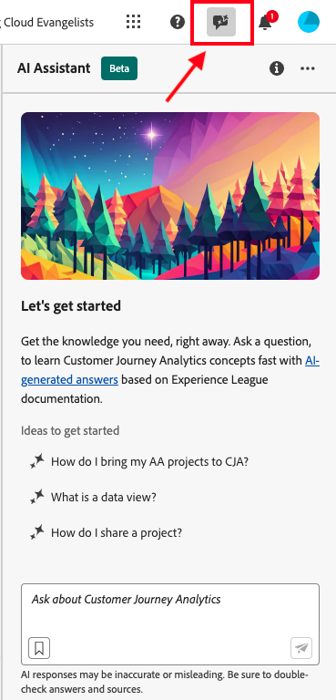
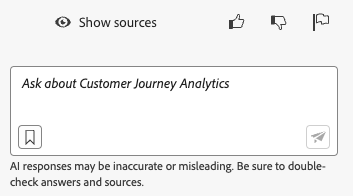

# Assistente IA per Adobe Customer Journey Analytics

L’Assistente IA è un’esperienza conversazionale che consente ai professionisti di svolgere a pieno ritmo le proprie attività. Sia per la comprensione di concetti, risoluzione dei problemi o ricerca delle informazioni. Inoltre, l’Assistente IA consente a chi non è esperto di poter svolgere le attività dei professionisti, migliorando la qualità complessiva del lavoro.

L’Assistente IA in Customer Journey Analytics è addestrato sulla documentazione di Adobe Experience League. Quando viene posta una domanda, l’Assistente IA risponde con una risposta utile che consente un’apprendimento rapido.

In qualità di utente principiante, puoi utilizzare l’Assistente IA per apprendere i concetti di Customer Journey Analytics ed eseguire autonomamente l’onboarding per usare prodotti e funzioni con cui non hai dimestichezza. In qualità di utente esperto, puoi utilizzare l’Assistente IA per presentare casi d’uso più avanzati o suggerimenti e trucchi.

Alcuni esempi di domande sui concetti possono includere:

* Qual è la differenza tra l’acquisizione in batch e l’acquisizione in streaming?
* Per che cosa è utilizzato principalmente Customer Journey Analytics?
* Come posso configurare una visualizzazione dati?

Non è possibile rispondere a domande che esulano dall’ambito di Customer Journey Analytics, ad esempio domande su altri prodotti Adobe come Adobe Target e la suite Adobe Creative Cloud.

L’Assistente IA per Customer Journey Analytics è disponibile per tutti i livelli di prodotto.

## Conoscenza prodotto {#knowledge}

| Conoscenza prodotto | Esempi |
| --- | --- |
| Apprendimento mirato | <ul><li>Qual è la differenza tra Adobe Analytics e Customer Journey Analytics?</li><li>Come posso creare una metrica calcolata?</li></ul> |
| Individuazione aperta | <ul><li>Come posso esportare un progetto Workspace?</li><li>Come posso trovare componenti Workspace duplicati?</li></ul> |
| Risoluzione dei problemi | <ul><li>Quanto tempo è necessario perché i dati arrivino in CJA?</li><li>Quanti campi derivati posso avere in una connessione Customer Journey Analytics?</li></ul> |

## Analisi dei dati

L’agente Data Insights, accessibile dall’Assistente IA in Customer Journey Analytics, è un agente per conversazioni basate sull’IA generativa che risponde in modo rapido ed efficiente alle domande sui tuoi dati. Crea visualizzazioni pertinenti in Analysis Workspace utilizzando i componenti della visualizzazione dati e i tuoi dati effettivi.

Per ulteriori informazioni sull’utilizzo dell’agente Data Insights in Assistente IA, consulta [Visualizzare i dati con l’agente Data Insights](/help/data-analysis-ai.md).

## Accesso alla funzione

I seguenti parametri regolano l’accesso alla funzione dell’Assistente IA:

* **Accesso alla soluzione**: l’Assistente IA è disponibile in Customer Journey Analytics, ma non in Adobe Analytics. È disponibile anche in Adobe Experience Platform, Adobe Journey Optimizer, Adobe Real-Time CDP e in altre app di Experience Platform.

* **Accesso contrattuale**: se non puoi utilizzare l’Assistente IA, contatta l’amministratore della tua organizzazione o il rappresentante dell’account Adobe. Prima che la tua organizzazione possa utilizzare l’Assistente IA, è necessario accettare alcuni termini legali relativi a GenAI.

* **Autorizzazioni**: in [!UICONTROL Adobe Admin Console], l&#39;autorizzazione [!UICONTROL Strumenti di reporting] **[!UICONTROL Assistente AI: conoscenza del prodotto]** determina l&#39;accesso a questo strumento. Un [amministratore del profilo di prodotto](https://helpx.adobe.com/enterprise/using/manage-product-profiles.html?lang=it) deve seguire questi passaggi in [!UICONTROL Admin Console]:
  1. Passa a **[!UICONTROL Admin Console]** > **[!UICONTROL Prodotti e servizi]** > **[!UICONTROL Customer Journey Analytics]** > **[!UICONTROL Profili di prodotto]**
  1. Selezionare il titolo del profilo di prodotto per il quale si desidera fornire l&#39;accesso all&#39;[!UICONTROL Assistente AI: conoscenza del prodotto].
  1. Nel profilo di prodotto specifico, selezionare **[!UICONTROL Autorizzazioni]**.
  1. Seleziona  per modificare **[!UICONTROL Strumenti di reporting]**.
  1. Selezionare  per aggiungere **Assistente IA: conoscenza del prodotto** a **[!UICONTROL elementi di autorizzazione inclusi]**.

     .

  1. Seleziona **[!UICONTROL Salva]** per salvare le autorizzazioni.

Per ulteriori informazioni, consulta [Controllo degli accessi](/help/technotes/access-control.md#access-control).

## Accedere all’Assistente IA nell’interfaccia utente di Customer Journey Analytics

1. Per avviare l’Assistente IA, seleziona la relativa icona dall’intestazione superiore di qualsiasi pagina nell’interfaccia utente di Customer Journey Analytics.

   

   Quando utilizzi l’Assistente IA per la prima volta, viene visualizzata una liberatoria con alcuni termini e condizioni per l’utilizzo dell’Assistente.

1. Nella casella fornita, poni una domanda specifica all’Assistente IA usando un linguaggio naturale.

   

1. (Facoltativo) Per visualizzare le origini, fare clic su **[!UICONTROL Mostra origini]**. Verranno visualizzate l&#39;origine o le origini della documentazione che hanno fornito informazioni sulla risposta.

1. (Facoltativo) Puoi anche fornire un voto con pollice su/giù sull’utilità di una determinata risposta.

1. (Facoltativo) Puoi contrassegnare una risposta per il contenuto inappropriato o dannoso.
