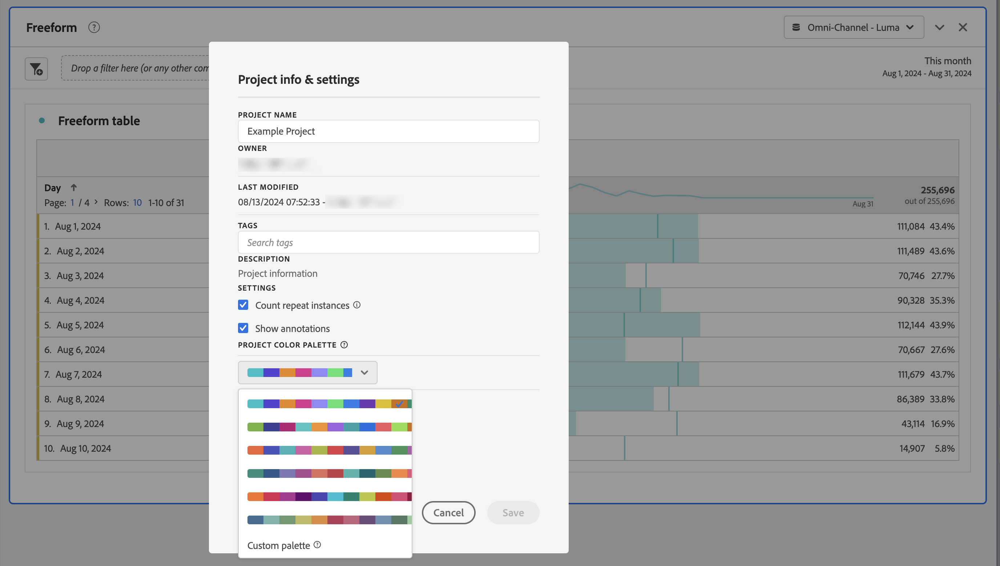

# Palette di colori di visualizzazione {#visualization-color-palettes}

<!-- markdownlint-disable MD034 -->

>[!CONTEXTUALHELP]
>id="workspace_project_colorpalette"
>title="Palette dei colori del progetto"
>abstract="Modifica la palette di colori utilizzata in questo progetto."

<!-- markdownlint-enable MD034 -->

Puoi modificare la palette di colori di visualizzazione utilizzata in Workspace. Puoi selezionare una palette di colori predefinita o specificare una tua propria palette che corrisponda ai colori di branding della tua azienda. Questa funzione interessa gran parte delle visualizzazioni in Workspace, ma **non** influisce sulle modifiche di riepilogo, sulla formattazione condizionale nelle tabelle a forma libera e sulla vista Mappa.

>[!NOTE]
>
>Il supporto per la palette di colori non è abilitato per Internet Explorer 11.

Nota bene:

* Sono disponibili sei palette di colori predefinite tra cui scegliere. La palette predefinita e la seconda dell’elenco sono state ottimizzate per garantire un contrasto ottimale e sono entrambe più accessibili agli utenti daltonici.
* Le altre palette sono state ottimizzate per l’armonia dei colori.

## Per modificare la palette di colori:

1. Passa a **[!UICONTROL Workspace]** > **[!UICONTROL Progetto]** > **[!UICONTROL Informazioni e impostazioni progetto]**.
1. Dal menu a discesa **[!UICONTROL Tavolozza colori progetto]**, è possibile scegliere una delle combinazioni di colori predefinite.
1. Per specificare una tua tavolozza, seleziona **[!UICONTROL Tavolozza personalizzata]** sotto le opzioni predefinite.
1. Specifica fino a 16 valori esadecimali delimitati da virgole (ad esempio, `#00a4e4`) per creare una tua palette di colori. Se ad esempio specifichi solo quattro valori, i colori vengono ripetuti automaticamente nelle visualizzazioni che contengono più colori.
