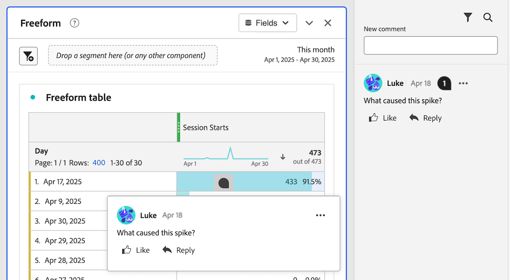
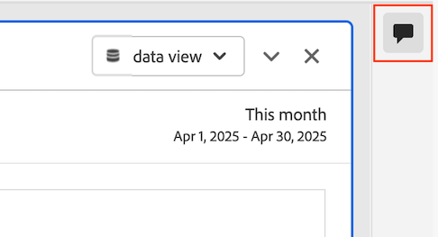
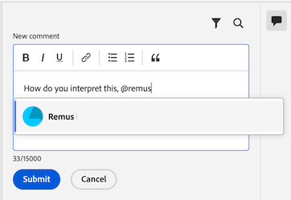

# Aggiungere e gestire commenti nei progetti {#comment-on-projects}

I commenti in Analysis Workspace consentono di condividere informazioni approfondite e porre domande nel contesto di un progetto Analysis Workspace. Questo può semplificare le discussioni sui dati, mantenendo le conversazioni nell’ambito del contesto dei dati che vengono discussi.

>[!NOTE]
>
>La possibilità di aggiungere e gestire commenti su un progetto può essere disabilitata a livello di progetto o di organizzazione. Se non è possibile aggiungere e gestire i commenti come descritto in questa sezione, l&#39;amministratore di Customer Journey Analytics o il proprietario del progetto ha disabilitato questa funzionalità.
>
>* **Progetto:** Il proprietario del progetto può disabilitare questa funzionalità per il progetto, come descritto in [Crea progetti](/help/analysis-workspace/build-workspace-project/create-projects.md).
>* **Organizzazione:** L&#39;amministratore di Customer Journey Analytics può disabilitare questa funzionalità per l&#39;organizzazione, come descritto in [Preferenze](/help/analysis-workspace/user-preferences.md).

## Visualizza commenti

Puoi visualizzare i commenti dall’area commenti nella barra a destra o dal badge del commento, se presente.

>[!NOTE]
>
>Un progetto deve essere salvato prima che l’area dei commenti sia visibile nella barra a destra. Se il progetto non è stato salvato in precedenza, è necessario [salvare il progetto](/help/analysis-workspace/build-workspace-project/save-projects.md) prima di aggiungere commenti.

### Visualizza commenti nell&#39;area commenti

Tutti i commenti aggiunti in un progetto Analysis Workspace sono visibili nell’area commenti nella barra a destra. Il numero totale di commenti esistenti viene visualizzato sull&#39;icona dei commenti.

1. Per impostazione predefinita, la prima volta che apri un progetto, l’area dei commenti viene espansa per ogni progetto in Analysis Workspace.

   Seleziona l’icona dell’area commenti nella barra a destra di un progetto per aprire o chiudere l’area commenti.

   

   Ogni commento mostra una marca temporale del giorno in cui è stato pubblicato. Se il commento è stato pubblicato nel giorno corrente, viene visualizzata l’ora del giorno. Passa il puntatore del mouse sul giorno o sull&#39;ora per visualizzare la data e l&#39;ora complete di pubblicazione del commento.

1. (Facoltativo) Per cercare nell&#39;area commenti, selezionare l&#39;icona di ricerca , quindi digitare una parola o una frase. L’area dei commenti viene filtrata in modo da contenere solo i commenti che includono quella parola o frase.

### Visualizzare i badge di commento in un progetto

I commenti creati [su un&#39;area specifica del progetto](#comment-on-a-specific-area-of-the-project) hanno un **badge di commento**  che viene visualizzato sull&#39;area del progetto a cui si riferisce il commento. Seleziona un badge per visualizzare il commento. Dopo aver selezionato il badge, puoi selezionare il commento stesso per evidenziarlo nell’area dei commenti nella barra a destra.

I numeri vengono visualizzati su ogni badge in un progetto e sono ordinati nell’ordine in cui sono stati creati. Se più commenti vengono inseriti nella stessa area di un progetto, il badge mostra 3 punti . Seleziona il badge a 3 punti per visualizzare tutti i commenti in quell’area.

<!-- Insert screeshot-->

Per nascondere tutti i badge di commento da un progetto:

1. Con il progetto aperto in Analysis Workspace, seleziona l&#39;icona dell&#39;area commenti  nella barra a destra di Analysis Workspace.

1. Nella parte inferiore dell&#39;area dei commenti, abilita l&#39;opzione **[!UICONTROL Nascondi badge inseriti]**.

## Aggiungi commenti

Puoi aggiungere un commento che fa riferimento a un’area specifica del progetto oppure un commento generale.

### Commento su un’area specifica del progetto

Per aggiungere un commento a un’area specifica del progetto (ad esempio un valore di metrica in una tabella a forma libera):

1. Con il progetto aperto in Analysis Workspace, fai clic con il pulsante destro del mouse sull’area del progetto in cui desideri inserire il commento.

   Tutte le visualizzazioni supportano i badge di commento nell’intestazione della visualizzazione, ma solo le seguenti visualizzazioni supportano i badge di commento su punti di dati specifici all’interno della visualizzazione:

   * Tabella a forma libera
   * Tabella coorte
   * A linee

   <!--add screenshot-->

1. Seleziona **[!UICONTROL Aggiungi commento]**.

1. Nel campo **[!UICONTROL Nuovo commento]**, specifica il commento.

   I commenti possono contenere fino a 15.000 caratteri e possono includere markup di base, collegamenti ipertestuali, elenchi puntati e numerati ed emoticon.

1. (Facoltativo) Informa un&#39;altra persona del tuo commento digitando il simbolo @ seguito dal suo nome. Per ulteriori informazioni sull&#39;utilizzo del simbolo @ per notificare altri utenti, vedere [Includere altri utenti in un commento](#include-others-in-a-comment).

1. Seleziona **[!UICONTROL Invia]**.

   Un **badge di commento**  è posizionato nell&#39;area del progetto Workspace in cui hai aggiunto il commento, come descritto in [Visualizza badge di commento in un progetto](#view-comment-badges-in-a-project). Il commento viene visualizzato anche nella parte superiore dell’area commenti nella barra a destra.

### Aggiungi un commento generale sul progetto

Per aggiungere commenti a un progetto in Analysis Workspace:

1. Con il progetto aperto in Analysis Workspace, seleziona l&#39;icona dell&#39;area commenti  nella barra a destra di Analysis Workspace. <!-- add screen shot -->

1. Nel campo **[!UICONTROL Nuovo commento]**, specifica il commento.

   I commenti possono contenere fino a 15.000 caratteri e possono includere markup di base, collegamenti ipertestuali, elenchi puntati e numerati ed emoticon.

1. (Facoltativo) Informa un&#39;altra persona del tuo commento digitando il simbolo @ seguito dal suo nome. Per ulteriori informazioni sull&#39;utilizzo del simbolo @ per notificare altri utenti, vedere [Includere altri utenti in un commento](#include-others-in-a-comment).

1. Seleziona **[!UICONTROL Invia]**.

   Il commento verrà visualizzato nella parte superiore dell&#39;area commenti, come descritto in [Visualizza commenti nell&#39;area commenti](#view-comments-in-the-comments-area).

## Includi altri in un commento

La funzione di commento in Analysis Workspace semplifica la collaborazione con altri utenti.

Quando si utilizza il simbolo @ per includere le persone in un commento, tenere presente quanto segue:

* Le persone incluse ricevono le notifiche in base alle impostazioni di notifica CX Enterprise.

  Per ulteriori informazioni, vedere [Ricevere notifiche sui commenti](#receive-notifications-about-comments).

* Puoi includere in un commento chiunque si trovi nella tua organizzazione e abbia accesso a Customer Journey Analytics, ma così facendo non concede automaticamente l’accesso per la modifica del progetto.

Per includere un&#39;altra persona nel commento:

1. Digita il simbolo @, quindi inizia a digitare il nome, il cognome o l’indirizzo e-mail della persona che desideri includere.

   

1. Seleziona il nome della persona quando viene visualizzato nel menu a discesa.

## Rispondi a un commento

1. In Analysis Workspace, apri il progetto in cui desideri aggiungere un commento.

1. Seleziona l&#39;icona dell&#39;area commenti  nella barra a destra di Analysis Workspace, quindi seleziona **[!UICONTROL Rispondi]** accanto al commento a cui desideri rispondere.

   Per includere il testo del commento a cui si sta rispondendo, con il testo originale racchiuso in un tag di virgolette, selezionare l&#39;icona a tre punti accanto al commento o alla risposta specifica a cui si desidera rispondere, quindi selezionare **[!UICONTROL Risposta al preventivo]**. Una risposta a un preventivo è un buon modo per indicare a quale commento o risposta si riferisce il commento.

   Oppure

   Seleziona l&#39;icona del commento nel pannello o nella visualizzazione in cui è stato creato, quindi seleziona **[!UICONTROL Rispondi]**.

1. Nel campo **[!UICONTROL Nuovo commento]**, specifica il commento.

   I commenti possono contenere fino a 15.000 caratteri e possono includere markup di base, collegamenti ipertestuali, elenchi puntati e numerati ed emoticon.

1. (Facoltativo) Informa un&#39;altra persona del tuo commento digitando il simbolo @ seguito dal suo nome. Per ulteriori informazioni sull&#39;utilizzo del simbolo @ per notificare altri utenti, vedere [Includere altri utenti in un commento](#include-others-in-a-comment).

1. Seleziona **[!UICONTROL Invia]**.

## Ricevi notifiche sui commenti

I proprietari del progetto e [le persone specifiche menzionate](#include-others-in-a-comment) ricevono le notifiche in base alle impostazioni di notifica dell&#39;organizzazione CX. Per impostazione predefinita, ricevono una notifica in-app, visibile dall&#39;[icona di notifica CX Enterprise](https://experienceleague.adobe.com/en/docs/core-services/interface/features/account-preferences#view-notifications)  in Customer Journey Analytics.

Inoltre, gli utenti possono configurare le impostazioni di notifica CX Enterprise per ricevere notifiche e-mail e Slack mediante [abbonamento a notifiche e-mail](https://experienceleague.adobe.com/en/docs/core-services/interface/features/account-preferences#subscribe-to-in-app-and-email-notifications) e [abbonamento a notifiche Slack](https://experienceleague.adobe.com/en/docs/core-services/interface/features/account-preferences#slack).

## Inserisci un badge per un commento esistente

Se un commento è disponibile nell’area commenti nella barra a destra, ma non dispone ancora di un badge nel progetto, puoi aggiungere il badge.

1. Con il progetto aperto in Analysis Workspace, seleziona l&#39;icona dell&#39;area commenti  nella barra a destra di Analysis Workspace.

1. Seleziona l&#39;icona Altro  accanto al commento per il quale vuoi inserire un distintivo, quindi seleziona **[!UICONTROL Badge Luogo]**.

1. Seleziona l’area del progetto in cui desideri inserire il badge per il commento esistente.

   Nell&#39;area del progetto Workspace selezionata viene inserito un **badge di commento** . Il commento viene visualizzato anche nella parte superiore dell’area commenti nella barra a destra.

   Per ulteriori informazioni, vedi [Visualizzare i badge di commento in un progetto](#view-comment-badges-in-a-project).

Per rimuovere un badge:

1. Selezionare il badge da rimuovere, quindi selezionare **[!UICONTROL Rimuovi badge]**.

   Il badge viene rimosso, ma il commento è ancora disponibile nell’area commenti nella barra a destra.

## Spostare un badge per un commento esistente

Puoi spostare un badge di commento già inserito per un commento esistente.

1. Con il progetto aperto in Analysis Workspace, individua il badge del commento da spostare.

1. Fai clic con il pulsante destro del mouse sul badge, quindi seleziona **[!UICONTROL Sposta posizionamento]**.

1. Seleziona l’area del progetto in cui desideri inserire il badge.

<!-- add section about adding images to comments. will be available at GA. Include that "you can have a maximum of 5 images per comment, and each image can be up to 2 MB." -->

## Copiare il collegamento in un commento

Puoi copiare il collegamento in un commento e condividerlo con altri utenti. Solo le persone che hanno già accesso al progetto possono accedervi con il collegamento.

Per copiare il collegamento in un commento:

1. Con il progetto aperto in Analysis Workspace, seleziona l&#39;icona dell&#39;area commenti  nella barra a destra di Analysis Workspace.

1. Fai clic sull&#39;icona Altro  accanto al commento di cui desideri copiare il collegamento, quindi seleziona **[!UICONTROL Copia collegamento]**.

   Il collegamento viene copiato negli Appunti di sistema. Puoi incollare il collegamento in un’e-mail o in un altro tipo di messaggio.

## Copiare il testo di un commento

È possibile copiare il corpo del testo di un commento e condividerlo con altri utenti.

Per copiare il corpo del testo di un commento:

1. Con il progetto aperto in Analysis Workspace, seleziona l&#39;icona dell&#39;area commenti  nella barra a destra di Analysis Workspace.

1. Seleziona l&#39;icona Altro  accanto al commento contenente il testo da copiare, quindi seleziona **[!UICONTROL Copia corpo del testo]**.

   Il corpo del testo del commento viene copiato negli Appunti di sistema.

## Metti Mi piace a un commento

1. Con il progetto aperto in Analysis Workspace, seleziona l&#39;icona dell&#39;area commenti  nella barra a destra di Analysis Workspace.

1. Seleziona **[!UICONTROL Mi piace]** sotto il commento che desideri approvare.

## Eliminare un commento

Quando si elimina un commento, vengono eliminati anche il commento originale ed eventuali risposte o allegati.

Non è possibile recuperare i commenti eliminati.

Per eliminare un commento:

1. Con il progetto aperto in Analysis Workspace, seleziona l&#39;icona dell&#39;area commenti  nella barra a destra di Analysis Workspace.

1. Seleziona l&#39;icona Altro  accanto al commento da eliminare, quindi seleziona **[!UICONTROL Elimina]**.

1. Seleziona di nuovo **[!UICONTROL Elimina]** per confermare l&#39;eliminazione.

## Risolvere un commento

Quando si risolve un commento, questo viene contrassegnato come risolto e nascosto nell&#39;area dei commenti. Se al commento è associato un badge, questo viene rimosso dal progetto.

Per risolvere un commento:

1. Con il progetto aperto in Analysis Workspace, seleziona l&#39;icona dell&#39;area commenti  nella barra a destra di Analysis Workspace.

1. Seleziona l&#39;icona Altro  accanto al commento da risolvere, quindi seleziona **[!UICONTROL Risolvi]**.

1. Seleziona di nuovo **[!UICONTROL Risolvi]** per confermare.

Per impostazione predefinita, i commenti risolti sono nascosti dall&#39;area commenti. Per visualizzare i commenti risolti:

1. Selezionare l&#39;icona del filtro nell&#39;area commenti, quindi deselezionare l&#39;opzione **[!UICONTROL Nascondi commenti risolti]**.
