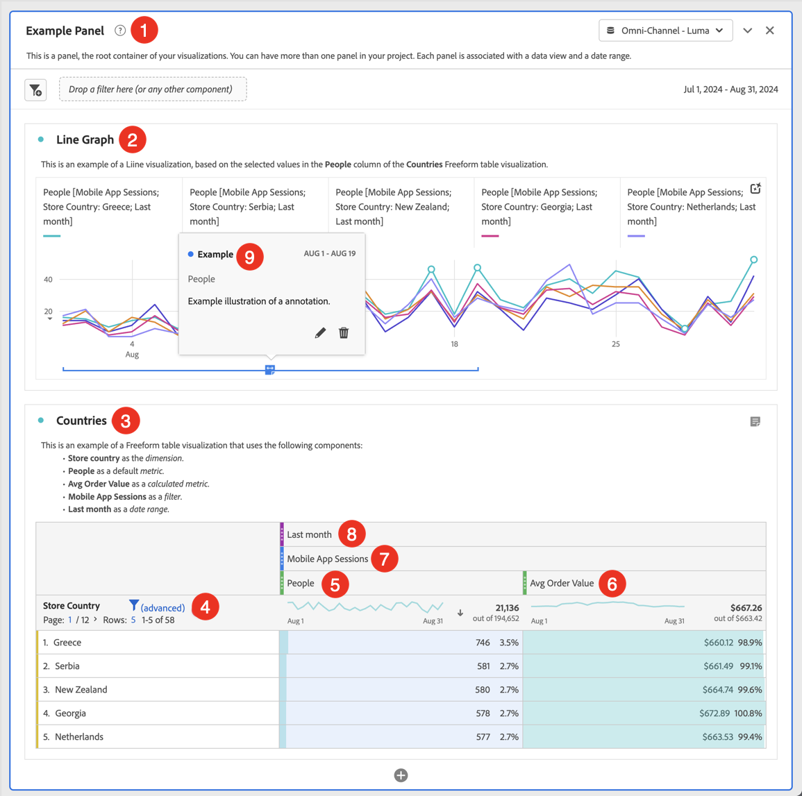

# Creare progetti {#create-projects}

I [progetti](/help/analysis-workspace/build-workspace-project/freeform-overview.md) in Analysis Workspace consentono di creare e visualizzare le analisi business-critical.  Queste analisi possono essere condivise con gli stakeholder all’interno o all’esterno dell’organizzazione.

1. In Customer Journey Analytics, seleziona **[!UICONTROL Workspace]**.

1. Seleziona **[!UICONTROL Projects]** nel pannello a sinistra, quindi seleziona **[!UICONTROL Create project]**.

1. Seleziona **Progetto Workspace vuoto** per creare il tuo progetto Workspace utilizzando un browser.

   Consulta [Scorecard per dispositivi mobili vuota](/help/mobile-app/curator.md) per ulteriori informazioni su come creare un progetto scorecard per dispositivi mobili che puoi condividere con gli altri stakeholder utilizzando un’app per dispositivi mobili. Per ulteriori informazioni sulle varie opzioni disponibili per creare il tuo progetto di analisi guidata, consulta [Analisi guidata](/help/guided-analysis/overview.md).

1. Seleziona [!UICONTROL **Crea**].

Dopo aver creato un progetto Workspace vuoto, assicurati di avere familiarità con l’interfaccia utente di [Analysis Workspace](/help/analysis-workspace/home.md). Una volta acquisita la familiarità necessaria, puoi creare il progetto. A tale scopo, effettua le seguenti operazioni:

* Aggiungi dei [pannelli](/help/analysis-workspace/c-panels/panels.md) al progetto. Ad esempio, **[!DNL Example Panel]** ➊.

* Aggiungi [visualizzazioni](/help/analysis-workspace/visualizations/freeform-analysis-visualizations.md) ai pannelli. Ad esempio:
   * **[!DNL Line Graph]** Visualizzazione [a linee](/help/analysis-workspace/visualizations/line.md) ➋
   * **[!DNL Countries]** Visualizzazione [tabella a forma libera](/help/analysis-workspace/visualizations/freeform-table/freeform-table.md) ➌
* Aggiungi [componenti](/help/components/overview.md) alle visualizzazioni. Ad esempio:
   * **[!DNL Store Country]** [Dimensione](/help/components/dimensions/overview.md) ➍
   * **[!DNL People]** [Metrica](/help/components/apply-create-metrics.md) ➎
   * **[!DNL Avg Order Value]** [Metrica calcolata](/help/components/calc-metrics/calc-metr-overview.md) ➏
   * **[!DNL Mobile App Sessions]** [Segmento](/help/components/segments/seg-overview.md) ➐
   * **[!DNL Last Month]** [Intervallo di date](/help/components/date-ranges/overview.md) ➑
   * **[!DNL Example]** [Annotazione](/help/components/annotations/overview.md) ➒

## Informazioni e impostazioni progetto {#project-info-settings}

>[!CONTEXTUALHELP]
>id="workspace_project_countrepeatinstances"
>title="Conta istanze ripetute"
>abstract="Specifica se le istanze ripetute vengono conteggiate o meno nei rapporti.  Nota: questa impostazione non si applica alle visualizzazioni Flusso o Fallout."

>[!CONTEXTUALHELP]
>id="workspace_project_repeatinstances"
>title="Conta istanze ripetute"
>abstract="Specifica se le istanze ripetute vengono conteggiate o meno nei rapporti. Nota: questa impostazione non si applica alle visualizzazioni Flusso o Fallout."

>[!CONTEXTUALHELP]
>id="workspace_project_commenting"
>title="Consenti commenti"
>abstract="Quando questa opzione è abilitata, nella barra a destra del progetto in Analysis Workspace è disponibile un’area commenti."

Impostazioni progetto offre informazioni a livello di progetto sul progetto attualmente attivo.

Le impostazioni includono:

| Impostazione | Descrizione |
|---|---|
| Nome progetto | Nome assegnato al progetto. Puoi fare doppio clic sul nome per modificarlo. |
| Proprietario | Nome del proprietario del progetto. |
| Ultima modifica | Data dell’ultima modifica apportata al progetto. |
| Tag | Elenca eventuali tag applicati a un progetto per facilitarne la categorizzazione. |
| Descrizione | La descrizione è utile per chiarire lo scopo di un progetto. Puoi fare doppio clic sulla descrizione per modificarla. |
| Conta istanze ripetute | Specifica se le istanze ripetute sono conteggiate o meno nei rapporti. Nota: questa impostazione non si applica alle visualizzazioni Flusso o Abbandono. |
| Mostra annotazioni | Specifica se le annotazioni per questo progetto sono visualizzate o meno. |
| [Palette dei colori del progetto](/help/analysis-workspace/build-workspace-project/color-palettes.md) | Per cambiare la palette di colori utilizzata per le categorie in Workspace, puoi scegliere una delle palette predefinite ottimizzate per il daltonismo o specificarne una personalizzata. Questa funzione interessa numerosi elementi in Workspace, compresa la maggior parte delle visualizzazioni. |
| [Densità di visualizzazione](/help/analysis-workspace/build-workspace-project/view-density.md) | Consente di visualizzare più dati nella schermata riducendo la spaziatura verticale del pannello a sinistra, delle tabelle a forma libera e delle tabelle a coorte. |
| Consenti commenti | **Nota:** questa funzionalità è in fase di test limitato e potrebbe non essere ancora disponibile nel tuo ambiente. Questa nota verrà rimossa non appena la funzionalità sarà disponibile a livello generale. Per informazioni sul processo di rilascio di Customer Journey Analytics, consulta [Rilascio delle funzioni di Customer Journey Analytics](/help/release-notes/releases.md). 
Quando questa opzione è abilitata, nella barra a destra del progetto in Analysis Workspace è disponibile un’area commenti. Per ulteriori informazioni, consulta [Aggiungere e gestire i commenti nei progetti](/help/analysis-workspace/build-workspace-project/comment-projects.md).
 |

