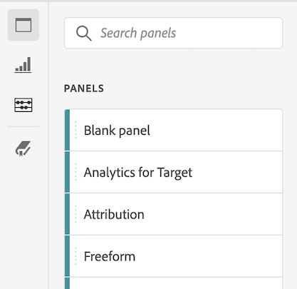

# Creare progetti

[Progetti](/help/analysis-workspace/build-workspace-project/freeform-overview.md) in Analysis Workspace consente di visualizzare le analisi business-critical che possono essere condivise con le parti interessate all’interno o all’esterno dell’organizzazione.

Per informazioni generali su come iniziare a utilizzare Analysis Workspace, consulta [Panoramica di Analysis Workspace](/help/analysis-workspace/home.md).

Le sezioni seguenti descrivono come creare un progetto e iniziare ad aggiungere i blocchi predefiniti chiave per qualsiasi progetto Analysis Workspace: pannelli, visualizzazioni e componenti.

## Inizia a creare un progetto

1. In Adobe Analytics, seleziona [!UICONTROL **Workspace**].

1. Il giorno [!UICONTROL **Workspace**] , seleziona la scheda [!UICONTROL **Progetti**] sul lato sinistro della pagina, quindi seleziona [!UICONTROL **Crea progetto**].

1. Scegli se creare un progetto vuoto o una scheda di valutazione mobile vuota

   * **Progetto vuoto** se prevedi di condividere l’analisi dal browser
   * [**Scorecard per dispositivi mobili vuota**](/help/mobile-app/curator.md) se prevedi di condividere l’analisi dall’app mobile Adobe Analytics dashboards.

1. Seleziona [!UICONTROL **Crea**].

1. Successivamente, devi aggiungere pannelli, visualizzazioni e componenti al progetto. Innanzitutto, aggiungi i pannelli al progetto in Analysis Workspace, come descritto in [Aggiungere pannelli al progetto](#add-panels-to-the-project). Puoi quindi aggiungere visualizzazioni a qualsiasi pannello. Infine, puoi aggiungere componenti a qualsiasi pannello o visualizzazione.

## Aggiungere pannelli al progetto {#panels}

[Pannelli](/help/analysis-workspace/c-panels/panels.md) sono alla base di qualsiasi progetto in Analysis Workspace. I pannelli vengono utilizzati per organizzare il contenuto (visualizzazioni e componenti) di un progetto.

Molti dei pannelli forniti in Analysis Workspace generano una serie completa di analisi basate su alcuni input dell’utente.

Per aggiungere un pannello:

1. Seleziona la [!UICONTROL **Pannelli**] nella barra a sinistra.

   

1. Cerca il pannello da aggiungere. Quando viene visualizzato nella barra a sinistra, trascinalo nel progetto.

1. Aggiungere visualizzazioni al pannello, come descritto in [Aggiungere visualizzazioni al progetto](#add-visualizations-to-the-project).

   In alternativa, è possibile aggiungere componenti direttamente a un pannello, come descritto in [Aggiungere componenti al progetto](#add-components-to-the-project).

## Aggiungere visualizzazioni al progetto

[Visualizzare](/help/analysis-workspace/visualizations/freeform-analysis-visualizations.md) (ad esempio, una tabella a forma libera, un grafico a barre o un grafico a linee) possono essere utilizzati per riprodurre visivamente i dati.

>[!TIP]
>
>Le tabelle a forma libera sono il tipo di visualizzazione più comune e costituiscono la base per l’analisi interattiva dei dati. Per ulteriori dettagli sull’utilizzo delle tabelle a forma libera in Analysis Workspace, consulta [Tabella a forma libera](/help/analysis-workspace/visualizations/freeform-table/freeform-table.md).

Per aggiungere una visualizzazione:

1. Seleziona la **[!UICONTROL Visualizations]** nella barra a sinistra.

   

1. Cerca la visualizzazione da aggiungere. Quando viene visualizzato nella barra a sinistra, trascinalo su un pannello all’interno del progetto.

1. Aggiungi componenti alla visualizzazione, come descritto in [Aggiungere componenti al progetto](#add-components-to-the-project).

## Aggiungere componenti al progetto

[Componenti](/help/components/overview.md) costituisce i dati effettivi di qualsiasi progetto. Puoi aggiungere componenti alle visualizzazioni o ai pannelli.

>[!TIP]
>
>Per informazioni su ciascun componente, seleziona l’icona Informazioni accanto al nome di un componente nella barra a sinistra, oppure vedi [Panoramica dei componenti](/help/components/overview.md).

Per aggiungere un componente:

1. Seleziona la **[!UICONTROL Components]** nella barra a sinistra.

   

1. Cerca il componente che desideri aggiungere. Quando viene visualizzato nella barra a sinistra, trascinalo su un pannello o una visualizzazione all’interno del progetto.

1. Condividi il progetto come descritto in (facoltativo) [Salvare e condividere il progetto](#save-and-share-the-project).

## Salvare e condividere il progetto

Quando crei un’analisi in Analysis Workspace, il tuo lavoro è [salvato automaticamente](/help/analysis-workspace/build-workspace-project/save-projects.md).

Una volta completato il progetto che raccoglie informazioni fruibili, il progetto è pronto per essere utilizzato da altri utenti. Puoi condividere il progetto con utenti e gruppi della tua organizzazione o anche con persone esterne all’organizzazione. Per informazioni sulla condivisione di un progetto, consulta [Condividere progetti](/help/analysis-workspace/curate-share/share-projects.md).
