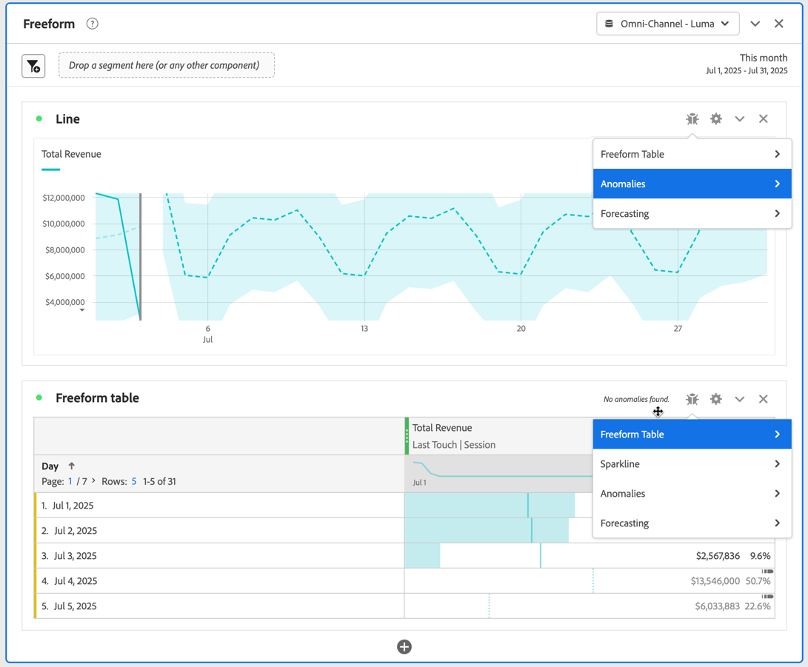
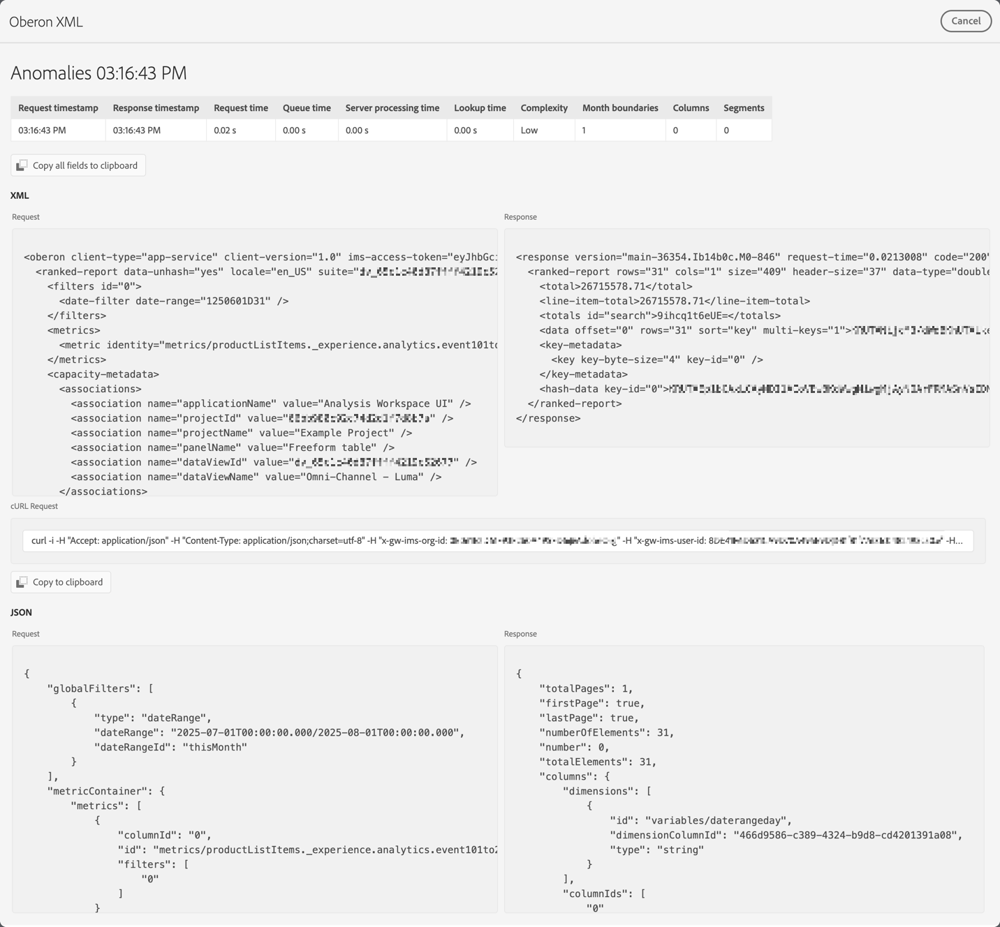

# Debugger progetto

Il debugger del progetto consente a te e al Supporto Adobe di risolvere i problemi relativi ai progetti in Analysis Workspace. Il supporto Adobe potrebbe richiedere di abilitare il debugger per la risoluzione dei problemi dei ticket generati con il supporto Adobe. Esempi di problemi sono il tempo di caricamento delle visualizzazioni o i componenti interrotti nelle visualizzazioni.

>[!NOTE]
>
>Per utilizzare il debugger, è necessario avere accesso **Modifica** o **Copia** [al progetto](https://experienceleague.adobe.com/it/docs/experience-cloud-kcs/kbarticles/ka-25744).
>

## Abilita debugger

>[!IMPORTANT]
>
>Salva il progetto prima di abilitare il debugger.
>

Per abilitare il debugger:

1. Selezionare **[!UICONTROL Guida]** > **[!UICONTROL Abilita debugger]** dal menu Progetto di Analysis Workspace.
1. Selezionare **[!UICONTROL OK]** nella finestra di dialogo **[!UICONTROL Abilita debugger]**.
1. Conferma quando il browser richiede di ricaricare la pagina o il sito.

## Usa debugger

Dopo aver abilitato il debugger, tutte le visualizzazioni nel progetto presentano un&#39;ulteriore icona .

Per utilizzare il debugger per una visualizzazione specifica:

1. Seleziona  nella parte superiore della visualizzazione.

   

1. Selezionare l&#39;azione appropriata dal menu di scelta rapida. Le azioni disponibili dipendono dalla visualizzazione e indicano il tipo di debug che desideri eseguire. Ad esempio, se selezioni **[!UICONTROL Anomalie]**, vuoi eseguire il debug della funzionalità delle anomalie nella visualizzazione.
1. Dal sottomenu, selezionare un timestamp.
1. Viene visualizzata una finestra di debug **[!UICONTROL XML Oberon]** con i dettagli delle funzionalità specifiche eseguite dalla visualizzazione. Di seguito è riportato un esempio dell’output di una richiesta di anomalie.

   

   I dettagli sono i seguenti:

   * **[!UICONTROL Timestamp richiesta]**
   * **[!UICONTROL Timestamp risposta]**
   * **[!UICONTROL Ora richiesta]**
   * **[!UICONTROL Ora coda]**
   * **[!UICONTROL Tempo di elaborazione server]**
   * **[!UICONTROL Ora di ricerca]**
   * **[!UICONTROL Complessità]**
   * **[!UICONTROL Limiti del mese]**
   * **[!UICONTROL Colonne]**
   * **[!UICONTROL Segmenti]**
   * **[!UICONTROL XML]** **[!UICONTROL Richiesta]** e **[!UICONTROL Risposta]**
   * **[!UICONTROL richiesta cURL]**
   * **[!UICONTROL JSON]** **[!UICONTROL Richiesta]** e **[!UICONTROL Risposta]**

1. Utilizza  **[!UICONTROL Copia tutto il campo negli Appunti]** per copiare tutte le informazioni di debug negli Appunti. Incolla le informazioni nell’editor o nello strumento preferito. Le informazioni consistono in:

   * XML (richiesta)
   * XML (risposta)
   * JSON (richiesta)
   * JSON (risposta)
   * Richiesta cURL

1. Utilizza  **[!UICONTROL Copia negli Appunti]** sotto **[!UICONTROL richiesta cURL]** per copiare la richiesta negli Appunti.
1. Passa il puntatore del mouse su una delle **[!UICONTROL aree di testo Richiesta]** o **[!UICONTROL Risposta]** per visualizzare e selezionare  **[!UICONTROL Copia negli Appunti]** per copiare il contenuto dell&#39;area di testo (XML o JSON) negli Appunti.

1. Scambia le informazioni copiate e richieste dal supporto Adobe per la risoluzione dei problemi relativi alle visualizzazioni nel progetto Analysis Workspace.

1. Seleziona **[!UICONTROL Annulla]** per chiudere la finestra di debug **[!UICONTROL XML Oberon]** e tornare al progetto.

Ripeti i passaggi precedenti per qualsiasi altra visualizzazione che desideri risolvere.

## Disabilita debugger

>[!IMPORTANT]
>
>Prima di disabilitare il debugger, salva le modifiche apportate al progetto e desideri mantenerle durante l’esercizio di debug.
>

Per disattivare il debugger:

1. Selezionare **[!UICONTROL Guida]** > **[!UICONTROL Disabilita debugger]** dal menu Progetto di Analysis Workspace.
1. Selezionare **[!UICONTROL OK]** nella finestra di dialogo **[!UICONTROL Disattiva debugger]**.
1. Conferma quando il browser richiede di ricaricare la pagina o il sito.
