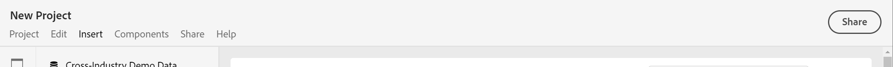

# Panoramica dei progetti

Utilizzando i progetti Workspace, puoi combinare componenti dati, tabelle e visualizzazioni per sviluppare delle analisi da condividere con altri nella tua organizzazione. Prima di iniziare il primo progetto, scopri come accedere, navigare e gestire i progetti.

## Elenco dei progetti {#project-list}

Quando scegli **[!UICONTROL Analytics]** > **[!UICONTROL Workspace]** per la prima volta, vengono elencati tutti i progetti di cui sei proprietario o a cui puoi accedere. Questa è anche la pagina di destinazione per Adobe Analytics, a meno che tu non abbia precedentemente impostato una pagina di destinazione personalizzata.

La pagina Progetti contiene le seguenti informazioni:

>[!NOTE]
>
>Alcune colonne non sono visualizzate per impostazione predefinita. Per personalizzare le colonne visualizzate, fai clic sul pulsante **Personalizzare la tabella** icona .

| Elemento | Descrizione |
|---|---|
| [Modifica preferenze](/help/analysis-workspace/user-preferences.md) | Gestisci le impostazioni di Analysis Workspace e dei relativi componenti per tutti i nuovi progetti o pannelli creati. |
| [Crea cartella](/help/analysis-workspace/build-workspace-project/workspace-folders/create-folders.md) | Aggiungi una nuova cartella o sottocartella all’elenco dei progetti e delle cartelle. |
| [Crea progetto](/help/analysis-workspace/home.md) | Avvia un nuovo progetto da zero o da un [template](https://experienceleague.adobe.com/docs/analytics/analyze/analysis-workspace/build-workspace-project/starter-projects.html#analysis-workspace). |
| Gestione progetti <!--I don't see this option--> | Fai clic su questo collegamento per passare al modulo di gestione dei componenti per progetti (**[!UICONTROL Analytics]** > **[!UICONTROL Components]** > **[!UICONTROL Projects]**), in cui vengono elencati tutti i tuoi progetti e dove puoi assegnare tag, condividere, eliminare, rinominare, approvare, copiare ed esportare i progetti come file CSV. |
| Imposta come pagina di destinazione <!--I don't see this option--> | Consente di impostare la pagina attuale come pagina di destinazione di Workspace. |
| Mostra altro | Mostra le opzioni per la creazione di un progetto vuoto o di una scheda di valutazione mobile, [visualizzazione dei tutorial di formazione](https://experienceleague.adobe.com/docs/analytics-learn/tutorials/analysis-workspace/analysis-workspace-basics/analysis-workspace-introduction.html?lang=it)oppure [visualizzazione delle note sulla versione](/help/release-notes/latest.md). |
| Mostra cartelle e progetti | Scegliere se visualizzare la struttura delle cartelle dei progetti. Per ulteriori informazioni, consulta la sezione [Informazioni sulle cartelle in Analytics](/help/analysis-workspace/build-workspace-project/workspace-folders/about-folders.md). |
| Personalizza tabella (icona) | Consente di personalizzare le informazioni visualizzate per ogni progetto nella pagina Progetti. |
| Nome | Nome del progetto Workspace. |
| Tipo | Indica se si tratta di un progetto Workspace, una cartella o un [Scorecard per dispositivi mobili](https://experienceleague.adobe.com/docs/analytics/analyze/mobapp/home.html?lang=it). |
| Tag | Tag che sono stati applicati al progetto. |
| Pianificato | Indica se i progetti devono essere inviati via e-mail ai destinatari in base a una pianificazione. Vedi [Pianificare progetti](/help/analysis-workspace/curate-share/t-schedule-report.md). |
| Collegamento condiviso (chiunque) | I progetti possono essere condivisi con chiunque, anche con persone che non hanno accesso ad Analysis Workspace. Questa colonna mostra se i progetti sono stati condivisi in questo modo. Vedi [Condivisione di un progetto con altri utenti (accesso non richiesto)](/help/analysis-workspace/curate-share/share-projects.md#share-public-link) in [Condividere progetti](/help/analysis-workspace/curate-share/share-projects.md) per ulteriori informazioni. |
| Suite di rapporti | La suite di rapporti a cui è associato il progetto. |
| [Ruolo progetto](https://experienceleague.adobe.com/docs/analytics/analyze/analysis-workspace/curate-share/share-projects.html?lang=it) | Indica il tuo ruolo per il progetto, ossia se sei il proprietario o se sei autorizzato a modificarlo, duplicarlo o visualizzarlo. |
| Proprietario | Autore del progetto (tu o l’utente che ha condiviso con te il progetto). |
| Condiviso con | Utenti con cui è stato condiviso il progetto. |
| Ultima modifica | Data e ora dell’ultima volta che il progetto è stato modificato. |
| Ultima apertura | Data e ora dell’ultima apertura del progetto. |
| ID progetto | ID del progetto. |
| Intervallo date più lungo | L’intervallo di date più lungo del progetto. |
| Numero di query | Numero totale di query contenute nel progetto. |
| Posizione | La cartella in cui si trova il progetto. |
| Progetti preferiti <!--I don't see this option--> | Per contrassegnare un progetto come preferito, aprilo e fai clic sulla stella accanto al nome del progetto. Al successivo avvio di Workspace, verrà elencato tra i progetti preferiti. |
| Progetti visualizzati di frequente <!--I don't see this option--> | Elenca i progetti che vengono aperti più spesso, per accedervi più facilmente. |

## Barra dei menu {#menu-bar}

In un progetto, il menu fornisce le opzioni necessarie per gestirlo, aggiungervi dei componenti, cercare assistenza e altro ancora. È inoltre possibile accedere a ogni opzione del menu tramite [scelte rapide](/help/analysis-workspace/build-workspace-project/fa-shortcut-keys.md) da tastiera.

| Opzione di menu | Descrizione |
|---|---|
| Progetto | Include azioni comuni per la gestione dei progetti, come Nuovo, Apri, Salva, Salva con nome e Salva come modello. Puoi anche aggiornare l’intero progetto per recuperare i dati e le definizioni più recenti facendo clic su Refresh Project (Aggiorna progetto). Le opzioni [Download CSV and PDF](/help/analysis-workspace/curate-share/download-send.md) (Scarica CSV e PDF) consentono di esportare i dati da Workspace. **Informazioni e impostazioni progetto** (vedi sotto) offre molte opzioni per la gestione del progetto. |
| Modifica | Annulla o ripristina l’ultima azione. Con Clear All (Cancella tutto) puoi ripristinare il progetto e tornare al progetto vuoto iniziale. |
| Inserisci | Con questo menu puoi inserire nuovi pannelli o visualizzazioni. Puoi anche inserire nuovi pannelli e visualizzazioni dalla barra a sinistra. |
| [Componenti](/help/components/overview.md) | Crea dal progetto nuovi filtri, metriche calcolate, intervalli di date o componenti di avviso. Puoi anche creare nuovi componenti dalla barra a sinistra. Se le definizioni dei componenti sono state recentemente modificate, usa Refresh Components (Aggiorna componenti) per recuperare le definizioni più recenti. |
| [Condividi](/help/analysis-workspace/curate-share/send-schedule-files.md) | Curare, condividere e pianificare progetti PDF/CSV per i destinatari all’interno della tua organizzazione. |
| Aiuto | Accedi alla documentazione dell’Aiuto, ai video e alla [community di Experience League](https://experienceleaguecommunities.adobe.com/t5/adobe-analytics/ct-p/adobe-analytics-community) per Analytics. Gestisci la visibilità dei suggerimenti di Workspace e il [debugger](https://www.adobe.io/apis/experiencecloud/analytics/docs.html#!AdobeDocs/analytics-2.0-apis/master/reporting-tricks.md). Trova dettagli su Workspace e sui fattori che influiscono sulle [prestazioni](/help/analysis-workspace/workspace-faq/optimizing-performance.md) del progetto. |
| Pulsante Condividi o Proprietario | Se stai utilizzando il progetto in modalità Own (Proprietario) o Edit (Modifica), il pulsante Share (Condividi) in alto a destra consente di accedere con un solo clic ai destinatari del progetto e di gestirli. Se invece utilizzi il progetto con un ruolo Duplicate (Duplica) o View (Visualizza), viene visualizzato il nome del proprietario del progetto. |

### Informazioni e impostazioni progetto {#info-settings}

**[!UICONTROL Workspace]** > **[!UICONTROL Project]** > **[!UICONTROL Project Info & Settings]** fornisce informazioni a livello di progetto sul progetto attualmente attivo.

Le impostazioni includono:

| Impostazione | Descrizione |
|---|---|
| Progetto Nome | Nome assegnato al progetto. Puoi fare doppio clic sul nome per modificarlo. |
| Creato da | Nome del proprietario del progetto. |
| Ultima modifica | Data dell’ultima modifica apportata al progetto. |
| Tag | Elenca eventuali tag applicati a un progetto per facilitarne la categorizzazione. |
| Descrizione | La descrizione è utile per chiarire lo scopo di un progetto. Puoi fare doppio clic sulla descrizione per modificarla. |
| Conteggio istanze ripetute nel progetto | Consente di specificare se conteggiare o meno, per i rapporti, le istanze ripetute. Nota: questa impostazione non si applica alle visualizzazioni Flusso o Abbandono. |
| [Palette dei colori del progetto](/help/analysis-workspace/build-workspace-project/color-palettes.md) | Per cambiare la palette di colori utilizzata per le categorie in Workspace, puoi scegliere una delle palette predefinite ottimizzate per il daltonismo o specificarne una personalizzata. Questa funzione interessa numerosi elementi in Workspace, compresa la maggior parte delle visualizzazioni. |
| [Densità di visualizzazione](/help/analysis-workspace/build-workspace-project/view-density.md) | Consente di visualizzare più dati nella schermata riducendo la spaziatura verticale della barra a sinistra, tabelle a forma libera e tabelle a coorte. |

## Barra a sinistra {#left-rail}

Nel progetto Workspace, puoi accedere a [pannelli](/help/analysis-workspace/c-panels/panels.md), tabelle, [visualizzazioni](/help/analysis-workspace/visualizations/freeform-analysis-visualizations.md) e [componenti] dalla barra a sinistra. Si tratta degli elementi di base del progetto.

Puoi anche accedere a visualizzazioni e pannelli dal [pannello vuoto](/help/analysis-workspace/c-panels/blank-panel.md).

I componenti (dimensioni, metriche, filtri, intervalli di date) nella barra a sinistra si riferiscono alla vista di dati del pannello attivo. Il pannello attivo è evidenziato da un bordo blu e la vista dati attiva è elencata nella parte superiore della barra dei componenti.

## Area di lavoro del progetto {#canvas}

Nell’area di lavoro del progetto puoi raccogliere i pannelli, le tabelle, le visualizzazioni e i componenti con cui intendi generare le analisi. Un progetto può contenere diversi pannelli, e ciascun pannello può contenere più tabelle e visualizzazioni.

I pannelli sono utili per organizzare i progetti in base a specifici periodi di tempo, viste dati o casi di utilizzo di analisi. Il pannello attivo è evindenziato da un bordo blu e determina quali componenti sono disponibili nella barra a sinistra.

A seconda del punto iniziale scelto per i progetti, l’area di lavoro presenta una [tabella a forma libera](/help/analysis-workspace/visualizations/freeform-table/freeform-table.md) o un [pannello vuoto](/help/analysis-workspace/c-panels/blank-panel.md). Il modo più rapido per iniziare l’analisi consiste nel selezionare uno o più componenti e semplicemente trascinarli nell’area di lavoro del progetto. Viene creata automaticamente una tabella di dati. [Scopri di più](/help/analysis-workspace/visualizations/freeform-table/freeform-table.md) sulle diverse opzioni per la creazione di una tabella. Per maggiori informazioni su come creare il primo progetto, segui questo [tutorial](/help/analysis-workspace/home.md).

## Project Manager {#manager}

I progetti di Analysis Workspace possono essere gestiti da **Analytics > Components >  Projects** (Componenti > Progetti). Lo strumento per la gestione dei progetti mostra gli elementi creati da uno specifico utente. La proprietà del progetto può essere trasferita a un nuovo utente da Admin > Analytics Users &amp; Assets > Transfer Assets (Amministrazione > Utenti e risorse di Analytics > Trasferisci risorse).

Nella finestra per la gestione dei progetti è possibile aggiungere, assegnare tag, condividere, duplicare/copiare e altro ancora. Per cercare un progetto puoi utilizzare la barra di ricerca o le opzioni filtro disponibili nella barra a sinistra. Puoi filtrare per tag, proprietari, tipo di progetto e altro ancora.

Di seguito sono riportate le azioni più comuni per la gestione dei progetti, che possono essere eseguite su uno o più progetti alla volta:

| Azione | Descrizione |
|---|---|
| Add | Crea un nuovo progetto da zero. |
| Tag (Assegna tag) o Approve (Approva) | Scegli &quot;Tag&quot; o &quot;Approva&quot; per organizzare i tuoi progetti e semplificarne la ricerca. |
| [Condividi](/help/analysis-workspace/curate-share/share-projects.md) | Rendi un progetto disponibile ad altri utenti di Analysis Workspace all’interno dell’organizzazione. |
| Elimina | Elimina il progetto. |
| Rinomina | Modifica il nome del progetto. |
| Copia | Crea un duplicato del progetto. Viene creato un nuovo progetto, con un nuovo ID progetto. Eventuali condivisioni o pianificazioni collegate al progetto originale non vengono copiate. |
| Export to CSV (Esporta in CSV) | Scarica il progetto come file CSV, contenente dati in formato solo testo. |
