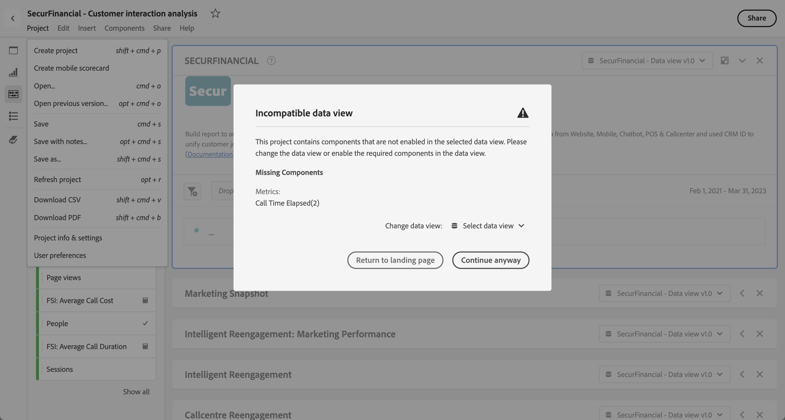

# Aprire i progetti

Puoi aprire un progetto direttamente dalla pagina [Progetti](/help/analysis-workspace/build-workspace-project/freeform-overview.md). Cerca il progetto nell’elenco. Utilizza [ricerca](/help/analysis-workspace/build-workspace-project/freeform-overview.md#search) o il [pannello segmenti](/help/analysis-workspace/build-workspace-project/freeform-overview.md#segment-panel) per restringere l’elenco.

* Seleziona il titolo del progetto per aprirlo in Analysis Workspace.

Puoi aprire un progetto anche mentre lavori su un altro progetto.

* Seleziona **[!UICONTROL Apri]** dal menu **[!UICONTROL Progetto]**. Viene visualizzata una finestra di dialogo simile alla pagina [Progetti](/help/analysis-workspace/build-workspace-project/freeform-overview.md).  Utilizza [ricerca](/help/analysis-workspace/build-workspace-project/freeform-overview.md#search) o il [pannello segmenti](/help/analysis-workspace/build-workspace-project/freeform-overview.md#segment-panel) per restringere l’elenco.
* Seleziona il titolo del progetto per aprirlo in Analysis Workspace.

Se non riesci a trovare il progetto e vuoi avviare un nuovo progetto, seleziona **[!UICONTROL Crea nuovo]**.

## Aprire la versione precedente

Per aprire una versione salvata in precedenza di un progetto:

1. Seleziona **[!UICONTROL Apri versione precedente]** dal menu **[!UICONTROL Progetto]**.

   

1. Rivedi l&#39;elenco delle versioni precedenti disponibili nella finestra di dialogo **[!UICONTROL Versioni salvate in precedenza]**. È possibile passare da **[!UICONTROL Tutte le versioni]** a **[!UICONTROL Solo le versioni con note]**.

   Per ogni versione, l’elenco mostra una marca temporale, l’editor e le note salvate.

1. Selezionare una versione precedente e fare clic su **[!UICONTROL Carica]**.
La versione precedente viene quindi caricata con una notifica. La versione precedente diventa la versione salvata corrente del progetto solo dopo aver fatto clic su **[!UICONTROL Salva]**. Se esci dalla versione caricata, viene visualizzata l’ultima versione salvata quando desideri aprire di nuovo una versione precedente.

## Visualizzazione dati incompatibile

Quando apri un progetto, potresti visualizzare una **[!UICONTROL visualizzazione dati incompatibile]** finestra di avviso. Questa finestra di dialogo spiega che alcuni componenti all’interno del progetto non sono abilitati nella visualizzazione dati selezionata per uno dei pannelli del progetto.

Per correggere questo avviso, è possibile:

* **[!UICONTROL Modifica la visualizzazione dati]**. Selezionare una visualizzazione dati corretta da **[!UICONTROL Modifica visualizzazione dati:]** . Se la visualizzazione dati selezionata è valida, il progetto viene aperto in Analysis Workspace.
* **[!UICONTROL Torna alla pagina di destinazione]**. Il progetto selezionato non viene aperto e puoi selezionare un altro progetto.
* **[!UICONTROL Continua comunque]**. Il progetto viene aperto in Analysis Workspace, ma mostra errori in alcune visualizzazioni e le visualizzazioni dati incompatibili mostrano un avviso  prima del nome della visualizzazione dati.
