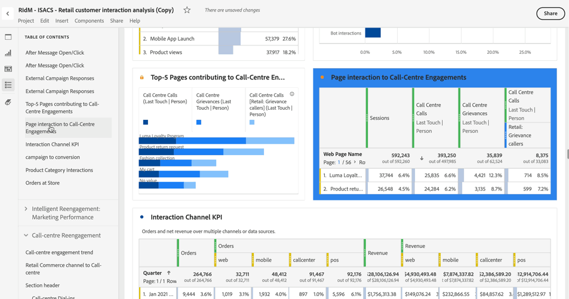

# Sommario

In Analysis Workspace puoi visualizzare il sommario di un progetto, per spostarti rapidamente tra i pannelli e le visualizzazioni al suo interno. Il sommario è particolarmente utile quando si visualizzano progetti più grandi che contengono molti pannelli e visualizzazioni.

>[!BEGINSHADEBOX]

Per un video dimostrativo, guarda  [Creare un sommario](https://experienceleague.adobe.com/it/docs/analytics-learn/tutorials/analysis-workspace/navigating-workspace-projects/create-a-toc-in-analysis-workspace){target="_blank"}.

>[!ENDSHADEBOX]

>[!TIP]
>
>Puoi utilizzare la visualizzazione dell’intestazione Sezione per identificare e articolare una sezione all’interno di un pannello che contiene molte visualizzazioni. Anche queste intestazioni di sezione vengono visualizzate come voci nel sommario.
>

Per visualizzare il sommario di un progetto:

1. In Analysis Workspace, vai al progetto in cui desideri visualizzare il sommario.

1. Nel pannello pulsante, seleziona  **[!UICONTROL Sommario]**. Per ulteriori informazioni, consulta [Panoramica su Analysis Workspace](/help/analysis-workspace/home.md). 

   Il **[!UICONTROL sommario]** per il progetto viene visualizzato e ogni pannello viene espanso per impostazione predefinita.

1. Nel **[!UICONTROL sommario]**, selezionare una visualizzazione. 

   La visualizzazione selezionata viene scorsa automaticamente ed evidenziata brevemente.

   

>[!MORELIKETHIS]
>
>* [Semplifica la navigazione nella dashboard con la nuova funzione Sommario in Adobe Analytics](https://experienceleaguecommunities.adobe.com/t5/adobe-analytics-blogs/simplify-dashboard-navigation-with-the-new-table-of-contents/ba-p/731284)
