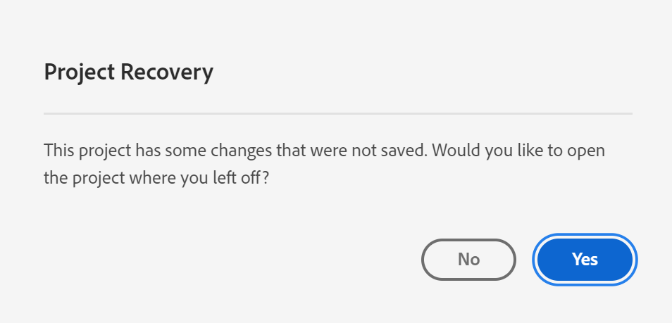

# Salvare i progetti {#save-projects}

<!-- markdownlint-disable MD034 -->

>[!CONTEXTUALHELP]
>id="workspace_project_addnotes"
>title="Aggiungere note"
>abstract="Aggiungi note sulla versione del progetto che viene salvata. Queste note verranno archiviate con la versione e saranno accessibili dal menu **[!UICONTROL Project]** > **[!UICONTROL Open previous version]**."

<!-- markdownlint-enable MD034 -->

I progetti in Analysis Workspace vengono salvati automaticamente ogni 2 minuti. Puoi anche salvare i progetti autonomamente, salvare un progetto come duplicato o salvare un progetto con le note sulla versione.

## Salva

Per salvare un progetto manualmente, con il progetto aperto in Analysis Workspace, seleziona **[!UICONTROL Project]**, quindi scegli tra le seguenti opzioni:

* **[!UICONTROL Save]**

  Salva le modifiche apportate al progetto. Se il progetto è condiviso, anche i destinatari del progetto visualizzeranno le modifiche.

  Quando salvi il progetto per la prima volta, viene visualizzata una finestra di dialogo **[!UICONTROL Save]**.

  

   1. Specifica:

      * **[!UICONTROL Name]** (obbligatorio). nome del progetto.
      * **[!UICONTROL Description]**. Descrizione del progetto.
      * **[!UICONTROL Tags]**. Cerca i tag nel campo [!UICONTROL *Ricerca tag*] o aggiungine di nuovi utilizzando **[!UICONTROL ENTER]**.
      * **[!UICONTROL Folder]**. Selezionare una cartella dal menu a discesa [!UICONTROL *Seleziona una cartella*]. Se non specifichi una cartella, il progetto viene salvato nella cartella corrente dalla quale hai creato un nuovo progetto.
      * **[!UICONTROL Version notes]**. Aggiungi le note sulla versione nell’area di testo *Aggiungi note*.

   1. Seleziona **[!UICONTROL Save]** per salvare il progetto.

  Il salvataggio del progetto in realtà salva una versione del progetto che viene memorizzata per 90 giorni.

  Se salvi un progetto condiviso, una finestra di dialogo di avviso **[!UICONTROL Save changes to shared project]** ti chiede di confermare.

  

   * Seleziona **[!UICONTROL Save]** per salvare il progetto.
   * Seleziona **[!UICONTROL Save as]** per salvare il progetto come duplicato con un nuovo nome.

* **[!UICONTROL Save with notes]**

  

  Quando salvi il progetto, aggiungi note sulle modifiche apportate al progetto. Nella finestra di dialogo Salva note sulla versione:

   1. Immetti le **[!UICONTROL Version notes]** nell’area di testo **[!UICONTROL Add notes]**.
   1. Seleziona **[!UICONTROL Save]**.

  Le note sono archiviate con la versione del progetto e sono disponibili quando [apri una versione precedente](open-projects.md#open-previous-version) del progetto. Una versione salvata con le note viene automaticamente memorizzata per un anno.

* **[!UICONTROL Save As]**

  

  Crea un duplicato del progetto con un nuovo nome. Viene visualizzata la finestra di dialogo Salva con nome.

   1. Specifica:

      * **[!UICONTROL Name]** (obbligatorio). nome del progetto.
      * **[!UICONTROL Description]**. Descrizione del progetto.
      * **[!UICONTROL Tags]**. Cerca i tag nel campo [!UICONTROL *Ricerca tag*] o aggiungine di nuovi utilizzando **[!UICONTROL ENTER]**.
      * **[!UICONTROL Folder]**. Selezionare una cartella dal menu a discesa [!UICONTROL *Seleziona una cartella*]. Se non specifichi una cartella, il progetto viene salvato nella cartella corrente dalla quale hai creato un nuovo progetto.
      * **[!UICONTROL Version notes]**. Aggiungi le note sulla versione nell’area di testo *Aggiungi note*.

   1. Seleziona **[!UICONTROL Save]** per salvare il progetto.

  Puoi salvare il progetto in un’altra cartella. Il progetto originale non verrà interessato.

<!-- Cannot find this option in CJA 
| **[!UICONTROL Save as template]** | Save your project as a [custom template](https://experienceleague.adobe.com/docs/analytics/analyze/analysis-workspace/build-workspace-project/starter-projects.html?lang=it) that becomes available to your organization under **[!UICONTROL Project > New]** | 
-->

## Salvataggio automatico

>[!IMPORTANT]
>
>Anche se i nuovi progetti vengono salvati automaticamente, è necessario salvare manualmente ogni nuovo progetto la **prima** volta.
>

Tutti i progetti in Analysis Workspace vengono salvati automaticamente ogni 2 minuti nel computer locale. Il salvataggio automatico include i progetti appena creati che non sono ancora stati salvati manualmente.

### Nuovi progetti

Analysis Workspace richiede di salvare manualmente nuovi progetti quando si passa a un altro progetto, si chiude la scheda del browser e così via.

Se per qualsiasi motivo perdi inaspettatamente l’accesso a un nuovo progetto creato prima di salvarlo manualmente, viene salvata una versione di ripristino del progetto nella pagina di destinazione di Analysis Workspace in una cartella denominata **[!UICONTROL Recovered Projects (Last 7 Days)]** (Ultimi 7 giorni). Rripristina il progetto recuperato e salvalo manualmente nella posizione desiderata.

Per ripristinare un progetto recuperato:

1. Passa alla cartella **[!UICONTROL Recovered Projects (Last 7 Days)]** nella pagina di destinazione di Analysis Workspace.

<!-- 
     
  -->

1. Apri il progetto e salvalo nella posizione desiderata.

### Progetti esistenti

Se per qualsiasi motivo esci da un progetto con modifiche non ancora salvate automaticamente, Analysis Workspace richiede di salvare le modifiche o mostra un messaggio di avviso.

Alcuni scenari comuni:

#### Aprire un altro progetto

Se apri un altro progetto mentre lavori a un progetto contenente modifiche non ancora salvate automaticamente, Analysis Workspace richiede di salvare il progetto in corso.

Sono disponibili le seguenti opzioni:

* **[!UICONTROL Save]**: sostituisce la copia locale più recente del progetto salvata automaticamente con le ultime modifiche.
* **[!UICONTROL Discard Changes]**: ignora le modifiche più recenti. Il progetto conserva la copia locale salvata automaticamente più recente.
* **[!UICONTROL Cancel]**: annulla l’azione per aprire un altro progetto e mantenere aperto il progetto esistente.

<!--  -->

#### Uscire o chiudere una scheda

In caso di uscita o chiusura della scheda del browser durante la visualizzazione di un progetto con modifiche non ancora salvate automaticamente, il browser avverte che le modifiche non salvate andranno perse. È possibile scegliere di uscire o annullare. Il modo in cui il browser avvisa l’utente dipende dal browser utilizzato.

### Arresto anomalo del browser o timeout della sessione

Se il browser subisce un arresto anomalo o se la sessione si interrompe, al prossimo accesso ad Analysis Workspace ti verrà richiesto di ripristinare eventuali modifiche al progetto che non sono ancora state salvate automaticamente.

* Seleziona **[!UICONTROL Yes]** per ripristinare il progetto dalla copia salvata automaticamente più recente.

* Seleziona **[!UICONTROL No]** per eliminare la copia salvata automaticamente e aprire l’ultima versione del progetto salvata dall’utente.

<!---->

Per i **nuovi** progetti che non sono mai stati salvati, non è possibile recuperare le modifiche non salvate.

<!-- Shouldn't this belong to another page?  Moved it to a new open projects page

## Open previously saved version

To open a previously saved version of a project:

1. Select **[!UICONTROL Open previous version]** from the **[!UICONTROL Project]** menu.

   

1. Review the list of previous versions available. You can switch between **[!UICONTROL All versions]** and **[!UICONTROL Only versions with notes]**.

   For each version, the list shows a timestamp
   [!UICONTROL Timestamp] and [!UICONTROL Editor] are shown, in addition to [!UICONTROL Notes] if they were added when the [!UICONTROL Editor] saved. Versions without notes are stored for 90 days; versions with notes are stored for 1 year.
1. Select a previous version and click **[!UICONTROL Load]**.
   The previous version then loads with a notification. The previous version does not become the current saved version of your project until you click **[!UICONTROL Save]**. If you navigate away from the loaded version, when you return, you will see the last saved version of the project.

-->
