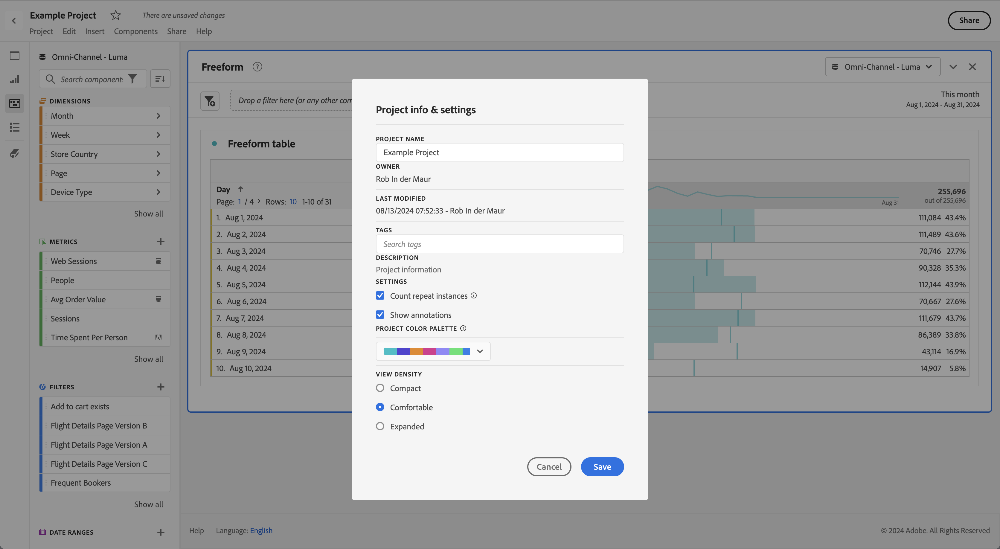

# Densità di visualizzazione

Regolando la densità di visualizzazione puoi visualizzare più dati nella schermata riducendo la spaziatura verticale della barra a sinistra, delle tabelle a forma libera e delle tabelle a coorte. Sono disponibili tre opzioni:

>[!BEGINTABS]

>[!TAB Compatta]

Questa è la versione con maggiore densità di visualizzazione.

>[!TAB Comoda]

Impostazione che hai utilizzato finora in Workspace.

>[!TAB Espansa]

Questa è la versione con la visualizzazione più espansa.

>[!ENDTABS]

Per impostare la densità di visualizzazione:

1. In Workspace, passa a **[!UICONTROL Progetti]** > **[!UICONTROL Informazioni e impostazioni progetto]**.

1. Seleziona un&#39;opzione **[!UICONTROL Densità di visualizzazione]**, quindi seleziona **[!UICONTROL Salva]**.
