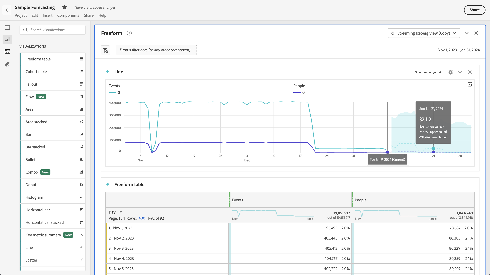

# Visualizzare le previsioni in Analysis Workspace

È possibile visualizzare le previsioni in una tabella a forma libera o in un grafico a linee.

## Visualizzare le previsioni in una tabella

È possibile visualizzare le previsioni in una tabella a forma libera di serie temporali. Quando Mostra previsione è abilitato per la tabella a forma libera in [preferenze utente](../user-preferences.md), la previsione viene visualizzata automaticamente per la prima colonna di metriche aggiunta alla tabella. Per qualsiasi colonna aggiuntiva:

1. Seleziona l’icona delle impostazioni della colonna  nell’intestazione della colonna, assicurati che **[!UICONTROL Show forecast]** è selezionato nell’elenco delle opzioni. Per ulteriori informazioni, consulta la sezione [Impostazioni delle colonne](../visualizations/freeform-table/column-row-settings/column-settings.md).

1. Fai clic all’esterno del **[!UICONTROL Column settings]** per salvare l&#39;impostazione e visualizzare la tabella aggiornata.

Le previsioni sono indicate nella tabella come segue:

* Il valore di previsione e la percentuale per ogni cella vengono visualizzati in **grigio scuro**.
* Per indicare un valore di previsione, un simbolo di previsione  viene visualizzato nell&#39;angolo superiore destro della cella.

## Visualizza previsioni in un grafico a linee

Un grafico a linee è l’unica visualizzazione che consente di visualizzare le previsioni.

1. Seleziona l’icona delle impostazioni  nell’intestazione della visualizzazione, assicurati che **[!UICONTROL Show forecast]** è selezionato nell’elenco delle opzioni.

1. (facoltativo) Per consentire alle previsioni di ridimensionare correttamente il grafico, seleziona **[!UICONTROL Allow forecast to scale Y-axis]**. Questa opzione non è selezionata per impostazione predefinita perché a volte può rendere un grafico meno leggibile.

1. Fai clic all’esterno del **[!UICONTROL Settings]** per visualizzare il grafico a linee aggiornato.

Le previsioni vengono visualizzate nel grafico a linee come segue:

* I valori correnti per le metriche nel grafico a linee sono indicati da una barra verticale. Se passi il cursore del mouse su quella linea verticale, viene visualizzato un pop-up con l’ultima data corrente.
* I valori previsti per una o più metriche vengono visualizzati a destra della barra verticale utilizzando linee tratteggiate. Puoi passare il cursore sopra qualsiasi punto dati per una metrica. Verrà visualizzata una finestra a comparsa con:
   * data della previsione
   * valore previsto per la metrica
   * limite superiore del valore previsto per la metrica
   * limite inferiore del valore previsto per la metrica
* l&#39;area ombreggiata mostra la fascia di affidabilità della previsione.

