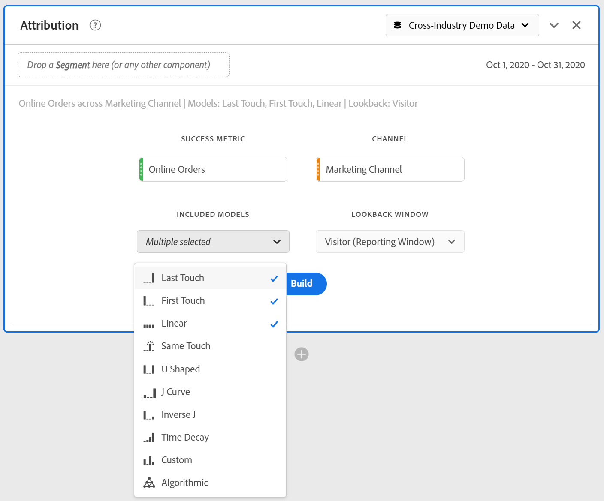

# Pannello Attribution

Il pannello [!UICONTROL Attribution] permette di strutturare facilmente un’analisi confrontando diversi modelli di attribuzione. È una funzione che offre un’area di lavoro dedicata per utilizzare e confrontare modelli di attribuzione.

Customer Journey Analytics migliora l’attribuzione consentendo di:

* Definire l’attribuzione oltre i mezzi di comunicazione comprati: è possibile applicare ai modelli qualsiasi dimensione, metrica, canale o evento (ad es. ricerca interna), non solo le campagne di marketing.
* Utilizzare il confronto illimitato tra modelli di attribuzione: è possibile confrontare in modo dinamico tanti modelli quanti se ne desiderano.
* Evitare le modifiche di implementazione: con l’elaborazione al momento del reporting e le sessioni in base al contesto, è possibile integrare e applicare il contesto di percorso del cliente in fase di esecuzione.
* Costruire la sessione che si adatta al meglio allo scenario di attribuzione.
* Suddividere l’attribuzione in base ai filtri: è possibile confrontare facilmente le prestazioni dei canali di marketing in qualsiasi filtro importante (ad es. clienti nuovi rispetto a clienti di ritorno, prodotto X rispetto a prodotto Y, livello di fedeltà rispetto a Customer Lifetime Value).
* Ispezionare l’analisi incrociata e a più contatti dei canali: è possibile utilizzare diagrammi di Venn, istogrammi e risultati di attribuzione di tendenze.
* Analizzare visivamente sequenze di marketing principali: è possibile esplorare in modo visivo i percorsi che hanno condotto alla conversione, con visualizzazioni di abbandono e di flusso a più nodi.
* Costruire metriche calcolate: è possibile utilizzare un qualsiasi numero di metodi di allocazione di attribuzione.

## Creare un pannello di attribuzione

1. Fai clic sull’icona del pannello a sinistra.
1. Trascina il pannello [!UICONTROL Attribution] nel progetto di Analysis Workspace.

   

1. Aggiungi una metrica che desideri attribuire e aggiungi qualsiasi dimensione secondo cui effettuare l’attribuzione. Alcuni esempi includono Marketing Channels o dimensioni personalizzate, ad esempio promozioni interne.

   

1. Seleziona i modelli di attribuzione e l’intervallo di lookback che desideri confrontare.

1. Il pannello Attribution restituisce un set completo di dati e visualizzazioni che confrontano l’attribuzione per la dimensione e la metrica selezionate.

   

## Visualizzazioni di Attribution

* **Metrica totale**: il numero totale di conversioni che si sono verificate nell’intervallo di tempo di reporting. Queste sono le conversioni attribuite nella dimensione selezionata.
* **Barra di confronto attribuzione**: confronta visivamente le conversioni attribuite per ciascun elemento dimensionale dalla dimensione selezionata. Ogni colore della barra rappresenta un modello di attribuzione distinto.
* **Tabella di confronto attribuzione**: mostra gli stessi dati del grafico a barre, rappresentandoli sotto forma di tabella. Se si selezionano colonne o righe diverse in questa tabella, il grafico a barre e diverse altre visualizzazioni nel pannello vengono filtrate. Questa tabella funziona come qualsiasi altra tabella a forma libera in Workspace e consente di aggiungere componenti quali metriche, filtri o raggruppamenti.
* **Grafico di sovrapposizione**: un diagramma di Venn che mostra i primi tre elementi dimensionali e la frequenza con cui partecipano congiuntamente a una conversione. Ad esempio, le dimensioni della sovrapposizione a bolla indicano quanto spesso si è verificata una conversione quando una persona è stata esposta a entrambi gli elementi dimensionali. Quando si selezionano altre righe nella tabella a forma libera adiacente, la visualizzazione si aggiorna in base alla selezione.
* **Dettagli delle prestazioni**: consente di confrontare visivamente fino a tre modelli di attribuzione mediante un grafico a dispersione.
* **Prestazioni con tendenze**: mostra la tendenza delle conversioni attribuite per l’elemento della dimensione superiore. Quando si selezionano altre righe nella tabella a forma libera adiacente, la visualizzazione si aggiorna in base alla selezione.
* **Flusso**: consente di vedere con quali canali si interagisce più comunemente e in quale ordine all’interno del percorso di una persona.
