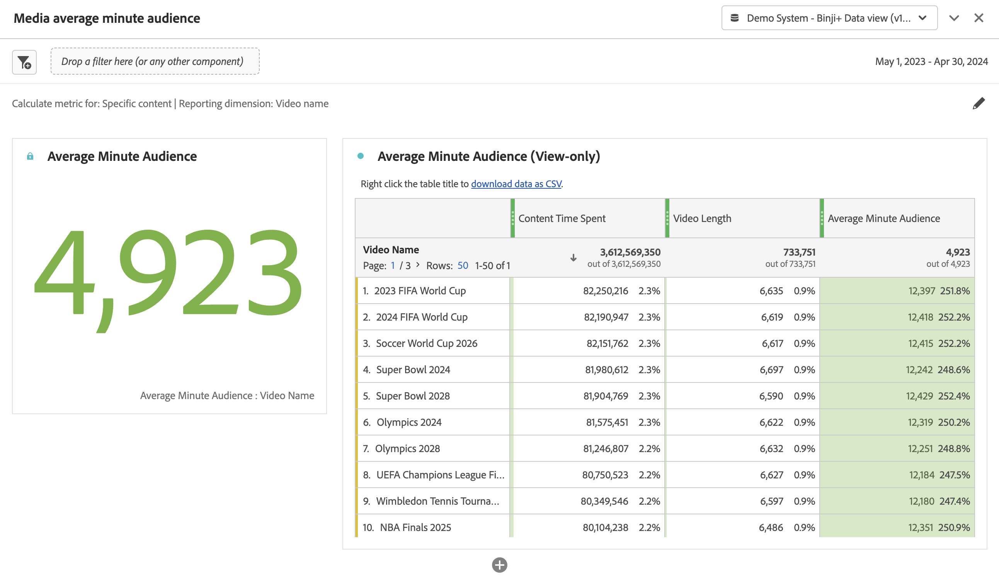

# Pannello Pubblico medio per minuto del file multimediale {#media-average-minute-audience-panel}

<!-- markdownlint-disable MD034 -->

>[!CONTEXTUALHELP]
>id="workspace_mediaminuteaverageaudience_button"
>title="Pubblico medio per minuto del file multimediale"
>abstract="Crea un pannello per analizzare il pubblico medio per minuto di un contenuto specifico o in un periodo di tempo specifico."

<!-- markdownlint-enable MD034 -->

<!-- markdownlint-disable MD034 -->

>[!CONTEXTUALHELP]
>id="workspace_mediaaverageminuteaudience_panel"
>title="Pubblico medio per minuto del file multimediale"
>abstract="Mostra le prestazioni di contenuti multimediali specifici o in un periodo di tempo personalizzato. Specifica la dimensione di reporting e facoltativamente segmenta il contenuto."

<!-- markdownlint-enable MD034 -->

>[!BEGINSHADEBOX]

_Questo articolo descrive il pannello Pubblico medio per minuto del file multimediale in_  _&#x200B;**Customer Journey Analytics**&#x200B;_. _Consulta [Pannello Pubblico medio per minuto del file multimediale](https://experienceleague.adobe.com/it/docs/analytics/analyze/analysis-workspace/panels/average-minute-audience-panel) per la versione_  _&#x200B;**Adobe Analytics** di questo articolo._

>[!ENDSHADEBOX]

>[!NOTE]
>
>Il pannello **[!UICONTROL Media average minute audience]** è disponibile solo per la clientela che ha acquistato Streaming Media Collection per Customer Journey Analytics.
>
>Per ulteriori informazioni, contatta il tuo rappresentante commerciale Adobe o il team dell’account Adobe.
>

In Analysis Workspace, il pubblico medio per minuto può fornire informazioni

* sul tempo impiegato per la visualizzazione di un flusso multimediale specifico diviso per la durata del contenuto, oppure
* sul tempo impiegato per la visualizzazione durante un periodo di tempo personalizzato con granularità selezionata.

Il pannello Pubblico medio per minuto del file multimediale consente di comprendere il consumo medio dei contenuti confrontando programmi di qualsiasi durata o genere. Ad esempio, puoi comprendere il consumo medio quando confronti una sitcom di 30 minuti con un evento sportivo di 3 ore.

Inoltre, puoi utilizzare il pannello Pubblico medio per minuto del file multimediale per confrontare o aggiungere questo pubblico medio digitale per minuto con le metriche medie per minuto della TV lineare.

Il pannello Pubblico medio per minuto del file multimediale fornisce i seguenti vantaggi rispetto alla metrica Pubblico medio per minuto:

* Supporta periodi di tempo personalizzati

* Consente di aggiornare la classificazione della durata dopo l’elaborazione delle viste (se la classificazione della durata non era presente o deve essere corretta)

  Se esegui questo aggiornamento quando utilizzi la metrica, la classificazione della durata non esiste (se la classificazione non era presente). Oppure la classificazione della durata non è aggiornata (se la classificazione era presente ma non corretta).

## Utilizzo

Per usare un pannello **[!UICONTROL Media average minute audience]**:

1. Crea un pannello **[!UICONTROL Media average minute audience]**. Per informazioni su come creare un pannello, consulta [Creare un pannello](panels.md#create-a-panel).

1. Accertati di selezionare una visualizzazione dati per il pannello i cui componenti sono configurati da Streaming Media Collection.

1. Specifica l’[input](#panel-input) per il pannello.

1. Osserva l’[output](#panel-output) per il pannello.

### Input del pannello

Utilizza le impostazioni di input descritte in questa sezione per configurare il pannello Pubblico medio per minuto del file multimediale.

1. Configura le seguenti impostazioni di input:

   | Impostazione | Descrizione |
   |---------|------------|
   | **Intervallo date del pannello** | L’intervallo di date predefinito del pannello è [!UICONTROL **Questo mese**]. Puoi modificarlo per visualizzare un solo giorno o più mesi alla volta.    Questa visualizzazione è limitata a 1440 righe di dati (ad esempio, 24 ore con granularità al minuto). Se una combinazione di intervallo di date e granularità genera più di 1440 righe, la granularità viene aggiornata automaticamente per adattarsi all’intero intervallo di date. |
   | [!UICONTROL **Trascina qui un segmento (o qualsiasi altro componente)**] | Come altri pannelli, questa impostazione segmenta le selezioni in base ai segmenti creati. È un ottimo modo per esaminare piattaforme specifiche, live stream o altri segmenti di file multimediali comuni. |
   | [!UICONTROL **Calcola metrica per**] | Scegli se visualizzare il pubblico medio al minuto per [**[!UICONTROL Specific content]**](#specific-content). Oppure se desideri visualizzare il pubblico medio per minuto per un [**[!UICONTROL Custom time period]**](#custom-time-period).  Seleziona [!UICONTROL **Periodo di tempo personalizzato**]: <ul><li>Se la durata non è disponibile, oppure </li><li>se desideri visualizzare il pubblico medio per minuto di una serie temporale con più parti di contenuto, oppure</li><li>per contenuti senza una specifica durata assegnata (come durante un live stream o un evento)</li></ul></li></li></ul> 
Questa impostazione modifica il flusso di lavoro e l’output del rapporto.
 |

1. Continua con [Contenuto specifico](#specific-content) o [Periodo di tempo personalizzato](#custom-time-period), a seconda dell&#39;opzione scelta nel menu a discesa [!UICONTROL **Calcola metrica per**].

#### Contenuto specifico

1. Se hai selezionato [!UICONTROL **Contenuto specifico**] nel menu a discesa [!UICONTROL **Calcola metrica per**] durante la [configurazione degli input del pannello](#panel-inputs), specifica le seguenti opzioni di configurazione:

   | Impostazione | Descrizione |
   |---------|------------|
   | [!UICONTROL **Dimensione di reporting**] | Quando selezioni un contenuto specifico, puoi selezionare l’output del rapporto in modo da utilizzare i campi ID contenuto o nome video per mostrare il contenuto e il pubblico medio per minuto associato. |
   | [!UICONTROL **Filtra il contenuto per (facoltativo)**] | Puoi filtrare il contenuto specifico in base alla visualizzazione desiderata o alla struttura dei dati. <ul>[!UICONTROL **Spettacolo, stagione, episodio**]: visualizza gli spettacoli disponibili nel menu a discesa, che puoi filtrare utilizzando una ricerca (oppure trascinando e rilasciando il nome dello spettacolo dalla colonna di sinistra). Puoi terminare la selezione per visualizzare tutte le stagioni dello spettacolo oppure filtrare per singole stagioni e poi per singoli episodi. Questa impostazione mostra i dati relativi a spettacoli, stagioni o episodi per il periodo di tempo selezionato.</li><li>[!UICONTROL **Dimensione personalizzata**]: se il nome dello spettacolo si trova in una dimensione personalizzata, puoi trovarlo eseguendo una ricerca nel menu a discesa della dimensione (facoltativo) o utilizzando la ricerca nella colonna sinistra. L’elemento dimensionale si popola automaticamente in base a tale selezione e viene trattato come un episodio.</li><li>[!UICONTROL **Nessuno**]: mostra tutti i nomi dei video con dati del pubblico medio per minuto per la selezione scelta. (Questa opzione è selezionata per impostazione predefinita.)</li></ul> |

1. Continua con [Impostazioni avanzate contenuto specifico](#specific-content-advanced-settings) per configurare le impostazioni avanzate.

#### Impostazioni avanzate del contenuto specifico

1. Con [!UICONTROL **Contenuto specifico**] selezionato nel menu a discesa [!UICONTROL **Calcola metrica per**], seleziona [!UICONTROL **Mostra impostazioni avanzate**], quindi specifica le opzioni di configurazione seguenti:

   | Opzioni | Descrizione |
   |---------|------------|
   | **[!UICONTROL Table settings]** | L’opzione predefinita **[!UICONTROL Show calculation values in table]** mostra il numeratore e il denominatore del pubblico medio per minuto come colonne precedenti nella tabella. Deselezionando questa opzione le due colonne vengono rimosse. La colonna del pubblico medio per minuto rimane nella tabella accanto al nome video o all’ID contenuto. |
   | **[!UICONTROL Time spent metric]** | È possibile scegliere l’opzione predefinita **[!UICONTROL Content Time Spent]**, che include solo il tempo del contenuto. Oppure puoi scegliere di utilizzare **[!UICONTROL Media Time Spent]**, che include il contenuto e il tempo degli annunci insieme come calcolo del numeratore per il pubblico medio per minuto. |

1. Seleziona [!UICONTROL **Build**] per completare la creazione del pannello Pubblico medio per minuto del file multimediale.

1. Continua con [Output pannello](#panel-output) per informazioni su come utilizzare il pannello Pubblico medio per minuto del file multimediale.

#### Periodo di tempo personalizzato

1. Se hai selezionato [!UICONTROL **Periodo di tempo personalizzato**] nel menu a discesa [!UICONTROL **Calcola metrica per**] durante la [configurazione degli input del pannello](#panel-inputs), specifica le seguenti opzioni di configurazione:

   | Opzioni | Descrizione |
   |---------|------------|
   | **[!UICONTROL Granularity]** | La granularità predefinita è [!UICONTROL **5 minuti**], ma è possibile scegliere una qualsiasi delle granularità utilizzate come denominatore per la serie temporale all’interno del periodo di tempo selezionato. Ad esempio, selezionando dalle 12:00 alle 12:30 con una granularità di cinque minuti, verrà restituito il pubblico medio per minuto nell’intera mezz’ora, così come sei righe contenenti il pubblico medio per minuto per ogni periodo di cinque minuti. Queste righe vengono utilizzate come punti dati per il grafico delle serie temporali. |
   | [!UICONTROL **Filtra il contenuto per (facoltativo)**] | Puoi filtrare il contenuto specifico in base alla visualizzazione desiderata o alla struttura dei dati. <ul>[!UICONTROL **Spettacolo, stagione, episodio**]: visualizza gli spettacoli disponibili nel menu a discesa, che puoi filtrare utilizzando una ricerca (oppure trascinando e rilasciando il nome dello spettacolo dalla colonna di sinistra). Puoi terminare la selezione per visualizzare tutte le stagioni dello spettacolo oppure filtrare per singole stagioni e poi per singoli episodi. Questa impostazione mostra i dati relativi a spettacoli, stagioni o episodi per il periodo di tempo selezionato.</li><li>[!UICONTROL **Dimensione personalizzata**]: se il nome dello spettacolo si trova in una dimensione personalizzata, puoi trovarlo eseguendo una ricerca nel menu della dimensione (facoltativo) o utilizzando la ricerca nella colonna sinistra. L’elemento dimensionale si popola automaticamente in base a tale selezione e viene trattato come un episodio.</li><li>[!UICONTROL **Nessuno**]: mostra tutti i nomi dei video con dati del pubblico medio per minuto per la selezione scelta. (Questa opzione è selezionata per impostazione predefinita.)</li></ul> |

1. Continua con [Impostazioni avanzate del periodo di tempo personalizzato](#custom-time-period-advanced-settings) per configurare le impostazioni avanzate.

#### Impostazioni avanzate del periodo di tempo personalizzato

1. Con [!UICONTROL **Periodo di tempo personalizzato**] selezionato nel menu a discesa [!UICONTROL **Calcola metrica per**], seleziona [!UICONTROL **Mostra impostazioni avanzate**], quindi specifica la seguente opzione di configurazione:

   | Opzione | Descrizione |
   |---------|------------|
   | **[!UICONTROL Table settings]** | L’impostazione predefinita visualizza i valori di calcolo nella tabella, la quale visualizza il numeratore e il denominatore del pubblico medio per minuto come colonne precedenti nella tabella. Deselezionando questa opzione le due colonne vengono rimosse, lasciando solo il pubblico medio per minuto accanto al periodo di tempo. |

1. Seleziona [!UICONTROL **Build**] per completare la creazione del pannello Pubblico medio per minuto del file multimediale.

1. Continua con [Output pannello](#panel-output) per informazioni su come utilizzare il pannello Pubblico medio per minuto del file multimediale.

### Output del pannello

L’output del pannello varia a seconda che sia stato scelto [!UICONTROL **Contenuto specifico**] o [!UICONTROL **Periodo di tempo personalizzato**] nel menu a discesa [!UICONTROL **Calcola metrica per**] durante la [configurazione degli input del pannello](#panel-inputs).

#### Contenuto specifico

Il pannello Pubblico medio per minuto del file multimediale restituisce quanto segue:

* Pubblico medio per minuto totale dell’intera selezione
* Filtri e pubblico medio per minuto dei singoli video visualizzati in una tabella
* Durata del contenuto e lunghezza del video (durata), se è stata selezionata tale impostazione avanzata

Per modificare e ricreare il pannello in qualsiasi momento, seleziona  in alto a destra.

#### Origine dati del contenuto specifico

Il pannello Pubblico medio per minuto del file multimediale utilizza solo la metrica pubblico medio per minuto per raccogliere i dati. Raggruppamenti o altre metriche non possono essere utilizzati nel pannello.

| Metrica | Descrizione |
|--------|-------------|
| **[!UICONTROL Average minute audience]** | Il tempo impiegato per visualizzare il flusso multimediale diviso per la lunghezza del video (durata) fornita tramite Classificazioni. |

#### Periodo di tempo personalizzato {#custom-time-period-output}

Il pannello Pubblico medio per minuto del file multimediale restituisce quanto segue:

* Pubblico medio per minuto totale dell’intera selezione

* Pubblico medio per minuto massimo e minimo

* Grafico a linee che mostra il pubblico medio per minuto dell’intera selezione.

* La tabella seguente mostra i filtri e il pubblico medio per minuto per le granularità, nonché il tempo trascorso sui contenuti e la granularità per ogni periodo di tempo

  Questa tabella viene visualizzata solo se nelle impostazioni avanzate è selezionata l’opzione denominata [!UICONTROL **Mostra valori di calcolo nella tabella**].

Per modificare e ricreare il pannello in qualsiasi momento, seleziona  in alto a destra.

#### Origine dati del periodo di tempo personalizzato

Il pannello Pubblico medio per minuto del file multimediale utilizza solo la metrica pubblico medio per minuto per raccogliere i dati. Raggruppamenti o altre metriche non possono essere utilizzati nel pannello.

| Metrica | Descrizione |
|---|---|
| **[!UICONTROL Average Minute Audience]** | Il tempo impiegato per visualizzare il flusso multimediale diviso per la selezione totale o per la granularità selezionata in minuti. |

>[!MORELIKETHIS]
>
> [Creare un pannello](/help/analysis-workspace/c-panels/panels.md#create-a-panel)
> [Pannello Visualizzatori simultanei di file multimediali](media-concurrent-viewers.md)
> [Pannello Tempo trascorso per la riproduzione di file multimediali](media-playback-time-spent.md)
>