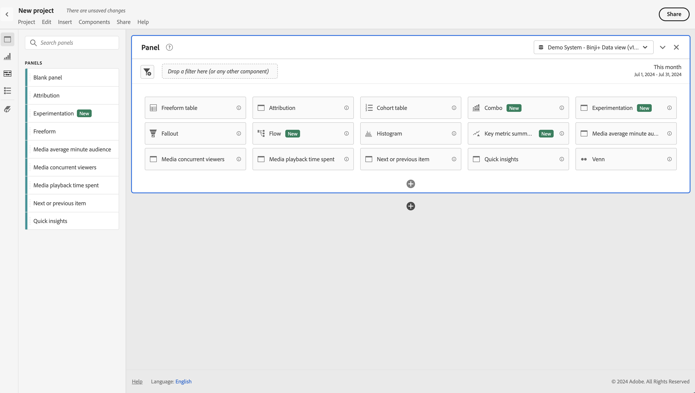

# Pannello vuoto {#blank-panel}

<!-- markdownlint-disable MD034 -->

>[!CONTEXTUALHELP]
>id="workspace_blankpanel_button"
>title="Pannello vuoto"
>abstract="Mostra una selezione di pannelli o visualizzazioni che puoi creare per generare un’analisi completamente personalizzata."
>additional-url="https://www.youtube.com/watch?v=SYaioiwBTrk" text="Pannelli in Analysis Workspace"

<!-- markdownlint-enable MD034 -->

>[!BEGINSHADEBOX]

_In questo articolo viene documentato il pannello vuoto in_  _&#x200B;**Customer Journey Analytics**&#x200B;_. _Vedere [Pannello vuoto](https://experienceleague.adobe.com/it/docs/analytics/analyze/analysis-workspace/panels/blank-panel) per la versione_  _&#x200B;**Adobe Analytics** di questo articolo._

>[!ENDSHADEBOX]

Un **[!UICONTROL pannello vuoto]** mostra una selezione di pannelli (indicati da ) o visualizzazioni che è possibile creare per creare un&#39;analisi completamente personalizzata.

## Utilizzo

Per utilizzare un **[!UICONTROL pannello vuoto]**:

1. Crea un **[!UICONTROL pannello vuoto]**. Per informazioni su come creare un pannello, consulta [Creare un pannello](panels.md#create-a-panel).

   

1. Seleziona una visualizzazione o un pannello tra le opzioni disponibili.

   * Quando selezioni un pannello, il pannello vuoto lascia il posto al pannello selezionato.
   * Quando selezioni una visualizzazione, questa viene aggiunta al pannello vuoto.

   Ad esempio, seleziona una visualizzazione (come  **[!UICONTROL Tabella coorte]**) da aggiungere al pannello, oppure seleziona un pannello (come  **[!UICONTROL Attribuzione]**) per modificare il pannello in un pannello Attribuzione.

Puoi:

* Selezionare  **dentro** un pannello per aggiungere un’altra visualizzazione. Viene visualizzato un riquadro a comparsa che consente di selezionare una visualizzazione.

  | Seleziona... | Per creare una visualizzazione... |
  |---|---|
  |  | [Tabella a forma libera](/help/analysis-workspace/visualizations/freeform-table/freeform-table.md) |
  |  | [Linee](/help/analysis-workspace/visualizations/line.md) |
  |  | [Barre](/help/analysis-workspace/visualizations/bar.md) |
  |  | [Numero di riepilogo](/help/analysis-workspace/visualizations/summary-number-change.md) |
  |  | [Testo](/help/analysis-workspace/visualizations/text.md) |
  |  | [Fallout](/help/analysis-workspace/visualizations/fallout/fallout-flow.md) |
  |  | [Flusso](/help/analysis-workspace/visualizations/c-flow/flow.md) |
  |  | [Area sovrapposta](/help/analysis-workspace/visualizations/area.md) |
  |  | [Tabella coorte](/help/analysis-workspace/visualizations/cohort-table/t-cohort.md) |
  |  | [Bullet](/help/analysis-workspace/visualizations/bullet-graph.md) |
  |  | [Anello](/help/analysis-workspace/visualizations/donut.md) |
  |  | [Variazione di riepilogo](/help/analysis-workspace/visualizations/summary-number-change.md) |
  |  | [Istogramma](/help/analysis-workspace/visualizations/histogram.md) |
  |  | [A dispersione](/help/analysis-workspace/visualizations/scatterplot.md) |
  |  | [Venn](/help/analysis-workspace/visualizations/venn.md) |
  |  | [Mappa ad albero](/help/analysis-workspace/visualizations/treemap.md) |

* Seleziona  **fuori** dal pannello per aggiungere un altro pannello vuoto.

>[!MORELIKETHIS]
>
>[Creare un pannello](/help/analysis-workspace/c-panels/panels.md#create-a-panel)
>
