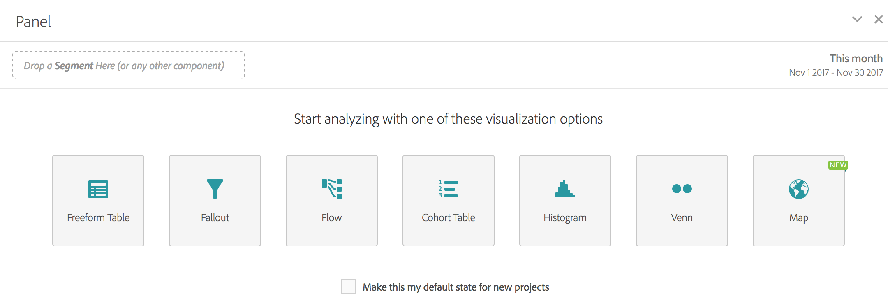

# Pannello vuoto

Un pannello vuoto evidenzia tutte le visualizzazioni che possono essere generate all’interno di un pannello, incluse Forma libera, Mappa, Abbandono, Flusso, Istogramma, Coorte e Venn. Inoltre, è possibile scegliere il pannello vuoto come stato iniziale predefinito del progetto, al posto del pannello a forma libera.

