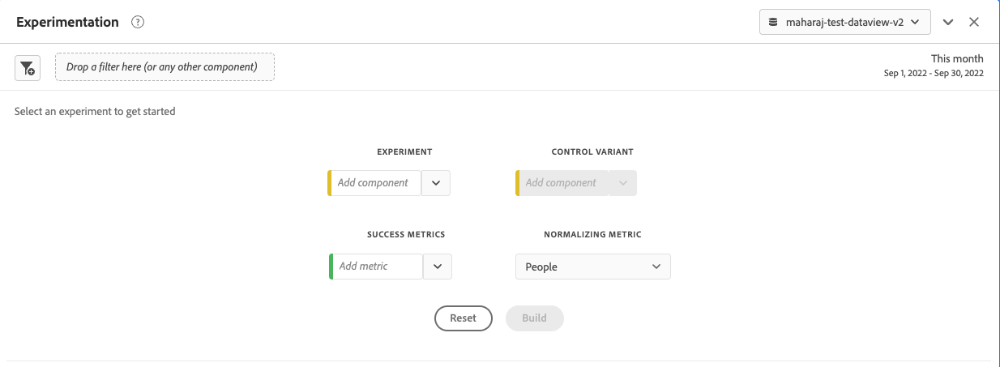

# Pannello sperimentale

>[!NOTE]
>
>Questa funzionalità è attualmente in [fase di test](/help/release-notes/releases.md).

La **[!UICONTROL Experimentation]** consente agli analisti di confrontare diverse varianti di esperienza utente, marketing o messaggistica per determinare quale sia meglio per determinare un risultato specifico. Puoi valutare l’incremento e l’affidabilità di qualsiasi esperimento A/B da qualsiasi piattaforma di sperimentazione: online, offline, dalle soluzioni di Adobe, Adobe Journey Optimizer e persino i dati BYO (risorse disponibili).

>[!IMPORTANT]
>
>A questo punto, [Adobe Analytics for Target](https://experienceleague.adobe.com/docs/target/using/integrate/a4t/a4t.html) (A4T) dati inviati in Adobe Experience Platform tramite il connettore sorgente di Analytics **impossibile** essere analizzati nella [!UICONTROL Experimentation] pannello. Ci attendiamo una soluzione a questo problema nel 2023.

## Controllo degli accessi

Il pannello Sperimentazione è disponibile per l’uso da parte di tutti gli utenti del Customer Journey Analytics (CJA). Non sono necessari diritti di amministratore o altre autorizzazioni. Tuttavia, la configurazione (passaggi 1 e 2 di seguito) richiede azioni che solo gli amministratori possono eseguire.

## Passaggio 1: Creare una connessione per sperimentare i set di dati

Lo schema di dati consigliato prevede che i dati dell’esperimento siano in un [Matrice oggetto](https://experienceleague.adobe.com/docs/experience-platform/xdm/ui/fields/array.html?lang=en) che contiene l’esperimento e i dati della variante in due dimensioni separate. Se i dati dell’esperimento sono in una singola dimensione con dati di esperimento e variante in una stringa delimitata, puoi utilizzare la variabile [sottostringa](/help/data-views/component-settings/substring.md) nelle visualizzazioni dati per dividerle in due per l’utilizzo nel pannello.

Dopo che i dati dell&#39;esperimento sono stati [acquisito](https://experienceleague.adobe.com/docs/experience-platform/ingestion/home.html?lang=it) in Adobe Experience Platform, [creare una connessione in CJA](/help/connections/create-connection.md) a uno o più set di dati di prova.

## Passaggio 2: Aggiungere etichette di contesto nelle visualizzazioni dati

Nelle impostazioni delle visualizzazioni dati di CJA, gli amministratori possono aggiungere [etichette di contesto](/help/data-views/component-settings/overview.md) a una dimensione o a una metrica e ai servizi CJA come [!UICONTROL Experimentation] possono utilizzare queste etichette per i loro scopi. Per il pannello Sperimentazione vengono utilizzate due etichette predefinite:

* [!UICONTROL Experimentation Experiment]
* [!UICONTROL Experimentation Variant]

Nella visualizzazione dati che contiene dati di sperimentazione, scegli due dimensioni, una con i dati di sperimentazione e una con i dati della variante. Quindi etichettate queste dimensioni con il **[!UICONTROL Experiment]** e **[!UICONTROL Variant]** etichette.

Senza queste etichette presenti, il pannello Esperimento non funziona, in quanto non vi sono esperimenti con cui lavorare.

## Passaggio 3: Configurare il pannello Esperimento

1. In CJA Workspace, trascina il pannello Sperimentazione in un progetto.

>[!IMPORTANT]
>Se la configurazione necessaria nelle visualizzazioni dati di CJA non è stata completata, riceverai questo messaggio prima di procedere: &quot;[!UICONTROL Please configure the experiment and variant dimensions in Data Views]&quot;.

1. Configura le impostazioni di input del pannello.

   | Impostazione | Definizione |
   | --- | --- |
   | **[!UICONTROL Experiment]** | Un insieme di varianti di un’esperienza che è stata esposta agli utenti finali per determinare quale è meglio mantenere in perpetuità. Un esperimento è costituito da due o più varianti, una delle quali è considerata la variante di controllo. Questa impostazione è precompilata con le dimensioni etichettate con  **[!UICONTROL Experiment]** etichetta nelle visualizzazioni dati e i dati degli ultimi 3 mesi sugli esperimenti. |
   | **[!UICONTROL Control Variant]** | Una delle due o più modifiche nell&#39;esperienza di un utente finale che vengono confrontate allo scopo di identificare l&#39;alternativa migliore. Una variante deve essere selezionata come controllo e una sola variante può essere considerata come variante di controllo. Questa impostazione è precompilata con le dimensioni etichettate con  **[!UICONTROL Variant]** nelle visualizzazioni dati. Questa impostazione richiama i dati della variante associati all&#39;esperimento. |
   | **[!UICONTROL Success Metrics]** | La metrica o le metriche con cui un utente confronta le varianti. La variante con il risultato più auspicabile per la metrica di conversione (sia essa più alta o più bassa) è dichiarata la &quot;variante con le prestazioni migliori&quot; di un esperimento. Puoi aggiungere fino a 5 metriche. |
   | **[!UICONTROL Normalizing Metric]** | La base ([!UICONTROL People], [!UICONTROL Sessions]oppure [!UICONTROL Events]) in cui verrà eseguito un test. Ad esempio, un test può confrontare i tassi di conversione di diverse varianti quando **[!UICONTROL Conversion rate]** è calcolato come segue **[!UICONTROL Conversions per session]** o **[!UICONTROL Conversions per person]**. |
   | **[!UICONTROL Date Range]** | L’intervallo di date viene impostato automaticamente in base al primo hit ricevuto in CJA per l’esperimento selezionato. Se necessario, puoi limitare o espandere l’intervallo di date a un intervallo temporale più specifico. |

1. Fai clic su **[!UICONTROL Build]**.

## Passaggio 4: Visualizza l&#39;output del pannello

Il pannello Sperimentazione restituisce un set completo di dati e visualizzazioni per consentirti di comprendere meglio le prestazioni degli esperimenti. Nella parte superiore del pannello viene visualizzata una riga di riepilogo per ricordarti le impostazioni del pannello selezionate. In qualsiasi momento, puoi modificare il pannello facendo clic sulla matita di modifica in alto a destra.

Viene inoltre visualizzato un riepilogo del testo che indica se l’esperimento è conclusivo o meno e riepiloga il risultato. La conclusione si basa sulla rilevanza statistica. (Vedi &quot;Metodologia statistica&quot; di seguito.) Puoi visualizzare i numeri di riepilogo per la variante con le prestazioni migliori con l’incremento e l’affidabilità più elevati.

Per ogni metrica di successo selezionata, verrà visualizzata una tabella a forma libera e una tendenza del tasso di conversione.

La [!UICONTROL Line] il grafico [!UICONTROL Control] contro [!UICONTROL Control Variant] prestazioni:

>[!NOTE]
>
>Al momento questo pannello non supporta l’analisi dei test A/A.

>[!NOTE]
>
>Incremento e affidabilità [funzioni metriche calcolate avanzate](/help/components/calc-metrics/cm-adv-functions.md) in CJA, così puoi creare metriche di incremento e affidabilità personalizzate.

## Passaggio 5: Interpretare i risultati

1. **L&#39;esperimento è conclusivo**: Ogni volta che visualizzi il rapporto sulla sperimentazione, l&#39;Adobe analizza i dati accumulati nell&#39;esperimento fino a questo punto e dichiarerà un esperimento &quot;Conclusivo&quot; quando la fiducia valida supera una soglia del 95% per *almeno uno* delle varianti (con una correzione Bonferonni applicata quando ci sono più di due bracci, per correggere per test di ipotesi multiple).

2. **Variante con prestazioni migliori**: Quando un esperimento è dichiarato conclusivo, la variante con il tasso di conversione più alto è etichettata come la &quot;variante con le prestazioni migliori&quot;. Questa variante deve essere la variante di controllo o linea di base oppure una delle varianti che supera il 95% ogni volta che viene applicata una soglia di affidabilità valida (con le correzioni Bonferonni).

3. **Tasso di conversione**: Il tasso di conversione mostrato è un rapporto tra il valore della metrica di successo e il valore della metrica di normalizzazione. Tieni presente che a volte questo può essere maggiore di 1, se la metrica non è binaria (1 o 0 per ogni unità nell’esperimento)

4. **Lift**: Il riepilogo del rapporto Esperimento mostra l’Incremento rispetto alla linea di base, che è una misura del miglioramento percentuale del tasso di conversione di una determinata variante rispetto alla linea di base. Definito con precisione, è la differenza di prestazioni tra una determinata variante e la linea di base, divisa per le prestazioni della linea di base, espressa in percentuale.

5. **Affidabilità**: La confidenza valida per ogni tempo mostrata è una misura probabilistica della quantità di prove che dimostrano che una data variante è la stessa della variante di controllo. Una maggiore affidabilità indica meno prove dell&#39;ipotesi che la variante di controllo e non di controllo abbiano prestazioni uguali. Più precisamente, l’affidabilità visualizzata è una probabilità (espressa in percentuale) che avremmo osservato una differenza minore nei tassi di conversione tra una data variante e il controllo, se in realtà non c’è differenza nei veri tassi di conversione sottostanti. In termini di *p*-valori, l&#39;affidabilità visualizzata è 1 - *p*-value.

>[!NOTE]
>
>Una descrizione completa dei risultati dovrebbe considerare tutte le prove disponibili (ad esempio la progettazione di esperimenti, le dimensioni dei campioni, i tassi di conversione, la fiducia, ecc.), e non solo la dichiarazione conclusiva o meno. Anche quando un risultato non è ancora &quot;conclusivo&quot;, ci possono essere prove convincenti che una variante sia diversa da un&#39;altra (ad esempio, gli intervalli di affidabilità sono quasi non sovrapposti). Idealmente, il processo decisionale dovrebbe essere informato da tutte le prove statistiche, interpretate su uno spettro continuo.

## Metodologia statistica dell&#39;Adobe

Per fornire un’inferenza statistica facilmente interpretabile e sicura, l’Adobe ha adottato una metodologia statistica basata sui [Sequenze di affidabilità valide in qualsiasi momento](https://doi.org/10.48550/arXiv.2103.06476).

Una sequenza di affidabilità è un analogico &quot;sequenziale&quot; di un intervallo di affidabilità. Per capire quale sia una sequenza di affidabilità, immagina di ripetere i tuoi esperimenti cento volte e di calcolare una stima della metrica media di business (ad esempio il tasso di apertura di un’e-mail) e della sequenza di affidabilità al 95% associata per *ogni nuovo utente* entra nell&#39;esperimento. Una sequenza di affidabilità del 95% includerà il valore &quot;true&quot; della metrica di business in 95 dei 100 esperimenti eseguiti. (Un intervallo di affidabilità del 95% può essere calcolato una sola volta per esperimento al fine di fornire la stessa garanzia di copertura del 95%; non con ogni nuovo utente). Le sequenze di affidabilità consentono quindi di monitorare continuamente gli esperimenti, senza aumentare i tassi di errore falsi positivi, ovvero permettono di &quot;sbirciare&quot; nei risultati.
