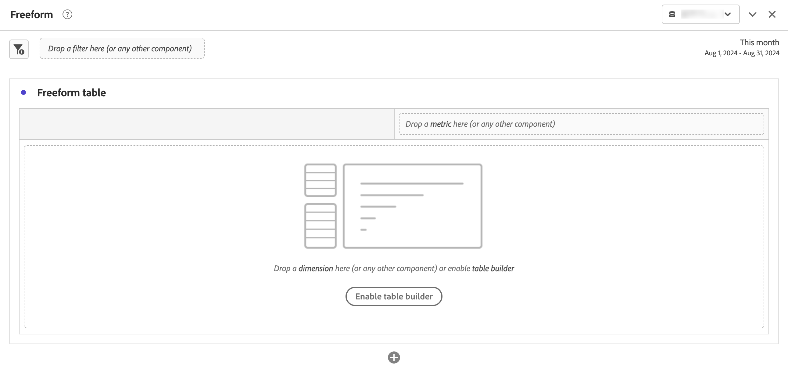

# Pannello a forma libera

>[!BEGINSHADEBOX]

_Questo articolo documenta il pannello a forma libera in_  _**Customer Journey Analytics**_. _Consulta il [pannello a forma libera](https://experienceleague.adobe.com/it/docs/analytics/analyze/analysis-workspace/panels/freeform-panel) per la versione_  _**Adobe Analytics** di questo articolo._

>[!ENDSHADEBOX]

Un **[!UICONTROL pannello a forma libera]** è un pannello vuoto con [tabella a forma libera](/help/analysis-workspace/visualizations/freeform-table/freeform-table.md) come stato iniziale predefinito.

## Utilizzo

Per utilizzare un **[!UICONTROL pannello a forma libera]**:

1. Crea un **[!UICONTROL pannello a forma libera]**. Per informazioni su come creare un pannello, consulta [Creare un pannello](panels.md#create-a-panel).

   

1. Consulta [Utilizzare i componenti in Workspace](/help/components/use-components-in-workspace.md) come aggiungere componenti al pannello a forma libera e alla visualizzazione [Tabella a forma libera](/help/analysis-workspace/visualizations/freeform-table/freeform-table.md).

>[!MORELIKETHIS]
>
>[Crea un pannello](/help/analysis-workspace/c-panels/panels.md#create-a-panel)
>[Utilizzare i componenti in Workspace](/help/components/use-components-in-workspace.md)
>[Visualizzazione tabella a forma libera](/help/analysis-workspace/visualizations/freeform-table/freeform-table.md)
>