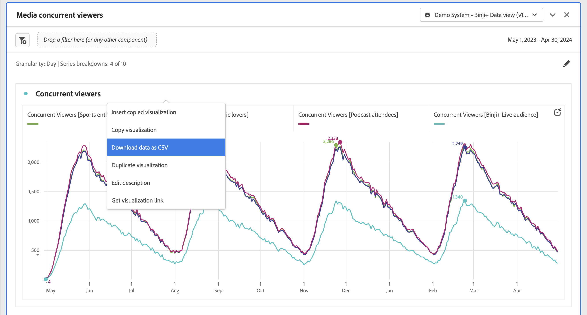

# Pannello Visualizzatori simultanei di file multimediali {#media-concurrent-viewers-panel}

<!-- markdownlint-disable MD034 -->

>[!CONTEXTUALHELP]
>id="workspace_mediaconcurrentviewers_button"
>title="Visualizzatori simultanei di contenuti multimediali"
>abstract="Crea un pannello per analizzare i visualizzatori simultanei in un determinato periodo di tempo."

<!-- markdownlint-enable MD034 -->

<!-- markdownlint-disable MD034 -->

>[!CONTEXTUALHELP]
>id="workspace_mediaconcurrentviewers_panel"
>title="Visualizzatori simultanei di contenuti multimediali"
>abstract="Analizza i visualizzatori simultanei nel tempo, visualizza il picco di concorrenza e, facoltativamente, suddividi e confronta utilizzando filtri, dimensioni, elementi dimensionali o intervalli di date."

<!-- markdownlint-enable MD034 -->

>[!BEGINSHADEBOX]

_Questo articolo documenta il pannello Visualizzatori simultanei di contenuti multimediali in_  _**Customer Journey Analytics**_. _Consulta [Pannello Visualizzatori simultanei di contenuti multimediali](https://experienceleague.adobe.com/en/docs/analytics/analyze/analysis-workspace/panels/media-concurrent-viewers) per_  _**Adobe Analytics** versione di questo articolo._

>[!ENDSHADEBOX]

>[!NOTE]
>
>Il pannello Pubblico medio per minuto è disponibile solo per i clienti che hanno acquistato il componente aggiuntivo Streaming Media Collection per Customer Journey Analytics.
>
>Per ulteriori informazioni, contatta il rappresentante commerciale Adobe o il team dell’account Adobe.
>

Il pannello **[!UICONTROL Media concurrent viewers]** consente di analizzare i visualizzatori simultanei nel tempo, con dettagli sul picco di concorrenza e con la possibilità di suddividerli e confrontarli.

Puoi analizzare i visualizzatori simultanei per capire dove si è verificato il picco di concorrenza o dove si è verificato un calo, così da fornire ad insight preziosi dati sulla qualità dei contenuti e sul coinvolgimento dei visualizzatori. E per risolvere problemi o pianificare volumi o scala.

In Analysis Workspace, la metrica Visualizzatori simultanei è il numero di persone univoche che visualizzano i flussi multimediali in un momento specifico, indipendentemente dal numero di sessioni.

>[!BEGINSHADEBOX]

Per un video dimostrativo, consulta  [Pannello visualizzatori simultanei di contenuti multimediali](https://video.tv.adobe.com/v/26990/?quality=12&learn=on){target="_blank"}.

{{videoaa}}

>[!ENDSHADEBOX]

## Utilizzo

Per utilizzare un pannello **[!UICONTROL Media concurrent viewers]**:

1. Crea un pannello **[!UICONTROL Media concurrent viewers]**. Per informazioni su come creare un pannello, consulta [Creare un pannello](panels.md#create-a-panel).

1. Accertati di selezionare una visualizzazione dati per il pannello i cui componenti sono configurati da Streaming Media Collection.

1. Specifica l’[input](#panel-input) per il pannello.

1. Osserva l’[output](#panel-output) per il pannello.

### Input del pannello

Puoi configurare il pannello Visualizzatori simultanei di contenuti multimediali usando le seguenti impostazioni di input:

| Impostazione | Descrizione |
|---|---|
| **[!UICONTROL Panel date range]** | L’intervallo di date predefinito del pannello è Today (Oggi).  È possibile modificarlo per visualizzare uno o più mesi alla volta.    Questa visualizzazione è limitata a 1440 righe di dati (ad esempio, 24 ore con granularità al minuto).  Se una combinazione di intervallo di date e granularità genera più di 1440 righe, la granularità viene aggiornata automaticamente in modo che l’intervallo di date completo possa rientrare entro questo limite di righe. |
| **[!UICONTROL Granularity]** | L’impostazione predefinita della granularità è Minuto. Questa visualizzazione è limitata a 1440 righe di dati (ad esempio, 24 ore con granularità al minuto).  Se una combinazione di intervallo di date e granularità genera più di 1440 righe, la granularità viene aggiornata automaticamente in modo che l’intervallo di date completo possa rientrare entro questo limite di righe. |
| **[!UICONTROL Panel summary numbers]** | Per visualizzare i dettagli di data o ora per i visualizzatori simultanei, è disponibile un numero di riepilogo. Il valore Maximum (Massimo) mostra i dettagli del picco di concorrenza. **[!UICONTROL Minimum]** mostra i dettagli del valore minimo.  Per impostazione predefinita il pannello mostra solo il valore massimo, ma puoi impostarlo sul valore minimo o su entrambi.  Se utilizzi i raggruppamenti, per ciascuno viene visualizzato un numero di riepilogo. |
| **[!UICONTROL Series breakdown]** | Facoltativamente, puoi suddividere la visualizzazione per filtri, dimensioni, elementi dimensionali o intervalli di date. È possibile visualizzare fino a 10 righe alla volta. I raggruppamenti sono limitati a un singolo livello. Quando si trascina una dimensione, gli elementi dimensionali principali vengono selezionati automaticamente in base all’intervallo di date del pannello selezionato. Per confrontare intervalli di date, trascina 2 o più intervalli di date nel filtro di raggruppamento per serie. |

Ecco un esempio del pannello configurato per la granularità **[!UICONTROL Minute]**, con **[!UICONTROL Maximum only]** numeri di riepilogo. E suddiviso per **[!UICONTROL Other]**, **[!UICONTROL Table]**, **[!UICONTROL Mobile Phone]**, **[!UICONTROL Gaming Console]**, **[!UICONTROL Media Player]**, **[!UICONTROL Set-top Box]**, **[!UICONTROL Television]**.

### Output del pannello

Il pannello Visualizzatori simultanei di contenuti multimediali restituisce un grafico a linee e numeri di riepilogo che includono i dettagli del numero massimo e/o minimo di visualizzatori simultanei.  Nella parte superiore del pannello viene visualizzata una riga di riepilogo per ricordarti le impostazioni del pannello selezionate.

In qualsiasi momento, seleziona  per modificare e ricreare il pannello.

Se selezioni una suddivisione per serie, per ciascuna suddivisione viene visualizzata una linea sul grafico a linee e un numero di riepilogo:

### Origine dati

L&#39;unica metrica che può essere utilizzata in questo pannello è **[!UICONTROL Concurrent viewers]**:

| Metrica | Descrizione |
|---|---|
| **[!UICONTROL Concurrent viewers]** | Il numero di persone univoche che visualizzano i flussi multimediali in un determinato momento, indipendentemente dal numero di sessioni. |

In questa visualizzazione non è disponibile una tabella a forma libera.  Per visualizzare l&#39;origine dati, scaricarla dal menu di scelta rapida della visualizzazione grafico a linee e selezionare **[!UICONTROL Download data as CSV]**.  Sono incluse le suddivisioni per serie di dati.

## Domande frequenti

| Domanda | Risposta |
|---|---|
| Dov’è la tabella a forma libera? Come posso visualizzare l’origine dati? | La tabella a forma libera non è disponibile in questa vista. È possibile scaricare l&#39;origine dati dal menu di scelta rapida del grafico a linee e selezionare **[!UICONTROL Download data as CSV]**. |
| Perché la granularità è cambiata? | Questa visualizzazione è limitata a 1440 righe di dati (ad esempio, 24 ore con granularità al minuto). Se una combinazione di intervallo di date e granularità genera più di 1440 righe, la granularità viene aggiornata automaticamente in modo che l’intervallo di date completo possa rientrare entro questo limite di righe.  Quando passi da un intervallo di date più ampio a uno più ridotto, la granularità viene aggiornata al dettaglio più basso consentito dopo la modifica dell&#39;intervallo di date. Per visualizzare una granularità maggiore, modifica il pannello e ricompila. |
| Come si confrontano nomi video, filtri, tipi di contenuto e altri? | Per confrontare questi elementi in una singola visualizzazione, trascina filtri, dimensioni o elementi dimensionali specifici nel filtro di raggruppamento per serie.  La visualizzazione è limitata a 10 raggruppamenti.  Per visualizzarne più di 10, è necessario utilizzare più pannelli. |
| Come si confrontano gli intervalli di date? | Per confrontare intervalli di date diversi in una singola visualizzazione, utilizza i raggruppamenti di serie trascinando 2 o più intervalli di date.  Gli intervalli di date sovrascrivono l’intervallo del pannello. |
| Come posso modificare il tipo di visualizzazione? | Questo pannello consente solo la visualizzazione a linee per le serie temporali. |
| Posso eseguire il rilevamento delle anomalie? | No.  Il rilevamento delle anomalie non è disponibile per questo pannello. |
| Perché utilizzare persone univoche invece di sessioni attive? | L’utilizzo di persone univoche consente di rimuovere i picchi indesiderati in corrispondenza dei confini tra dati da visualizzare (dove le sessioni terminano e iniziano allo stesso momento). |
| Cosa significa avere visualizzatori simultanei con granularità maggiore del minuto? | Con una granularità maggiore di un minuto, i visualizzatori simultanei sono la somma dei visualizzatori simultanei univoci per tutti i minuti entro l’intervallo di tempo in questione. Ad esempio, i visualizzatori simultanei con granularità a livello di ora corrispondono alla somma dei visualizzatori simultanei univoci per tutti i minuti all’interno di quell’ora. |
| Il pannello Workspace mostra le stesse informazioni del rapporto Visualizzatori simultanei? | No.  In Analysis Workspace, la metrica Visualizzatori simultanei è definita come il numero di persone univoche che visualizzano il flusso multimediale in un momento specifico. Indipendentemente dal numero di sessioni.  Questa metrica è diversa dal reporting sui visualizzatori simultanei nella sezione Rapporti, che utilizza sessioni attive simultanee. L’utilizzo di persone univoche consente di rimuovere i picchi indesiderati in corrispondenza dei confini tra dati da visualizzare (dove le sessioni terminano e iniziano allo stesso momento). |

<!-- For more information about Media Concurrent Viewers, visit [MA doc page]( https://url). -->

>[!MORELIKETHIS]
>
>[Creare un pannello](/help/analysis-workspace/c-panels/panels.md#create-a-panel)
>[Pannello Tempo di riproduzione dei contenuti multimediali](media-playback-time-spent.md)
>[Pannello del pubblico medio per minuto del file multimediale](average-minute-audience-panel.md)
>