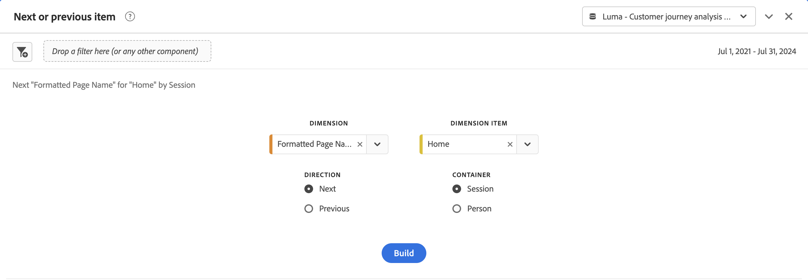
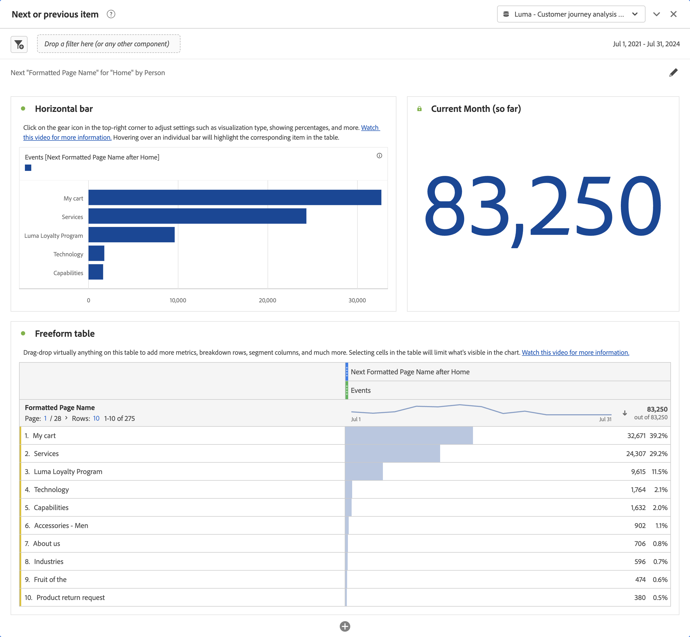

# Pannello elemento successivo o precedente {#next-or-previous-item-panel}

<!-- markdownlint-disable MD034 -->

>[!CONTEXTUALHELP]
>id="workspace_nextorpreviousitem_button"
>title="Elemento successivo o precedente"
>abstract="Crea un pannello per comprendere le dimensioni da cui in precedenza provenivano le persone o la dimensione dove andranno successivamente."

>[!CONTEXTUALHELP]
>id="workspace_nextorpreviousitem_panel"
>title="Elemento successivo o precedente"
>abstract="Analizza i luoghi più comuni da cui provengono o a cui accedono i visitatori in precedenza. Specifica la dimensione, l’elemento dimensione, la direzione e il contenitore da utilizzare per la visualizzazione."

<!-- markdownlint-enable MD034 -->

>[!BEGINSHADEBOX]

_Questo articolo descrive il pannello elemento successivo o precedente in_  _**Customer Journey Analytics**_. _Consulta il [Pannello elemento successivo o precedente](https://experienceleague.adobe.com/it/docs/analytics/analyze/analysis-workspace/panels/next-previous) per la versione_  _**Adobe Analytics** di questo articolo._

>[!ENDSHADEBOX]

Il pannello **[!UICONTROL Next or previous item]** contiene diverse tabelle e visualizzazioni per identificare l’elemento dimensionale successivo o precedente per una dimensione specifica. Ad esempio, potresti voler scoprire a quali pagine la clientela accede più spesso dopo aver visitato la pagina Home.

## Utilizzo {#use}

>[!CONTEXTUALHELP]
>id="workspace_nextorpreviousitem_container"
>title="Contenitore"
>abstract="Seleziona il contenitore per determinare l’ambito della richiesta di informazioni."

Per usare un pannello **[!UICONTROL Next or previous item]**:

1. Crea un pannello **[!UICONTROL Next or previous item]**. Per informazioni su come creare un pannello, consulta [Creare un pannello](panels.md#create-a-panel).

1. Specifica l’[input](#panel-input) per il pannello.

1. Osserva l’[output](#panel-output) per il pannello.

### Input del pannello

Puoi configurare il pannello [!UICONTROL Next or previous item] usando le seguenti impostazioni di input:

| Input | Descrizione |
| --- | --- |
| **[!UICONTROL Dimension]** | Seleziona la dimensione per la quale desideri scoprire gli elementi successivi o precedenti. |
| **[!UICONTROL Dimension item]** | Seleziona l’elemento dimensionale specifico al centro della richiesta successiva/precedente. |
| **[!UICONTROL Direction]** | Specifica se stai cercando l’elemento dimensionale [!UICONTROL Next] o [!UICONTROL Previous]. |
| **[!UICONTROL Container]** | Seleziona il contenitore **[!UICONTROL Global Account]** [!BADGE B2B edition]{type=Informative url="https://experienceleague.adobe.com/en/docs/analytics-platform/using/cja-overview/cja-b2b/cja-b2b-edition" newtab=true tooltip="Customer Journey Analytics B2B edition"}, **[!UICONTROL Account]** [!BADGE B2B edition]{type=Informative url="https://experienceleague.adobe.com/en/docs/analytics-platform/using/cja-overview/cja-b2b/cja-b2b-edition" newtab=true tooltip="Customer Journey Analytics B2B edition"}, **[!UICONTROL Buying Group]** [!BADGE B2B edition]{type=Informative url="https://experienceleague.adobe.com/en/docs/analytics-platform/using/cja-overview/cja-b2b/cja-b2b-edition" newtab=true tooltip="Customer Journey Analytics B2B edition"}, **[!UICONTROL Opportunity]** [!BADGE B2B edition]{type=Informative url="https://experienceleague.adobe.com/en/docs/analytics-platform/using/cja-overview/cja-b2b/cja-b2b-edition" newtab=true tooltip="Customer Journey Analytics B2B edition"}, **[!UICONTROL Session]** o **[!UICONTROL Person]**, per determinare l&#39;ambito della richiesta di informazioni. |

{style="table-layout:auto"}

Seleziona **[!UICONTROL Build]** per creare il pannello.

### Output del pannello

Il pannello [!UICONTROL Next or previous item] restituisce un set completo di dati e visualizzazioni per consentirti di comprendere meglio le occorrenze che seguono o precedono elementi dimensionali specifici.

| Visualizzazione | Descrizione |
| --- | --- |
| **[!UICONTROL Horizontal bar]** | Elenca gli elementi successivi (o precedenti) in base all’elemento dimensionale selezionato. Passando il puntatore del mouse su una singola barra viene evidenziato l’elemento corrispondente nella tabella a forma libera. |
| **[!UICONTROL Summary number]** | Numero di riepilogo di alto livello di tutte le occorrenze degli elementi dimensionali successivi o precedenti per il mese corrente (finora). |
| **[!UICONTROL Freeform table]** | Elenca gli elementi successivi (o precedenti) in base all’elemento dimensionale selezionato, in formato tabella. Ad esempio, quali sono le pagine più popolari (per occorrenze) a cui gli utenti accedono dopo (o prima) della pagina Home o dell’area di lavoro. |

{style="table-layout:auto"}

>[!MORELIKETHIS]
>
>[Creare un pannello](/help/analysis-workspace/c-panels/panels.md#create-a-panel)
>
