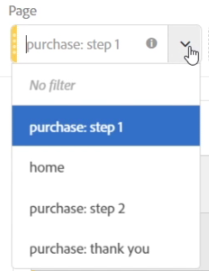

# Panoramica dei pannelli

>[!NOTE] Stai visualizzando la documentazione per  Analysis Workspace in Customer Journey Analytics. Il set di funzioni è leggermente diverso da [Analysis Workspace in Adobe  Analytics](https://docs.adobe.com/content/help/it-IT/analytics/analyze/analysis-workspace/home.html)tradizionale. [Ulteriori informazioni...](/help/getting-started/cja-aa.md)

I pannelli sono raccolte di tabelle e visualizzazioni. È possibile accedere ai pannelli dall’icona in alto a sinistra in Workspace. I pannelli sono utili quando desideri organizzare i tuoi progetti in base a periodi di tempo, unità organizzative, aree geografiche, ecc. Questi quattro tipi di pannelli sono disponibili in  Analysis Workspace per Customer Journey Analytics:

* [Pannello vuoto](blank-panel.md)
* [Pannello Approfondimenti rapidi](quickinsight.md)
* [Pannello Attribuzione](attribution.md)
* [Pannello a forma libera](freeform-panel.md)

I pannelli Quick Insights, Blank e Freeform sono luoghi ideali per avviare l&#39;analisi, mentre il pannello Attribution IQ si presta ad analisi più avanzate. Nei progetti è disponibile un `"+"` pulsante che consente di aggiungere pannelli vuoti in qualsiasi momento.

The default starting panel is the Freeform panel, but you can make the [blank panel](/help/analysis-workspace/c-panels/blank-panel.md) your default as well.

## Filtri a discesa nei pannelli

La zona di rilascio dei pannelli ora dispone di funzionalità di filtro a discesa. Questi filtri ti consentono di interagire con i dati del progetto in modo controllato in modo da poter eseguire analisi approfondite, semplificare i tuoi progetti e/o condividere informazioni con altri.

Ecco un esempio di progetto semplificato: se hai diverse versioni di un progetto/pannello per ottenere rapporti specifici per diversi paesi, ora puoi comprimerle in un singolo pannello e aggiungere un elenco a discesa per il paese anziché di filtrare tra diversi set di dati.

Nota bene:

* Puoi rilasciare più componenti (o elementi di dimensioni), quindi passare da uno all’altro in un elenco a discesa per filtrare i contenuti del pannello.
* Puoi creare più elenchi a discesa nello stesso pannello.
* Puoi personalizzare il titolo dell’elenco a discesa facendo clic sul titolo e modificandolo oppure rimuovere del tutto il titolo facendo clic sulla x posta accanto.
* Puoi creare filtri a discesa utilizzando qualsiasi tipo di componente: dimensioni, intervalli di date, segmenti e metriche. Tieni presente che gli intervalli di date dell’elenco a discesa sostituiscono sempre gli intervalli di date del pannello.
* Sono mantenuti i colori dei componenti dalla barra a sinistra: giallo per gli elenchi a discesa degli elementi di dimensioni, verde per le metriche, blu per i segmenti e viola per gli intervalli di date.
* La zona di rilascio continua a creare segmenti a livello di hit per gli oggetti trascinati al suo interno come segmenti. Puoi modificarli come di consueto facendo clic sull’icona delle informazioni (i) accanto al segmento, quindi sull’icona di modifica a forma di matita e modificandoli nel Generatore di segmenti.

**Per creare e utilizzare filtri a discesa:**

1. Seleziona qualsiasi elemento dalla barra a sinistra e, **tenendo premuto il tasto**, rilascia l’elemento nella zona di rilascio del pannello.

   

   Questo trasforma il componente in un elenco a discesa, anziché in un segmento (puoi inoltre continuare ad aggiungere segmenti senza tenere premuto il tasto).

   

1. Seleziona una delle opzioni dal menu a discesa per modificare i dati nel pannello sottostante (puoi anche scegliere di non filtrare nessuno dei dati del pannello selezionando **[!UICONTROL No filter]** (Nessun filtro)).
1. Ad esempio, se desideri anche suddividere i dati per canale di marketing, puoi aggiungere un altro menu a discesa denominato “Canale di marketing”:

   

