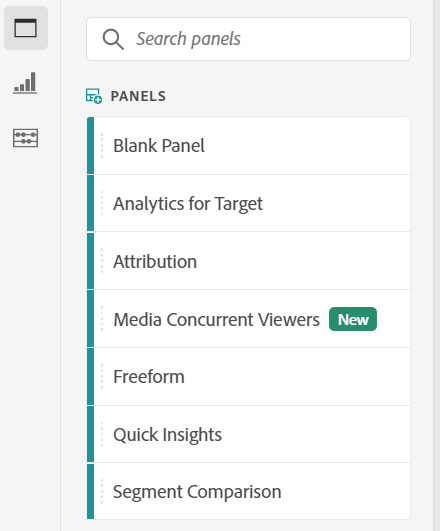
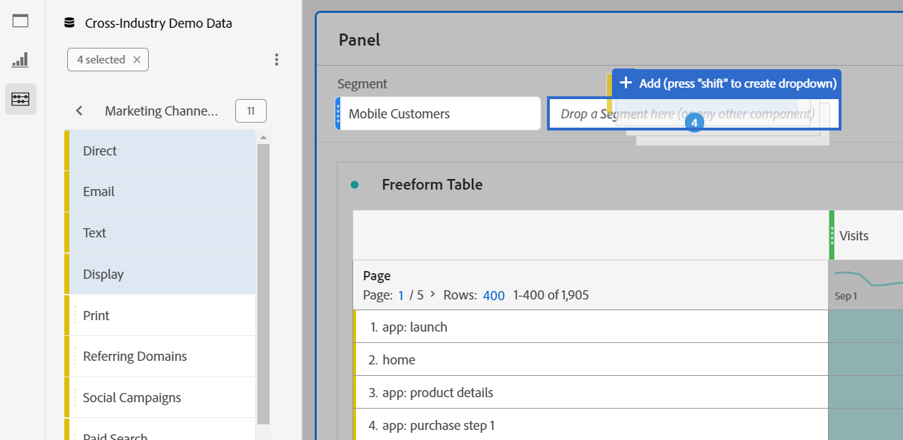

# Panoramica dei pannelli

Un [!UICONTROL panel] è una raccolta di tabelle e visualizzazioni. Puoi accedere ai pannelli dall’icona in alto a sinistra in Workspace o in un [pannello vuoto](/help/analysis-workspace/c-panels/blank-panel.md). I pannelli sono utili per organizzare i progetti in base a specifici periodi di tempo, viste dati o casi di utilizzo di analisi.

## Tipi di pannello

In Analysis Workspace sono disponibili i seguenti tipi di pannello per [!UICONTROL Customer Journey Analytics]:

| Nome pannello | Descrizione |
| --- | --- |
| [Pannello vuoto](/help/analysis-workspace/c-panels/blank-panel.md) | Per iniziare a eseguire analisi, scegli tra i pannelli e le visualizzazioni disponibili. |
| [Pannello Quick Insights](quickinsight.md) | Crea una tabella a forma libera e una relativa visualizzazione per analizzare e individuare più rapidamente le informazioni. |
| [Pannello Attribution](attribution.md) | Confronta e visualizza rapidamente più modelli di attribuzione utilizzando qualsiasi dimensione e metrica di conversione. |
| [Pannello a forma libera](freeform-panel.md) | Esegui confronti illimitati e raggruppamenti, quindi aggiungi visualizzazioni per raccontare una storia ricca di dati. |
| [Pannello Visualizzatori simultanei di contenuti multimediali](media-concurrent-viewers.md) | Analizza i visualizzatori simultanei nel tempo, con dettagli sui picchi di concorrenza e con la possibilità di suddividerli e confrontarli. |
| [Pannello Media Playback Time Spent (Tempo di riproduzione dei contenuti multimediali)](media-playback-timespent/media-playback-time-spent.md) | L’analisi del tempo di riproduzione consente di comprendere dove si è verificato il picco di concorrenza o dove si è verificato il calo. |

I pannelli [!UICONTROL Quick Insights], [!UICONTROL Blank] e [!UICONTROL Freeform] sono ideali per iniziare con le attività di analisi, mentre [!UICONTROL Attribution IQ] si presta ad analisi più avanzate. Nei progetti è disponibile un pulsante `"+"` che consente di aggiungere pannelli vuoti in qualsiasi momento.

Il pannello iniziale predefinito è [!UICONTROL Freeform], ma puoi impostare come predefinito il [pannello vuoto](/help/analysis-workspace/c-panels/blank-panel.md).

## Calendario {#calendar}

Il calendario del pannello controlla l’intervallo di reporting per tabelle e visualizzazioni all’interno di un pannello.

Nota: se un componente di intervallo date (viola) viene utilizzato all’interno di una tabella, di una visualizzazione o di una zona di rilascio di un pannello, questo sovrascriverà il calendario del pannello.

Puoi applicare un intervallo di date a livello di minuto nelle impostazioni avanzate del calendario del pannello. Se esegui rapporti su un intervallo di date che dura molti giorni, l’ora di inizio si applica al primo giorno e l’ora di fine si applica all’ultimo giorno dell’intervallo.

## Zona di rilascio {#dropzone}

La zona di rilascio del pannello consente di applicare filtri e filtri a discesa a tutte le tabelle e visualizzazioni di un pannello. Puoi applicare uno o più filtri a un pannello. Per modificare il titolo sopra ogni filtro, fai clic sull’icona della matita (Modifica); per rimuoverlo, fai clic con il pulsante destro del mouse.

### Filtri

Per iniziare a filtrare il pannello, trascina un filtro dalla barra a sinistra fino alla zona di rilascio del pannello.

### Filtri ad hoc

Puoi anche trascinare componenti diversi da filtri direttamente nella zona di rilascio, per creare filtri ad hoc in modo più rapido e senza dover passare al Generatore di filtri. I filtri creati in questo modo vengono automaticamente definiti come filtri a livello di hit. Puoi modificarli come di consueto facendo clic sull’icona delle informazioni (i) accanto al filtro, quindi sull’icona Modifica a forma di matita per accedere al Generatore di filtri.

I filtri ad hoc sono un tipo di filtro rapido e sono locali per il progetto. Non appaiono nella barra a sinistra a meno che tu non li renda pubblici.

Per ulteriori informazioni, consulta [Filtri rapidi](/help/components/filters/quick-filters.md).

### Filtri a discesa statici

I filtri a discesa consentono di interagire con i dati in modo controllato. Ad esempio, puoi aggiungere un filtro a discesa per i tipi di dispositivi mobili, in modo da filtrare il pannello per Tablet, Telefono cellulare o Desktop.

I filtri a discesa possono essere utilizzati per consolidare più progetti in un progetto unico. Ad esempio, se hai creato più versioni dello stesso progetto, assegnando a ciascuna un filtro Paese diverso, puoi consolidarle tutte in un unico progetto e aggiungere un filtro a discesa Paese.

Per creare un filtro a discesa statico:

* Per i filtri a discesa che utilizzano elementi dimensionali, fai clic sull’icona della freccia destra accanto alla dimensione desiderata nella barra a sinistra. Questa azione espone tutti gli elementi dimensionali disponibili. Seleziona più elementi dimensionali da questo elenco utilizzando `[Shift + Click]` o `[Ctrl + Click]`, quindi rilasciali nella zona di rilascio del pannello **in attesa`[Shift]`**.
* Per i filtri a discesa che utilizzano altri componenti come metriche, filtri o intervalli di date, seleziona più componenti utilizzando `[Shift + Click]` o `[Ctrl + Click]`. Rilascia la selezione nella zona di rilascio del pannello **in attesa`[Shift]`**. In questo contesto, tutti i tipi di componenti vengono trattati come filtri.
* Un singolo filtro a discesa può contenere un solo tipo di componente. Se nella selezione sono inclusi più tipi di componenti, viene creato un filtro a discesa separato per tipo di componente. Ad esempio, se nella selezione includi sia metriche che elementi dimensionali, vengono creati due filtri a discesa separati. Un filtro a discesa include elementi dimensionali e l’altro metriche.

Seleziona una delle opzioni dall’elenco a discesa per modificare i dati nel pannello. Puoi anche scegliere di non filtrare nessuno nei dati del pannello selezionando **[!UICONTROL No filter]**.

Il clic con il pulsante destro del mouse su un filtro a discesa fornisce le seguenti opzioni:

* **[!UICONTROL Add label]**: Quando aggiungi un filtro a discesa a un progetto, un’etichetta viene impostata automaticamente sul nome del componente. Se elimini l’etichetta, puoi aggiungerla nuovamente con questa opzione.
* **[!UICONTROL Delete label]**: Rimuovi il testo sopra un filtro a discesa.
* **[!UICONTROL Delete drop-down filter]**: Rimuove il filtro a discesa dal pannello.

Per ulteriori informazioni su come aggiungere filtri a discesa a un progetto, [guarda questo video](https://experienceleague.adobe.com/docs/analytics-learn/tutorials/analysis-workspace/using-panels/using-panels-to-organize-your-analysis-workspace-projects.html?lang=it).

### Filtri a discesa dinamici

I filtri a discesa dinamici ti consentono di determinare i valori disponibili in base ai dati nell’intervallo di reporting del pannello e ai valori di altri filtri a discesa. Ad esempio, puoi creare due menu a discesa dinamici utilizzando una dimensione Paesi e la dimensione Città. Quando selezioni un paese dall’elenco a discesa Paesi UICONTROL , l’elenco a discesa Città si regola in modo dinamico per mostrare solo le città all’interno del paese.

Lo stesso concetto si applica a tutte le dimensioni; sono visibili solo gli elementi dimensionali visualizzati nell’intervallo di date del pannello e i filtri selezionati. Gli elementi di Dimension selezionati nei filtri a discesa statici influiscono sui valori disponibili nei filtri a discesa dinamici. Tuttavia, l&#39;inverso non è vero; Gli elementi di Dimension selezionati nei filtri a discesa dinamici non influiscono sui valori disponibili nei filtri a discesa statici.

La selezione manuale degli elementi dimensionali è disponibile se si anticipa un certo elemento dimensionale da raccogliere in futuro. È inoltre possibile cancellare un filtro a discesa dinamico in modo che non contenga un valore, consentendo ad altri filtri a discesa dinamici di contenere più valori. Seleziona **[!UICONTROL Clear All]** per cancellare la selezione da tutti i filtri a discesa per quel pannello.

Per creare un filtro a discesa dinamico:

* Trascina una singola dimensione nella zona di rilascio del pannello **in attesa`[Shift]`**.
* I filtri a discesa dinamici non sono disponibili per metriche, filtri o intervalli di date.
* Fai clic con il pulsante destro del mouse su un filtro a discesa e seleziona **[!UICONTROL Delete filter]** per eliminarlo.

Facendo clic con il pulsante destro del mouse su un filtro a discesa dinamico, sono disponibili le stesse opzioni dei filtri a discesa statici.

## Menu di scelta rapida {#right-click}

Ulteriori funzionalità per un pannello sono disponibili nel menu di scelta rapida che compare quando fai clic con il pulsante destro del mouse sull’intestazione del pannello.

Sono disponibili le seguenti impostazioni:

| Impostazione | Descrizione |
| --- | --- |
| [!UICONTROL Insert Copied Panel/Visualization] | Consente di incollare (&quot;inserire&quot;) un pannello o una visualizzazione copiati in un’altra posizione all’interno del progetto o in un progetto diverso. |
| [!UICONTROL Copy Panel] | Consente di fare clic con il pulsante destro del mouse e copiare un pannello in modo da poterlo inserire in un’altra posizione all’interno del progetto o in un progetto diverso. |
| [!UICONTROL Duplicate Panel] | Crea un duplicato esatto del pannello corrente, che potrai quindi modificare. |
| [!UICONTROL Collapse/Expand all Panels] | Comprime ed espande tutti i pannelli del progetto. |
| [!UICONTROL Collapse/Expand all Visualizations in Panel] | Comprime ed espande tutte le visualizzazioni nel pannello corrente. |
| [!UICONTROL Edit Description] | Aggiungi (o modifica) un testo descrittivo per il pannello. |
| [!UICONTROL Get Panel Link] | Consente di indirizzare un utente a uno specifico pannello in un progetto. Quando fai clic sul collegamento, al destinatario verrà richiesto di effettuare l’accesso prima di essere indirizzato al pannello a cui è collegato. |
