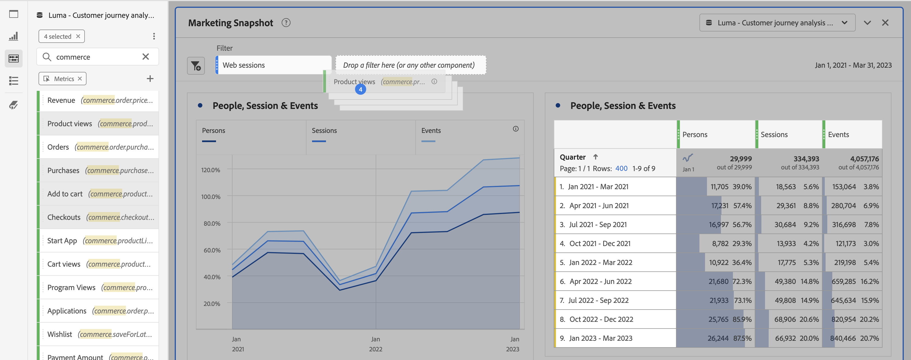

# Panoramica dei pannelli

Un [!UICONTROL panel] è un insieme di tabelle e visualizzazioni. È possibile accedere ai pannelli dall&#39;icona in alto a sinistra in Workspace o da un [pannello vuoto](/help/analysis-workspace/c-panels/blank-panel.md). I pannelli sono utili per organizzare i progetti in base a periodi di tempo, suite di rapporti o casi di utilizzo dell’analisi. In  Analysis Workspace sono disponibili i seguenti tipi di pannelli:

| Nome pannello | Descrizione |
| --- | --- |
| [Pannello vuoto](/help/analysis-workspace/c-panels/blank-panel.md) | Scegli tra i pannelli e le visualizzazioni disponibili per avviare l&#39;analisi. |
| [Pannello Quick Insights](quickinsight.md) | Crea rapidamente una tabella a forma libera e una relativa visualizzazione per analizzare e individuare più rapidamente le informazioni. |
| [Pannello Attribution](attribution.md) | Confronta e visualizza rapidamente qualsiasi numero di modelli di attribuzione utilizzando qualsiasi dimensione e metrica di conversione. |
| [Pannello Freeform](freeform-panel.md) | Esegui confronti illimitati e suddivisioni, quindi aggiungi visualizzazioni per raccontare una storia ricca di dati. |

[!UICONTROL Quick Insights],  [!UICONTROL Blank] e  [!UICONTROL Freeform] i pannelli sono luoghi ideali per iniziare l&#39;analisi, mentre  [!UICONTROL Analytics for Target] [!UICONTROL Attribution IQ]e  [!UICONTROL Media Concurrent Viewers]   [!UICONTROL Segment Comparison] prestarsi ad analisi più avanzate. Nei progetti è disponibile un pulsante `"+"` che consente di aggiungere pannelli vuoti in qualsiasi momento.

Il pannello iniziale predefinito è il pannello [!UICONTROL Freeform], ma è possibile impostare il pannello [vuoto](/help/analysis-workspace/c-panels/blank-panel.md) come predefinito.

## Calendario {#calendar}

Il calendario del pannello controlla l’intervallo di rapporti per tabelle e visualizzazioni all’interno di un pannello.

Nota: Se all’interno di una tabella, una visualizzazione o un’area di rilascio di un pannello viene utilizzato un componente Intervallo date (viola), questo sostituisce il calendario del pannello.

## Zona di rilascio {#dropzone}

La zona di rilascio del pannello consente di applicare filtri a segmenti e a discesa a tutte le tabelle e le visualizzazioni all’interno di un pannello. Potete applicare uno o più filtri a un pannello. Per modificare il titolo sopra ogni filtro, fai clic sulla matita di modifica oppure fai clic con il pulsante destro del mouse per rimuoverla completamente.

### Filtri segmento

Trascinate tutti i filtri dalla barra a sinistra nella zona di rilascio del pannello per iniziare a filtrare il pannello.

### Filtri ad hoc

I componenti non del segmento possono anche essere trascinati direttamente nella zona di rilascio per creare filtri ad hoc, risparmiando tempo e fatica nell’andare al generatore di filtri. I filtri creati in questo modo vengono automaticamente definiti come filtri a livello di hit. Questa definizione può essere modificata facendo clic sull’icona delle informazioni (i) accanto al filtro, quindi sull’icona di modifica a forma di matita e modificandola in Generatore di filtri.

I filtri ad hoc sono locali per il progetto e non vengono visualizzati nella barra a sinistra a meno che non vengano resi pubblici.

### Filtri a discesa {#dropdown-filter}

Oltre ai filtri per segmenti, i filtri a discesa consentono di interagire con i dati in modo controllato. Ad esempio, potete aggiungere un filtro a discesa per i tipi di dispositivi mobili in modo da segmentare il pannello per Tablet, Cellulare o Desktop.

I filtri a discesa possono essere utilizzati per consolidare più progetti in un unico progetto. Ad esempio, se disponete di molte versioni dello stesso progetto con diversi segmenti Paese applicati, potete consolidare tutte le versioni in un unico progetto e aggiungere un filtro a discesa Paese.

Per creare filtri a discesa:

1. Per creare un filtro a discesa utilizzando [!UICONTROL Dimension items], ad esempio valori all&#39;interno della dimensione [!UICONTROL Marketing Channel], fare clic sull&#39;icona freccia destra accanto alla dimensione nella parte sinistra. Vengono visualizzati tutti gli elementi disponibili. Selezionate uno o più componenti dalla barra a sinistra e rilasciateli nella zona di rilascio del pannello **tenendo premuto il tasto Maiusc**. Questo trasformerà i componenti in un filtro a discesa, anziché in un singolo segmento.
1. Per creare un filtro a discesa utilizzando un altro componente come metriche, segmenti o intervalli di date, seleziona da un tipo di componente nella barra a sinistra e rilascia nella zona di rilascio del pannello **tenendo premuto il tasto Maiusc**.
1. Selezionate una delle opzioni dal menu a discesa per modificare i dati nel pannello. Potete anche scegliere di non filtrare i dati del pannello selezionando **[!UICONTROL No filter]**.

[Guarda il ](https://docs.adobe.com/content/help/en/analytics-learn/tutorials/analysis-workspace/using-panels/using-panels-to-organize-your-analysis-workspace-projects.html) video per saperne di più su come aggiungere filtri a discesa al tuo progetto.

## Fare clic con il pulsante destro del mouse sul menu {#right-click}

Per aggiungere altre funzionalità a un pannello, fate clic con il pulsante destro del mouse sull’intestazione del pannello.

Sono disponibili le seguenti impostazioni:

| Impostazione | Descrizione |
| --- | --- |
| [!UICONTROL Insert Copied Panel/Visualization] | Consente di incollare (&quot;inserire&quot;) un pannello o una visualizzazione copiati in un’altra posizione all’interno del progetto o in un progetto completamente diverso. |
| [!UICONTROL Copy Panel] | Consente di fare clic con il pulsante destro del mouse e copiare un pannello, in modo da poterlo inserire in un’altra posizione all’interno del progetto o in un progetto completamente diverso. |
| [!UICONTROL Duplicate Panel] | Crea un duplicato esatto del pannello corrente, che potrete quindi modificare. |
| [!UICONTROL Collapse/Expand all Panels] | Comprime ed espande tutti i pannelli del progetto. |
| [!UICONTROL Collapse/Expand all Visualizations in Panel] | Comprime ed espande tutte le visualizzazioni nel pannello corrente. |
| [!UICONTROL Edit Description] | Aggiungete (o modificate) una descrizione di testo per il pannello. |
| [!UICONTROL Get Panel Link] | Consente di indirizzare un utente a uno specifico pannello in un progetto. Quando si fa clic sul collegamento, il destinatario dovrà effettuare il login prima di essere indirizzato al pannello esatto a cui è collegato. |
