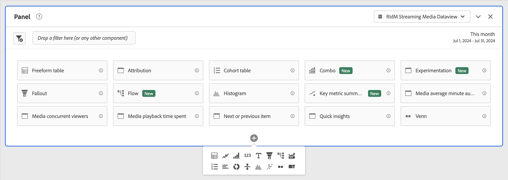

# Panoramica dei pannelli {#panels-overview}

>[!CONTEXTUALHELP]
>id="workspace_panel_realtime_refresh"
>title="Aggiornamento in tempo reale"
>abstract="Abilita questa opzione per aggiornare dati e visualizzazioni in questo pannello in tempo reale."

Un [!UICONTROL panel] è una raccolta di tabelle e visualizzazioni. Puoi accedere ai pannelli dall’icona in alto a sinistra in Workspace o da un [pannello vuoto](/help/analysis-workspace/c-panels/blank-panel.md). I pannelli sono utili per organizzare i progetti in base a specifici periodi di tempo, viste dati o casi di utilizzo di analisi.

## Tipi di pannello

In Analysis Workspace sono disponibili i seguenti tipi di pannello per [!UICONTROL Customer Journey Analytics]:

| Nome pannello | Descrizione |
| --- | --- |
| [Pannello vuoto](/help/analysis-workspace/c-panels/blank-panel.md) | Per iniziare a eseguire analisi, scegli tra i pannelli e le visualizzazioni disponibili. |
| [Attribuzione](attribution.md) | Confronta e visualizza rapidamente più modelli di attribuzione utilizzando qualsiasi dimensione e metrica di conversione. |
| [Sperimentazione](experimentation.md) | Confronta diverse varianti di esperienza utente, marketing o messaggistica per determinare quale sia meglio per determinare un risultato specifico. |
| [A forma libera](freeform-panel.md) | Esegui confronti illimitati e raggruppamenti, quindi aggiungi visualizzazioni per raccontare una storia ricca di dati. |
| [Pubblico medio per minuto del file multimediale](average-minute-audience-panel.md) | Analizza il pubblico medio per minuto di una parte del contenuto specifico o in un periodo di tempo personalizzato. |
| [Visualizzatori simultanei di contenuti multimediali](media-concurrent-viewers.md) | Analizza i visualizzatori simultanei nel tempo, con dettagli sui picchi di concorrenza e con la possibilità di suddividerli e confrontarli. |
| [Tempo trascorso su contenuti multimediali](/help/analysis-workspace/c-panels/media-playback-time-spent.md) | L’analisi del tempo di riproduzione trascorso consente di comprendere dove si è verificato il picco di concorrenza o dove si è verificato il calo. |
| [Elemento successivo o precedente](next-previous.md) | Mostra le pagine successive o precedenti a cui si accede. |
| [Quick Insights](quickinsight.md) | Crea rapidamente una tabella a forma libera e una relativa visualizzazione per analizzare e individuare più rapidamente le informazioni. |

I pannelli [!UICONTROL Quick insights], [!UICONTROL Blank] e [!UICONTROL Freeform] sono ideali per iniziare con le attività di analisi, mentre [!UICONTROL Attribution] si presta ad analisi più avanzate. Nella parte inferiore dell’area di lavoro è disponibile un , che consente di aggiungere pannelli vuoti in qualsiasi momento.

Il pannello iniziale predefinito è [!UICONTROL Freeform], ma puoi impostare come predefinito il [Pannello vuoto](/help/analysis-workspace/c-panels/blank-panel.md) o [Quick Insights](/help/analysis-workspace/c-panels/quickinsight.md). Consulta [Preferenze Progetti e Analisi](/help/analysis-workspace/user-preferences.md#projects--analyses-preferences).

## Creare un pannello

Per creare un pannello:

* Trascina un pannello dal pannello a sinistra **[!UICONTROL Panels]** nell’area di lavoro.
* Seleziona un pannello dal [Pannello vuoto](blank-panel.md).
* Utilizza il menu **[!UICONTROL Insert]** in Workspace e seleziona il tuo pannello. In alternativa, puoi utilizzare una delle [scelte rapide da tastiera](../build-workspace-project/fa-shortcut-keys.md) per inserire un pannello.

  

Puoi:

* Seleziona  **all’interno** di un pannello per aggiungere un’altra visualizzazione. Viene visualizzato un riquadro a comparsa che consente di selezionare una visualizzazione.

  

  | Seleziona... | Per creare una visualizzazione... |
  |---|---|
  |  | [Tabella a forma libera](/help/analysis-workspace/visualizations/freeform-table/freeform-table.md) |
  |  | [Linee](/help/analysis-workspace/visualizations/line.md) |
  |  | [Barre](/help/analysis-workspace/visualizations/bar.md) |
  |  | [Numero di riepilogo](/help/analysis-workspace/visualizations/summary-number-change.md) |
  |  | [Testo](/help/analysis-workspace/visualizations/text.md) |
  |  | [Fallout](/help/analysis-workspace/visualizations/fallout/fallout-flow.md) |
  |  | [Flusso](/help/analysis-workspace/visualizations/c-flow/flow.md) |
  |  | [Area sovrapposta](/help/analysis-workspace/visualizations/area.md) |
  |  | [Tabella coorte](/help/analysis-workspace/visualizations/cohort-table/t-cohort.md) |
  |  | [Bullet](/help/analysis-workspace/visualizations/bullet-graph.md) |
  |  | [Anello](/help/analysis-workspace/visualizations/donut.md) |
  |  | [Variazione di riepilogo](/help/analysis-workspace/visualizations/summary-number-change.md) |
  |  | [Istogramma](/help/analysis-workspace/visualizations/histogram.md) |
  |  | [A dispersione](/help/analysis-workspace/visualizations/scatterplot.md) |
  |  | [Venn](/help/analysis-workspace/visualizations/venn.md) |
  |  | [Mappa ad albero](/help/analysis-workspace/visualizations/treemap.md) |

* Seleziona  **all&#39;esterno** dell’ultimo pannello nell’area di lavoro per aggiungere un altro [pannello vuoto](blank-panel.md).

## Visualizzazione dati

Ogni pannello è associato a una [visualizzazione dati](/help/data-views/data-views.md), identificata dal  **[!UICONTROL *nome della visualizzazione dati *]**&#x200B;nel menu a discesa in alto a destra del pannello.

Quando crei un progetto Workspace vuoto, la visualizzazione dati predefinita per il pannello iniziale è l’ultima visualizzazione dati su cui hai lavorato in Customer Journey Analytics.

Quando crei un nuovo pannello, la visualizzazione dati predefinita si basa sulla visualizzazione dati dell’ultimo pannello su cui hai lavorato nel progetto Workspace.

>[!IMPORTANT]
>
>La visualizzazione dati selezionata determina le dimensioni, le metriche e i segmenti disponibili per la creazione di visualizzazioni in un pannello.
>
>
>Quando passi da una visualizzazione dati a un pannello, alcuni componenti potrebbero non essere disponibili nella nuova visualizzazione dati. Questa modifica può impedire il corretto rendering della visualizzazione. Potresti visualizzare avvisi come:
>
>* Questo pannello contiene componenti non abilitati nella visualizzazione dati selezionata. Modifica la visualizzazione dati o abilita i componenti richiesti nella visualizzazione dati.
>* Impossibile eseguire il rendering della visualizzazione: controlla le colonne e le righe per assicurarti che contengano componenti validi.
>

## Calendario

Il calendario del pannello controlla l’intervallo della date di reporting per tabelle e visualizzazioni all’interno di un pannello.

>[!NOTE]
>
>Se un componente Intervallo di date del  viene utilizzato all’interno di una visualizzazione o di un pannello (ad esempio, come segmento), tale componente sostituisce il calendario del pannello.
>

1. Seleziona un intervallo di date selezionando prima la data di inizio e quindi la data di fine.
In alternativa, puoi selezionare **[!UICONTROL Preset]** dal menu a discesa [!UICONTROL *Seleziona un predefinito*].

1. Facoltativamente, seleziona **[!UICONTROL Show advanced settings]** per:

   * Specificare **[!UICONTROL Start time]** e **[!UICONTROL End time]** diversi da `12:00 AM` (`0:00`) e `11:59 PM` (`23:59`) predefiniti. Gli orari di fine includono sempre 59 secondi. Per un intervallo di date che si estende su più giorni, l’ora di inizio si applica al primo giorno dell’intervallo di date e l’ora di fine si applica all’ultimo giorno dell’intervallo di date. Utilizza **[!UICONTROL (Reset time values)]** per ripristinare le impostazioni predefinite dell’ora di inizio e di fine.
   * **[!UICONTROL Make date range components relative to panel calendar]**. Se disattivato, i componenti dell’intervallo di date utilizzati nel pannello sono relativi all’ora corrente. Se questa opzione è abilitata, i componenti dell’intervallo di date utilizzati nel pannello sono relativi al calendario del pannello.
   * **[!UICONTROL Use rolling dates]**. Se abilitati, gli intervalli di date predefiniti come **[!UICONTROL Last 7 full days]** vengono aggiornati in modo dinamico in base all’avanzamento della data e dell’ora corrente. Se disattivate, tali predefiniti non vengono aggiornati una volta applicati.

     

     È possibile selezionare il testo tra parentesi (ad esempio **[!UICONTROL fixed start - rolling daily]**) per estendere il pannello e specificare i dettagli per **[!UICONTROL Start]** e **[!UICONTROL End]**.

      1. Seleziona **[!UICONTROL Start of]**, **[!UICONTROL End of]**, or **[!UICONTROL Fixed day]**.
      1. Dopo aver selezionato **[!UICONTROL Start of]** o **[!UICONTROL End of]**, è possibile creare un’espressione completa. Ad esempio: **[!UICONTROL End of]** **[!UICONTROL current year]** **[!UICONTROL plus]** `1` **[!UICONTROL day]**. Seleziona il valore appropriato per ogni singola parte dell’espressione.
         * Seleziona un valore corrente. Ad esempio **[!UICONTROL current year]**.
         * Seleziona un valore per il calcolo aggiuntivo. Ad esempio: **[!UICONTROL plus]**.
         * Dopo aver specificato un calcolo aggiuntivo, specifica un valore. Ad esempio `1`.
         * Dopo aver specificato il calcolo aggiuntivo, seleziona il periodo di tempo da utilizzare per il calcolo. Ad esempio **[!UICONTROL day]**.

     Seleziona **[!UICONTROL Hide details]** per nascondere i dettagli del calcolo delle date continue.

1. Seleziona **[!UICONTROL Apply]** per applicare l’intervallo di date al pannello da cui è stato richiamato il calendario.
Seleziona **[!UICONTROL Apply to all panels]** per applicare l’intervallo di date a tutti i pannelli nel progetto Workspace.

## Zona di rilascio {#dropzone}

La zona di rilascio del pannello consente di applicare segmenti e segmenti a discesa a tutte le tabelle e visualizzazioni all’interno di un pannello. Puoi applicare uno o più segmenti a un pannello.

### Segmenti

Per iniziare a segmentare il pannello, trascina un segmento dal pannello a sinistra fino alla zona di rilascio del pannello. Ripeti questa procedura per aggiungere altri segmenti al pannello. I segmenti vengono visualizzati uno accanto all’altro nella parte superiore del pannello.

#### Segmenti rapidi

Puoi anche trascinare componenti diversi da segmenti direttamente nella zona di rilascio, per creare segmenti rapidi in modo più rapido e senza dover passare al [Generatore di segmenti](/help/components/segments/seg-builder.md). I segmenti creati in questo modo vengono automaticamente definiti come segmenti a livello di evento. È possibile modificare rapidamente questa definizione selezionando  accanto al nome del segmento.

Per ulteriori informazioni, consulta [Segmenti rapidi](/help/components/segments/seg-quick.md).

### Segmenti a discesa

>[!BEGINSHADEBOX]

Per un video demo, guarda  [Segmenti a discesa](https://video.tv.adobe.com/v/23877?quality=12&learn=on){target="_blank"}.

{{videoaa}}

>[!ENDSHADEBOX]

#### Segmenti a discesa statici

I segmenti a discesa statici consentono di interagire con i dati in modo controllato. Ad esempio, puoi aggiungere un segmento a discesa per i tipi di dispositivi mobili, in modo da segmentare il pannello per tablet, telefono cellulare o desktop.

I segmenti a discesa statici possono essere utilizzati anche per consolidare più progetti in un unico progetto. Ad esempio, se hai creato più versioni dello stesso progetto assegnando a ciascuna un segmento Paese diverso, puoi consolidarle tutte in un unico progetto e aggiungere un segmento a discesa Paese.

##### Creare segmenti a discesa statici

* Per i segmenti a discesa che utilizzano elementi dimensionali, seleziona una singola dimensione dal pannello a sinistra e rilasciala nella zona di rilascio del pannello tenendo premuto ⇧ (*Maiusc*). Questa azione crea un segmento a discesa con tutti gli elementi dimensionali associati a tale dimensione.

  Oppure, se desideri che il segmento a discesa includa solo elementi dimensionali specifici associati a una dimensione, seleziona l’icona a forma di freccia verso destra accanto alla dimensione desiderata nel pannello di sinistra. Questa azione espone tutti gli elementi dimensionali disponibili. Seleziona più elementi dimensionali da questo elenco utilizzando ⇧ +  (*Maiusc* + *Seleziona*) o ^ +  (*controllo* + *Seleziona*), quindi rilasciali nell’area di rilascio del pannello **mentre tieni premuto** ⇧.

* Per i segmenti a discesa che utilizzano un singolo tipo di componente (ad esempio, solo dimensioni, solo segmenti o solo metriche), seleziona più elementi dello stesso tipo nel pannello a sinistra utilizzando ⇧ +  o ^ + . Quindi rilascia gli elementi nella zona di rilascio del pannello **mentre tieni premuto** ⇧.

  Viene creato un segmento a discesa singolo con i componenti selezionati.

* Per i segmenti a discesa che utilizzano un mix di componenti (ad esempio 2 metriche e 3 segmenti), seleziona più componenti utilizzando ⇧ +  o ^ + . Rilascia la selezione nella zona di rilascio del pannello **mentre tieni premuto** ⇧. In questo contesto, tutti i tipi di componente vengono trattati come segmenti a discesa separati. Ad esempio, se nella selezione includi sia metriche che elementi dimensionali, vengono creati due segmenti a discesa separati: uno include gli elementi dimensionali e l’altro include le metriche.

Un segmento a discesa fornisce le seguenti opzioni del menu di scelta rapida:

* **[!UICONTROL Delete drop-down]**: rimuove il segmento a discesa dal pannello.
* **[!UICONTROL Delete label]**: rimuove il testo mostrato sopra un segmento a discesa. Per modificare l’etichetta, passaci sopra il puntatore e seleziona .
* **[!UICONTROL Add label]**: quando aggiungi un segmento a discesa a un progetto, un’etichetta viene impostata automaticamente sul nome del componente. Se elimini l’etichetta, puoi aggiungerla nuovamente con questa opzione.
* **[!UICONTROL Require selection]**: richiede che nel pannello sia impostato un segmento.

##### Utilizzare segmenti a discesa statici

Per segmentare il pannello, gli utenti possono utilizzare il menu dei segmenti a discesa in uno dei seguenti modi:

* Applicare un singolo segmento al pannello selezionandolo dal segmento a discesa.

* Applicare più segmenti al pannello selezionandone più di uno dal segmento a discesa. Il pannello viene segmentato per includere uno qualsiasi dei segmenti selezionato.

#### Segmenti a discesa dinamici

I segmenti a discesa dinamici consentono di determinare i valori disponibili in base ai dati all’interno dell’intervallo di reporting del pannello e ai valori in altri segmenti a discesa. Ad esempio, puoi creare due menu a discesa dinamici utilizzando una dimensione Paesi e una dimensione Città. Quando selezioni un paese dal menu a discesa **[!UICONTROL Countries]**, **[!UICONTROL Cities]** si adatta in modo dinamico per mostrare solo le città all’interno di quel paese.

Lo stesso concetto si applica a tutte le dimensioni: sono visibili solo gli elementi dimensionali che compaiono nell’intervallo di date del pannello e i segmenti selezionati. Gli elementi dimensionali selezionati nei segmenti a discesa statici influiscono sui valori disponibili nei segmenti a discesa dinamici. Tuttavia, ciò non vale per il contrario: gli elementi dimensionali selezionati nei segmenti a discesa dinamici non influiscono sui valori disponibili nei segmenti a discesa statici.

La selezione manuale degli elementi dimensionali è disponibile se prevedi che un certo elemento dimensionale verrà raccolto in futuro. È inoltre possibile cancellare un segmento a discesa dinamico in modo che non contenga un valore, consentendo ad altri segmenti a discesa dinamici di contenere più valori. Seleziona **[!UICONTROL Reset all]** per cancellare la selezione da tutti i segmenti a discesa di quel pannello.

Per creare un segmento a discesa dinamico:

* Trascina una singola dimensione nella zona di rilascio del pannello **mentre tieni premuto** ⇧.

Tieni presente che i segmenti a discesa dinamici non sono disponibili per metriche, segmenti o intervalli di date.

Un segmento a discesa dinamico fornisce le stesse opzioni del menu di scelta rapida dei segmenti a discesa statici.

## Menu di scelta rapida

Ulteriori funzionalità per un pannello sono disponibili tramite il menu di scelta rapida (clic con il pulsante destro del mouse) sull’intestazione del pannello.

Sono disponibili le seguenti opzioni:

| Opzione | Descrizione |
| --- | --- |
| **[!UICONTROL Insert copied panel]** | Consente di incollare un pannello copiato in un’altra posizione all’interno del progetto o in un progetto diverso. |
| **[!UICONTROL Insert copied visualization]** | Consente di incollare un pannello copiato in un’altra posizione all’interno del pannello, del progetto o in un progetto diverso. |
| **[!UICONTROL Apply Data view to all panels]** | Applica la visualizzazione dati di questo pannello a tutti gli altri pannelli nel progetto. |
| **[!UICONTROL Copy panel]** | Copia un pannello, in modo da poterlo inserire in un’altra posizione all’interno di un progetto o in un progetto diverso. |
| **[!UICONTROL Duplicate panel]** | Crea un duplicato esatto del pannello corrente, che potrai quindi modificare. |
| **[!UICONTROL Collapse all panels]** | Comprimi tutti i pannelli del progetto. |
| **[!UICONTROL Expand all panels]** | Espandi tutti i pannelli del progetto. |
| **[!UICONTROL Collapse all visualizations in panel]** | Comprimi tutte le visualizzazioni nel pannello corrente. |
| **[!UICONTROL Expand all visualizations in panel]** | Espandi tutte le visualizzazioni nel pannello corrente. |
| **[!UICONTROL Edit Description]** | Aggiungi (o modifica) un testo descrittivo per il pannello. |
| **[!UICONTROL Get Panel Link]** | Indirizza un utente a uno specifico pannello all’interno di un progetto. Quando selezioni il collegamento, al destinatario verrà richiesto di effettuare l’accesso prima di essere indirizzato al pannello esatto a cui è collegato. |

## Configurazione

Alcuni pannelli (come [!UICONTROL Attribution], [!UICONTROL Experimentation], [!UICONTROL Media average minute audience] e altri) dispongono di una finestra di dialogo per la configurazione che consente di creare la visualizzazione. Utilizza  nella parte superiore del pannello per accedere e modificare la configurazione.

