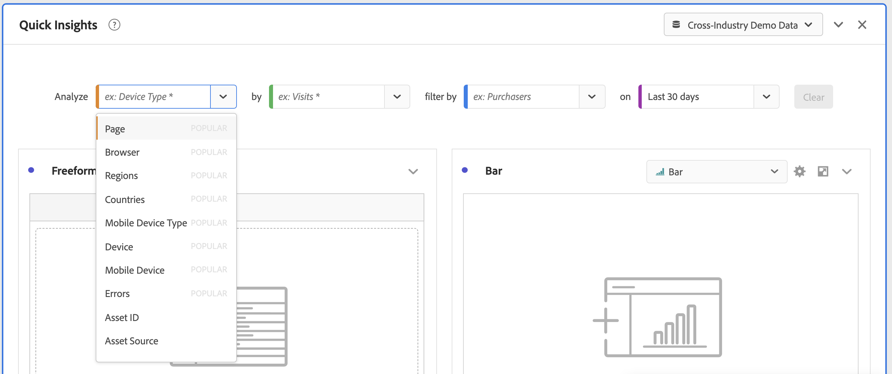
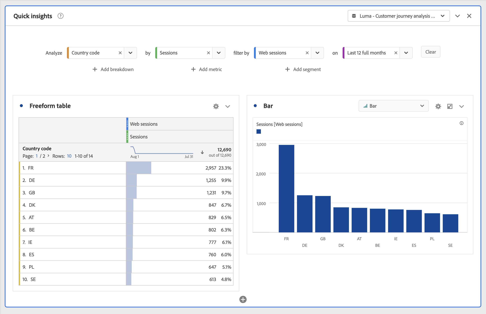
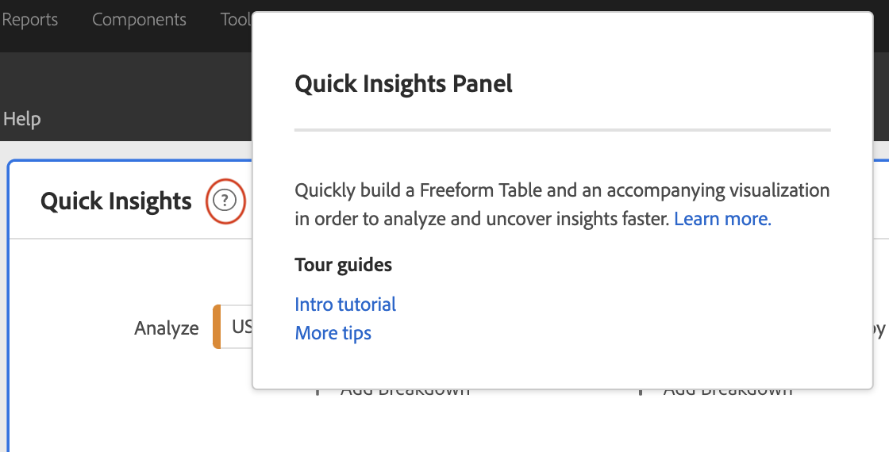
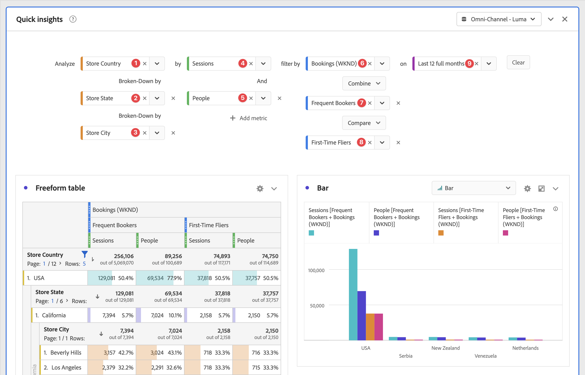
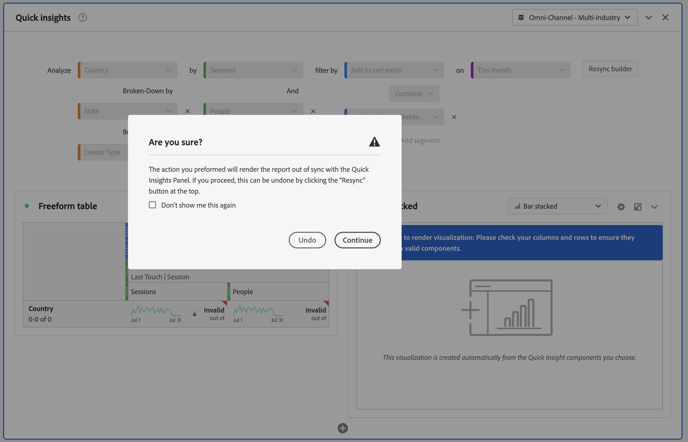

# Pannello Quick Insights {#quick-insights-panel}

<!-- markdownlint-disable MD034 -->

>[!CONTEXTUALHELP]
>id="workspace_quickinsights_button"
>title="Quick Insights"
>abstract="Crea un pannello per generare rapidamente una tabella a forma libera e una relativa visualizzazione per analizzare e individuare più rapidamente le informazioni."

<!-- markdownlint-enable MD034 -->

>[!BEGINSHADEBOX]

_Questo articolo documenta il pannello Quick Insights in_  _**Customer Journey Analytics**_. _Consulta il [pannello Quick Insights](https://experienceleague.adobe.com/it/docs/analytics/analyze/analysis-workspace/panels/quickinsight) per la_  _**Adobe Analytics** versione di questo articolo._

>[!ENDSHADEBOX]

La funzione [!UICONTROL Insight rapidi] fornisce indicazioni ai non analisti e ai nuovi utenti di [!UICONTROL Analysis Workspace] per scoprire come rispondere alle domande di business in modo rapido e semplice. È anche un ottimo strumento per gli utenti avanzati che desiderano rispondere rapidamente a una semplice domanda senza dover creare personalmente una tabella.

Quando inizi a utilizzare questo [!UICONTROL Analysis Workspace], potresti chiederti:

* quali visualizzazioni sarebbero più utili,
* quali dimensioni e metriche potrebbero facilitare le informazioni approfondite,
* dove trascinare gli elementi,
* dove creare un segmento,
* e altro ancora.

Per rispondere a queste domande, [!UICONTROL Quick insights] sfrutta un algoritmo che ti presenta le dimensioni, le metriche, i segmenti e gli intervalli di date più comuni utilizzati dalla tua azienda. Questo algoritmo si basa sull&#39;utilizzo dei componenti dati da parte della tua azienda in [!UICONTROL Analysis Workspace]. Vedrai infatti dimensioni, metriche e segmenti con tag [!UICONTROL POPULAR] nel menu a discesa, come mostrato di seguito:

[!UICONTROL Quick Insights] ti aiuta a:

* Creare correttamente una tabella di dati e una relativa visualizzazione in [!UICONTROL Analysis Workspace].
* Impara la terminologia e il vocabolario dei componenti e delle parti di base di [!UICONTROL Analysis Workspace].
* Eseguire semplici raggruppamenti di dimensioni, aggiungere metriche multiple o confrontare facilmente segmenti all&#39;interno di una [!UICONTROL tabella a forma libera].
* Modificare o provare vari tipi di visualizzazione per trovare lo strumento di ricerca per la tua analisi in modo rapido e intuitivo.

## Terminologia chiave di base

Di seguito sono riportati alcuni dei termini di base con cui è necessario che tu abbia familiarità. Ogni tabella di dati è composta da 2 o più blocchi (componenti) utilizzati per spiegare la storia dei dati.

| Blocco predefinito (componente) | Definizione |
|---|---|
| **[!UICONTROL Dimensione]** | Le dimensioni sono descrizioni o caratteristiche dei dati di metriche che possono essere visualizzate, raggruppate e confrontate in un progetto. Sono valori non numerici e date raggruppati in elementi dimensionali. Ad esempio, un *browser* o una *pagina* è una dimensione. |
| **[!UICONTROL Elemento Dimension]** | Gli elementi dimensionali sono valori singoli per una dimensione. Ad esempio, gli elementi dimensionali per la dimensione del browser sarebbero *Chrome*, *Firefox*, *Edge* oppure altri. |
| [!UICONTROL Metrica] | Le metriche corrispondono a informazioni quantitative sull’attività della persona come visualizzazioni, click-through, ricaricamenti delle pagine, tempo medio trascorso, unità, ordini, entrate e così via. |
| **[!UICONTROL Visualizzazione]** | Workspace offre [diverse visualizzazioni](/help/analysis-workspace/visualizations/freeform-analysis-visualizations.md) per creare rappresentazioni visive dei dati. Ad esempio grafici a barre, grafici ad anello, istogrammi, grafici a linee, mappe, grafici di dispersione e altri. |
| **[!UICONTROL Raggruppamento Dimension]** | Un raggruppamento di dimensioni è un modo per raggruppare una dimensione secondo altre dimensioni. Ad esempio, puoi raggruppare gli Stati Uniti per dispositivi mobili per ottenere le visite da parte di dispositivi mobili per stato. Oppure puoi raggruppare i dispositivi mobili per tipo di dispositivo mobile, per aree geografiche, per campagne interne e altro ancora. |
| **[!UICONTROL Segmento]** | I segmenti ti consentono di identificare sottoinsiemi di persone in base a caratteristiche o interazioni con siti web. Ad esempio, puoi creare [!UICONTROL Segmenti Persone] in base a <li>attributi: tipo di browser, dispositivo, numero di visite, paese, genere o</li><li>interazioni: campagne, ricerca di parole chiave, motore di ricerca o</li><li>uscite ed entrate: persone da Facebook, una pagina di destinazione definita, un dominio di riferimento o</li><li> variabili personalizzate: campo modulo, categorie definite, ID cliente. |

## Utilizzo

Per utilizzare un pannello **[!UICONTROL Quick insights]**:

1. Crea un pannello **[!UICONTROL Quick Insights]**. Per informazioni su come creare un pannello, consulta [Creare un pannello](panels.md#create-a-panel).

1. Quando utilizzi per la prima volta un pannello **[!UICONTROL Quick Insights]**, potresti voler seguire la breve [!UICONTROL esercitazione introduttiva] che illustra alcune delle nozioni di base. Seleziona  accanto al titolo del pannello Quick Insights e seleziona **[!UICONTROL Intro tutorial]** dal menu a comparsa.

1. Specifica l’[input](#panel-input) per il pannello.

1. Osserva l’[output](#panel-output) per il pannello.

### Input del pannello

Seleziona i blocchi:

* **[!UICONTROL Analizza]** - specifica una dimensione (arancione)
* **[!UICONTROL per]** - specifica una metrica (verde)
* **[!UICONTROL segmento per]** - specifica un segmento (blu)
* **[!UICONTROL il]** - specifica un intervallo di date (viola).

Per il corretto funzionamento della visualizzazione, devi selezionare almeno una dimensione e una metrica.

Puoi specificare i blocchi in tre modi:

* Trascina i componenti dal pannello a sinistra.
* Inizia a digitare in uno dei campi del blocco. Quando viene trovato un input, il campo del blocco viene compilato automaticamente con i valori possibili.
* Specifica un menu a discesa del blocco predefinito (ad esempio Paese in **[!UICONTROL Analizza]**) e **[!UICONTROL cerca]** l&#39;elenco dei possibili valori (utilizzando ) per il valore che desideri utilizzare (ad esempio, **[!UICONTROL Codice paese]**).

Seleziona **[!UICONTROL Cancella]** per cancellare tutti i campi di input.

### Output del pannello

1. Dopo aver aggiunto almeno una dimensione e una metrica, puoi visualizzare i risultati.

   

   * Una tabella a forma libera con dimensione (Codice paese) e metrica (Sessioni), segmentata per sessioni web per gli ultimi 12 mesi.

   * Una visualizzazione associata, in questo caso un [grafico a barre](/help/analysis-workspace/visualizations/bar.md). La visualizzazione generata si basa sul tipo di dati che hai aggiunto alla tabella. Per impostazione predefinita, qualsiasi dato basato sul tempo (ad esempio [!UICONTROL Sessioni] al giorno/mese) viene visualizzato in un grafico [!UICONTROL Line]. Per impostazione predefinita, qualsiasi dato non basato sul tempo (ad esempio [!UICONTROL Sessioni] per [!UICONTROL Dispositivo]) viene visualizzato in un grafico a [!UICONTROL barre]. Puoi modificare il tipo di visualizzazione facendo clic sulla freccia dell’elenco a discesa accanto al tipo di visualizzazione.

1. Prova ad aggiungere altri miglioramenti come descritto di seguito in [Ulteriori suggerimenti](#more-tips)

1. È possibile salvare il progetto utilizzando **[!UICONTROL Progetto > Salva]**.

## Ulteriori suggerimenti

Altri utili suggerimenti vengono visualizzati in [!UICONTROL Quick Insights Builder], alcuni a seconda dell&#39;ultima azione.

* Innanzitutto, completa l&#39;esercitazione **[!UICONTROL Ulteriori suggerimenti]**. Questo tutorial viene visualizzato 24 ore dopo la creazione di un progetto con almeno una dimensione e una metrica. Seleziona  accanto al titolo del pannello Quick Insights e seleziona **[!UICONTROL Altri suggerimenti]** dal popup.

  

* Puoi analizzare più dimensioni e metriche, combinare o confrontare segmenti e specificare un intervallo di date:

  

   * **[!UICONTROL Analizza]** dimensione **[!UICONTROL Suddivisa per]**: puoi utilizzare fino a 3 livelli di suddivisioni sulle dimensioni per eseguire il drill-down dei dati effettivamente necessari. Vedere ➊, ➋ e ➌.

   * Aggiungi altre metriche **[!UICONTROL per]**: puoi aggiungere fino a 2 ulteriori metriche. Vedere ➍ e ➎.

   * **[!UICONTROL segmento per]**: puoi aggiungere fino a 2 ulteriori segmenti. Ad esempio, aggiungi il segmento Prenotazioni e combinalo con i segmenti Prenotazioni frequenti e Nuovi viaggiatori per confrontarli. Vedere ➏, ➐ e ➑.

   * on: puoi specificare l’intervallo di date. Vedere ➒.

## Limitazioni note

Se tenti di modificare direttamente all&#39;interno della tabella, il pannello [!UICONTROL Quick Insights] potrebbe non essere sincronizzato. Seleziona **[!UICONTROL Risincronizza generatore]** in alto a destra del pannello per ripristinarlo alle precedenti impostazioni di [!UICONTROL Quick Insights].

Prima di aggiungere qualsiasi elemento direttamente alla tabella, viene visualizzato un avviso:

In caso contrario, la creazione diretta farà sì che la tabella si comporti come una tabella a forma libera tradizionale, senza le funzioni utili per i nuovi utenti.

>[!MORELIKETHIS]
>
>[Creare un pannello](/help/analysis-workspace/c-panels/panels.md#create-a-panel)
>