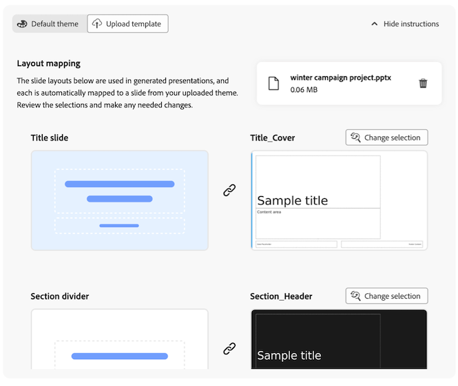

# Narrazione dei dati: generare presentazioni di diapositive dai rapporti di Workspace {#generate-powerpoint}

{{release-limited-testing}}

<!-- also remove lmited testing note from: /help/technotes/access-control.md -->

Gli utenti con [le autorizzazioni necessarie](#permission-requirements-to-generate-slides) possono generare automaticamente presentazioni con estensione pptx in base ai progetti Analysis Workspace. Durante la generazione di queste presentazioni di diapositive, Customer Journey Analytics crea automaticamente una storia dai tuoi dati identificando le informazioni chiave e convertendole in diapositive pronte per le parti interessate.

Questa storia di dati generata riduce il tempo, l’impegno e l’esperienza necessari per evidenziare i risultati di un progetto Workspace. Gli analisti possono concentrarsi di più sull’esplorazione dei dati, consentendo al contempo a Customer Journey Analytics di creare e formattare la narrazione esecutiva e comunicare l’impatto aziendale alle parti interessate.

## Comprendere la storia dei dati nelle presentazioni diapositive

Una **storia dei dati** è la narrazione creata da Customer Journey Analytics in base ai tuoi dati Workspace. Utilizzando l’intelligenza artificiale generativa, Customer Journey Analytics identifica temi importanti nei pannelli e nelle visualizzazioni che scegli di includere nella presentazione di diapositive. Genera approfondimenti, quindi esegue un processo di deduplicazione e punteggio per identificare un sottoinsieme di approfondimenti da utilizzare per creare la storia dei dati.

Le sezioni seguenti descrivono il valore aggiuntivo fornito dalle storie di dati, gli elementi necessari di un progetto che contribuiscono a modellare la narrazione e gli elementi chiave inclusi nell&#39;output della presentazione .pptx.

### Valore aggiuntivo fornito dai data story

Le storie di dati forniscono valore e informazioni approfondite a un progetto Workspace rendendo i dati accessibili agli utenti meno esperti nell’analisi dei dati.

Le storie di dati integrano un&#39;analisi per un dato progetto Workspace in base a:

* Fornire ulteriore contesto

* Evidenziazione di informazioni importanti

* Valutare se alcune variabili sono sottovalutate o sopravvalutate

* Richiamare tendenze nascoste, anomalie e altri fattori contribuenti

* Offrire idee per le fasi successive

### Elementi del progetto che modellano le storie di dati

Analysis Workspace crea storie di dati considerando i seguenti elementi di progetto:

* Relazioni tra dimensioni e intermetriche

* I singoli elementi che costituiscono la base dell’analisi (dimensioni, metriche, filtri, struttura della tabella a forma libera, visualizzazioni e pannelli)

* Nomi assegnati a pannelli, tabelle e visualizzazioni

* Ordine delle metriche in una tabella a forma libera (per determinare la priorità)

* Ordine delle visualizzazioni in un pannello (per determinare la priorità)

* Numeri di riepilogo e testi di riepilogo (per determinare le metriche da evidenziare nei dati)

### Elementi di presentazione di una storia di dati

Le storie di dati sono costituite da una diapositiva titolo, una diapositiva di riepilogo esecutivo, diapositive di dettaglio e divisori di sezione.

**Diapositiva titolo:** Visualizza il titolo e il nome del relatore specificati. Le informazioni sono riportate nelle note dell’oratore che descrivono il processo di creazione del tema e della narrazione, quante informazioni sono state generate e utilizzate e quali pannelli sono stati utilizzati.

**Riepilogo esecutivo:** assegna la priorità alle informazioni di valore più elevato e crea una storia generale di lunghezza compresa tra 1 e 5 frasi.

**Diapositive di dettaglio:** genera informazioni relative a tabelle, pannelli o visualizzazioni in un progetto Workspace. Gli approfondimenti sono costituiti da tendenze, stagionalità, anomalie e correlazioni.

**Divisori di sezione:** divide le informazioni con divisori di sezione posizionati e denominati in modo appropriato.

## Generare una presentazione .pptx basata su un progetto Workspace

<!-- markdownlint-disable MD034 -->

>[!CONTEXTUALHELP]
>id="cja-powerpoint-include-visualizations"
>title="Pannelli e visualizzazioni inclusi"
>abstract="Scegli i pannelli e le visualizzazioni da includere nella presentazione. Puoi includere fino a 50 visualizzazioni."

<!-- markdownlint-enable MD034 -->

<!-- markdownlint-disable MD034 -->

>[!CONTEXTUALHELP]
>id="cja-presentation-emphasized-components"
>title="Componenti evidenziati"
>abstract="Scegli fino a 5 metriche e 5 dimensioni dalle visualizzazioni che desideri enfatizzare nella presentazione. Le metriche scelte sono visualizzate in corsivo, le dimensioni in grassetto e gli elementi dimensionali in contrasto."

<!-- markdownlint-enable MD034 -->

1. Passare al progetto Workspace contenente i dati che si desidera utilizzare come base per la presentazione di diapositive.

1. Selezionare **[!UICONTROL Genera diapositive]** nell&#39;angolo superiore destro della pagina.

   Viene visualizzata la finestra di dialogo Genera diapositive.

   

1. Specifica le seguenti informazioni:

   | Opzione | Descrizione |
   |---------|----------|
   | **[!UICONTROL Titolo copertina]** | Specificare un titolo per la presentazione. Questo titolo viene visualizzato nella diapositiva titolo della presentazione. |
   | **[!UICONTROL Includi nome relatore]** | Specifica il nome del relatore. Questo nome viene visualizzato nella diapositiva del titolo della presentazione, sotto il titolo della copertina. |
   | **[!UICONTROL Pannelli e visualizzazioni da includere]** | Scegli i pannelli e la visualizzazione da includere nella presentazione. Puoi includere fino a 50 visualizzazioni.
Se una visualizzazione è inattiva, viene seguita dal testo **[!UICONTROL (non supportato)]** o **[!UICONTROL (dati con restrizioni)]**.
<ul><li>**Non supportato**: la maggior parte dei pannelli e delle visualizzazioni è supportata. Per informazioni sui pannelli e la visualizzazione non supportati, vedere [Elementi e funzionalità del progetto non supportati](#unsupported-project-elements-and-features).</li><li>**Dati limitati**: la visualizzazione contiene un componente a cui non è consentito esportare i dati in base a un criterio di governance dei dati imposto dall&#39;organizzazione. Contattare l&#39;amministratore di sistema per verificare quali componenti non possono essere esportati, quindi rimuovere i componenti con restrizioni prima di generare le diapositive.</li></ul> |
   | **[!UICONTROL Enfatizza componenti]** | Scegli le metriche e le dimensioni dalle visualizzazioni che desideri enfatizzare nella presentazione. I componenti scelti vengono classificati più in alto e hanno più peso quando si creano i temi e la narrazione generale della storia dei dati. 
Quando non viene applicata alcuna enfasi, i componenti vengono visualizzati nelle presentazioni nel modo seguente:<ul><li>**Metriche e dimensioni:** corsivo</li><li>**Elementi Dimension:** virgolette</li></ul>

Quando si applica l’enfasi, i componenti vengono visualizzati nelle presentazioni come segue:
<ul><li>**Metriche e dimensioni:** corsivo e grassetto</li><li>**Elementi Dimension:** grassetto quando la dimensione corrispondente viene enfatizzata
Un colore viene applicato anche all’elemento dimensione quando questo viene evidenziato nel grafico.
</li></ul> |

   <!-- add this later: - **[!UICONTROL Panel and visualization descriptions]** - Choose whether to include panel and visualization descriptions in your generated slide presentation. - 
   - **[!UICONTROL Annotations]** - Choose whether annotations are visible in your generated slide presentation. For more information about annotations, see [Annotations overview](/help/components/annotations/overview.md).  -  -->

1. (Condizionale) Selezionare **[!UICONTROL Tema predefinito]** se si desidera generare diapositive in meno passaggi e se non è necessario un tema aziendale per la presentazione diapositive.

   È sufficiente scegliere il tema del colore della presentazione selezionando il colore desiderato.

   

1. (Condizionale) Seleziona **[!UICONTROL Carica modello]** se la presentazione della diapositiva deve corrispondere a un tema aziendale. Questa opzione richiede il caricamento di un modello personalizzato e l’applicazione di stili personalizzati.

   Il modello personalizzato più recente caricato viene memorizzato localmente nella cache del browser ed è disponibile per la generazione di presentazioni diapositive future.

   

   Per caricare un modello personalizzato, effettuare una delle seguenti operazioni:

   * (Consigliato) Scarica un modello vuoto e modificalo.

      1. Scarica [questo modello vuoto](https://d30ln29764hddd.cloudfront.net/deploy/builds/data-storytelling.2025-10-20T15:10:19/resources/components/Blank.potx?).

      1. Applica gli stili personalizzati al modello vuoto.

      1. Ricarica il modello senza modificare i nomi del layout principale:

         Dal file system, trascina il modello vuoto a cui sono applicati gli stili personalizzati nell’area di rilascio.

         Oppure

         Seleziona **[!UICONTROL Sfoglia]**, quindi individua e seleziona il modello vuoto a cui sono applicati gli stili personalizzati dal file system.

      1. Nella sezione **[!UICONTROL Mappatura layout]**, ogni layout di diapositiva utilizzato nelle presentazioni generate viene automaticamente mappato a una diapositiva del tema caricato. Verificare che le selezioni siano corrette.

         

      1. (Condizionale) Se il layout di una diapositiva non è mappato correttamente, seleziona **[!UICONTROL Cambia selezione]** sopra la diapositiva selezionata nella presentazione caricata, quindi scegli la diapositiva che corrisponde al layout.

         Ripetere questo processo per ogni diapositiva mappata in modo errato.

   * Carica direttamente un modello personalizzato.

      1. Dal file system, trascina il modello personalizzato nell’area di rilascio.

         Oppure

         Seleziona **[!UICONTROL Sfoglia]**, quindi individua e seleziona il modello personalizzato dal file system.

         Assicurati che il file caricato abbia layout master con i seguenti nomi: &quot;Title_Slide&quot;, &quot;Section_Divider&quot;, &quot;Title_Text&quot;, &quot;Title_Chart&quot;, &quot;Title_Two_Content_Mixed&quot;, &quot;Title_Three_Content_Mixed&quot;.

         Sono supportati fino a 15 layout principali.

         Sono supportati i file .pptx e .potx di dimensioni fino a 25 MB.

      1. Nella sezione **[!UICONTROL Mappatura layout]**, ogni layout di diapositiva utilizzato nelle presentazioni generate viene automaticamente mappato a una diapositiva del tema caricato. Verificare che le selezioni siano corrette.

         

      1. (Condizionale) Se il layout di una diapositiva non è mappato correttamente, seleziona **[!UICONTROL Cambia selezione]** sopra la diapositiva selezionata nella presentazione caricata, quindi scegli la diapositiva che corrisponde al layout.

         Ripetere questo processo per ogni diapositiva mappata in modo errato.

1. Selezionare **[!UICONTROL Esporta PPT]**.

   La presentazione .pptx viene scaricata automaticamente sulla workstation.

1. (Consigliato) Apri la presentazione .pptx e rivedila. Apporta le modifiche necessarie.

## Requisiti delle autorizzazioni per generare diapositive

>[!AVAILABILITY]
>
>Se la tua organizzazione non ha accesso alla generazione di presentazioni diapositive da un progetto Workspace, contatta il rappresentante del tuo account Adobe per ulteriori informazioni sulle licenze.

La possibilità di generare diapositive è attivata per impostazione predefinita per tutti gli utenti delle organizzazioni che dispongono delle licenze necessarie.

Se necessario, gli amministratori dei profili di prodotto le cui organizzazioni dispongono di licenze per la generazione di diapositive possono disabilitare l’accesso.

In [!UICONTROL Adobe Admin Console], l&#39;autorizzazione [!UICONTROL Strumenti di reporting] **[!UICONTROL Narrazione dati]** determina l&#39;accesso a questa funzionalità. Un [amministratore del profilo di prodotto](https://helpx.adobe.com/it/enterprise/using/manage-product-profiles.html?lang=it) deve seguire questi passaggi in [!UICONTROL Admin Console] se desidera disabilitare l&#39;accesso:
1. Passa a **[!UICONTROL Admin Console]** > **[!UICONTROL Prodotti e servizi]** > **[!UICONTROL Customer Journey Analytics]** > **[!UICONTROL Profili di prodotto]**
1. Selezionare il titolo del profilo di prodotto per il quale si desidera fornire l&#39;accesso alla [!UICONTROL narrazione dei dati].
1. Nel profilo di prodotto specifico, selezionare **[!UICONTROL Autorizzazioni]**.
1. Seleziona  per modificare **[!UICONTROL Strumenti di reporting]**.
1. Seleziona  per rimuovere **Narrazione dati** dai **[!UICONTROL Elementi autorizzazione inclusi]**.

   <!--add screenshot of permission in the admin console-->

1. Seleziona **[!UICONTROL Salva]** per salvare le autorizzazioni.

Per ulteriori informazioni, vedere [Accesso a livello utente](/help/technotes/access-control.md#user-level-access) in [Controllo dell&#39;accesso](/help/technotes/access-control.md#access-control).

## Elementi e funzionalità del progetto non supportati {#unsupported}

I seguenti elementi e funzioni di Analysis Workspace utilizzati in un progetto non sono supportati durante la generazione delle diapositive:

* Pannello Attribuzione

  Questo pannello viene visualizzato in grigio quando vengono visualizzate le opzioni di configurazione.

  Tutti gli altri pannelli possono essere inclusi nelle diapositive generate da un progetto Workspace.

* Alcune visualizzazioni

  La maggior parte delle visualizzazioni può essere inclusa nelle diapositive generate da un progetto Workspace. Tuttavia, le seguenti visualizzazioni non possono essere incluse e vengono visualizzate in grigio quando vengono visualizzate le opzioni di configurazione:

   * Area

   * Bullet

   * Tabella coorte

   * Combinato

   * Fallout

   * Flusso

   * Area di lavoro del percorso

   * A dispersione

   * Mappa ad albero

* Raggruppamenti

  I dati per i raggruppamenti sono inclusi nelle presentazioni generate, ma vengono visualizzati allo stesso livello degli elementi dimensionali.

* Analisi guidate

* Componenti per i quali non è consentita l’esportazione da un criterio di governance dei dati

  Per ulteriori informazioni, vedere [Risoluzione dei problemi relativi alle esportazioni non riuscite](/help/components/exports/troubleshoot-exports.md).

