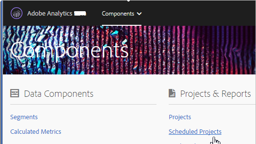

# Gestione progetti programmati

>[!NOTE]
>
>Stai visualizzando la documentazione per Analysis Workspace in Customer Journey Analytics. Le funzioni disponibili sono leggermente diverse da quelle di [Analysis Workspace in Adobe Analytics tradizionale](https://docs.adobe.com/content/help/it-IT/analytics/analyze/analysis-workspace/home.html). [Ulteriori informazioni...](/help/getting-started/cja-aa.md)

Gestisci progetti programmati di Analysis Workspace.

**[!UICONTROL Analytics]** (Analytics) > **[!UICONTROL Components]** (Componenti) > **[!UICONTROL Scheduled Projects]** (Progetti programmati).

In Gestione progetti programmati, puoi modificare ed eliminare consegne ricorrenti di progetti. Puoi programmare le consegne in modo che i rapporti vengano inviati via e-mail a un indirizzo specifico. Puoi configurare le programmazioni in modo da inviare i rapporti in modo automatico a intervalli definiti per una durata di tempo stabilita o indefinita, o interrompere la consegna di un progetto ricorrente.

Lo strumento di gestione dei progetti programmati mostra gli elementi creati da uno specifico utente. Se l’account dell’utente è disabilitato nell’applicazione, tutte le consegne programmate vengono interrotte.

* Modificare progetti programmati.
* Visualizzare l’ID della pianificazione di un progetto (opzione utilizzata principalmente per eseguire il debug).
* Cercare progetti programmati.
* Assegnare tag a progetti programmati.
* Specificare/cambiare il proprietario di un progetto programmato.
* Aggiungere altri filtri, quali Approvato, Non riuscito, Preferiti, Personale, Mostra tutti e Progetti scaduti.

* Definire una data di scadenza dei progetti programmati.

