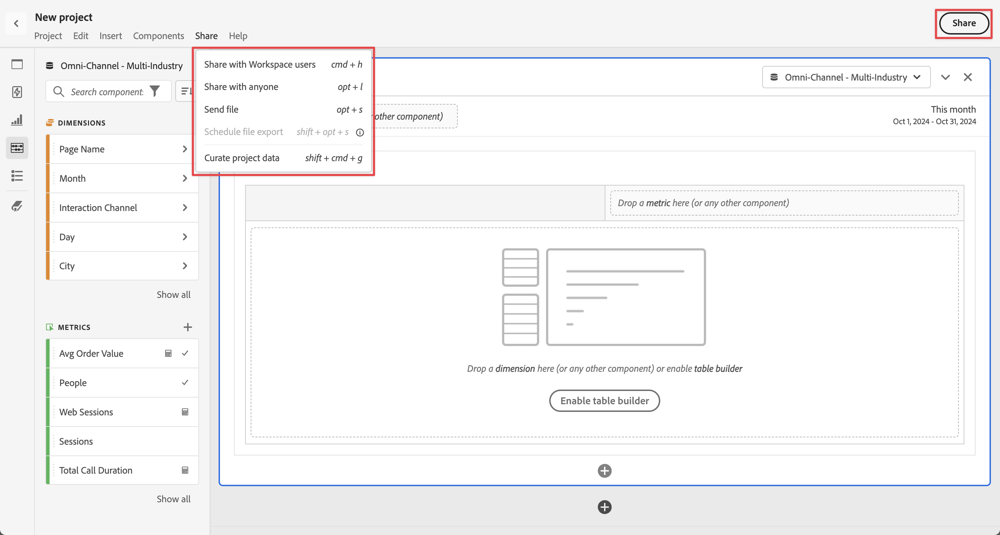

# Panoramica sulla cura e la condivisione dei progetti

Puoi curare e condividere progetti, oppure inviare progetti come file PDF o CSV a destinatari della tua organizzazione o a chiunque altro, utilizzando le opzioni disponibili nel menu **[!UICONTROL Condividi]** in Analysis Workspace o selezionando **[!UICONTROL Condividi]** in alto a destra nell&#39;interfaccia.

| Opzione | Descrizione |
|---|---|
| **[!UICONTROL Cura i dati del progetto]** | Limita i componenti (dimensioni, metriche, segmenti, intervalli di date) disponibili in un progetto. [Ulteriori informazioni](/help/analysis-workspace/curate-share/curate.md) |
| **[!UICONTROL Condividi con gli utenti di Workspace]** | Rendi un progetto disponibile ad altri utenti di Analysis Workspace all’interno dell’organizzazione. Condividi con utenti specifici o crea un collegamento condivisibile per accedere rapidamente a un progetto. Gli utenti devono effettuare l’accesso. [Ulteriori informazioni](/help/analysis-workspace/curate-share/share-projects.md) |
| **[!UICONTROL Condividi con chiunque]** | Concedi l’accesso in sola lettura ai progetti Analysis Workspace alle persone che non hanno accesso a Customer Journey Analytics. [Ulteriori informazioni](/help/analysis-workspace/curate-share/share-projects.md) |
| **[!UICONTROL Invia file]** | Invia subito un progetto come CSV o PDF ai destinatari specificati. [Ulteriori informazioni](/help/analysis-workspace/export/t-schedule-report.md) |
| **[!UICONTROL Pianifica l’esportazione di file]** | Invia un progetto come CSV o PDF secondo un programma a destinatari specifici. [Ulteriori informazioni](/help/analysis-workspace/export/t-schedule-report.md) |

