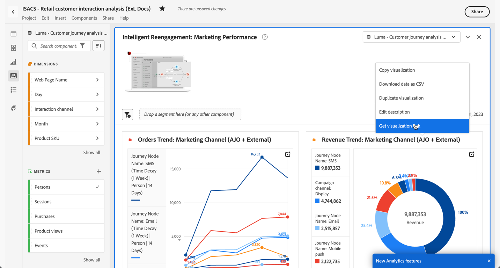

# Creare collegamenti condivisibili

Analysis Workspace offre diversi modi per condividere un progetto con gli utenti, inclusa la possibilità di ottenere un collegamento a un progetto o a una parte specifica di un progetto. Alcuni tipi di collegamento richiedono che il destinatario acceda a Customer Journey Analytics prima di accedere al progetto, altri no.

## Ottenere un collegamento al progetto da condividere con altri utenti di Workspace {#project-link}

Per condividere un collegamento a un progetto, passa al progetto che desideri condividere, quindi seleziona vai a **[!UICONTROL Share]** > **[!UICONTROL Get project link]** (o **[!UICONTROL Share]** > **[!UICONTROL Share with Workspace users]** > **[!UICONTROL Share by link]**). Gli utenti con cui condividi il collegamento devono effettuare l’accesso.

Se al destinatario del collegamento non è stato assegnato un ruolo di [progetto](/help/analysis-workspace/curate-share/share-projects.md), gli amministratori riceveranno **[!UICONTROL Edit original]** e i non amministratori **[!UICONTROL Edit copy]** esperienze.

## Ottenere un collegamento di sola lettura da condividere con chiunque

Puoi condividere un collegamento in sola lettura ai progetti Analysis Workspace con persone che non hanno accesso a Customer Journey Analytics.

Per ulteriori informazioni, vedere [Condividi con chiunque](/help/analysis-workspace/curate-share/share-projects.md#share-a-project-with-anyone-no-login-required).

## Ottenere un collegamento a un pannello o a una visualizzazione {#panel-link}

Puoi anche condividere un collegamento a una parte specifica del progetto, ad esempio un pannello o una visualizzazione individuale. Questa pratica viene talvolta definita intralinking e può essere utile per attirare l’attenzione degli utenti sulle informazioni chiave all’interno del progetto.

* Dal menu di scelta rapida di un&#39;intestazione del pannello, selezionare **[!UICONTROL Get panel link]**
* Dal menu di scelta rapida di un&#39;intestazione di visualizzazione, selezionare **[!UICONTROL Get visualization link]**

[Guarda il video](https://experienceleague.adobe.com/docs/analytics-learn/tutorials/analysis-workspace/visualizations/intra-linking-in-analysis-workspace.html?lang=it) sulla creazione di collegamenti e sul loro utilizzo per indirizzare i destinatari verso parti specifiche del progetto.

## Utilizzare i collegamenti in un sommario {#TOC}

Un suggerimento per sfruttare le varie opzioni di collegamento è includere sempre un sommario nella parte superiore del progetto Workspace. Nel sommario puoi inserire collegamenti ad altri progetti rilevanti, pannelli specifici e visualizzazioni specifiche. In questo modo il destinatario del progetto potrà navigare più facilmente.

[Guarda il video](https://experienceleague.adobe.com/docs/analytics-learn/tutorials/analysis-workspace/navigating-workspace-projects/create-a-toc-in-analysis-workspace.html?lang=it) sulla creazione di un sommario utilizzando i collegamenti e l’editor Rich Text di Workspace.

