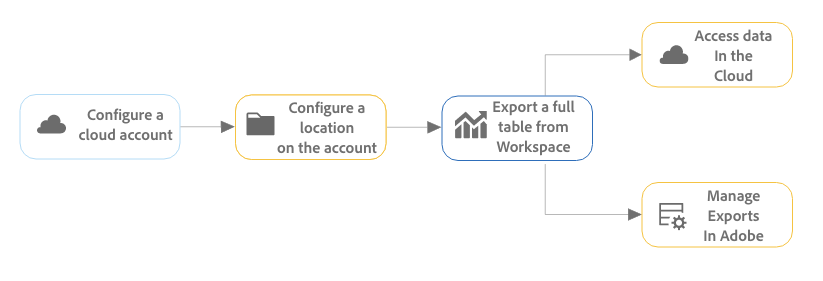
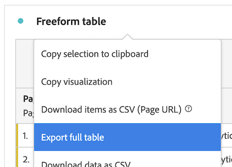

# Esportare i rapporti di Customer Journey Analytics nel cloud

Puoi esportare tabelle complete di Workspace dal Customer Journey Analytics e inviare esportazioni alle destinazioni cloud designate.

Sono disponibili anche altri metodi di esportazione dei rapporti sui Customer Journey Analytics, come descritto in [Panoramica sull’esportazione](/help/analysis-workspace/export/export-project-overview.md).

## Comprendere l’esportazione di tabelle complete

Puoi esportare tabelle complete da Analysis Workspace a provider cloud come Google, Azure, Amazon e Adobe.

[Vantaggi dell’esportazione di tabelle complete nel cloud](#advantages-of-exporting-to-the-cloud) includono la possibilità di esportare milioni di righe, includere metriche calcolate, dati della struttura in valori concatenati e altro ancora.

Durante l&#39;esportazione di tabelle complete, tenere presente quanto segue:

* Prima di esportare nel cloud, assicurati che le tabelle, l’ambiente e le autorizzazioni soddisfino i requisiti [requisiti di esportazione](#export-requirements).

* Alcuni [funzioni](#unsupported-features) e [componenti](#unsupported-components) non sono supportate per l’esportazione di tabelle complete nel cloud.

Utilizza il seguente processo per esportare tabelle complete nel cloud:

1. [Configurare un account cloud](/help/components/exports/cloud-export-accounts.md)

1. [Configurare una posizione sull’account](/help/components/exports/cloud-export-locations.md)

1. [Esportare una tabella completa da Workspace](#export-full-tables-from-analysis-workspace)

1. [Accedere ai dati nel cloud](#view-exported-data-and-manifest-file) e [Gestire le esportazioni in Adobe](/help/components/exports/manage-exports.md)

## Esportare tabelle complete da Analysis Workspace

>[!NOTE]
>
>Prima di esportare i dati come descritto in questa sezione, ulteriori informazioni sull’esportazione di tabelle complete sono disponibili nella sezione [Comprendere l’esportazione di tabelle complete](#understand-full-table-export) sopra.

Per esportare tabelle complete da Analysis Workspace:

1. Se non lo hai già fatto, configura un account e una posizione di esportazione, come descritto in [Configurare account di esportazione cloud](/help/components/exports/cloud-export-accounts.md).

1. In Analysis Workspace, fai clic con il pulsante destro del mouse sulla tabella a forma libera che contiene i dati da esportare.

1. Seleziona [!UICONTROL **Esporta tabella completa**].

   

1. In [!UICONTROL **Nuova esportazione di tabelle complete**] , specificare le informazioni seguenti:

   | Nome campo | Funzione |
   |---------|----------|
   | Nome | Specifica un nome per l’esportazione. Questo nome viene visualizzato nell’elenco delle esportazioni. |
   | Tag | Puoi applicare un tag esistente all’esportazione oppure creare un nuovo tag e applicarlo. 
Per applicare un tag esistente all’esportazione, seleziona un tag qualsiasi dal menu a discesa. Tutti i tag della tua azienda sono disponibili per l’applicazione<!-- double-check this -->.
 
Per creare un nuovo tag, digitarne il nome e premere Invio.

Quando applichi i tag a un’esportazione, tieni presente quanto segue: <ul><li>I tag applicati possono essere filtrati o cercati nella tabella delle esportazioni.</li> <li>I tag applicati a un progetto non vengono applicati automaticamente durante l’esportazione di una tabella completa, come descritto in &quot;Configurare le colonne nella pagina di esportazione&quot; in [Gestione esportazioni](/help/components/exports/manage-exports.md). (in alternativa, quando [programmazione di un progetto completo per l&#39;esportazione](/help/analysis-workspace/export/t-schedule-report.md), tutti i tag applicati al progetto vengono automaticamente applicati all&#39;esportazione.)  <!-- Right now we don't have a column for them on the exports table, so this isn't true. Jaden is adding the column. --></li></ul> |
   | Descrizione | Aggiungi una descrizione all’esportazione. È possibile scegliere di visualizzare le descrizioni come una colonna nella [Pagina Esporta](/help/components/exports/manage-exports.md) durante la visualizzazione delle esportazioni. |
   | Visualizzazione dati | Seleziona la visualizzazione dati che contiene i componenti da includere nell’esportazione. Il menu a discesa Visualizzazione dati si trova nell’angolo superiore sinistro della finestra di dialogo e può essere identificato dall’icona della visualizzazione dati.  
**Nota:** Se si sceglie una visualizzazione dati con componenti mancanti già inclusi nella tabella dati, verrà richiesto di cancellare la tabella dati e di ricrearla utilizzando i componenti inclusi nella visualizzazione dati selezionata. 
 |
   | Intervallo di lookback | Seleziona l’intervallo di tempo di reporting da includere in ciascun file di esportazione. Le opzioni includono [!UICONTROL **Oggi**], [!UICONTROL **Ieri**], [!UICONTROL **Ultimi 7 giorni**], [!UICONTROL **Ultimi 30 giorni**], [!UICONTROL **Questa settimana**], e [!UICONTROL **Questo mese**]. 
Questa opzione non viene visualizzata quando [!UICONTROL **Frequenza di esportazione**] è impostato su [!UICONTROL **Invia ora (una tantum)**]. |
   | Tabella dati | Visualizza la tabella a forma libera da esportare. Puoi modificare la tabella di dati trascinando i componenti dalla barra a sinistra alla tabella. La tabella viene aggiornata dinamicamente quando si aggiungono componenti all’area di lavoro.  
Tutti i segmenti applicati all’intera tabella del progetto vengono visualizzati nella parte superiore di ogni singola colonna della tabella.
 |
   | Cancella | Cancella il contenuto della tabella dati. Questo consente di iniziare a creare una nuova tabella direttamente nella finestra di dialogo Nuova esportazione di tabella completa. |
   | Frequenza di esportazione | Imposta la pianificazione per la frequenza con cui deve avvenire l’esportazione. 
Puoi scegliere [!UICONTROL **Invia ora (una tantum)**] per inviare l&#39;esportazione una sola volta. Quando selezioni questa opzione, l’esportazione viene avviata immediatamente.
In alternativa, puoi scegliere di inviare l’esportazione in base a una pianificazione definita. Quando si invia secondo una pianificazione, le opzioni includono [!UICONTROL **Giornaliero**], [!UICONTROL **Ogni settimana**], [!UICONTROL **Mensile per giorno della settimana**], [!UICONTROL **Mensile per giorno del mese**], [!UICONTROL **Annuale per giorno del mese**], e [!UICONTROL **Annuale per data specifica**]. 

Quando selezioni una frequenza di esportazione, considera quanto segue:
<ul><li>Le opzioni in [!UICONTROL **Intervallo di lookback**] cambia a seconda di ciò che selezioni qui.<!-- if they're doing Daily, then we might not let them look back to the last year... --></li><li>A seconda dell’opzione scelta, vengono visualizzati campi di configurazione aggiuntivi.</li></ul> |
   | A partire dal | Il giorno e l’ora in cui deve iniziare l’esportazione pianificata. 
Questa opzione è disponibile solo quando si sceglie una frequenza di esportazione pianificata.
 |
   | Fino al | Il giorno e l&#39;ora di scadenza dell&#39;esportazione pianificata. L’esportazione pianificata non viene più eseguita dopo la data e l’ora impostate. 
Questa opzione è disponibile solo quando si sceglie una frequenza di esportazione pianificata.
 |
   | Formato file | Scegli se i dati esportati devono essere in formato .csv o .json. |
   | Account | Seleziona l’account di esportazione cloud in cui desideri inviare i dati. 
In alternativa, se non hai già configurato un account cloud da utilizzare, puoi configurare un nuovo account:<ol><li>Seleziona [!UICONTROL **Aggiungi account**], quindi specifica le seguenti informazioni:<ul><li>[!UICONTROL **Nome account località**]: specifica un nome per l’account della posizione. Questo nome viene visualizzato durante la creazione di una posizione </li><li>[!UICONTROL **Descrizione del conto di ubicazione**]: fornisci una breve descrizione dell’account per distinguerlo da altri account dello stesso tipo.</li><li>[!UICONTROL **Tipo di account**]: seleziona il tipo di account cloud su cui stai effettuando l’esportazione. I tipi di account disponibili sono Amazon S3 Role ARN, Google Cloud Platform, Azure SAS, Azure RBAC, Snowflake e AEP Data Landing Zone.</li></ul><li>Per completare la configurazione dell’account, continua con il collegamento seguente che corrisponde al [!UICONTROL **Tipo di account**] hai selezionato:<ul><li>[Area di destinazione dati AEP](/help/components/exports/cloud-export-accounts.md#aep-data-landing-zone)</li><li>[ARN per ruolo Amazon S3](/help/components/exports/cloud-export-accounts.md#amazon-s3-role-arn)</li><li>[Piattaforma Google Cloud](/help/components/exports/cloud-export-accounts.md#google-cloud-platform)</li><li>[SAS di Azure](/help/components/exports/cloud-export-accounts.md#azure-sas)</li><li>[RBAC di Azure](/help/components/exports/cloud-export-accounts.md#azure-rbac)</li><li>[Snowflake](/help/components/exports/cloud-export-accounts.md#snowflake)</li></ul></ol> |
   | Nome posizione | Selezionare la posizione dell&#39;account in cui si desidera inviare i dati di esportazione.
Oppure, se non hai già configurato la posizione da utilizzare sull’account selezionato, puoi configurare una nuova posizione:<ol><li>Seleziona [!UICONTROL **Aggiungi posizione**], quindi specifica le seguenti informazioni: <ul><li>[!UICONTROL **Nome**]: nome della posizione.</li><li>[!UICONTROL **Descrizione**]: fornisci una breve descrizione della posizione per distinguerla dalle altre posizioni sull’account.</li><li>[!UICONTROL **Account località**]: seleziona l’account in cui desideri creare la posizione.</li></ul><li>Per completare la configurazione della posizione, continua con il collegamento seguente corrispondente al tipo di account selezionato in [!UICONTROL **Account località**] campo:<ul><li>[Area di destinazione dati AEP](/help/components/exports/cloud-export-locations.md#aep-data-landing-zone).</li><li>[ARN per ruolo Amazon S3](/help/components/exports/cloud-export-locations.md#amazon-s3-role-arn)</li><li>[Piattaforma Google Cloud](/help/components/exports/cloud-export-locations.md#google-cloud-platform)</li><li>[SAS di Azure](/help/components/exports/cloud-export-locations.md#azure-sas)</li><li>[RBAC di Azure](/help/components/exports/cloud-export-locations.md#azure-rbac)</li><li>[Snowflake](/help/components/exports/cloud-export-locations.md#snowflake)</li></ul> |

   {style="table-layout:auto"}

1. Seleziona [!UICONTROL **Salva**] per salvare l&#39;esportazione.

   I dati vengono inviati all’account cloud specificato alla frequenza specificata.

1. (Facoltativo) Dopo aver creato l’esportazione, che si scelga di inviarla ora o secondo una pianificazione definita, è possibile visualizzarla e gestirla sulla [Pagina Esporta](/help/components/exports/manage-exports.md) e visualizzarlo in [Esporta registri](/help/components/exports/manage-export-logs.md).

## Gestione esportazioni

Dopo l’esportazione dei dati da Analysis Workspace, puoi modificare, riesportare, duplicare, assegnare tag o eliminare esportazioni esistenti, come descritto in [Gestione esportazioni](/help/components/exports/manage-exports.md).

## Visualizzare i dati esportati e il file manifesto

### Dati esportati

I dati esportati sono disponibili come file compresso nella destinazione cloud configurata, come descritto in [Configurare account di esportazione cloud](/help/components/exports/cloud-export-accounts.md) e [Configurare i percorsi di esportazione cloud](/help/components/exports/cloud-export-locations.md).

Il nome del file compresso è il seguente, a seconda che sia stato scelto CSV o JSON come formato di file:

* `cja-export-{reportInstanceId}-{idx}.csv.gz`

* `cja-export-{reportInstanceId}-{idx}.json.gz`

>[!NOTE]
>
>È possibile scegliere il formato di file nel [!UICONTROL **Formato file**] durante l&#39;esportazione della tabella, come descritto in [Esportare tabelle complete da Analysis Workspace](#export-full-tables-from-analysis-workspace).

### File manifesto

Un file manifesto con il nome file `cja-export-{reportInstanceId}-{idx}.json.gz` è incluso in tutte le consegne di esportazione riuscite che contengono almeno un file. Il file manifesto consente di verificare che tutti i file siano stati consegnati correttamente. Include le seguenti informazioni:

* Elenco di tutti i file consegnati

* Il checksum MD5 di ciascun file

<!-- add in  what the file name, structure, and file format will be -->

## Vantaggi dell&#39;esportazione nel cloud

L’esportazione dei dati di Customer Journey Analytics nel cloud consente di:

* Esporta in una posizione condivisa, ad esempio Adobe Experience Platform Data Landing Zone, Google Cloud Platform, Microsoft Azure, Amazon S3 o Snowflake.

* Memorizza grandi quantità di dati storici.

  Questo tipo di dati può essere utilizzato per rilevare le tendenze a lungo termine al fine di acquisire informazioni aziendali e, in ultima analisi, portare a un processo decisionale migliore.

* Esporta tabelle complete contenenti migliaia o milioni di righe (3 milioni, 30 milioni, 150 milioni o 300 milioni di righe, a seconda del tipo di licenza). Altri metodi di esportazione consentono un massimo di 50.000 righe.

* Include le metriche calcolate nei dati del Customer Journey Analytics esportato.

* Strutturare l’output dei dati come valori concatenati.

* Esporta una tantum o in base a una pianificazione. (disponibile anche con [altre opzioni di esportazione](/help/analysis-workspace/export/export-project-overview.md).)

* Esporta file in formato CSV o JSON. (disponibile anche con [altre opzioni di esportazione](/help/analysis-workspace/export/export-project-overview.md).)

* Esporta tabelle che includono più dimensioni.

## Esporta requisiti {#export-requirements}

### Requisiti minimi

Assicurati che le tabelle, l’ambiente e le autorizzazioni soddisfino i seguenti requisiti:

* **Tabelle:** Per poter essere supportate per un’esportazione di tabelle complete, tutte le tabelle devono includere almeno una dimensione nella riga e una metrica in ogni colonna.

* **Ambiente:** Assicurati che [Indirizzi IP](/help/technotes/ip-addresses.md) e [Domini](/help/technotes/domains.md) utilizzati dal Customer Journey Analytics sono consentiti tramite il firewall dell’organizzazione.

* **Autorizzazioni:** In Adobe Admin Console, agli utenti deve essere assegnato un profilo di prodotto con [!UICONTROL **Esportazione tabella completa**] le autorizzazioni assegnate per esportare tabelle complete. Per informazioni sull’assegnazione di un’autorizzazione a un profilo di prodotto nell’Admin Console, vedi [Autorizzazione di Customer Journey Analytics in Admin Console](/help/technotes/access-control.md).

  >[!NOTE]
  >
  >  Utenti a cui è assegnato il [Ruolo di amministratore di prodotto](/help/technotes/access-control.md#product-admin-role) hanno sempre accesso all’esportazione di tabelle complete; a questi utenti non deve essere assegnato il [!UICONTROL **Esportazione tabella completa**] autorizzazione.

### Funzioni non supportate

Le seguenti funzioni non sono supportate e vengono rimosse automaticamente dalle esportazioni di tabelle complete:

* Percentuali
* Totali
* Filtro di ricerca
* Righe statiche
* Allineamento data
* Dimensioni dinamiche

  Per ulteriori informazioni, consulta [Elementi dimensionali dinamici e statici nelle tabelle a forma libera](/help/analysis-workspace/visualizations/freeform-table/column-row-settings/manual-vs-dynamic-rows.md).
* I Dimension nel primo raggruppamento sono convertiti e aggiunti come dimensione secondaria nella riga della tabella esportata; eventuali altri raggruppamenti non sono inclusi nella tabella
* L&#39;ordinamento non è supportato per la maggior parte dei set di dati; i dati potrebbero essere ordinati per set di dati di piccole dimensioni

### Componenti non supportati

I seguenti componenti non sono supportati e Analysis Workspace richiede di rimuoverli dalla tabella quando si esegue un’esportazione di tabella completa:

* Metriche calcolate che utilizzano funzioni di base o avanzate nella definizione della metrica (vedi [Funzioni di base](/help/components/calc-metrics/cm-functions.md) e [Funzioni avanzate](/help/components/calc-metrics/cm-adv-functions.md) per ulteriori informazioni)
* Non è possibile esportare i componenti per i quali un amministratore ha impostato un limite (vedere *Filtrare i criteri di governance dei dati nelle visualizzazioni dati* sezione in [Etichette e criteri](/help/data-views/data-governance.md) per ulteriori informazioni)
* Qualsiasi dimensione che soddisfi tutti i seguenti criteri:
   * È stato creato da un campo che fa parte di un [array di oggetti](/help/use-cases/object-arrays.md) (simile alle variabili con più valori in Adobe Analytics)
   * Ha [persistenza abilitata](/help/data-views/component-settings/persistence.md)
   * Non utilizza un’ [dimensione di binding](/help/use-cases/data-views/binding-dimensions-metrics.md)
* Più di 5 dimensioni e 5 metriche per rapporto (sono supportate fino a 5 dimensioni e 5 metriche)
* Nelle colonne della tabella:
   * Intervalli di date
   * Dimensioni
* Nelle righe della tabella:
   * Metriche calcolate
   * Metriche
   * Intervalli di date
   * Filtri

### Comportamento di attribuzione

L’esportazione di tabelle complete supporta metriche calcolate che utilizzano un modello di attribuzione non predefinito (come descritto nella sezione *Usa modello di attribuzione non predefinito* sezione in [Impostazioni colonna](/help/analysis-workspace/visualizations/freeform-table/column-row-settings/column-settings.md)).

Se in un rapporto viene utilizzato un modello di attribuzione non predefinito, il modello di allocazione utilizzato nel rapporto viene ignorato o mantenuto, a seconda che il rapporto abbia una singola dimensione o più dimensioni:

* **Per i rapporti che includono l’attribuzione delle metriche in una singola dimensione:** [Attribuzione delle metriche](/help/data-views/component-settings/attribution.md) sostituisce il [modello di allocazione](/help/data-views/component-settings/persistence.md) come avviene normalmente quando si utilizza l’attribuzione metrica.

  Ad esempio, l’attribuzione di una metrica di &quot;primo contatto&quot; sostituisce l’allocazione di una dimensione &quot;più recente&quot;.

* **Per i rapporti che includono l’attribuzione di metriche su più dimensioni contemporaneamente:** [Attribuzione delle metriche](/help/data-views/component-settings/attribution.md) viene applicato in aggiunta alla dimensione [modello di allocazione](/help/data-views/component-settings/persistence.md).

  Ad esempio, viene applicata un’attribuzione di metrica &quot;primo contatto&quot; oltre a un’allocazione di dimensione &quot;più recente&quot;. Inoltre, l’attribuzione della metrica verrà applicata alle coppie di elementi dimensionali post-allocati come se fossero elementi dimensionali singoli, anziché a ciascun elemento dimensionale in modo indipendente, come avviene normalmente in una tabella a forma libera.

  >[!NOTE]
  >
  >I rapporti multidimensionali sono supportati solo quando si esportano dati nel cloud, come descritto in questo articolo.

## Confronto tra l’esportazione di tabelle complete (in Customer Journey Analytics) e la Data Warehouse (in Adobe Analytics)

Se in precedenza utilizzavi Data Warehouse per esportare dati Adobe Analytics, la tabella seguente consente di comprendere le differenze tra l’esportazione di tabelle complete in Customer Journey Analytics e l’esportazione di dati con Data Warehouse in Adobe Analytics.

| Funzione | Esportazione tabella completa nel Customer Journey Analytics | Data Warehouse in Adobe Analytics |
|---------|----------|---------|
| Creare un rapporto personalizzato | Sì | Sì |
| Metriche calcolate | Sì | No |
| Segmenti | Sì | Limitato |
| Dimensioni | Limite di 5 | Senza limiti |
| Metriche | Limite di 5 | Senza limiti |
| Righe di reporting | Limite di 3 milioni, 30 milioni, 150 milioni o 300 milioni, a seconda del livello | Senza limiti |
| Numero di rapporti | Senza limiti | Senza limiti |
| Consegna ad hoc (una tantum) | Sì | Sì |
| Pianificare una consegna ricorrente | Sì | Sì |
| Consegna e-mail | No | Sì |
| FTP / SFTP | No | Supporto legacy |
| Azure | Sì | Sì |
| Amazon S3 | Sì | Sì |
| Google Cloud Platform | Sì | Sì |
| Snowflake | Sì | No |
| Frequenza di consegna | Giornaliero | Oraria |
