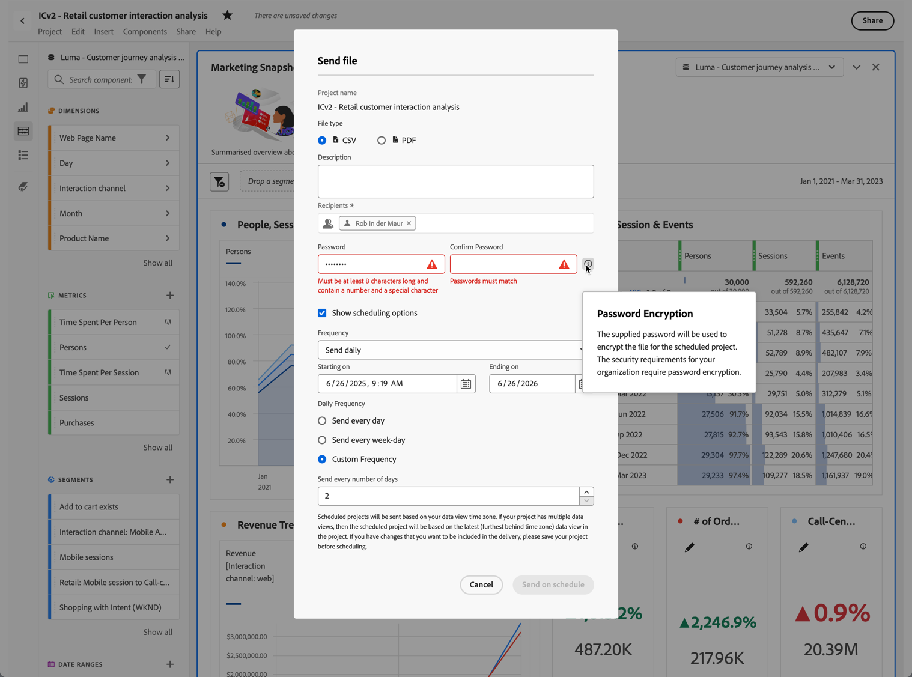
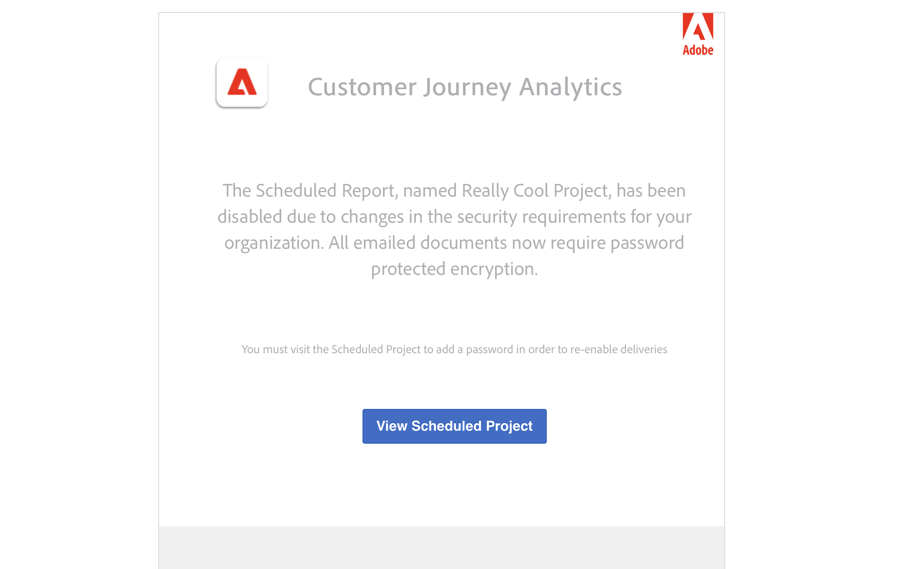

# Inviare e pianificare progetti

Puoi inviare progetti Customer Journey Analytics come file a utenti selezionati tramite e-mail. Puoi inviare file ad hoc oppure configurare i progetti da inviare in base a una pianificazione.

Quando invii dei file, tieni presente quanto segue:

* I file possono essere inviati in formato CSV o PDF.

* Tutti i tag applicati al progetto vengono applicati automaticamente all’esportazione.

Sono disponibili anche altri metodi di esportazione dei dati di Customer Journey Analytics, come descritto in [Panoramica sull’esportazione](/help/analysis-workspace/export/export-project-overview.md).

## Invia file

Per inviare un file ai destinatari tramite e-mail:

1. Selezionare **[!UICONTROL Condividi] > [!UICONTROL Invia file]**.
1. Specifica il tipo di file:
   * [!UICONTROL **CSV**]: scegli questa opzione se desideri utilizzare dati in formato testo normale.
   * [!UICONTROL **PDF**]: scegli questa opzione se vuoi che il file scaricato contenga tutte le tabelle e le visualizzazioni mostrate (visibili) nel progetto.
1. (Facoltativo) Utilizza **[!UICONTROL Descrizione]** per aggiungere una descrizione da includere nell&#39;e-mail.
1. Aggiungi destinatari o gruppi. Puoi anche immettere indirizzi e-mail.
1. (Solo per i clienti Healthcare Shield) Fornisci una password per [proteggere con password un report pianificato](#password-protect-a-new-scheduled-project).
1. (Facoltativo) Seleziona **[!UICONTROL Mostra opzioni di pianificazione]** per [pianificare un&#39;esportazione di file](#schedule-file-export).
1. Fai clic su **[!UICONTROL Invia ora]**. Seleziona **[!UICONTROL Annulla]** per annullare.

## Pianificare l’esportazione di file {#schedule}

Per inviare un file ai destinatari in base a una pianificazione tramite e-mail:

1. Seleziona **[!UICONTROL Condividi] > [!UICONTROL Pianifica esportazione file]**.
1. Specifica il tipo di file:
   * [!UICONTROL **CSV**]: scegli questa opzione se desideri utilizzare dati in formato testo normale.
   * [!UICONTROL **PDF**]: scegli questa opzione se vuoi che il file scaricato contenga tutte le tabelle e le visualizzazioni mostrate (visibili) nel progetto.
1. (Facoltativo) Utilizza **[!UICONTROL Descrizione]** per aggiungere una descrizione da includere nell&#39;e-mail.
1. Aggiungi destinatari o gruppi. Puoi anche immettere indirizzi e-mail.
1. (Solo per i clienti Healthcare Shield) Fornisci una password per [proteggere con password un report pianificato](#password-protect-a-new-scheduled-project).
1. Assicurarsi che **[!UICONTROL Mostra opzioni di pianificazione]** sia selezionato.
1. Seleziona una **[!UICONTROL frequenza]**. Puoi scegliere tra:

   | Frequenza | Opzioni |
   |---|---|
   | **[!UICONTROL Invia ogni ora]** | Immetti un valore per **[!UICONTROL Invia ogni numero di ore]**. |
   | **[!UICONTROL Invia ogni giorno]** | Seleziona una **[!UICONTROL frequenza giornaliera]**: **[!UICONTROL Invia ogni giorno]**, **[!UICONTROL Invia ogni giorno feriale]** o **[!UICONTROL Frequenza personalizzata]**. Se selezioni **[!UICONTROL Frequenza personalizzata]**, inserisci un valore per **[!UICONTROL Invia ogni numero di giorni]**. |
   | **[!UICONTROL Invia ogni settimana]** | Immetti un valore per **[!UICONTROL Invia ogni numero di settimane]**. E seleziona un **[!UICONTROL giorno della settimana]**. |
   | **[!UICONTROL Invia mensilmente per giorno della settimana]** | Seleziona un **[!UICONTROL giorno della settimana]** e un **[!UICONTROL settimana del mese]**. |
   | **[!UICONTROL Invia mensilmente per giorno del mese]** | Seleziona un valore da **[!UICONTROL Invia in questo giorno del mese]**. |
   | **[!UICONTROL Invia ogni anno per giorno del mese]** | Seleziona un **[!UICONTROL Giorno della settimana]**, scegli una **[!UICONTROL Settimana del mese]** e scegli un **[!UICONTROL Mensile dell&#39;anno]**. |
   | **[!UICONTROL Invia ogni anno per data specifica]** | Seleziona un **[!UICONTROL mese dell&#39;anno]** e un valore tra **[!UICONTROL Invia in questo giorno del mese]**. |

1. Immetti una data di inizio in **[!UICONTROL A partire dal]**. In alternativa, selezionare  per scegliere una data di inizio dal calendario.

1. Immetti una data di fine in **[!UICONTROL Data di fine]**. In alternativa, selezionare  per scegliere una data di fine dal calendario.
1. Seleziona **[!UICONTROL Invia secondo programma]**. Seleziona **[!UICONTROL Annulla]** per annullare.

## Proteggere un progetto pianificato tramite password {#password}

<!-- markdownlint-disable MD034 -->

>[!CONTEXTUALHELP]
>id="workspace_sendfile_password"
>title="Crittografia password"
>abstract="La password fornita verrà utilizzata per crittografare il file per il progetto pianificato. I requisiti di sicurezza dell’organizzazione richiedono la crittografia della password."

<!-- markdownlint-enable MD034 -->

>[!NOTE]
>
>L’opzione per proteggere un progetto pianificato tramite password viene visualizzata solo per i clienti Customer Journey Analytics che hanno acquistato il prodotto aggiuntivo [Healthcare Shield](https://business.adobe.com/solutions/industries/healthcare.html?lang=it).

Adobe utilizza la password per crittografare i progetti pianificati, sia che siano inviati in formato .pdf o .csv.

Dopo che la tua azienda ha acquistato lo SKU Healthcare Shield ed è stata abilitata a usarlo, il messaggio di richiesta di creazione di una password per un progetto pianificato viene visualizzato nelle circostanze seguenti:

* Quando un utente crea un nuovo progetto pianificato.

* Quando un progetto pianificato esistente sta per essere inviato. Il progetto attualmente pianificato verrà disattivato fino a quando non sarà attiva la protezione tramite password. Il proprietario del progetto pianificato riceve un messaggio e-mail con informazioni su questo requisito.

### Requisiti per la password

I requisiti relativi alla password sono conformi agli standard Adobe che richiede un minimo di 8 caratteri con almeno un numero e un carattere speciale.

### Proteggere un nuovo progetto pianificato tramite password

1. Dopo aver salvato il progetto, vai a **[!UICONTROL Condividi]** > **[!UICONTROL Invia il file ora]** oppure **[!UICONTROL Condividi]** > **[!UICONTROL Invia il file secondo programma]**.
1. Segui le istruzioni precedenti, in [Invia il file ora](https://experienceleague.adobe.com/docs/analytics-platform/using/cja-workspace/export/t-schedule-report.html#now) o [Invia il file secondo pianificazione](https://experienceleague.adobe.com/docs/analytics-platform/using/cja-workspace/export/t-schedule-report.html#schedule).

### Proteggere un progetto pianificato esistente tramite password

Quando proteggi con password un progetto pianificato esistente, il proprietario del progetto riceve un’e-mail simile alla seguente:

1. Accedi a Customer Journey Analytics.
1. Seleziona **[!UICONTROL Visualizza Progetto Pianificato]**.
1. Nella finestra di dialogo **[!UICONTROL Modifica progetto pianificato]**, immetti e reimmetti una password.
1. Consenti ai destinatari del progetto pianificato di conoscere la password. Non distribuire la password a persone che non sono destinatari del progetto pianificato.

## Gestione progetti programmati {#manager}

I progetti Analysis Workspace pianificati possono essere gestiti dall&#39;interfaccia principale, utilizzando **[!UICONTROL Componenti]** > **[!UICONTROL Progetti pianificati]**. Per ulteriori informazioni, consulta [Progetti pianificati](/help/components/scheduled-projects-manager.md).
