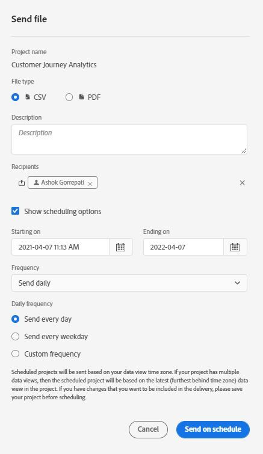

# Inviare file ad altri

Puoi inviare i report di Customer Journey Analytics come file agli utenti selezionati per e-mail. Puoi inviare file ad hoc oppure configurare i file da inviare secondo una pianificazione. I file possono essere inviati in formato CSV o PDF.

Tutti i tag applicati al progetto vengono applicati automaticamente all’esportazione.

Sono disponibili anche altri metodi di esportazione dei dati di Customer Journey Analytics, come descritto in [Panoramica sull’esportazione](/help/analysis-workspace/export/export-project-overview.md).

## Invia subito file {#now}

Per inviare immediatamente un file ai destinatari per e-mail:

1. Fai clic su **[!UICONTROL Share]>[!UICONTROL Export file]**.
1. Specifica il tipo di file:
   * [!UICONTROL **CSV**]: scegli questa opzione se desideri utilizzare dati in formato testo normale.
   * [!UICONTROL **PDF**]: scegli questa opzione se vuoi che il file scaricato contenga tutte le tabelle e le visualizzazioni mostrate (visibili) nel progetto.
1. (Facoltativo) Aggiungi una descrizione del file che verrà inclusa nell’e-mail.
1. Aggiungi destinatari o gruppi. È inoltre possibile inserire gli indirizzi e-mail.
1. (Solo per i clienti Healthcare Shield) Fornisci una password. Consulta la sezione Proteggere un rapporto pianificato tramite password.
1. (Facoltativo) Fai clic su **[!UICONTROL Show scheduling options]** per specificare la programmazione della consegna.
1. Fai clic su **[!UICONTROL Send Now]**.

## Invia file secondo pianificazione {#schedule}

Per inviare un file per e-mail secondo una pianificazione ricorrente:

1. Fai clic su **[!UICONTROL Share]>[!UICONTROL Schedule file export]**.
1. Specifica il tipo di file (CSV o PDF).
1. (Facoltativo) Aggiungi una descrizione del file che verrà inclusa nell’e-mail.
1. Aggiungi destinatari o gruppi. È inoltre possibile inserire gli indirizzi e-mail.
1. (Solo per i clienti Healthcare Shield) Fornisci una password. Consulta la sezione Proteggere un rapporto pianificato tramite password.
1. Specifica l’intervallo per il quale la pianificazione deve essere consegnata modificando l’opzione Inizia e Termina negli input. La data di fine deve essere compresa entro un anno dal giorno in cui la pianificazione viene creata o modificata.
1. Specifica la frequenza di consegna. Ogni frequenza consente diverse personalizzazioni.
1. Fai clic su **[!UICONTROL Send on schedule]**.

## Gestione progetti programmati {#manager}

I progetti Analysis Workspace pianificati possono essere gestiti in **[!UICONTROL Analytics]> [!UICONTROL Components] >[!UICONTROL Scheduled Projects]**.

In Gestione progetti programmati, puoi modificare ed eliminare pianificazioni ricorrenti di progetti. Cerca una pianificazione nella barra di ricerca o utilizzando le opzioni filtro nel pannello a sinistra. Puoi filtrare per tag, pianificazioni approvate, proprietari e altro ancora.

| Campo | Descrizione |
| --- | --- |
| [!UICONTROL Favorites] | Selezionando l’icona a forma di stella, questa pianificazione diventa la preferita. |
| [!UICONTROL Schedule ID] | Questo ID viene utilizzato principalmente a scopo di debug. |
| [!UICONTROL Title and Description] | Titolo e descrizione di questo progetto. |
| [!UICONTROL Owner] | La persona che ha creato ed è proprietaria del progetto. |
| [!UICONTROL Tags] | (facoltativo) Assegnare tag è un modo efficace per organizzare progetti. Tutti gli utenti possono creare tag e applicarne uno o più a un progetto. Tuttavia, puoi visualizzare solo i tag dei progetti di tua proprietà o che sono stati condivisi con te. |
| [!UICONTROL Delivered To] | Il/i destinatario/i del progetto programmato. |
| [!UICONTROL Expiration Date] | Puoi impostare la data di scadenza massima fino a un anno, indipendentemente dalla frequenza di pianificazione. |
| [!UICONTROL Frequency] | Con quale frequenza desideri che questo progetto programmato venga inviato ai destinatari. |
| [!UICONTROL Execution Time] | A che ora del giorno viene inviato questo progetto programmato. |
| [!UICONTROL Number of Queries] | Il numero di query su questo progetto. |

Di seguito sono riportate le azioni comuni di Gestione progetti programmati:

| Azione | Descrizione |
|---|---|
| **[!UICONTROL Edit schedule]** | Fai clic sul titolo della pianificazione per aggiornare le impostazioni di consegna. |
| **[!UICONTROL Delete schedule]** | Seleziona il progetto programmato nell’elenco, quindi fai clic su Elimina dal menu. In questo modo verrà eliminata la pianificazione selezionata per il progetto, mentre il progetto stesso non verrà eliminato. |
| **[!UICONTROL Add tags]** | Seleziona il progetto programmato nell’elenco, quindi scegli “Assegna tag” o “Approva” per organizzare le pianificazioni e semplificarne la ricerca. |
| **[!UICONTROL View failed schedules]** | Passa al pannello a sinistra > Altri filtri > Non riuscite per visualizzare le pianificazioni non riuscite. |
| **[!UICONTROL View expired schedules]** | Passa al pannello a sinistra > Altri filtri > Scadute per visualizzare le pianificazioni scadute. Fai clic sul titolo della pianificazione per impostare una nuova programmazione di consegna. |
| **[!UICONTROL View schedule ID]** | Passa alle opzioni della colonna in alto a destra e aggiungi la colonna ID pianificazione alla tabella. L’ID pianificazione è spesso utile per il debug. |

Lo strumento di gestione dei progetti programmati mostra gli elementi creati da uno specifico utente. Se l’account utente è disabilitato nell’applicazione, tutte le consegne programmate vengono interrotte.
Per ulteriori informazioni, consulta [Progetti pianificati](/help/components/scheduled-projects-manager.md).

## Proteggere un progetto pianificato tramite password {#password}

<!-- markdownlint-disable MD034 -->

>[!CONTEXTUALHELP]
>id="workspace_sendfile_password"
>title="Crittografia password"
>abstract="La password fornita verrà utilizzata per crittografare il file per il progetto pianificato. I requisiti di sicurezza dell’organizzazione richiedono la crittografia della password."

<!-- markdownlint-enable MD034 -->

>[!NOTE]
>
>L’opzione per proteggere un progetto pianificato tramite password viene visualizzata solo per i clienti Customer Journey Analytics che hanno acquistato il prodotto aggiuntivo [Healthcare Shield](https://business.adobe.com/solutions/industries/healthcare.html?lang=it).

Adobe utilizza la password per crittografare i progetti pianificati, sia che siano inviati in formato .pdf o .csv.

Dopo che la tua azienda ha acquistato lo SKU Healthcare Shield ed è stata abilitata a usarlo, il messaggio di richiesta di creazione di una password per un progetto pianificato viene visualizzato nelle circostanze seguenti:

* Quando un utente crea un nuovo progetto pianificato.

* Quando un progetto pianificato esistente sta per essere inviato. Il progetto attualmente pianificato verrà disattivato fino a quando non sarà attiva la protezione tramite password. Il proprietario del progetto pianificato riceve un messaggio e-mail con informazioni su questo requisito.

### Requisiti per la password

I requisiti relativi alla password sono conformi agli standard Adobe che richiede un minimo di 8 caratteri con almeno un numero e un carattere speciale.

### Proteggere un nuovo progetto pianificato tramite password

1. Dopo aver salvato il progetto, passa a **[!UICONTROL Share]** > **[!UICONTROL Send file now]** oppure **[!UICONTROL Share]** > **[!UICONTROL Send file on schedule]**.
1. Segui le istruzioni precedenti, in [Invia il file ora](https://experienceleague.adobe.com/docs/analytics-platform/using/cja-workspace/curate-share/t-schedule-report.html?lang=it#now) o [Invia il file secondo pianificazione](https://experienceleague.adobe.com/docs/analytics-platform/using/cja-workspace/curate-share/t-schedule-report.html?lang=it#schedule).

### Proteggere un progetto pianificato esistente tramite password

Prima di pianificare un progetto, il proprietario del progetto riceve un messaggio e-mail simile al seguente:

1. Accedi a Customer Journey Analytics.
1. Seleziona **[!UICONTROL View Scheduled Project]**.
1. Nella finestra di dialogo **[!UICONTROL Edit scheduled project]**, immetti e reimmetti una password.
1. Consenti ai destinatari del progetto pianificato di conoscere la password. Non distribuire la password a persone che non sono destinatari del progetto pianificato.
