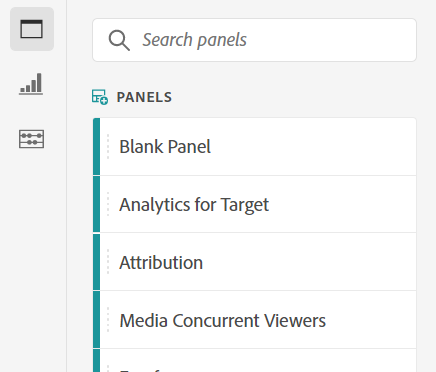

# Panoramica di Analysis Workspace

 Analysis Workspace è uno strumento browser flessibile che consente di creare rapidamente analisi e condividere approfondimenti. Tramite l’interfaccia di trascinamento, puoi creare analisi, aggiungere visualizzazioni per dare vita ai dati, curare un dataset, condividere e pianificare progetti con chiunque all’interno dell’organizzazione.

Se avete solo pochi minuti, guardate questa breve panoramica per vedere cosa è possibile.

>[!VIDEO](https://video.tv.adobe.com/v/26266/?quality=12)

## Accedi a Adobe Analytics {#login}

Per iniziare a utilizzare  Analysis Workspace, accedete a  Adobe Analytics accedendo a [experience.adobe.com/analytics](https://experience.adobe.com/analytics). Se un progetto specifico non è stato selezionato in precedenza, verrà visualizzato nella home page dell&#39;elenco dei progetti Workspace.

## Utilizzo dell’esercitazione Formazione {#training-tutorial}

Una volta effettuato l’accesso, il primo arresto deve essere l’ Analysis Workspace Training Tutorial, che illustra la terminologia e i passaggi comuni per la creazione della prima analisi in Workspace. Per iniziare l&#39;esercitazione, fate clic su **[!UICONTROL Create New Project]** quindi selezionare **Esercitazione sulla formazione** all&#39;interno del nuovo progetto modale.

## Creare un nuovo progetto {#new-project}

Completata l&#39;esercitazione, è possibile iniziare a creare il primo progetto. Il **nuovo progetto modale** offre diverse opzioni per avviare l’analisi. Potete scegliere di iniziare da un progetto vuoto o [scorecard mobile vuota](https://docs.adobe.com/content/help/it-IT/analytics/analyze/mobapp/curator.html), a seconda se intendete condividere l&#39;analisi dal browser o dall&#39;app mobile  Adobe Analytics dashboards.

Potete anche iniziare l&#39;analisi da **templates**,  modelli standard forniti dal Adobe o modelli personalizzati creati dalla vostra organizzazione. Sono disponibili diversi modelli, a seconda dell’analisi o del caso d’uso previsto. [Ulteriori informazioni](/help/analysis-workspace/build-workspace-project/starter-projects.md) informazioni sulle diverse opzioni di modello disponibili.

## Creazione di analisi {#analysis}

Nel progetto Workspace, **pannelli, tabelle, visualizzazioni e componenti** sono accessibili dalla barra a sinistra. Questi sono i vostri elementi costitutivi del progetto.

### Componenti

**Componenti** sono dimensioni, metriche, segmenti o intervalli di date, che possono essere combinati in un **[!UICONTROL Freeform table]** per iniziare a rispondere alla tua domanda di lavoro. Assicurati di familiarizzare con ciascuno [tipo di componente](/help/components/overview.md) prima di immergerti nella tua analisi. Dopo aver acquisito una conoscenza approfondita della terminologia del componente, puoi iniziare a trascinare per [creazione di analisi](/help/analysis-workspace/build-workspace-project/freeform-overview.md) in **[!UICONTROL Freeform table]**.

### Visualizzazioni

**Visualizzazioni**, ad esempio un grafico a barre o a linee, vengono quindi aggiunti sopra i dati per renderli visivamente vitali. Nella barra a sinistra, selezionate il centro **[!UICONTROL Visualizations]** per visualizzare l&#39;elenco completo di [visualizzazioni](/help/analysis-workspace/visualizations/freeform-analysis-visualizations.md) disponibile.

### Pannelli

**Pannelli** vengono utilizzati per organizzare l&#39;analisi all&#39;interno di un progetto e possono contenere numerose tabelle e visualizzazioni. Molti dei pannelli forniti in  Analysis Workspace generano una serie completa di analisi basate su alcuni input dell&#39;utente. Nella barra a sinistra, selezionate la parte superiore **[!UICONTROL Panels]** per visualizzare un elenco completo [panel](/help/analysis-workspace/c-panels/panels.md) disponibile.

## Risorse aggiuntive {#resources}

*  Adobe offre centinaia [Esercitazioni di formazione video per Analytics](https://docs.adobe.com/content/help/en/analytics-learn/tutorials/overview.html).
