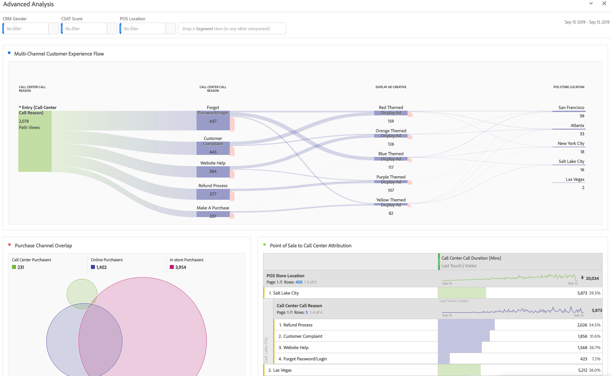
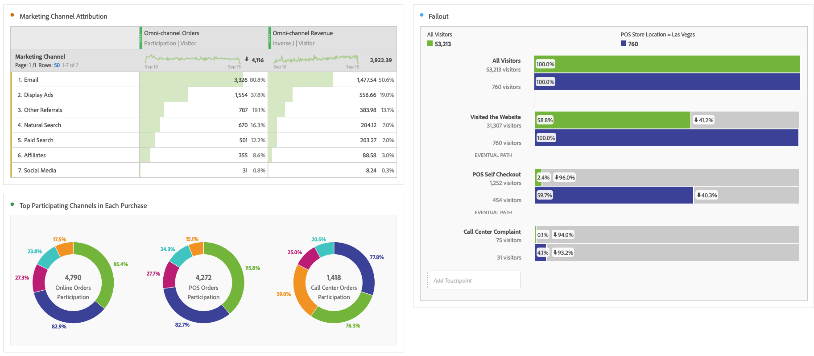

# Eseguire analisi avanzate

Prima di iniziare a creare rapporti di analisi e visualizzazioni avanzati, come descritto di seguito, assicurati di aver compreso le [analisi di base](/help/analysis-workspace/perform-basic-analysis.md).

L’analisi avanzata sfrutta funzioni come diagrammi di [Flusso](/help/analysis-workspace/visualizations/c-flow/flow.md), [Attribuzione](/help/analysis-workspace/c-panels/attribution.md), [Fallout](/help/analysis-workspace/visualizations/fallout/fallout-flow.md) e [raggruppamenti per dimensione](/help/components/dimensions/t-breakdown-fa.md).

