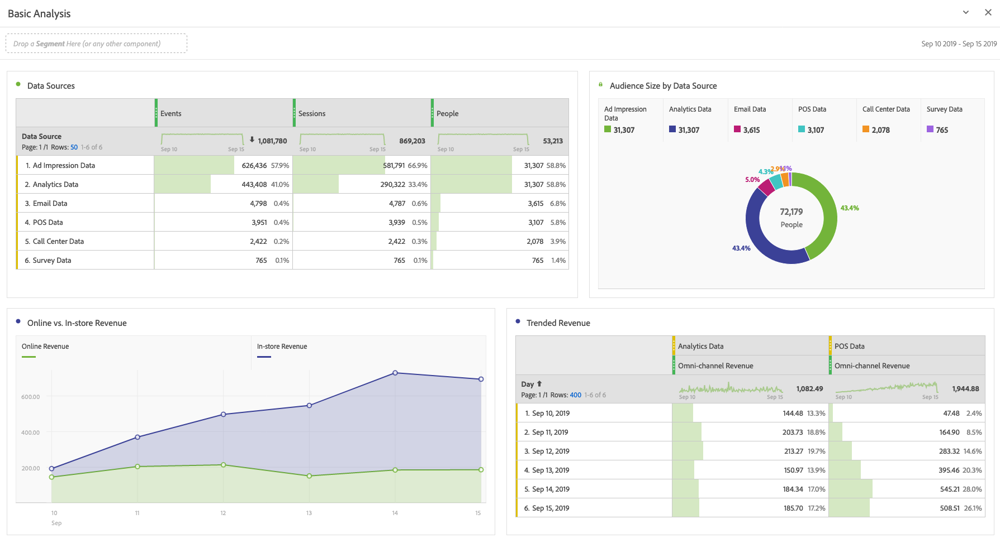

# Eseguire analisi di base

Dopo aver creato connessioni e visualizzazioni dati, analizza i dati che hai immesso utilizzando la potenza e la flessibilità di Analysis Workspace. Sentiti libero di sperimentare e trascinare dimensioni e metriche, modificane impostazioni di attribuzione, nomi descrittivi, fuso orario, impostazioni delle sessioni, ecc.

Ecco un esempio di visualizzazioni di base in Workspace. Potrai, ad esempio

* Creare un rapporto di classificazione delle sorgenti di dati che includono il maggior numero di eventi, sessioni e persone.

* Creare un rapporto con le tendenze delle entrate online e in negozio che confronta le due origini di dati nel tempo.

* Rappresenta la dimensione del pubblico in base alle origini dati, ad esempio dati da ad impression, Customer Journey Analytics, e-mail, POS, call center e sondaggi.

