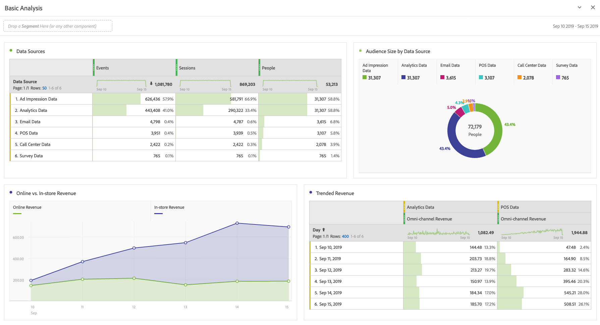
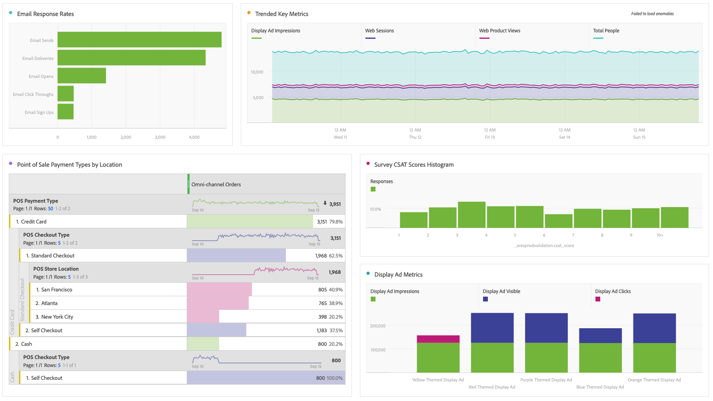

# Eseguire analisi di base

Customer Journey Analytics consente di analizzare i dati utilizzando la potenza e la flessibilità di Analysis Workspace.

>[!TIP]
>
>Se non sono disponibili dati in Analysis Workspace, assicurati di aver seguito il [processo di acquisizione dati](/help/data-ingestion/data-ingestion.md), che include quanto segue:<ul><li>[Creare una connessione](/help/connections/create-connection.md#create-and-configure-the-connection)  Assicurati che la connessione sia configurata per importare nuovi dati, dati di retrocompilazione o entrambi.</li><li>[Aggiungere set di dati](/help/connections/create-connection.md#add-and-configure-datasets)</li><li>[Creare le visualizzazioni dati](/help/data-views/create-dataview.md)</li></ul>

Sentiti libero di sperimentare e trascinare dimensioni e metriche, modificane impostazioni di attribuzione, nomi descrittivi, fuso orario, impostazioni delle sessioni, ecc.

Ecco un esempio di visualizzazioni di base in Workspace. Potrai, ad esempio

* Creare un rapporto sul ranking delle origini di dati che includono il maggior numero di eventi, sessioni e persone.

* Creare un rapporto con le tendenze delle entrate online e in negozio che confronta le due origini di dati nel tempo.

* Rappresenta la dimensione del pubblico in base alle origini dati, ad esempio dati da ad impression, Customer Journey Analytics, e-mail, POS, call center e sondaggi.

