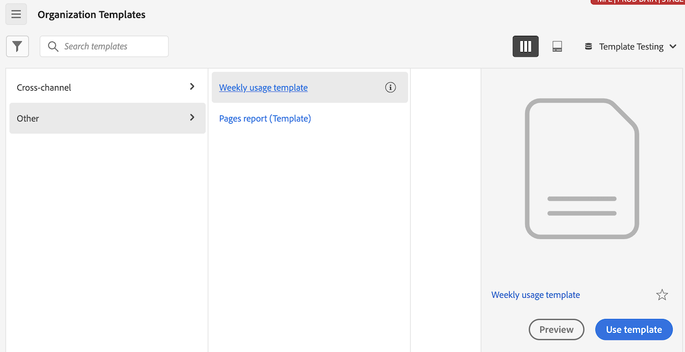

# Creare e gestire i modelli

Gli amministratori possono creare modelli e salvarli affinché possano essere utilizzati da altri utenti dell’azienda da cui accedi

Gli utenti dell’azienda da cui accedi possono utilizzare questi modelli aziendali come descritto in [Utilizzare i modelli](/help/analysis-workspace/templates/use-templates.md).

## Creare un modello {#create-templates}

<!-- markdownlint-disable MD034 -->

>[!CONTEXTUALHELP]
>id="use-case-ajo-template"
>title="Utilizzare i modelli in Journey Optimizer"
>abstract="Quando utilizzi questo modello in Journey Optimizer, viene utilizzata la visualizzazione dati impostata come predefinita in Adobe Journey Optimizer, indipendentemente dalla visualizzazione dati selezionata con questo modello in Customer Journey Analytics."

<!-- markdownlint-enable MD034 -->

Per creare un nuovo modello utilizzabile dalle persone dell’azienda da cui accedi:

1. In Analysis Workspace, crea un progetto con lo stato desiderato.

1. Seleziona [!UICONTROL **Progetto**] > **[!UICONTROL Salva come modello...]**.

   

1. Specificare le informazioni seguenti nella finestra di dialogo [!UICONTROL Salva come modello]:

   | Campo | Descrizione |
   |---------|----------|
   | **[!UICONTROL Nome]** | Inserisci un nome descrittivo per il modello. |
   | **[!UICONTROL Descrizione]** | Fornisci una breve descrizione del modello che ne indichi gli usi previsti. |
   | **[!UICONTROL Perché utilizzare questo modello]** | Inserisci una breve spiegazione per indicare alle persone dell’organizzazione come potrebbe essere utilizzato questo modello. Questa spiegazione viene visualizzata nella pagina Anteprima del modello. |
   | **[!UICONTROL Canali]** | Scegli tutti i canali applicabili a questo modello. È possibile selezionare più canali: **[!UICONTROL Web]**, **[!UICONTROL Mobile]**, **[!UICONTROL Cross-channel]**, **[!UICONTROL Call center]** e **[!UICONTROL In-store]**.
Le selezioni effettuate determinano dove viene visualizzato il modello e quali segmenti sono applicabili per gli utenti che vi accedono dalla pagina Modelli organizzazione.
 |
   | **[!UICONTROL Casi di utilizzo]** | Scegli eventuali casi d’uso applicabili a questo modello. È possibile selezionare più casi d&#39;uso: **[!UICONTROL Coinvolgimento]**, **[!UICONTROL Conversione]**, **[!UICONTROL Pubblico]**, **[!UICONTROL Acquisizione]** e **[!UICONTROL Journey Optimizer]**. 
Le selezioni effettuate determinano la posizione del modello nella pagina Modelli organizzazione. Gli utenti possono passare al modello o filtrare l’elenco in base al caso d’uso. 

**Nota:** Quando si seleziona l&#39;opzione **[!UICONTROL Journey Optimizer]**, il modello è disponibile per l&#39;utilizzo in Adobe Journey Optimizer. In Journey Optimizer, nella pagina **[!UICONTROL Report]** è disponibile un menu a discesa che consente agli utenti di selezionare questo modello o quello predefinito. Per ulteriori informazioni, consulta [Introduzione alla esperienza di reporting aggiornata](https://experienceleague.adobe.com/it/docs/journey-optimizer/using/reporting/channel-report/report-gs-cja) nella documentazione di Journey Optimizer.

Quando selezioni l’opzione Journey Optimizer, tieni presente quanto segue:
<ul><li>Questa opzione è disponibile solo se i dati di Journey Optimizer sono presenti nella visualizzazione dati utilizzata in Customer Journey Analytics.</li><li>Quando utilizzi questo modello in Journey Optimizer, viene utilizzata la visualizzazione dati impostata come predefinita in Adobe Journey Optimizer, indipendentemente dalla visualizzazione dati selezionata con questo modello in Customer Journey Analytics.  Per ulteriori informazioni sull’impostazione di una visualizzazione dati come predefinita in Journey Optimizer, consulta [Compatibilità](/help/data-views/create-dataview.md#compatibility) in [Creare o modificare una visualizzazione di dati](/help/data-views/create-dataview.md).</li></ul> |
   | **[!UICONTROL Tipo di attività Journey Optimizer]** | Scegli il tipo di attività Journey Optimizer da associare a questo modello: **[!UICONTROL Campagne]**, **[!UICONTROL Percorsi]**, **[!UICONTROL Pagine di destinazione]**, **[!UICONTROL Report]** o **[!UICONTROL Sottoscrizioni]**. 
Lascia vuoto questo campo se vuoi che questo modello sia associato a tutti i tipi di attività.

Questo campo viene visualizzato solo se nel campo **[!UICONTROL Casi d&#39;uso]** è selezionato **[!UICONTROL Journey Optimizer]**.
 |
   | **[!UICONTROL Attività Journey Optimizer]** | Scegli l’attività Journey Optimizer da associare a questo modello. 
Lascia vuoto questo campo se vuoi che questo modello sia associato a tutte le attività del tipo di attività selezionato.

Questo campo viene visualizzato solo se nel campo **[!UICONTROL Casi d&#39;uso]** è selezionato **[!UICONTROL Journey Optimizer]**.
 |
   | **[!UICONTROL Tag]** | Specifica i tag da applicare al modello. Gli utenti possono filtrare l’elenco dei modelli in base ai tag aggiunti. |

1. Seleziona [!UICONTROL **Salva come modello**].

Per informazioni su come gli utenti possono creare un progetto basato su un modello, consulta [Creare un progetto basato su un modello](/help/analysis-workspace/templates/use-templates.md#create-a-project-based-on-a-template) in [Utilizzare i modelli](/help/analysis-workspace/templates/use-templates.md).

## Modificare o eliminare un modello

Gli amministratori possono modificare o eliminare i modelli aziendali.

1. In Analysis Workspace, seleziona la scheda [!UICONTROL **Workspace**], quindi in **[!UICONTROL Modelli]** nella barra a sinistra, seleziona **[!UICONTROL _login_company_name _modelli]**.

1. Se visualizzi i modelli in una vista a colonne :

   1. Passa al modello da modificare o eliminare, seleziona l’icona delle informazioni accanto al nome del modello.

      

   1. Selezionare **[!UICONTROL Anteprima]**.

   1. Fai clic sull&#39;icona Altro, quindi seleziona **[!UICONTROL Modifica]** o **[!UICONTROL Elimina]**.

      

1. Se visualizzi i modelli in una vista a schede :

   1. Individua il modello che desideri modificare o eliminare.

      

   1. Passa il puntatore del mouse sul modello, quindi seleziona **[!UICONTROL Anteprima]**.

   1. Fai clic sull&#39;icona Altro, quindi seleziona **[!UICONTROL Modifica]** o **[!UICONTROL Elimina]**.

      

1. Se stai modificando un modello, apporta le modifiche desiderate, quindi seleziona [!UICONTROL **Progetto**] > **[!UICONTROL Salva come modello...]**.

   

1. Specificare le informazioni seguenti nella finestra di dialogo [!UICONTROL Salva come modello]:

   | Campo | Descrizione |
   |---------|----------|
   | **[!UICONTROL Nome]** | Inserisci un nome descrittivo per il modello. |
   | **[!UICONTROL Descrizione]** | Fornisci una breve descrizione del modello che ne indichi gli usi previsti. |
   | **[!UICONTROL Perché utilizzare questo modello]** | Inserisci una breve spiegazione per indicare alle persone dell’organizzazione come potrebbe essere utilizzato questo modello. Questa spiegazione viene visualizzata nella pagina Anteprima del modello. |
   | **[!UICONTROL Canali]** | Scegli tutti i canali applicabili a questo modello. È possibile selezionare più canali: **[!UICONTROL Web]**, **[!UICONTROL Mobile]**, **[!UICONTROL Cross-channel]**, **[!UICONTROL Call center]** e **[!UICONTROL In-store]**. Se non è selezionato alcun canale, il modello viene incluso con tutti i canali.
Le selezioni effettuate determinano dove viene visualizzato il modello e quali sono i filtri applicabili per gli utenti che vi accedono dalla pagina Modelli aziendali.
 |
   | **[!UICONTROL Casi di utilizzo]** | Scegli eventuali casi d’uso applicabili a questo modello. È possibile selezionare più casi d&#39;uso: **[!UICONTROL Coinvolgimento]**, **[!UICONTROL Conversione]**, **[!UICONTROL Pubblico]**, **[!UICONTROL Acquisizione]** e **[!UICONTROL Journey Optimizer]**. 
Le selezioni effettuate determinano la posizione del modello nella pagina Modelli organizzazione. Gli utenti possono passare al modello o filtrare l’elenco in base al caso d’uso. 

**Nota:** Quando si seleziona l&#39;opzione **[!UICONTROL Journey Optimizer]**, il modello è disponibile per l&#39;utilizzo in Adobe Journey Optimizer. In Journey Optimizer, nella pagina **[!UICONTROL Report]** è disponibile un menu a discesa che consente agli utenti di selezionare questo modello o quello predefinito. Per ulteriori informazioni, consulta [Introduzione alla esperienza di reporting aggiornata](https://experienceleague.adobe.com/it/docs/journey-optimizer/using/reporting/channel-report/report-gs-cja) nella documentazione di Journey Optimizer.

Quando selezioni l’opzione Journey Optimizer, tieni presente quanto segue:
<ul><li>Questa opzione è disponibile solo se i dati di Journey Optimizer sono presenti nella visualizzazione dati utilizzata in Customer Journey Analytics.</li><li>Quando utilizzi questo modello in Journey Optimizer, viene utilizzata la visualizzazione dati impostata come predefinita in Adobe Journey Optimizer, indipendentemente dalla visualizzazione dati selezionata con questo modello in Customer Journey Analytics.  Per ulteriori informazioni sull’impostazione di una visualizzazione dati come predefinita in Journey Optimizer, consulta [Compatibilità](/help/data-views/create-dataview.md#compatibility) in [Creare o modificare una visualizzazione di dati](/help/data-views/create-dataview.md).</li></ul> |
   | **[!UICONTROL Tipo di attività Journey Optimizer]** | Scegli il tipo di attività Journey Optimizer da associare a questo modello: **[!UICONTROL Campagne]**, **[!UICONTROL Percorsi]**, **[!UICONTROL Pagine di destinazione]**, **[!UICONTROL Report]** o **[!UICONTROL Sottoscrizioni]**. 
Lascia vuoto questo campo se vuoi che questo modello sia associato a tutti i tipi di attività.

Questo campo viene visualizzato solo se nel campo **[!UICONTROL Casi d&#39;uso]** è selezionato **[!UICONTROL Journey Optimizer]**.
 |
   | **[!UICONTROL Attività Journey Optimizer]** | Scegli l’attività Journey Optimizer da associare a questo modello. 
Lascia vuoto questo campo se vuoi che questo modello sia associato a tutte le attività del tipo di attività selezionato.

Questo campo viene visualizzato solo se nel campo **[!UICONTROL Casi d&#39;uso]** è selezionato **[!UICONTROL Journey Optimizer]**.
 |
   | **[!UICONTROL Tag]** | Specifica i tag da applicare al modello. Gli utenti possono filtrare l’elenco dei modelli in base ai tag aggiunti. |

1. Seleziona [!UICONTROL **Salva come modello**].

## Rinominare, assegnare tag o approvare i modelli

Gli amministratori possono rinominare, assegnare tag e approvare i modelli aziendali.

1. In Analysis Workspace, seleziona la scheda [!UICONTROL **Workspace**], quindi la scheda **[!UICONTROL Projects]** nella barra a sinistra.

1. Seleziona l’icona del filtro per filtrare l’elenco dei progetti.

1. Nella barra dei filtri, seleziona **[!UICONTROL Altri filtri]**, quindi seleziona **[!UICONTROL Modelli aziendali]**.

   Viene visualizzato un elenco dei modelli aziendali. Tutti i progetti regolari non vengono visualizzati, a meno che non siano fissati.

   I modelli aziendali possono essere identificati dall’ che precede il nome del modello.

   

1. Fai clic sull’icona con i puntini di sospensione **...** accanto a un modello per visualizzare le opzioni disponibili.

   

1. Selezionare **[!UICONTROL Rinomina]**, **[!UICONTROL Tag]** o **[!UICONTROL Approva]**.

   Puoi inoltre eliminare un modello oppure eliminare un modello come descritto in [Modificare o eliminare i modelli](#edit-or-delete-templates).

1. (Facoltativo) Per tornare alla visualizzazione normale, nella barra dei filtri, deseleziona **[!UICONTROL Modelli aziendali]**.

## Aggiungere componenti mancanti alla visualizzazione dati per un determinato modello

Per impostazione predefinita, alcuni modelli forniti da Adobe non possono essere utilizzati perché contengono componenti non presenti nella visualizzazione dati.

Per ogni componente mancante, nella visualizzazione dati è disponibile un’etichetta di contesto corrispondente. Devi aggiungere l’etichetta di contesto corrispondente a un componente già presente nella visualizzazione dati oppure aggiungere un nuovo componente alla visualizzazione dati e aggiungervi l’etichetta di contesto.

Per aggiungere componenti mancanti a un modello:

1. In Analysis Workspace seleziona la scheda [!UICONTROL **Workspace**], quindi in **[!UICONTROL Modelli]** nella barra a sinistra seleziona **[!UICONTROL Modelli Adobe]**.

1. Seleziona l’icona del filtro per filtrare l’elenco dei modelli.

1. Seleziona **[!UICONTROL Non pronto per l&#39;uso]** per visualizzare i modelli che richiedono componenti non presenti nella visualizzazione dati.

   

1. Individua un modello non ancora pronto per l’utilizzo con la visualizzazione dati.

1. Esegui una delle operazioni seguenti:

   * **Se visualizzi modelli in una vista a colonne** :

      1. Passa al modello che non è ancora pronto per l’uso con la visualizzazione dati, quindi seleziona l’icona info accanto al nome del modello.

         

      1. Selezionare **[!UICONTROL Anteprima]**.

         

   * **Se visualizzi modelli in una vista a schede** :

      1. Individua il modello non ancora pronto per l’utilizzo con la visualizzazione dati.

         

      1. Passa il puntatore del mouse sul modello, quindi seleziona **[!UICONTROL Anteprima]**.

         

1. Nella sezione **[!UICONTROL Componenti mancanti]** viene visualizzato un elenco dei componenti mancanti nella visualizzazione dati. Seleziona **[!UICONTROL Aggiungi questi componenti alla visualizzazione dati]**.

   La pagina di configurazione della visualizzazione dati viene mostrata in una nuova scheda.

1. Selezionare la scheda **[!UICONTROL Componenti]** per la visualizzazione dati.

   

1. Per ogni componente elencato come mancante nel modello, eseguire una delle operazioni seguenti nella scheda **[!UICONTROL Componenti]**:

   * Nella sezione **[!UICONTROL Componenti inclusi]** selezionare un componente già incluso nella visualizzazione dati che si desidera utilizzare per il componente mancante.

   * Aggiungi un nuovo componente alla visualizzazione dati che desideri utilizzare per il componente mancante, quindi seleziona il componente.

     Per aggiungere un nuovo componente alla visualizzazione dati, cerca nell&#39;elenco dei campi dello schema, quindi trascinalo nella sezione **[!UICONTROL Componenti inclusi]**.

1. Con il componente selezionato, individua il menu a discesa **[!UICONTROL Etichette di contesto]** nella colonna di destra.

   

1. Nel menu a discesa **[!UICONTROL Etichette di contesto]**, selezionare l&#39;etichetta di contesto con lo stesso nome del componente mancante.

1. Seleziona **[!UICONTROL Salva e continua]**.

1. Per ogni componente mancante, ripeti il processo di aggiunta dell’etichetta di contesto corrispondente a un componente nella visualizzazione dati.

## Accedere a un modello aziendale

Come per i modelli forniti da Adobe, gli utenti dell’organizzazione possono accedere ai modelli creati dagli amministratori.

Per informazioni su come accedere a un modello aziendale, consulta [Accedere ed eseguire un modello](/help/analysis-workspace/templates/use-templates.md#access-and-run-a-template) in [Utilizzare i modelli](/help/analysis-workspace/templates/use-templates.md).

## Nascondere la scheda Modelli

Gli amministratori possono nascondere la scheda Modelli per tutti gli utenti all’interno della propria organizzazione.

1. Vai a **[!UICONTROL Customer Journey Analytics]** > **[!UICONTROL Componenti]** > **[!UICONTROL Preferenze]** > **[!UICONTROL Società]**.
1. Selezionare l&#39;opzione per **[!UICONTROL Nascondere la scheda Modelli]**.
