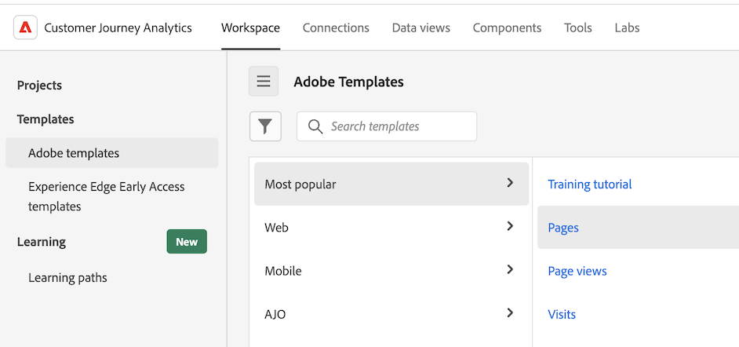

# Utilizzare i modelli

I modelli (o modelli aziendali) in Analysis Workspace forniscono informazioni rapide sugli scenari di reporting più comuni. Di seguito sono riportati alcuni esempi di domande a cui è possibile rispondere con i modelli:

* quante persone visitano il sito
* quanti di questi visitatori sono visitatori univoci (conteggiati una sola volta)
* come sono arrivati al sito (ad esempio, se hanno seguito un collegamento o ci sono arrivati direttamente)
* quali parole chiave hanno utilizzato i visitatori per cercare il contenuto del sito
* per quanto tempo i visitatori sono rimasti su una determinata pagina o sull’intero sito
* su quali collegamenti i visitatori hanno fatto clic e quando hanno lasciato il sito
* quali canali di marketing sono più efficaci nel generare ricavi o eventi di conversione
* quanto tempo hanno trascorso a guardare un video
* quali browser e dispositivi hanno utilizzato per visitare il sito

Le informazioni seguenti descrivono come accedere e utilizzare i modelli dalla scheda [!UICONTROL Templates] in Analysis Workspace.

## Accedere ed eseguire un modello

1. In Analysis Workspace, seleziona la scheda [!UICONTROL **Workspace**].

   

1. Nella sezione [!UICONTROL **Modelli**] selezionare una delle schede seguenti:

   * **[!UICONTROL Adobe templates]**: mostra tutti i modelli forniti da Adobe.

   * **[!UICONTROL _login_company_name _modelli]**: mostra tutti i modelli aziendali creati per la tua organizzazione.

     I modelli aziendali possono essere creati solo da un amministratore. Per informazioni su come creare un modello aziendale, vedere [Creare e gestire modelli](/help/analysis-workspace/templates/create-templates.md).

1. Per modificare la modalità di visualizzazione dei modelli disponibili, utilizzare una delle opzioni seguenti:

   * Scegli se visualizzare i modelli in una vista a colonne o in una vista a schede selezionando l&#39;icona della vista a colonne  o l&#39;icona della vista a schede .

   * Quando si utilizza la vista a schede , scegliere uno dei seguenti criteri di ordinamento: **[!UICONTROL Most recently used]**, **[!UICONTROL Most popular]**, **[!UICONTROL Alphabetical]**, **[!UICONTROL Categorical]**.

1. Nel campo di ricerca, iniziare a digitare il nome del modello che si desidera trovare, quindi selezionarlo dall&#39;elenco dei modelli.

   Oppure

   Selezionare la categoria di modello che si desidera visualizzare, quindi selezionare il modello dall&#39;elenco dei modelli.

   >[!TIP]
   >
   >Per spostarti nel menu utilizzando i tasti freccia, premi il tasto Barra obliqua (/), quindi premi il tasto Freccia giù. Premi Invio per caricare il modello selezionato.

   Per un elenco dei modelli disponibili, vedere la sezione [Modelli disponibili](#available-templates) di seguito.

1. (Facoltativo) Puoi visualizzare i modelli che contengono componenti non disponibili nella visualizzazione dati. Per impostazione predefinita, i modelli vengono visualizzati solo se utilizzano componenti disponibili nella visualizzazione dati.

   >[!NOTE]
   >
   >   Prima di poter utilizzare questi modelli, un amministratore deve innanzitutto aggiungere alla visualizzazione dati le etichette di contesto richieste per i componenti mancanti. Per ulteriori informazioni, vedere [Aggiungere componenti mancanti alla visualizzazione dati per un modello specificato](/help/analysis-workspace/templates/create-templates.md#add-missing-components-to-the-data-view-for-a-given-template) in [Utilizzare i modelli](/help/analysis-workspace/templates/create-templates.md).

   1. Seleziona l’icona del filtro.

   1. Selezionare **[!UICONTROL Not ready for use]** per visualizzare i modelli che richiedono componenti aggiuntivi.

      

1. Seleziona il modello per creare un rapporto basato sul modello scelto.

1. (Condizionale) Se il modello contiene componenti non disponibili nella visualizzazione dati, viene visualizzata la finestra di dialogo Visualizzazione dati non compatibile, in cui viene indicato che la visualizzazione dati è incompatibile con il modello e vengono indicati i componenti mancanti.

   Effettuare una delle seguenti operazioni:

   * Scegliere una visualizzazione dati diversa nel menu a discesa **[!UICONTROL Change data view]**.

   * Selezionare **[!UICONTROL Continue anyway]** per visualizzare il modello con i componenti mancanti.

## Creare un progetto basato su un modello {#use-reports}

Un modello potrebbe non soddisfare esattamente le tue esigenze, ma può avvicinarti. In questi casi, puoi utilizzare il modello come punto di partenza per il progetto, quindi personalizzarlo in base alle tue esigenze.

Se si esce da un modello dopo aver apportato modifiche, viene richiesto di salvare o eliminare le modifiche. Quando si salvano le modifiche apportate a un modello, questo viene salvato come nuovo progetto.

Per personalizzare un modello e salvarlo come progetto:

1. In Customer Journey Analytics selezionare la scheda [!UICONTROL **Workspace**].

1. Selezionare la scheda [!UICONTROL **Modelli**].

1. Seleziona il modello da visualizzare. Ad esempio, in [!UICONTROL **Più popolari**], seleziona il modello [!UICONTROL **Pagine**].

   Il modello Pagine, visualizzato in Analysis Workspace, mostra due [visualizzazioni](/help/analysis-workspace/visualizations/freeform-analysis-visualizations.md) ([Grafico a barre](/help/analysis-workspace/visualizations/bar.md) e [Numero riepilogo](/help/analysis-workspace/visualizations/summary-number-change.md)) e una [Tabella a forma libera](/help/analysis-workspace/visualizations/freeform-table/freeform-table.md). La metrica utilizzata è Occorrenze.

   <!--update screenshot. The following is AA -->

   

1. Esegui una delle operazioni seguenti:

   * Visualizza il modello.
   * Trascina uno o più filtri nella zona di rilascio Filtro, in alto. Ad esempio, trascina il filtro [!UICONTROL **Clienti dispositivi mobili**] e visualizza i risultati.
   * Modifica l’intervallo di date andando sul calendario in alto a destra.
   * Aggiungi suddivisioni dimensionali, trascina altre metriche e in genere personalizza il modello in base alle tue esigenze.

1. (Facoltativo) Salva il modello come progetto selezionando [!UICONTROL **Progetto**] > [!UICONTROL **Salva**].

   Il modello viene salvato come nuovo progetto e non modifica il modello esistente. Per ulteriori informazioni sul salvataggio dei progetti, vedere [Salva progetti](/help/analysis-workspace/build-workspace-project/save-projects.md).

## Modelli disponibili

Per accedere a tutti i modelli predefiniti disponibili:

1. In Adobe Analytics, seleziona la scheda [!UICONTROL **Workspace**], quindi la scheda [!UICONTROL **Modelli**].

   I modelli predefiniti sono organizzati per categoria.

   <!--add screenshot-->

1. Selezionare una categoria per visualizzare i modelli al suo interno.

   Le sezioni seguenti corrispondono alle categorie disponibili e forniscono informazioni su ciascun modello.

   * [[!UICONTROL ](#most-popular)

   * [[!UICONTROL ](#engagement)

   * [[!UICONTROL ](#web-conversion)

   * [[!UICONTROL ](#web-audience)

   * [[!UICONTROL ](#web-acquisition)

   * [[!UICONTROL ](#mobile-mobile-app)

   * [[!UICONTROL ](#mobile-mobile-device-information)

   * [[!UICONTROL ](#time-parting)

   * [[!UICONTROL ](#cross-channel)

   * [[!UICONTROL ](#other-channels)

   * [[!UICONTROL ](#ajo)

### Most popular (Più popolari) {#most-popular}

<!--AA only-->

<!-- markdownlint-disable MD034 -->

>[!CONTEXTUALHELP]
>id="aa-template--unitsOvertimeReport"
>title="Visualizza il numero totale di unità acquistate in tutti gli ordini. I dati vengono visualizzati in un periodo di tempo e confrontati con i periodi precedenti."
>abstract="**Questo ti aiuta** a capire meglio come le vendite unitarie aumentano o diminuiscono nel tempo. Puoi applicare un segmento per scoprire quali clienti o aree geografiche acquistano più unità e come queste vendite unitarie tendono nel tempo. **In base a quanto appreso, è possibile** eseguire una serie di operazioni, ad esempio valutare l&#39;efficacia di una campagna di marketing avviata di recente confrontando le vendite unitarie prima e dopo l&#39;avvio della campagna. In alternativa, è possibile confrontare le vendite unitarie annuali durante le festività. Questo modello utilizza la dimensione Giorno e la metrica Unità."

<!-- markdownlint-enable MD034 -->

<!--both AA and CJA-->

<!-- markdownlint-disable MD034 -->

>[!CONTEXTUALHELP]
>id="template--training"
>title="Modello per le esercitazioni"
>abstract="Scopri la terminologia e i passaggi comuni di Analysis Workspace per creare la tua prima analisi."

<!-- markdownlint-enable MD034 -->

<!-- markdownlint-disable MD034 -->

>[!CONTEXTUALHELP]
>id="template--pagesRankedReport"
>title="Identifica le pagine più popolari e meno popolari."
>abstract="**Questo può aiutarti** a comprendere meglio il tuo pubblico e il tipo di informazioni a cui sono più interessati. **In base a ciò che hai appreso, potresti** fare qualsiasi cosa, ad esempio regolare i metadati della pagina per aumentare la visibilità sulle pagine visualizzate meno o passare del tempo a migliorare il contenuto delle pagine più visualizzate. Questo modello utilizza la dimensione Pagina e la metrica Visualizzazioni pagina."

<!-- markdownlint-enable MD034 -->

<!-- markdownlint-disable MD034 -->

>[!CONTEXTUALHELP]
>id="template--pageViewsOvertimeReport"
>title="Visualizzare il numero totale di visualizzazioni di pagina. I dati vengono visualizzati in un periodo di tempo e confrontati con i periodi precedenti. "
>abstract="**Questo può aiutarti** a comprendere meglio come il traffico sul tuo sito potrebbe aumentare o diminuire nel tempo. **In base a ciò che apprendi, potresti** eseguire una serie di operazioni, ad esempio valutare l&#39;efficacia di una campagna di marketing avviata di recente confrontando il traffico del sito prima e dopo l&#39;avvio della campagna. Oppure puoi confrontare il traffico delle vacanze su base annua. Questo modello utilizza la dimensione Giorno e la metrica Visualizzazioni pagina."

<!-- markdownlint-enable MD034 -->

<!-- markdownlint-disable MD034 -->

>[!CONTEXTUALHELP]
>id="template--visitsOvertimeReport"
>title="Visualizza il numero totale di visite. I dati vengono visualizzati in un periodo di tempo e confrontati con i periodi precedenti."
>abstract="**Questo può aiutarti** a comprendere meglio come il traffico sul tuo sito potrebbe aumentare o diminuire nel tempo. **In base a ciò che apprendi, potresti** eseguire una serie di operazioni, ad esempio valutare l&#39;efficacia di una campagna di marketing avviata di recente confrontando il traffico del sito prima e dopo l&#39;avvio della campagna. Oppure puoi confrontare il traffico delle vacanze su base annua. Questo modello utilizza la dimensione Giorno e la metrica Visite."

<!-- markdownlint-enable MD034 -->

<!-- markdownlint-disable MD034 -->

>[!CONTEXTUALHELP]
>id="template--visitorsOvertimeReport"
>title="Visualizza il numero totale di visitatori univoci. I dati vengono visualizzati in un periodo di tempo e confrontati con i periodi precedenti. "
>abstract="**Questo può aiutarti** a comprendere meglio come la portata e la dimensione del pubblico del tuo sito aumentino o diminuiscano nel tempo o rispetto a un periodo precedente. **In base a ciò che hai appreso, potresti** fare un certo numero di cose, ad esempio valutare se una campagna di marketing lanciata di recente è riuscita ad attirare nuove persone sul sito confrontando visitatori univoci prima e dopo il lancio della campagna. Oppure puoi confrontare il numero di persone che visitano il sito durante le festività anno su anno. Questo modello utilizza la dimensione Giorno e la metrica Visitatori univoci. "

<!-- markdownlint-enable MD034 -->

<!-- markdownlint-disable MD034 -->

>[!CONTEXTUALHELP]
>id="template--keyMetricsReport"
>title="Visualizza un rapporto che mostra affiancate le metriche di visualizzazioni di pagina, visite e visitatori univoci. I dati vengono visualizzati in un periodo di tempo e confrontati con i periodi precedenti."
>abstract="**Questo può aiutarti** a confrontare queste metriche importanti per ottenere un quadro più completo del numero di persone univoche che che visitano il sito, del numero di volte in cui sono state visitate le pagine e del numero di sessioni. **In base a ciò che hai appreso, potresti** eseguire un numero qualsiasi di operazioni, ad esempio valutare il numero medio di pagine visualizzate da ogni persona durante la visita al sito in una determinata settimana o mese e come è cambiato durante determinati periodi dell&#39;anno o prima e dopo l&#39;esecuzione di campagne di marketing.  Questo modello utilizza la dimensione Giorno, la metrica Visualizzazioni pagina, la metrica Visite e la metrica Visitatori univoci."

<!-- markdownlint-enable MD034 -->

<!-- markdownlint-disable MD034 -->

>[!CONTEXTUALHELP]
>id="template--siteSectionRankedReport"
>title="Visualizza le sezioni più popolari o con le prestazioni più elevate del sito."
>abstract="**Questo può aiutarti** a capire meglio quali sezioni del tuo sito sono più visitate. **In base a ciò che hai appreso, potresti** fare un certo numero di cose, ad esempio valutare quali prodotti o servizi fornisci generano il maggior interesse. Questo modello utilizza la dimensione Sezione sito e la metrica Visite."

<!-- markdownlint-enable MD034 -->

<!-- markdownlint-disable MD034 -->

>[!CONTEXTUALHELP]
>id="template--next-page-report"
>title="Visualizza i luoghi più comuni in cui le persone vanno immediatamente dopo aver visitato una determinata pagina."
>abstract="**Questo può aiutarti** a comprendere meglio il comportamento degli utenti dopo aver visitato una determinata pagina. **In base a ciò che hai appreso, potresti** eseguire una serie di operazioni, ad esempio valutare se la progettazione o il layout della pagina possa essere ottimizzato per indirizzare gli utenti a pagine più desiderate, ad esempio una pagina per effettuare un acquisto o lasciare una recensione. Questo modello utilizza la dimensione Pagina e la metrica Eventi."

<!-- markdownlint-enable MD034 -->

<!-- markdownlint-disable MD034 -->

>[!CONTEXTUALHELP]
>id="template--previous-page-report"
>title="Visualizza i luoghi più comuni in cui le persone vanno immediatamente prima di visitare una determinata pagina."
>abstract="**Questo può aiutarti** a capire meglio quali pagine indirizzano il maggior traffico verso una determinata pagina. **In base a ciò che hai appreso, potresti** fare un certo numero di cose, ad esempio valutare se le pagine che non sono visualizzate come pagine precedenti richiedono collegamenti più evidenti alla pagina corrente."

<!-- markdownlint-enable MD034 -->

<!-- markdownlint-disable MD034 -->

>[!CONTEXTUALHELP]
>id="template--campaignRankedReport"
>title="Visualizza i collegamenti più efficaci per indirizzare il traffico verso il tuo sito."
>abstract="**Questo può aiutarti** a capire meglio quali codici di tracciamento (e i collegamenti a essi associati) sono stati più utilizzati per accedere al tuo sito. **In base a ciò che hai appreso, potresti** fare un certo numero di cose, ad esempio modificare la tua strategia per la posizione in cui aggiungi collegamenti al tuo sito. Questo modello utilizza la dimensione Codice di tracciamento e la metrica Visite."

<!-- markdownlint-enable MD034 -->

<!-- markdownlint-disable MD034 -->

>[!CONTEXTUALHELP]
>id="template--productsRankedReport"
>title="Visualizza il numero di ordini per prodotto. I dati vengono visualizzati in un arco di tempo."
>abstract="**Questo ti aiuta** a capire quali prodotti sono più richiesti o meno. **In base a ciò che hai appreso, potresti** fare qualsiasi cosa, ad esempio modificare le tue strategie di marketing per promuovere prodotti dalle prestazioni elevate o per migliorare o interrompere prodotti dalle prestazioni insoddisfacenti. Puoi anche regolare l’inventario dei prodotti in base all’analisi dei dati. Questo modello utilizza la dimensione Prodotto e la metrica Ordini."

<!-- markdownlint-enable MD034 -->

<!-- markdownlint-disable MD034 -->

>[!CONTEXTUALHELP]
>id="template--lastTouchChannelRankedReport"
>title="Visualizza i canali di marketing più recenti con cui i visitatori fanno riferimento durante il periodo di coinvolgimento (30 giorni per impostazione predefinita)."
>abstract="**Questo può aiutarti** a capire quali canali di marketing sono stati più efficaci nel portare le persone sul tuo sito e che hanno causato conversioni. **In base a ciò che hai appreso, potresti** eseguire un numero qualsiasi di operazioni, ad esempio allocare più risorse ai canali con prestazioni elevate o allocare meno risorse ai canali con prestazioni insoddisfacenti. Questo modello utilizza la dimensione Canale di ultimo contatto e la metrica Visitatori univoci."

<!-- markdownlint-enable MD034 -->

<!-- markdownlint-disable MD034 -->

>[!CONTEXTUALHELP]
>id="template--lastTouchChannelDetailRankedReport"
>title="Visualizza i dettagli sui canali di marketing più recenti con cui i visitatori corrispondono durante il periodo di coinvolgimento (30 giorni per impostazione predefinita)."
>abstract="**Questo può aiutarti** a capire non solo quali canali di marketing sono stati più efficaci nel portare le persone sul tuo sito che hanno generato conversioni, ma anche i dettagli su tali canali di marketing. Ad esempio, se un visitatore è arrivato sul tuo sito e corrisponde al canale di marketing &quot;Ricerca a pagamento&quot;, puoi utilizzare i dettagli del canale per vedere quale motore di ricerca è stato utilizzato o quale parola chiave ha cercato. **In base a ciò che hai appreso, potresti** eseguire un numero qualsiasi di operazioni, ad esempio allocare più risorse ai canali con prestazioni elevate o allocare meno risorse ai canali con prestazioni insoddisfacenti. Questo modello utilizza la dimensione Dettaglio canale di ultimo contatto e la metrica Visitatori univoci. "

<!-- markdownlint-enable MD034 -->

<!-- markdownlint-disable MD034 -->

>[!CONTEXTUALHELP]
>id="template--revenueOvertimeReport"
>title="Visualizza l&#39;importo monetario dei prodotti acquistati in tutti gli ordini. I dati vengono visualizzati in un periodo di tempo e confrontati con i periodi precedenti."
>abstract="**Questo può aiutarti** a capire come i ricavi aumentano o diminuiscono nel tempo. Puoi combinare questa metrica con qualsiasi dimensione per scoprire quali elementi dimensionali hanno contribuito ai ricavi. **In base a ciò che hai appreso, potresti** fare un certo numero di cose, ad esempio proiettare i ricavi futuri in base alle tendenze precedenti. Puoi anche aggiungere un’altra dimensione, come la dimensione Codice di tracciamento, per scoprire quali campagne generano più ricavi. Questo modello utilizza la dimensione Giorno e la metrica Ricavi."

<!-- markdownlint-enable MD034 -->

<!-- markdownlint-disable MD034 -->

>[!CONTEXTUALHELP]
>id="template--ordersOvertimeReport"
>title="Visualizza il numero totale di eventi di acquisto. I dati vengono visualizzati in un periodo di tempo e confrontati con i periodi precedenti."
>abstract="**Questo ti aiuta** a comprendere meglio come aumenta o diminuisce nel tempo l&#39;interesse per i tuoi prodotti e servizi. Puoi applicare un segmento per scoprire quali clienti o aree geografiche stanno effettuando il maggior numero di ordini e come questi ultimi tendono nel tempo. **In base a quanto appreso, è possibile** eseguire una serie di operazioni, ad esempio valutare l&#39;efficacia di una campagna di marketing avviata di recente confrontando gli ordini prima e dopo il lancio della campagna. Oppure puoi confrontare gli ordini relativi alle festività su base annua. Questo modello utilizza la dimensione Giorno e la metrica Ordini."

<!-- markdownlint-enable MD034 -->

Sono disponibili i seguenti modelli:

| Nome modello | Perché utilizzare questo modello <!-- What do you do with it? What can it help you learn? and What are the potential actions? --> |
| --- | --- | 
| [!UICONTROL **Esercitazione**] | Scopri la terminologia e i passaggi comuni di Analysis Workspace per creare la tua prima analisi |
| [!UICONTROL **Pagine**] | <!--duplicated in Engagement section--> Identifica le pagine più popolari e meno popolari. 
**Questo può aiutarti** a comprendere meglio il tuo pubblico e il tipo di informazioni a cui sono più interessati.

**In base a ciò che hai appreso, potresti** fare qualsiasi cosa, ad esempio regolare i metadati della pagina per aumentare la visibilità sulle pagine visualizzate meno o passare del tempo a migliorare il contenuto delle pagine più visualizzate.

Questo modello utilizza la dimensione Pagina e la metrica Visualizzazioni pagina.
 |
| [!UICONTROL **Visualizzazioni pagina**] | <!--duplicated in Engagement section--> Visualizzare il numero totale di visualizzazioni di pagina. I dati vengono visualizzati in un periodo di tempo e confrontati con i periodi precedenti. 
**Questo può aiutarti** a comprendere meglio come il traffico sul tuo sito potrebbe aumentare o diminuire nel tempo.

**In base a ciò che apprendi, potresti** eseguire una serie di operazioni, ad esempio valutare l&#39;efficacia di una campagna di marketing avviata di recente confrontando il traffico del sito prima e dopo l&#39;avvio della campagna. Oppure puoi confrontare il traffico delle vacanze su base annua.

Questo modello utilizza la dimensione Giorno e la metrica Visualizzazioni pagina.
 |
| [!UICONTROL **Visite Web**] | <!--duplicated in Engagement section--> Visualizza il numero totale di visite. I dati vengono visualizzati in un periodo di tempo e confrontati con i periodi precedenti. 
**Questo può aiutarti** a comprendere meglio come il traffico sul tuo sito potrebbe aumentare o diminuire nel tempo.

**In base a ciò che apprendi, potresti** eseguire una serie di operazioni, ad esempio valutare l&#39;efficacia di una campagna di marketing avviata di recente confrontando il traffico del sito prima e dopo l&#39;avvio della campagna. Oppure puoi confrontare il traffico delle vacanze su base annua.

Questo modello utilizza le dimensioni Giorno e Visite.
 |
| [!UICONTROL **Visitatori Web**] | <!--duplicated in Engagement section--> Visualizza il numero totale di visitatori univoci. I dati vengono visualizzati in un periodo di tempo e confrontati con i periodi precedenti. 
**Questo può aiutarti** a comprendere meglio come la portata e la dimensione del pubblico del tuo sito aumentino o diminuiscano nel tempo o rispetto a un periodo precedente.

**In base a ciò che hai appreso, potresti** fare un certo numero di cose, ad esempio valutare se una campagna di marketing lanciata di recente è riuscita ad attirare nuove persone sul sito confrontando visitatori univoci prima e dopo il lancio della campagna. Oppure puoi confrontare il numero di persone che visitano il sito durante le festività anno su anno.

Questo modello utilizza la dimensione Giorno e la metrica Visitatori univoci.
 |
| [!UICONTROL **Metriche chiave**] | <!--duplicated in Engagement section--> Visualizza un rapporto che mostra affiancate le metriche di visualizzazioni di pagina, visite e visitatori univoci. I dati vengono visualizzati in un periodo di tempo e confrontati con i periodi precedenti. 
**Questo può aiutarti** a confrontare queste metriche importanti per ottenere un quadro più completo del numero di persone univoche che che visitano il sito, del numero di volte in cui sono state visitate le pagine e del numero di sessioni.

**In base a ciò che hai appreso, potresti** eseguire un numero qualsiasi di operazioni, ad esempio valutare il numero medio di pagine visualizzate da ogni persona durante la visita al sito in una determinata settimana o mese e come è cambiato durante determinati periodi dell&#39;anno o prima e dopo l&#39;esecuzione di campagne di marketing. 

Questo modello utilizza la dimensione Giorno, la metrica Visualizzazioni pagina, la metrica Visite e la metrica Visitatori univoci.
 |
| [!UICONTROL **Sezioni del sito**] | Visualizza le sezioni più popolari o con le prestazioni più elevate del sito. 
**Questo può aiutarti** a capire meglio quali sezioni del tuo sito sono più visitate.

**In base a ciò che hai appreso, potresti** fare un certo numero di cose, ad esempio valutare quali prodotti o servizi fornisci generano il maggior interesse.
 
Questo modello utilizza la dimensione Sezione sito e la metrica Visite.
 |
| [!UICONTROL **Pagina successiva**] | Visualizza i luoghi più comuni in cui le persone vanno immediatamente dopo aver visitato una determinata pagina. 
**Questo può aiutarti** a comprendere meglio il comportamento degli utenti dopo aver visitato una determinata pagina.

**In base a ciò che hai appreso, potresti** eseguire una serie di operazioni, ad esempio valutare se la progettazione o il layout della pagina possa essere ottimizzato per indirizzare gli utenti a pagine più desiderate, ad esempio una pagina per effettuare un acquisto o lasciare una recensione.
 
Questo modello utilizza la dimensione Pagina e la metrica Eventi.
 |
| [!UICONTROL **Pagina precedente**] | Visualizza i luoghi più comuni in cui le persone vanno immediatamente prima di visitare una determinata pagina. 
**Questo può aiutarti** a capire meglio quali pagine indirizzano il maggior traffico verso una determinata pagina.

**In base a ciò che hai appreso, potresti** fare un certo numero di cose, ad esempio valutare se le pagine che non sono visualizzate come pagine precedenti richiedono collegamenti più evidenti alla pagina corrente.

Questo modello utilizza la dimensione Pagina e la metrica Eventi.
 |
| [!UICONTROL **Codice di tracking**] | Visualizza i collegamenti più efficaci per indirizzare il traffico verso il tuo sito. 
**Questo può aiutarti** a capire meglio quali codici di tracciamento (e i collegamenti a essi associati) sono stati più utilizzati per accedere al tuo sito.

**In base a ciò che hai appreso, potresti** fare un certo numero di cose, ad esempio modificare la tua strategia per la posizione in cui aggiungi collegamenti al tuo sito.

Questo modello utilizza la dimensione Codice di tracciamento e la metrica Visite.
 |
| [!UICONTROL **Prodotti**] | Visualizza il numero di ordini per prodotto. I dati vengono visualizzati in un arco di tempo. 
**Questo ti aiuta** a capire quali prodotti sono più richiesti o meno.

**In base a ciò che hai appreso, potresti** fare qualsiasi cosa, ad esempio modificare le tue strategie di marketing per promuovere prodotti dalle prestazioni elevate o per migliorare o interrompere prodotti dalle prestazioni insoddisfacenti. Puoi anche regolare l’inventario dei prodotti in base all’analisi dei dati.

Questo modello utilizza la dimensione Prodotto e la metrica Ordini.
 |
| [!UICONTROL **Canale di ultimo contatto**] | Visualizza i canali di marketing più recenti con cui i visitatori fanno riferimento durante il periodo di coinvolgimento (30 giorni per impostazione predefinita).
**Questo può aiutarti** a capire quali canali di marketing sono stati più efficaci nel portare le persone sul tuo sito e che hanno causato conversioni.

**In base a ciò che hai appreso, potresti** eseguire un numero qualsiasi di operazioni, ad esempio allocare più risorse ai canali con prestazioni elevate o allocare meno risorse ai canali con prestazioni insoddisfacenti.

Questo modello utilizza la dimensione Canale di ultimo contatto e la metrica Visitatori univoci.
 |
| [!UICONTROL **Dettaglio del canale di ultimo contatto**] | Visualizza i dettagli sui canali di marketing più recenti con cui i visitatori corrispondono durante il periodo di coinvolgimento (30 giorni per impostazione predefinita).
**Questo può aiutarti** a capire non solo quali canali di marketing sono stati più efficaci nel portare le persone sul tuo sito che hanno generato conversioni, ma anche i dettagli su tali canali di marketing. Ad esempio, se un visitatore è arrivato sul tuo sito e corrisponde al canale di marketing &quot;Ricerca a pagamento&quot;, puoi utilizzare i dettagli del canale per vedere quale motore di ricerca è stato utilizzato o quale parola chiave ha cercato.

**In base a ciò che hai appreso, potresti** eseguire un numero qualsiasi di operazioni, ad esempio allocare più risorse ai canali con prestazioni elevate o allocare meno risorse ai canali con prestazioni insoddisfacenti.

Questo modello utilizza la dimensione Dettaglio canale di ultimo contatto e la metrica Visitatori univoci.
 |
| [!UICONTROL **Ricavi**] | <!--duplicated in Web Conversion section-->Visualizza l&#39;importo monetario dei prodotti acquistati in tutti gli ordini. I dati vengono visualizzati in un periodo di tempo e confrontati con i periodi precedenti.
**Questo può aiutarti** a capire come i ricavi aumentano o diminuiscono nel tempo. Puoi combinare questa metrica con qualsiasi dimensione per scoprire quali elementi dimensionali hanno contribuito ai ricavi.

**In base a ciò che hai appreso, potresti** fare un certo numero di cose, ad esempio proiettare i ricavi futuri in base alle tendenze precedenti. Puoi anche aggiungere un’altra dimensione, come la dimensione Codice di tracciamento, per scoprire quali campagne generano più ricavi.

Questo modello utilizza la dimensione Giorno e la metrica Ricavi.
 |
| [!UICONTROL **Ordini**] | <!--duplicated in Web Conversion section-->Visualizza il numero totale di eventi di acquisto. I dati vengono visualizzati in un periodo di tempo e confrontati con i periodi precedenti. 
**Questo ti aiuta** a comprendere meglio come aumenta o diminuisce nel tempo l&#39;interesse per i tuoi prodotti e servizi. Puoi applicare un segmento per scoprire quali clienti o aree geografiche stanno effettuando il maggior numero di ordini e come questi ultimi tendono nel tempo.

**In base a quanto appreso, è possibile** eseguire una serie di operazioni, ad esempio valutare l&#39;efficacia di una campagna di marketing avviata di recente confrontando gli ordini prima e dopo il lancio della campagna. Oppure puoi confrontare gli ordini relativi alle festività su base annua.

Questo modello utilizza la dimensione Giorno e la metrica Ordini.
 |

### Web: coinvolgimento {#web-engagement}

<!--AA only-->

<!-- markdownlint-disable MD034 -->

>[!CONTEXTUALHELP]
>id="aa-template--real-time"
>title="Visualizza le dimensioni e le metriche attualmente raccolte sul tuo sito."
>abstract="**Questo può aiutarti** a comprendere meglio le tendenze sul tuo sito. **In base a ciò che hai appreso, potresti** fare qualsiasi cosa, ad esempio rispondere e gestire attivamente le prestazioni dei contenuti e delle campagne di marketing correnti."

<!-- markdownlint-enable MD034 -->

<!-- markdownlint-disable MD034 -->

>[!CONTEXTUALHELP]
>id="aa-template--timeSpentVisitOvertimeReport"
>title="Visualizza il tempo medio che i visitatori trascorrono sul sito durante ogni visita. I dati vengono visualizzati in un periodo di tempo e confrontati con i periodi precedenti."
>abstract="**Questo può aiutarti** a comprendere meglio i livelli di coinvolgimento dei visitatori e quanto tempo i visitatori passano sul sito. **In base a ciò che hai appreso, potresti** eseguire una serie di operazioni, ad esempio valutare se le modifiche al sito determinano una maggiore quantità di tempo da parte dei visitatori. Questo modello utilizza la dimensione Giorno e la metrica Tempo trascorso per visita (secondi)."

<!-- markdownlint-enable MD034 -->

<!-- markdownlint-disable MD034 -->

>[!CONTEXTUALHELP]
>id="aa-template--timePriorRankedReport"
>title="Visualizzare il tempo medio trascorso dagli utenti prima di un evento di successo."
>abstract="**Questo può aiutarti** a comprendere meglio quanto tempo impiegano i visitatori per eseguire un&#39;azione desiderata, ad esempio per effettuare un acquisto. **In base a ciò che hai appreso, potresti** fare qualsiasi cosa, ad esempio valutare se le modifiche al tuo sito migliorano la capacità dei visitatori di raggiungere rapidamente un evento di successo. Questo modello utilizza la dimensione Tempo precedente all&#39;evento e la metrica Visitatori univoci."

<!-- markdownlint-enable MD034 -->

<!-- markdownlint-disable MD034 -->

>[!CONTEXTUALHELP]
>id="aa-template--falloutReport"
>title="Visualizza il punto in cui le persone escono o continuano attraverso una sequenza di pagine predefinita."
>abstract="**Questo può aiutarti** a capire meglio dove le persone stanno abbandonando il percorso di utenti. **In base a ciò che hai appreso, potresti** fare qualsiasi cosa, come analizzare i tassi di conversione attraverso processi specifici sul tuo sito (ad esempio un processo di acquisto o registrazione), o analizzare le correlazioni tra gli eventi sul tuo sito. Ad esempio, la percentuale di persone che hanno guardato l&#39;informativa sulla privacy ha continuato ad acquistare un prodotto. Puoi anche utilizzare questo modello per eseguire confronti affiancati di due segmenti diversi nello stesso rapporto. Questo modello utilizza la visualizzazione Abbandono."

<!-- markdownlint-enable MD034 -->

<!-- markdownlint-disable MD034 -->

>[!CONTEXTUALHELP]
>id="aa-template--cross-device-analysis"
>title="Visualizzare i dispositivi utilizzati da tutti i punti del percorso."
>abstract="**Questo ti aiuta** a capire meglio quante persone interagiscono con il tuo marchio, i tipi di dispositivi che utilizzano e come il loro utilizzo di più dispositivi influisce sulla loro esperienza. Ad esempio, con quale frequenza le persone iniziano un’attività su un dispositivo mobile e successivamente passano a un desktop per completare un’attività? Quali sono i percorsi più comuni seguiti dagli utenti per passare da un dispositivo all’altro? Dove decidono di lasciar perdere? Dove hanno successo? E così via. **In base a ciò che hai appreso, potresti** fare un certo numero di cose, ad esempio ottimizzare alcune parti del percorso di utenti per un&#39;esperienza mobile. Questo modello utilizza le metriche Flusso, Abbandono, Analisi per coorte, Persone e Dispositivi univoci."

<!-- markdownlint-enable MD034 -->

<!-- markdownlint-disable MD034 -->

>[!CONTEXTUALHELP]
>id="aa-template--web-retention"
>title="Visualizza chi sono i tuoi utenti più fedeli e cosa stanno facendo sul tuo sito."
>abstract="**Questo può aiutarti** a comprendere meglio il numero di volte in cui una persona visita il tuo sito in media, la frequenza con cui le persone ritornano al sito e il numero di giorni tra le visite di ritorno. **In base a ciò che hai appreso, potresti** fare un certo numero di cose, ad esempio analizzare quale contenuto è più efficace per riportare le persone sul sito. Questo modello utilizza le metriche Visite e Visitatori univoci."

<!-- markdownlint-enable MD034 -->

<!-- markdownlint-disable MD034 -->

>[!CONTEXTUALHELP]
>id="aa-template--audio-consumption-template"
>title="Visualizza le tendenze e le metriche principali del consumo audio multimediale su tutti i dispositivi digitali."
>abstract="**Questo può aiutarti** a comprendere meglio come i visitatori consumano contenuti audio sul tuo sito. **In base a ciò che hai appreso, potresti** fare un certo numero di cose, ad esempio analizzare quale contenuto viene maggiormente utilizzato. Questo modello utilizza le metriche Visite e Visitatori univoci."

<!-- markdownlint-enable MD034 -->

<!-- markdownlint-disable MD034 -->

>[!CONTEXTUALHELP]
>id="aa-template--media-recency-frequency-loyalty"
>title="Visualizza le tendenze e le metriche principali del consumo di contenuti multimediali su tutti i dispositivi digitali."
>abstract="**Questo può aiutarti** a comprendere meglio il numero di volte in cui una persona visita il tuo sito in media, la frequenza con cui le persone ritornano al sito e il numero di giorni tra le visite di ritorno. **In base a ciò che hai appreso, potresti** fare un certo numero di cose, ad esempio analizzare quale contenuto è più efficace per riportare le persone sul sito. Questo modello utilizza le metriche Visite e Visitatori univoci."

<!-- markdownlint-enable MD034 -->

<!-- markdownlint-disable MD034 -->

>[!CONTEXTUALHELP]
>id="aa-template--reloadsRankedReport"
>title="Visualizza il numero di volte in cui un elemento dimensione era presente durante un ricaricamento. Un visitatore che aggiorna il browser è il modo più comune per attivare un ricaricamento."
>abstract="**Questo può aiutarti** a identificare quando potrebbero verificarsi problemi in una determinata pagina che richiederebbero a un visitatore di ricaricare la pagina. **In base a ciò che hai appreso, potresti** fare un certo numero di cose, ad esempio valutare quali pagine presentano problemi da risolvere. Questo modello utilizza la metrica Ricarica."

<!-- markdownlint-enable MD034 -->

<!-- markdownlint-disable MD034 -->

>[!CONTEXTUALHELP]
>id="aa-template--timeSpentPageRankedReport"
>title="Visualizza il tempo medio che i visitatori trascorrono sul sito durante ogni visita. I dati vengono visualizzati in un periodo di tempo e confrontati con i periodi precedenti."
>abstract="**Questo può aiutarti** a comprendere meglio i livelli di coinvolgimento dei visitatori e quanto tempo i visitatori passano sul sito. **In base a ciò che hai appreso, potresti** eseguire una serie di operazioni, ad esempio valutare se le modifiche al sito determinano una maggiore quantità di tempo da parte dei visitatori. Questo modello utilizza la dimensione Giorno e la metrica Tempo trascorso per visita (secondi)."

<!-- markdownlint-enable MD034 -->

<!-- markdownlint-disable MD034 -->

>[!CONTEXTUALHELP]
>id="aa-template--entryPageOriginalRankedReport"
>title="Visualizza le pagine principali a cui gli utenti accedono quando visitano il tuo sito per la prima volta nel corso della vita del visitatore."
>abstract="**Questo ti aiuta** a capire meglio quali pagine generano maggior traffico verso il tuo sito o le prime impressioni dei visitatori sul tuo sito. **In base a ciò che hai appreso, potresti** fare qualsiasi cosa, come ottimizzare l&#39;esperienza iniziale che le persone trovano sul sito o assicurarti che le pagine che le persone vedono per la prima volta quando accedono al tuo sito siano accoglienti e forniscano i collegamenti necessari ad altre aree del sito. Questo modello utilizza la metrica Sessioni. Utilizza anche la visualizzazione a barre e la visualizzazione a forma libera della tabella."

<!-- markdownlint-enable MD034 -->

<!-- markdownlint-disable MD034 -->

>[!CONTEXTUALHELP]
>id="aa-template--singlePageVisitsRankedReport"
>title="Visualizzare il numero di visite costituito da una singola pagina univoca."
>abstract="**Questo può aiutarti** a comprendere meglio i livelli di coinvolgimento dei visitatori e quanto tempo i visitatori passano sul sito. **In base a ciò che hai appreso, potresti** eseguire una serie di operazioni, ad esempio valutare se le modifiche al sito determinano una maggiore quantità di tempo da parte dei visitatori. Questo modello utilizza la dimensione Visite a pagina singola."

<!-- markdownlint-enable MD034 -->

<!-- markdownlint-disable MD034 -->

>[!CONTEXTUALHELP]
>id="aa-template--sitePerformanceOverview"
>title="Visualizzare i dati sulle prestazioni per il sito Adobe Experience Manager."
>abstract="**Questo può aiutarti** a comprendere meglio la realizzazione del valore da Adobe Experience Manager. **In base a ciò che hai appreso, potresti** fare qualsiasi cosa, come ottimizzare le impostazioni di Experience Manager."

<!-- markdownlint-enable MD034 -->

<!-- markdownlint-disable MD034 -->

>[!CONTEXTUALHELP]
>id="aa-template--formsPerformanceOverview"
>title="Visualizzare i dati sulle prestazioni per i moduli Adobe Experience Manager."
>abstract="**Questo può aiutarti** a comprendere meglio la realizzazione del valore da Adobe Experience Manager. **In base a ciò che hai appreso, potresti** fare qualsiasi cosa, come ottimizzare le impostazioni di Experience Manager."

<!-- markdownlint-enable MD034 -->

<!-- markdownlint-disable MD034 -->

>[!CONTEXTUALHELP]
>id="aa-template--itp-impact"
>title="Visualizzare e analizzare gli effetti di Intelligent Tracking Prevention (ITP) sulla raccolta dei dati e sul reporting."
>abstract="**Questo può aiutarti** a comprendere meglio la potenziale perdita di dati dovuta alle restrizioni sui cookie imposte da ITP. **In base a ciò che hai appreso, potresti** fare un certo numero di cose, ad esempio adattare la configurazione di Analytics per ridurre al minimo l&#39;impatto di ITP."

<!-- markdownlint-enable MD034 -->

<!--Both AA and CJA-->

<!-- markdownlint-disable MD034 -->

>[!CONTEXTUALHELP]
>id="cja_template_time_spent"
>title="Visualizza il tempo medio che i visitatori trascorrono sul sito durante ogni visita, nonché il tempo medio che gli utenti trascorrono prima di un evento di successo. I dati vengono visualizzati in un periodo di tempo e confrontati con i periodi precedenti."
>abstract="**Questo può aiutarti** a comprendere meglio i livelli di coinvolgimento dei visitatori e il tempo necessario ai visitatori per eseguire un&#39;azione desiderata, ad esempio per effettuare un acquisto. **In base a ciò che hai appreso, potresti** fare qualsiasi cosa, ad esempio valutare se le modifiche al tuo sito migliorano la capacità dei visitatori di raggiungere rapidamente un evento di successo. Questo modello utilizza la dimensione Giorno e la metrica Tempo trascorso per visita (secondi), la dimensione Giorno e la metrica Tempo trascorso per visita (secondi)."

<!-- markdownlint-enable MD034 -->

<!-- markdownlint-disable MD034 -->

>[!CONTEXTUALHELP]
>id="template--web-content-consumption"
>title="Visualizzare i contenuti web più utilizzati e coinvolge maggiormente gli utenti."
>abstract="**Questo può aiutarti** a capire meglio dove vanno le persone al primo accesso al sito, quali sezioni del sito sono più visitate e quali pagine hanno più probabilità di allontanare le persone dal sito. **In base a ciò che hai appreso, potresti** fare un certo numero di cose, ad esempio valutare quali percorsi sul sito indirizzano le persone alle pagine più importanti e quali sono le pagine che più probabilmente allontanano le persone dal sito. Questo modello utilizza la dimensione Pagina e la metrica Visualizzazioni pagina, la metrica Visite, la metrica Visitatori univoci, la metrica Tasso di ingresso, la metrica Tasso di rimbalzo, la metrica Tasso di uscita e la metrica Velocità contenuto. Vengono inoltre utilizzate le visualizzazioni Flusso per le sezioni di entrata, uscita e superiori."

<!-- markdownlint-enable MD034 -->

<!-- markdownlint-disable MD034 -->

>[!CONTEXTUALHELP]
>id="template--media-content-consumption"
>title="Visualizzare i contenuti multimediali più utilizzati e coinvolge maggiormente gli utenti."
>abstract="**Questo può aiutarti** a capire meglio dove vanno le persone al primo accesso al sito, quali sezioni del sito sono più visitate e quali pagine hanno più probabilità di allontanare le persone dal sito. **In base a ciò che hai appreso, potresti** fare un certo numero di cose, ad esempio valutare quali percorsi sul sito indirizzano le persone alle pagine più importanti e quali sono le pagine che più probabilmente allontanano le persone dal sito. Questo modello utilizza la dimensione Pagina e la metrica Visualizzazioni pagina, la metrica Visite, la metrica Visitatori univoci, la metrica Tasso di ingresso, la metrica Tasso di rimbalzo, la metrica Tasso di uscita e la metrica Velocità contenuto. Inoltre, utilizza le visualizzazioni Flusso per le sezioni di entrata, uscita e principali; una visualizzazione grafico a dispersione che mostra le visualizzazioni di pagina per le pagine più comuni; una visualizzazione a barre che mostra le visualizzazioni di pagina per periodo fisso; e una visualizzazione a linee che mostra una visualizzazione con tendenze del tempo medio trascorso sul sito."

<!-- markdownlint-enable MD034 -->

<!-- markdownlint-disable MD034 -->

>[!CONTEXTUALHELP]
>id="template--flowreport"
>title="Visualizzare i luoghi più comuni in cui le persone vanno immediatamente dopo la visita o immediatamente prima di visitare un determinato luogo."
>abstract="**Questo ti aiuta** a capire come il traffico si sposta da una determinata pagina ad altre parti del sito e i percorsi seguiti dalle persone per arrivare a una determinata pagina. **In base a ciò che hai appreso, potresti** eseguire una serie di operazioni, ad esempio valutare se la progettazione o il layout della pagina possa essere ottimizzato per indirizzare gli utenti a pagine più desiderate, ad esempio una pagina per effettuare un acquisto o lasciare una recensione. Oppure valuta se le informazioni sulla pagina corrente possano fornire la direzione o le azioni che le persone stanno cercando quando arrivano dalle pagine precedenti. Oppure puoi valutare se le pagine che non sono visualizzate come pagine precedenti richiedono collegamenti più prominenti alla pagina corrente. Questo modello utilizza il pannello Elemento successivo o precedente."

<!-- markdownlint-enable MD034 -->

<!-- markdownlint-disable MD034 -->

>[!CONTEXTUALHELP]
>id="template--page-summary-report"
>title="Visualizza informazioni chiave su qualsiasi pagina delle tue proprietà. Mostra le visualizzazioni di pagina, una linea di tendenza, una visualizzazione di flusso e altro ancora."
>abstract="**Questo ti aiuta** a capire meglio come le persone interagiscono con una determinata pagina. **In base a ciò che hai appreso, potresti** fare un certo numero di cose, come analizzare le prestazioni della pagina in un periodo di tempo o capire meglio cosa guida il traffico verso la pagina. Questo modello utilizza la metrica Visualizzazioni pagina. Utilizza anche la visualizzazione Linee e la visualizzazione Flusso."

<!-- markdownlint-enable MD034 -->

<!-- markdownlint-disable MD034 -->

>[!CONTEXTUALHELP]
>id="template--entryPageRankedReport"
>title="Visualizza le pagine principali a cui gli utenti accedono quando visitano il tuo sito per la prima volta."
>abstract="**Questo ti aiuta** a capire meglio quali pagine generano maggior traffico verso il tuo sito o le prime impressioni dei visitatori sul tuo sito. **In base a ciò che hai appreso, potresti** fare qualsiasi cosa, come ottimizzare l&#39;esperienza iniziale che le persone trovano sul sito o assicurarti che le pagine che le persone vedono per la prima volta quando accedono al tuo sito siano accoglienti e forniscano i collegamenti necessari ad altre aree del sito. Questo modello utilizza la metrica Sessioni. Utilizza anche la visualizzazione a barre e la visualizzazione a forma libera della tabella."

<!-- markdownlint-enable MD034 -->

<!-- markdownlint-disable MD034 -->

>[!CONTEXTUALHELP]
>id="template--exitPageRankedReport"
>title="Visualizza le pagine principali a cui gli utenti accedono immediatamente prima di lasciare il sito."
>abstract="**Questo ti aiuta** a capire meglio quali pagine allontanano le persone dal sito.  **In base a ciò che hai appreso, potresti** fare qualsiasi cosa, ad esempio aggiornare le pagine di uscita comuni per ottimizzare l&#39;esperienza che le persone ottengono prima di partire, oppure includere contenuti o collegamenti per incoraggiare le persone a rimanere sul tuo sito. Questo modello utilizza la metrica Sessioni. Utilizza anche la visualizzazione a barre e la visualizzazione a forma libera della tabella."

<!-- markdownlint-enable MD034 -->

Sono disponibili i seguenti modelli:

| Nome modello | Perché utilizzare questo modello <!-- What do you do with it? What can it help you learn? and What are the potential actions? --> |
| --- | --- | 
| [!UICONTROL **Metriche chiave**] | <!--duplicated in Most popular section--> Visualizza un rapporto che mostra affiancate le metriche di visualizzazioni di pagina, visite e visitatori univoci. I dati vengono visualizzati in un periodo di tempo e confrontati con i periodi precedenti. 
**Questo può aiutarti** a confrontare queste metriche importanti per ottenere un quadro più completo del numero di persone univoche che che visitano il sito, del numero di volte in cui sono state visitate le pagine e del numero di sessioni.

**In base a ciò che hai appreso, potresti** eseguire un numero qualsiasi di operazioni, ad esempio valutare il numero medio di pagine visualizzate da ogni persona durante la visita al sito in una determinata settimana o mese e come è cambiato durante determinati periodi dell&#39;anno o prima e dopo l&#39;esecuzione di campagne di marketing. 

Questo modello utilizza la dimensione Giorno, la metrica Visualizzazioni pagina, la metrica Visite e la metrica Visitatori univoci.
 |
| [!UICONTROL **Visualizzazioni pagina**] | <!--duplicated in Most popular section-->Visualizzare il numero totale di visualizzazioni di pagina. I dati vengono visualizzati in un periodo di tempo e confrontati con i periodi precedenti. 
**Questo può aiutarti** a comprendere meglio come il traffico sul tuo sito potrebbe aumentare o diminuire nel tempo.

**In base a ciò che apprendi, potresti** eseguire una serie di operazioni, ad esempio valutare l&#39;efficacia di una campagna di marketing avviata di recente confrontando il traffico del sito prima e dopo l&#39;avvio della campagna. Oppure puoi confrontare il traffico delle vacanze su base annua.

Questo modello utilizza la dimensione Giorno e la metrica Visualizzazioni pagina.
 |
| [!UICONTROL **Pagine**] | <!--duplicated in Most popular section-->Identifica le pagine più popolari e meno popolari. 
**Questo può aiutarti** a comprendere meglio il tuo pubblico e il tipo di informazioni a cui sono più interessati.

**In base a ciò che hai appreso, potresti** fare qualsiasi cosa, ad esempio regolare i metadati della pagina per aumentare la visibilità sulle pagine visualizzate meno o passare del tempo a migliorare il contenuto delle pagine più visualizzate.

Questo modello utilizza la dimensione Pagina e la metrica Visualizzazioni pagina.
 |
| [!UICONTROL **Visite**] | <!--duplicated in Most popular section-->Visualizza il numero totale di visite. I dati vengono visualizzati in un periodo di tempo e confrontati con i periodi precedenti. 
**Questo può aiutarti** a comprendere meglio come il traffico sul tuo sito potrebbe aumentare o diminuire nel tempo.

**In base a ciò che apprendi, potresti** eseguire una serie di operazioni, ad esempio valutare l&#39;efficacia di una campagna di marketing avviata di recente confrontando il traffico del sito prima e dopo l&#39;avvio della campagna. Oppure puoi confrontare il traffico delle vacanze su base annua.

Questo modello utilizza le dimensioni Giorno e Visite.
 |
| [!UICONTROL **Visitatori**] | <!--duplicated in Most popular section-->Visualizza il numero totale di visitatori univoci. I dati vengono visualizzati in un periodo di tempo e confrontati con i periodi precedenti. 
**Questo può aiutarti** a comprendere meglio come la portata e la dimensione del pubblico del tuo sito aumentino o diminuiscano nel tempo o rispetto a un periodo precedente.

**In base a ciò che hai appreso, potresti** fare un certo numero di cose, ad esempio valutare se una campagna di marketing lanciata di recente è riuscita ad attirare nuove persone sul sito confrontando visitatori univoci prima e dopo il lancio della campagna. Oppure puoi confrontare il numero di persone che visitano il sito durante le festività anno su anno.

Questo modello utilizza la dimensione Giorno e la metrica Visitatori univoci.
 |
| [!UICONTROL **Tempo trascorso**] | Visualizza il tempo medio che i visitatori trascorrono sul sito durante ogni visita, nonché il tempo medio che gli utenti trascorrono prima di un evento di successo. I dati vengono visualizzati in un periodo di tempo e confrontati con i periodi precedenti. 
**Questo può aiutarti** a comprendere meglio i livelli di coinvolgimento dei visitatori e il tempo necessario ai visitatori per eseguire un&#39;azione desiderata, ad esempio per effettuare un acquisto.

**In base a ciò che hai appreso, potresti** fare qualsiasi cosa, ad esempio valutare se le modifiche al tuo sito migliorano la capacità dei visitatori di raggiungere rapidamente un evento di successo.

Questo modello utilizza la dimensione Giorno e la metrica Tempo trascorso per visita (secondi), la dimensione Giorno e la metrica Tempo trascorso per visita (secondi).
 |
| [!UICONTROL **Sezioni del sito**] | <!--duplicated in Most popular section-->Visualizza le sezioni più popolari o con le prestazioni più elevate del sito. 
**Questo può aiutarti** a capire meglio quali sezioni del tuo sito sono più visitate.

**In base a ciò che hai appreso, potresti** fare un certo numero di cose, ad esempio valutare quali prodotti o servizi fornisci generano il maggior interesse.
 
Questo modello utilizza la dimensione Sezione sito e la metrica Visite.
 |
| [!UICONTROL **Consumo di contenuti Web**] | Visualizzare i contenuti web più utilizzati e coinvolge maggiormente gli utenti.
**Questo può aiutarti** a capire meglio dove vanno le persone al primo accesso al sito, quali sezioni del sito sono più visitate e quali pagine hanno più probabilità di allontanare le persone dal sito.

**In base a quanto appreso, è possibile** eseguire un&#39;operazione qualsiasi, ad esempio valutare quali percorsi sul sito indirizzano le persone alle pagine più importanti e quali pagine hanno più probabilità di allontanarle dal sito <!-- not sure about these takeaways... -->.
 
Questo modello utilizza la dimensione Pagina e la metrica Visualizzazioni pagina, la metrica Visite, la metrica Visitatori univoci, la metrica Tasso di ingresso, la metrica Tasso di rimbalzo, la metrica Tasso di uscita e la metrica Velocità contenuto. Vengono inoltre utilizzate le visualizzazioni Flusso per le sezioni di entrata, uscita e superiori.
 |
| [!UICONTROL **Consumo di contenuti multimediali**] | Visualizzare i contenuti multimediali più utilizzati e coinvolge maggiormente gli utenti.
**Questo può aiutarti** a capire meglio dove vanno le persone al primo accesso al sito, quali sezioni del sito sono più visitate e quali pagine hanno più probabilità di allontanare le persone dal sito.

**In base a quanto appreso, è possibile** eseguire un&#39;operazione qualsiasi, ad esempio valutare quali percorsi sul sito indirizzano le persone alle pagine più importanti e quali pagine hanno più probabilità di allontanarle dal sito <!-- not sure about these takeaways... -->.
 
Questo modello utilizza la dimensione Pagina e la metrica Visualizzazioni pagina, la metrica Visite, la metrica Visitatori univoci, la metrica Tasso di ingresso, la metrica Tasso di rimbalzo, la metrica Tasso di uscita e la metrica Velocità contenuto. Inoltre, utilizza le visualizzazioni Flusso per le sezioni di entrata, uscita e principali; una visualizzazione grafico a dispersione che mostra le visualizzazioni di pagina per le pagine più comuni; una visualizzazione a barre che mostra le visualizzazioni di pagina per periodo fisso; e una visualizzazione a linee che mostra una visualizzazione con tendenze del tempo medio trascorso sul sito.
 |
| [!UICONTROL **Flusso pagina successivo e precedente**] | Visualizza una visualizzazione di flusso dei luoghi più comuni in cui le persone si recano immediatamente dopo la visita e immediatamente prima di visitare una determinata pagina. 
**Questo ti aiuta** a capire come il traffico si sposta da una determinata pagina ad altre parti del sito e i percorsi seguiti dalle persone per arrivare a una determinata pagina.

**In base a ciò che hai appreso, potresti** eseguire una serie di operazioni, ad esempio valutare se la progettazione o il layout della pagina possa essere ottimizzato per indirizzare gli utenti a pagine più desiderate, ad esempio una pagina per effettuare un acquisto o lasciare una recensione. Oppure valuta se le informazioni sulla pagina corrente possano fornire la direzione o le azioni che le persone stanno cercando quando arrivano dalle pagine precedenti. Oppure puoi valutare se le pagine che non sono visualizzate come pagine precedenti richiedono collegamenti più prominenti alla pagina corrente.

Questo modello utilizza il pannello Elemento successivo o precedente.
 |
| **Riepilogo pagina** | Visualizza informazioni chiave su qualsiasi pagina delle tue proprietà. Mostra le visualizzazioni di pagina, una linea di tendenza, una visualizzazione di flusso e altro ancora.  
**Questo ti aiuta** a capire meglio come le persone interagiscono con una determinata pagina.

**In base a ciò che hai appreso, potresti** fare un certo numero di cose, come analizzare le prestazioni della pagina in un periodo di tempo o capire meglio cosa guida il traffico verso la pagina.

Questo modello utilizza la metrica Visualizzazioni pagina. Utilizza anche la visualizzazione Linee e la visualizzazione Flusso.
 |
| **Pagine di ingresso** | Visualizza le pagine principali a cui gli utenti accedono quando visitano il tuo sito per la prima volta. 
**Questo ti aiuta** a capire meglio quali pagine generano maggior traffico verso il tuo sito o le prime impressioni dei visitatori sul tuo sito.

**In base a ciò che hai appreso, potresti** fare qualsiasi cosa, come ottimizzare l&#39;esperienza iniziale che le persone trovano sul sito o assicurarti che le pagine che le persone vedono per la prima volta quando accedono al tuo sito siano accoglienti e forniscano i collegamenti necessari ad altre aree del sito.

Questo modello utilizza la metrica Sessioni. Utilizza anche la visualizzazione a barre e la visualizzazione a forma libera della tabella.
 |
| **Esci dalle pagine** | Visualizza le pagine principali a cui gli utenti accedono immediatamente prima di lasciare il sito.
**Questo ti aiuta** a capire meglio quali pagine allontanano le persone dal sito. 

**In base a ciò che hai appreso, potresti** fare qualsiasi cosa, ad esempio aggiornare le pagine di uscita comuni per ottimizzare l&#39;esperienza che le persone ottengono prima di partire, oppure includere contenuti o collegamenti per incoraggiare le persone a rimanere sul tuo sito.

Questo modello utilizza la metrica Sessioni. Utilizza anche la visualizzazione a barre e la visualizzazione a forma libera della tabella.
 |

### Web: Conversione {#web-conversion}

<!--AA only-->

<!-- markdownlint-disable MD034 -->

>[!CONTEXTUALHELP]
>id="aa-template--categoryRankedReport"
>title="Visualizza il numero di visite associate a ciascuna categoria di prodotto sul sito. Questa funzione è utile per le implementazioni che utilizzano la variabile prodotti e desiderano visualizzare metriche relative alla categoria di prodotto. La dimensione che compila questo modello può essere intenzionalmente vuota se non hai prodotti sul sito."
>abstract="**Questo ti aiuta** a comprendere meglio i prodotti più venduti o più visualizzati. &lt;/br/>**In base a ciò che hai appreso, potresti** eseguire una serie di operazioni, ad esempio misurare l&#39;efficacia di una campagna di marketing per un determinato prodotto. Questo modello utilizza la dimensione Categoria e la metrica Visite. "

<!-- markdownlint-enable MD034 -->

<!-- markdownlint-disable MD034 -->

>[!CONTEXTUALHELP]
>id="aa-template--commerce-and-marketing-management"
>title="Visualizza informazioni predefinite per i rivenditori sulle attività di e-commerce per migliorare le vendite. Questo è destinato agli utenti del Magento, ma può essere utilizzato da qualsiasi rivenditore online."
>abstract="**Questo ti aiuta** a capire meglio in che modo le attività di e-commerce contribuiscono ai numeri di vendita. **In base a ciò che hai appreso, potresti** fare qualsiasi cosa, ad esempio regolare i budget per le attività che ottengono il maggior ROI."

<!-- markdownlint-enable MD034 -->

<!--Both AA and CJA-->

<!-- markdownlint-disable MD034 -->

>[!CONTEXTUALHELP]
>id="template--productConversionReport"
>title="Visualizza la conversione del prodotto in una visualizzazione funnel che mostra carrelli, pagamenti e ordini. È inoltre possibile visualizzare le percentuali di conversione, le medie dei ricavi, le medie delle unità e le medie degli ordini."
>abstract="**Questo ti aiuta** a capire meglio come le persone avanzano e abbandonano durante il processo di conversione. **In base a ciò che hai appreso, potresti** fare qualsiasi cosa, ad esempio migliorare il tuo sito Web per facilitare un processo di pagamento più fluido."

<!-- markdownlint-enable MD034 -->

<!-- markdownlint-disable MD034 -->

>[!CONTEXTUALHELP]
>id="template--retail-products-template"
>title="Visualizzare i prodotti con le prestazioni più elevate."
>abstract="**Questo ti aiuta** a capire meglio quali prodotti hanno più successo. **In base a ciò che apprendi, potresti** fare un certo numero di cose, come aumentare i finanziamenti per i prodotti di successo e diminuire i finanziamenti per i prodotti di minor successo. Questo modello utilizza le metriche Visualizzazioni prodotto, Aggiunte carrello, Ordini, Entrate e Unità. Utilizza anche la dimensione Prodotto."

<!-- markdownlint-enable MD034 -->

<!-- markdownlint-disable MD034 -->

>[!CONTEXTUALHELP]
>id="template--cartConversionReport"
>title="Visualizzare il numero di volte in cui le persone hanno eseguito eventi di pagamento chiave, ad esempio l&#39;aggiunta di articoli al carrello, la visualizzazione del carrello, la rimozione di articoli dal carrello e l&#39;estrazione."
>abstract="**Questo può aiutarti** a capire meglio quali parti del funnel del processo di pagamento che portano alla conversione e quali sono più soggette all&#39;abbandono del carrello. **In base a ciò che hai appreso, potresti** fare un certo numero di cose, ad esempio ridurre l&#39;attrito in determinati passaggi del processo di pagamento. Questo modello utilizza"

<!-- markdownlint-enable MD034 -->

<!-- markdownlint-disable MD034 -->

>[!CONTEXTUALHELP]
>id="template--cartsOvertimeReport"
>title="Visualizza il numero di persone che hanno aggiunto un prodotto al carrello."
>abstract="**Questo può aiutarti** a comprendere meglio il numero di persone che aggiungono un prodotto al carrello, rispetto al numero complessivo di prodotti che vengono aggiunti a un carrello. **In base a ciò che hai appreso, potresti** eseguire una serie di operazioni, ad esempio misurare l&#39;efficacia delle pagine dei tuoi prodotti. Questo modello utilizza la metrica Carrelli."

<!-- markdownlint-enable MD034 -->

<!-- markdownlint-disable MD034 -->

>[!CONTEXTUALHELP]
>id="template--cartViewsOvertimeReport"
>title="Visualizza il numero di volte in cui le persone hanno visualizzato il carrello."
>abstract="**Questo può aiutarti** a comprendere meglio l&#39;esperienza di pagamento nel tentativo di ridurre i tassi di abbandono del carrello o di analizzare il tempo tra le aggiunte al carrello e le estrazioni tra i diversi prodotti. **In base a ciò che apprendi, potresti** fare un certo numero di cose, come offrire promozioni per prodotti che rimangono nei carrelli più a lungo e sono a maggior rischio di abbandono. Questo modello utilizza la metrica Visualizzazioni carrello."

<!-- markdownlint-enable MD034 -->

<!-- markdownlint-disable MD034 -->

>[!CONTEXTUALHELP]
>id="template--cartAdditionsOvertimeReport"
>title="Visualizza il numero di volte in cui le persone hanno aggiunto qualcosa al carrello."
>abstract="**Questo può aiutarti** a comprendere meglio la parte del funnel di conversione in cui l&#39;interesse del cliente per un prodotto è sufficientemente elevato da consentirne l&#39;aggiunta al carrello. **In base a ciò che hai appreso, potresti** fare qualsiasi cosa, ad esempio migliorare i consigli di prodotto per tutti i clienti. Questo può essere fatto analizzando quali prodotti vengono spesso aggiunti agli stessi carrelli e suggerendo prodotti correlati in base agli articoli già nel carrello."

<!-- markdownlint-enable MD034 -->

<!-- markdownlint-disable MD034 -->

>[!CONTEXTUALHELP]
>id="template--cartRemovalsOvertimeReport"
>title="Visualizza il numero di volte in cui le persone hanno rimosso qualcosa dal carrello."
>abstract="**Questo può aiutarti** a comprendere meglio la parte del funnel di conversione in cui i clienti non sono più interessati a un prodotto, oppure può aiutarti a capire dove possono esistere problemi nel processo di pagamento. **In base a ciò che hai appreso, potresti** eseguire una serie di operazioni, ad esempio rimuovere eventuali barriere che potrebbero esistere nel processo di pagamento, ad esempio un&#39;esperienza utente complicata. Questo modello utilizza la metrica Rimozioni carrello."

<!-- markdownlint-enable MD034 -->

<!-- markdownlint-disable MD034 -->

>[!CONTEXTUALHELP]
>id="template--purchaseConversionReport"
>title="Visualizza la conversione dell’acquisto in una visualizzazione funnel che mostra sessioni, carrelli e ordini. È inoltre possibile visualizzare le percentuali di conversione, le medie dei ricavi, le medie delle unità e le medie degli ordini."
>abstract="**Questo ti aiuta** a capire meglio come le persone avanzano e abbandonano durante il processo di conversione. **In base a ciò che hai appreso, potresti** fare qualsiasi cosa, ad esempio migliorare il tuo sito Web per facilitare un processo di pagamento più fluido."

<!-- markdownlint-enable MD034 -->

Sono disponibili i seguenti modelli:

| Nome modello | Perché utilizzare questo modello <!-- What do you do with it? What can it help you learn? and What are the potential actions? --> |
| --- | --- | 
| [!UICONTROL **Funnel di conversione prodotto**] | Visualizza la conversione del prodotto in una visualizzazione funnel che mostra carrelli, pagamenti e ordini. È inoltre possibile visualizzare le percentuali di conversione, le medie dei ricavi, le medie delle unità e le medie degli ordini.
**Questo ti aiuta** a capire meglio come le persone avanzano e abbandonano durante il processo di conversione.

**In base a ciò che hai appreso, potresti** fare qualsiasi cosa, ad esempio migliorare il tuo sito Web per facilitare un processo di pagamento più fluido.
 |
| **Prodotti** | Scopri quali prodotti sono più determinanti per le metriche chiave, ad esempio i più venduti o i più visualizzati. 
**Questo ti aiuta** a capire meglio quali prodotti hanno più successo.

**In base a ciò che apprendi, potresti** fare un certo numero di cose, come aumentare i finanziamenti per i prodotti di successo e diminuire i finanziamenti per i prodotti di minor successo.

Questo modello utilizza la metrica Ordini e la dimensione Prodotto. |
| **Prestazioni del prodotto** | Visualizzare i prodotti con le prestazioni più elevate.
**Questo ti aiuta** a capire meglio quali prodotti hanno più successo.

**In base a ciò che apprendi, potresti** fare un certo numero di cose, come aumentare i finanziamenti per i prodotti di successo e diminuire i finanziamenti per i prodotti di minor successo.

Questo modello utilizza le metriche Visualizzazioni prodotto, Aggiunte carrello, Ordini, Ricavi e Unità. Utilizza anche la dimensione Prodotto. |
| **Funnel di conversione carrello** | Visualizzare il numero di volte in cui le persone hanno eseguito eventi di pagamento chiave, ad esempio l&#39;aggiunta di articoli al carrello, la visualizzazione del carrello, la rimozione di articoli dal carrello e l&#39;estrazione. 
**Questo può aiutarti** a capire meglio quali parti del funnel del processo di pagamento che portano alla conversione e quali sono più soggette all&#39;abbandono del carrello.

**In base a ciò che hai appreso, potresti** fare un certo numero di cose, ad esempio ridurre l&#39;attrito in determinati passaggi del processo di pagamento.
 |
| **Carrelli** | Visualizza il numero di persone che hanno aggiunto un prodotto al carrello.
**Questo può aiutarti** a comprendere meglio il numero di persone che aggiungono un prodotto al carrello, rispetto al numero complessivo di prodotti che vengono aggiunti a un carrello.

**In base a ciò che hai appreso, potresti** eseguire una serie di operazioni, ad esempio misurare l&#39;efficacia delle pagine dei tuoi prodotti.

Questo modello utilizza la metrica Carrelli. |
| **Visualizzazioni del carrello** | Visualizza il numero di volte in cui le persone hanno visualizzato il carrello. 
**Questo può aiutarti** a comprendere meglio l&#39;esperienza di pagamento nel tentativo di ridurre i tassi di abbandono del carrello o di analizzare il tempo tra le aggiunte al carrello e le estrazioni tra i diversi prodotti.

**In base a ciò che apprendi, potresti** fare un certo numero di cose, come offrire promozioni per prodotti che rimangono nei carrelli più a lungo e sono a maggior rischio di abbandono.

Questo modello utilizza la metrica Visualizzazioni carrello. |
| **Aggiunte al carrello** | Visualizza il numero di volte in cui le persone hanno aggiunto qualcosa al carrello. 
**Questo può aiutarti** a comprendere meglio la parte del funnel di conversione in cui l&#39;interesse del cliente per un prodotto è sufficientemente elevato da consentirne l&#39;aggiunta al carrello.

**In base a ciò che hai appreso, potresti** fare qualsiasi cosa, ad esempio migliorare i consigli di prodotto per tutti i clienti. Questo può essere fatto analizzando quali prodotti vengono spesso aggiunti agli stessi carrelli e suggerendo prodotti correlati in base agli articoli già nel carrello. |
| **Rimozioni dal carrello** | Visualizza il numero di volte in cui le persone hanno rimosso qualcosa dal carrello.
**Questo può aiutarti** a comprendere meglio la parte del funnel di conversione in cui i clienti non sono più interessati a un prodotto, oppure può aiutarti a capire dove possono esistere problemi nel processo di pagamento.

**In base a ciò che hai appreso, potresti** eseguire una serie di operazioni, ad esempio rimuovere eventuali barriere che potrebbero esistere nel processo di pagamento, ad esempio un&#39;esperienza utente complicata.

Questo modello utilizza la metrica Rimozioni carrello. |
| **Acquisto funnel di conversione** | Visualizza la conversione dell’acquisto in una visualizzazione funnel che mostra sessioni, carrelli e ordini. È inoltre possibile visualizzare le percentuali di conversione, le medie dei ricavi, le medie delle unità e le medie degli ordini.
**Questo ti aiuta** a capire meglio come le persone avanzano e abbandonano durante il processo di conversione.

**In base a ciò che hai appreso, potresti** fare qualsiasi cosa, ad esempio migliorare il tuo sito Web per facilitare un processo di pagamento più fluido.
 |
| **Ricavi** | <!--duplicated in Most popular section-->Visualizza l&#39;importo monetario dei prodotti acquistati in tutti gli ordini.
**Questo può aiutarti** a capire meglio quali elementi dimensionali hanno contribuito ai ricavi, combinando la metrica Ricavi con qualsiasi dimensione. Ad esempio, puoi vedere le campagne principali (utilizzando la dimensione Codice di tracciamento) che hanno contribuito ai ricavi. 

**In base a ciò che hai appreso, potresti** fare un certo numero di cose, ad esempio regolare le campagne che non soddisfano gli obiettivi di ricavo previsti.

Questo modello utilizza la metrica Ricavi. |
| **Ordini** | <!--duplicated in Most popular section-->Visualizza il numero totale di eventi di acquisto effettuati sul sito. 
**Questo può aiutarti** a capire meglio quali elementi dimensionali hanno contribuito a un ordine, combinando la metrica Ordini con qualsiasi dimensione. Ad esempio, puoi vedere le campagne principali (utilizzando la dimensione Codice di tracciamento) che hanno contribuito agli acquisti.

**In base a ciò che hai appreso, potresti** fare qualsiasi cosa, ad esempio regolare le campagne che non soddisfano i target di acquisto previsti. 

Questo modello utilizza la metrica Ordini. |

### Web: audience {#web-audience}

<!--AA only-->

<!-- markdownlint-disable MD034 -->

>[!CONTEXTUALHELP]
>id="template--people"
>title="Visualizza il numero di persone che interagiscono con il tuo marchio."
>abstract="**Questo può aiutarti** a comprendere meglio le tendenze di utilizzo sul tuo sito. **In base a ciò che apprendi, potresti** fare un certo numero di cose, come misurare l&#39;efficacia delle recenti attività di marketing nella generazione di nuovi visitatori del tuo sito."

<!-- markdownlint-enable MD034 -->

<!-- markdownlint-disable MD034 -->

>[!CONTEXTUALHELP]
>id="template--bots"
>title="Visualizza le visualizzazioni di pagina e le tendenze relative al traffico da bot sul sito."
>abstract="**Questo può aiutarti** a comprendere meglio la quantità di traffico da bot filtrato dai tuoi rapporti, in base alle regole bot che hai configurato. **In base a ciò che hai appreso, potresti** fare un certo numero di cose, ad esempio continuare a monitorare l&#39;attività dei bot per identificare nuovi pattern."

<!-- markdownlint-enable MD034 -->

<!-- markdownlint-disable MD034 -->

>[!CONTEXTUALHELP]
>id="template--firstvsrepeatvisitors"
>title="Visualizza un confronto tra i visitatori nuovi e quelli ripetuti."
>abstract="**Questo può aiutarti** a comprendere meglio l&#39;efficacia del tuo sito nel mantenere la fedeltà dei clienti o la velocità con cui acquisisci nuovi clienti. **In base a ciò che hai appreso, potresti** fare qualsiasi cosa, ad esempio offrire incentivi per acquisti futuri ai nuovi visitatori per indurli a tornare."

<!-- markdownlint-enable MD034 -->

<!-- markdownlint-disable MD034 -->

>[!CONTEXTUALHELP]
>id="template--personid"
>title="Visualizzare il comportamento dei singoli utenti su vari canali."
>abstract="**Questo può aiutarti** a comprendere meglio il percorso completo dei clienti e le interazioni tra più punti di contatto. **In base a ciò che hai appreso, potresti** fare un certo numero di cose, come personalizzare le attività di marketing per indirizzare meglio le preferenze degli utenti."

<!-- markdownlint-enable MD034 -->

<!-- markdownlint-disable MD034 -->

>[!CONTEXTUALHELP]
>id="aa-template--timeZoneRankedReport"
>title="Visualizza i fusi orari principali dei visitatori che accedono al tuo sito."
>abstract="**Questo può aiutarti** a capire meglio in quali fusi orari vivono i tuoi visitatori. **In base a ciò che hai appreso, potresti** fare un certo numero di cose, come regolare la manutenzione del sito in momenti che influenzeranno il minor numero di persone."

<!-- markdownlint-enable MD034 -->

<!-- markdownlint-disable MD034 -->

>[!CONTEXTUALHELP]
>id="aa-template--location"
>title="Visualizza una panoramica della posizione del visitatore in una visualizzazione mappa."
>abstract="**Questo può aiutarti** a capire meglio dove si trovano i visitatori che stanno visitando il tuo sito.  **In base a ciò che apprendi, potresti** fare un certo numero di cose, come concentrare le risorse di marketing nelle posizioni in cui visualizzi più interesse e opportunità."

<!-- markdownlint-enable MD034 -->

<!-- markdownlint-disable MD034 -->

>[!CONTEXTUALHELP]
>id="aa-template--domainRankedReport"
>title="Visualizza i domini principali dei visitatori che accedono al tuo sito."
>abstract="**Questo ti aiuta** a capire meglio da quali organizzazioni provengono i tuoi visitatori. **In base a ciò che hai appreso, potresti** fare un certo numero di cose, ad esempio indirizzare i contenuti ai tuoi clienti più grandi."

<!-- markdownlint-enable MD034 -->

<!-- markdownlint-disable MD034 -->

>[!CONTEXTUALHELP]
>id="aa-template--topLevelDomainRankedReport"
>title="Visualizza i domini principali dei visitatori che accedono al tuo sito."
>abstract="**Questo ti aiuta** a capire meglio da quali organizzazioni provengono i tuoi visitatori. **In base a ciò che hai appreso, potresti** fare un certo numero di cose, ad esempio indirizzare i contenuti ai tuoi clienti più grandi."

<!-- markdownlint-enable MD034 -->

<!-- markdownlint-disable MD034 -->

>[!CONTEXTUALHELP]
>id="aa-template--browserWidthRankedReport"
>title="Visualizzare le larghezze superiori del browser utilizzate per accedere al sito."
>abstract="**Questo può aiutarti** a comprendere meglio come il contenuto viene visualizzato ai visitatori. **In base a ciò che hai appreso, potresti** fare qualsiasi cosa, ad esempio migliorare la qualità del sito testando nuove versioni del sito utilizzando le larghezze più comuni del browser. In questo modo è possibile massimizzare gli sforzi di controllo della qualità. Questo modello utilizza la dimensione Browser."

<!-- markdownlint-enable MD034 -->

<!-- markdownlint-disable MD034 -->

>[!CONTEXTUALHELP]
>id="aa-template--browserHeightRankedReport"
>title="Visualizza le altezze principali del browser utilizzate dagli utenti per accedere al tuo sito."
>abstract="**Questo può aiutarti** a comprendere meglio come il contenuto viene visualizzato ai visitatori. **In base a ciò che hai appreso, potresti** fare qualsiasi cosa, ad esempio migliorare la qualità del sito testando nuove versioni del sito utilizzando le altezze più comuni del browser. In questo modo è possibile massimizzare gli sforzi di controllo della qualità. Questo modello utilizza la dimensione Browser. "

<!-- markdownlint-enable MD034 -->

<!-- markdownlint-disable MD034 -->

>[!CONTEXTUALHELP]
>id="aa-template--operatingSystemRankedReport"
>title="Visualizzare il nome dei sistemi operativi e la versione utilizzati per accedere al sito."
>abstract="**Questo può aiutarti** a comprendere meglio i sistemi operativi e le versioni più comuni utilizzati dai visitatori. **In base a ciò che hai appreso, potresti** fare qualsiasi cosa, ad esempio migliorare la qualità del sito testando nuove versioni del sito utilizzando i sistemi operativi e le versioni principali. In questo modo è possibile massimizzare gli sforzi di controllo della qualità."

<!-- markdownlint-enable MD034 -->

<!-- markdownlint-disable MD034 -->

>[!CONTEXTUALHELP]
>id="aa-template--operatingSystemTypeRankedReport"
>title="Visualizzare il nome dei sistemi operativi utilizzati dagli utenti per accedere al sito."
>abstract="**Questo può aiutarti** a comprendere meglio i sistemi operativi più comuni utilizzati dai visitatori. **In base a ciò che hai appreso, potresti** fare qualsiasi cosa, ad esempio migliorare la qualità del sito testando nuove versioni del sito utilizzando i sistemi operativi principali. In questo modo è possibile massimizzare gli sforzi di controllo della qualità."

<!-- markdownlint-enable MD034 -->

<!-- markdownlint-disable MD034 -->

>[!CONTEXTUALHELP]
>id="aa-template--returnFrequencyRankedReport"
>title="Visualizza la società di telecomunicazioni che fornisce la connettività di rete cellulare ai dispositivi mobili.utilizzati dagli utenti per accedere al sito."
>abstract="**Questo può aiutarti** a capire meglio quali operatori di telefonia mobile sono più popolari nella tua base di utenti. **In base a ciò che hai appreso, potresti** fare qualsiasi cosa, ad esempio personalizzare la distribuzione dei contenuti in base alle funzionalità di rete di diversi gestori per garantire un&#39;esperienza utente fluida. Questo modello utilizza la dimensione Operatore mobile."

<!-- markdownlint-enable MD034 -->

<!-- markdownlint-disable MD034 -->

>[!CONTEXTUALHELP]
>id="aa-template--returnVisitorsOvertimeReport"
>title="Visualizza la società di telecomunicazioni che fornisce la connettività di rete cellulare ai dispositivi mobili.utilizzati dagli utenti per accedere al sito."
>abstract="**Questo può aiutarti** a capire meglio quali operatori di telefonia mobile sono più popolari nella tua base di utenti. **In base a ciò che hai appreso, potresti** fare qualsiasi cosa, ad esempio personalizzare la distribuzione dei contenuti in base alle funzionalità di rete di diversi gestori per garantire un&#39;esperienza utente fluida. Questo modello utilizza la dimensione Operatore mobile."

<!-- markdownlint-enable MD034 -->

<!-- markdownlint-disable MD034 -->

>[!CONTEXTUALHELP]
>id="aa-template--visitNumberRankedReport"
>title="Visualizza quante volte un visitatore ha visitato il sito."
>abstract="**Questo può aiutarti** a comprendere meglio quanto sono coinvolti i visitatori quando ritornano al tuo sito. Questo vale per la durata del visitatore, indipendentemente dall’intervallo di date del progetto. **In base a ciò che apprendi, potresti** fare un certo numero di cose, ad esempio regolare le attività di marketing per i visitatori frequenti. Questo modello utilizza la dimensione Numero visite."

<!-- markdownlint-enable MD034 -->

<!-- markdownlint-disable MD034 -->

>[!CONTEXTUALHELP]
>id="aa-template--customerLoyaltyRankedReport"
>title="Visualizza il numero di visitatori del sito che hanno effettuato 0 acquisti precedenti, 1 acquisto precedente, 2 acquisti precedenti o 3+ acquisti precedenti."
>abstract="**Questo ti aiuta** a capire meglio in che modo il tuo sito influisce sul comportamento d&#39;acquisto. . **In base a ciò che hai appreso, potresti** fare qualsiasi cosa, ad esempio concentrarsi sui visitatori che tornano per fare un acquisto, in modo da poter incoraggiare un comportamento simile per i nuovi visitatori. Questo modello utilizza la dimensione Fedeltà del cliente."

<!-- markdownlint-enable MD034 -->

<!-- markdownlint-disable MD034 -->

>[!CONTEXTUALHELP]
>id="aa-template--daysBeforeFirstPurchaseRankedReport"
>title="Visualizza il numero di giorni che trascorrono tra la prima volta che un visitatore raggiunge il sito e il momento in cui effettua un acquisto. Ad esempio, se un visitatore effettua un acquisto un giorno dopo la prima visita, tutte le visite o gli eventi successivi appartengono all’elemento dimensione 1 giorno."
>abstract="**Questo può aiutarti** a capire meglio quanto tempo impiegano i visitatori per effettuare un acquisto. **In base a ciò che hai appreso, potresti** fare un certo numero di cose, ad esempio aggiornare il tuo sito per incoraggiare un&#39;acquisizione più veloce. Questo modello utilizza la dimensione Giorni prima del primo acquisto."

<!-- markdownlint-enable MD034 -->

<!-- markdownlint-disable MD034 -->

>[!CONTEXTUALHELP]
>id="aa-template--daysSinceLastPurchaseRankedReport"
>title="Visualizza il tempo trascorso tra l’hit corrente del visitatore e il suo acquisto più recente in quel momento."
>abstract="**Questo può aiutarti** a comprendere meglio il comportamento dei visitatori dopo l&#39;acquisto di qualcosa sul tuo sito. **In base a ciò che hai appreso, potresti** fare un certo numero di cose, ad esempio aggiornare il tuo sito per incoraggiare gli acquisti successivi. Questo modello utilizza la dimensione Giorni dall&#39;ultimo acquisto."

<!-- markdownlint-enable MD034 -->

<!-- markdownlint-disable MD034 -->

>[!CONTEXTUALHELP]
>id="aa-template--mobileScreenSizeRankedReport"
>title="Visualizza le dimensioni principali dello schermo dei dispositivi mobili utilizzate dagli utenti per accedere al tuo sito."
>abstract="**Questo può aiutarti** a comprendere meglio come il contenuto viene visualizzato ai visitatori. **In base a ciò che hai appreso, potresti** fare qualsiasi cosa, ad esempio migliorare la qualità del sito testando nuove versioni del sito utilizzando le dimensioni più comuni dello schermo dei dispositivi mobili. In questo modo è possibile massimizzare gli sforzi di controllo della qualità."

<!-- markdownlint-enable MD034 -->

<!-- markdownlint-disable MD034 -->

>[!CONTEXTUALHELP]
>id="aa-template--mobileScreenHeightRankedReport"
>title="Visualizza le altezze superiori dello schermo del cellulare utilizzate dagli utenti per accedere al tuo sito."
>abstract="**Questo può aiutarti** a comprendere meglio come il contenuto viene visualizzato ai visitatori. **In base a ciò che hai appreso, potresti** fare qualsiasi cosa, ad esempio migliorare la qualità del sito testando nuove versioni del sito utilizzando le altezze dello schermo più comuni per dispositivi mobili. In questo modo è possibile massimizzare gli sforzi di controllo della qualità."

<!-- markdownlint-enable MD034 -->

<!-- markdownlint-disable MD034 -->

>[!CONTEXTUALHELP]
>id="aa-template--mobileScreenWidthRankedReport"
>title="Visualizzare le larghezze superiori dello schermo dei dispositivi mobili utilizzate dagli utenti per accedere al sito."
>abstract="**Questo può aiutarti** a comprendere meglio come il contenuto viene visualizzato ai visitatori. **In base a ciò che hai appreso, potresti** fare qualsiasi cosa, ad esempio migliorare la qualità del sito testando nuove versioni del sito utilizzando le larghezze più comuni dello schermo dei dispositivi mobili. In questo modo è possibile massimizzare gli sforzi di controllo della qualità."

<!-- markdownlint-enable MD034 -->

<!--Both AA and CJA-->

<!-- markdownlint-disable MD034 -->

>[!CONTEXTUALHELP]
>id="template--countryGeoReport"
>title="Visualizzare il paese da cui provengono le persone che visitano il sito."
>abstract="**Questo può aiutarti** a capire meglio da cosa provengono i visitatori dei paesi più popolari che visitano il tuo sito. **In base a ciò che apprendi, potresti** fare qualsiasi cosa, come utilizzare i dati per concentrarti sulle attività di marketing in questi paesi, o assicurarti che la tua esperienza sul sito sia ottimale in paesi che hanno diverse lingue primarie. Questo modello utilizza la dimensione Paesi."

<!-- markdownlint-enable MD034 -->

<!-- markdownlint-disable MD034 -->

>[!CONTEXTUALHELP]
>id="template--stateGeoReport"
>title="Visualizza lo stato (negli Stati Uniti) da cui hanno avuto origine le persone che visitano il sito. È simile al modello Geo Regions, con la differenza che è specifico per gli Stati Uniti."
>abstract="**Questo può aiutarti** a comprendere meglio gli stati americani più popolari da cui provengono i visitatori che visitano il tuo sito. **In base a ciò che apprendi, potresti** fare un certo numero di cose, come utilizzare i dati per concentrarsi sulle attività di marketing in questi stati. Questo modello utilizza la dimensione Stati Uniti."

<!-- markdownlint-enable MD034 -->

<!-- markdownlint-disable MD034 -->

>[!CONTEXTUALHELP]
>id="template--regionGeoReport"
>title="Visualizzare l&#39;area geografica da cui hanno avuto origine le persone che visitano il sito. Una regione è un&#39;area geografica più piccola di un paese ma più grande di una città. In alcuni paesi, una regione è uno stato, una provincia o una prefettura. In altre aree, è un paese costituente, un dipartimento o una regione metropolitana. "
>abstract="**Questo può aiutarti** a comprendere meglio le aree geografiche da cui provengono i visitatori più popolari che visitano il tuo sito. **In base a ciò che apprendi, potresti** fare qualsiasi cosa, ad esempio utilizzare i dati per concentrarti sulle attività di marketing in queste aree geografiche, oppure assicurarti che l&#39;esperienza del tuo sito sia ottimale nelle aree geografiche che hanno diverse lingue primarie.  Questo modello utilizza le dimensioni ID(variabili/geocountry) e Region. "

<!-- markdownlint-enable MD034 -->

<!-- markdownlint-disable MD034 -->

>[!CONTEXTUALHELP]
>id="template--cityGeoReport"
>title="Visualizza la città da cui provengono le persone che visitano il sito."
>abstract="**Questo può aiutarti** a comprendere meglio le città più popolari da cui provengono i visitatori che visitano il tuo sito. **In base a ciò che apprendi, potresti** fare un certo numero di cose, ad esempio utilizzare i dati per concentrarti sulle attività di marketing in queste città.  Questo modello utilizza la dimensione Città"

<!-- markdownlint-enable MD034 -->

<!-- markdownlint-disable MD034 -->

>[!CONTEXTUALHELP]
>id="template--dmaGeoReport"
>title="Visualizzare le aree di marketing designate (DMA) all’interno degli Stati Uniti da cui hanno avuto origine le persone che visitano il sito."
>abstract="**Questo può aiutarti** a comprendere meglio le aree geografiche da cui provengono i visitatori più popolari che visitano il tuo sito. **In base a ciò che apprendi, potresti** fare un certo numero di cose, ad esempio utilizzare i dati per concentrarti sulle attività di marketing nelle aree di maggior successo. "

<!-- markdownlint-enable MD034 -->

<!-- markdownlint-disable MD034 -->

>[!CONTEXTUALHELP]
>id="template--languageRankedReport"
>title="Visualizza le lingue principali in cui i visitatori preferiscono visualizzare il contenuto."
>abstract="**Questo può aiutarti** a comprendere meglio le lingue preferite più frequentemente dai visitatori. **In base a ciò che apprendi, potresti** fare un certo numero di cose, come concentrare le attività di localizzazione o di marketing per le lingue più popolari. Questo modello utilizza la dimensione Lingua."

<!-- markdownlint-enable MD034 -->

<!-- markdownlint-disable MD034 -->

>[!CONTEXTUALHELP]
>id="template--web-technology-template"
>title="Visualizzare informazioni relative alla tecnologia utilizzata dagli utenti per accedere al sito, ad esempio sistemi operativi, browser e dispositivi."
>abstract="**Questo ti aiuta** a capire meglio quali tecnologie vengono utilizzate più di frequente per accedere al tuo sito. **In base a ciò che hai appreso, potresti** fare un certo numero di cose, come ottimizzare il tuo sito per le tecnologie in uso."

<!-- markdownlint-enable MD034 -->

<!-- markdownlint-disable MD034 -->

>[!CONTEXTUALHELP]
>id="template--browserRankedReport"
>title="Visualizza il nome e la versione dei principali browser utilizzati dagli utenti per accedere al tuo sito."
>abstract="**Questo può aiutarti** a comprendere meglio i browser più comuni utilizzati dai visitatori. **In base a ciò che hai appreso, potresti** fare qualsiasi cosa, ad esempio migliorare la qualità del sito testando nuove versioni del sito utilizzando i browser principali. In questo modo è possibile massimizzare gli sforzi di controllo della qualità. Questo modello utilizza la dimensione Browser."

<!-- markdownlint-enable MD034 -->

<!-- markdownlint-disable MD034 -->

>[!CONTEXTUALHELP]
>id="template--browserTypeRankedReport"
>title="Visualizza i nomi delle organizzazioni che hanno creato i browser principali utilizzati dagli utenti per accedere al sito. Questo è diverso dal modello Browser in quanto non elenca diverse versioni dello stesso browser come elementi dimensionali separati."
>abstract="**Questo ti aiuta** a comprendere meglio i browser più comuni utilizzati dai visitatori  **In base a ciò che apprendi, potresti** fare qualsiasi cosa, ad esempio migliorare la qualità del sito testando nuove versioni del sito utilizzando i browser principali. In questo modo è possibile massimizzare gli sforzi di controllo della qualità.  Questo modello utilizza la dimensione Tipo di browser. "

<!-- markdownlint-enable MD034 -->

Sono disponibili i seguenti modelli:

| Nome modello | Perché utilizzare questo modello <!-- What do you do with it? What can it help you learn? and What are the potential actions? --> |
| --- | --- | 
| [!UICONTROL **Visitatori nuovi e ripetuti**] | Visualizza un confronto tra i visitatori nuovi e quelli ripetuti. 
**Questo può aiutarti** a comprendere meglio l&#39;efficacia del tuo sito nel mantenere la fedeltà dei clienti o la velocità con cui acquisisci nuovi clienti.

**In base a ciò che hai appreso, potresti** fare qualsiasi cosa, ad esempio offrire incentivi per acquisti futuri ai nuovi visitatori per indurli a tornare.
<!-- This template uses the --> |
| **ID persona** | Visualizzare il comportamento dei singoli utenti su vari canali.
**Questo può aiutarti** a comprendere meglio il percorso completo dei clienti e le interazioni tra più punti di contatto.

**In base a ciò che hai appreso, potresti** fare un certo numero di cose, come personalizzare le attività di marketing per indirizzare meglio le preferenze degli utenti.
<!-- This template uses the --> |
| **Paesi geografici** | Visualizzare il paese da cui provengono le persone che visitano il sito.
**Questo può aiutarti** a capire meglio da cosa provengono i visitatori dei paesi più popolari che visitano il tuo sito.

**In base a ciò che apprendi, potresti** fare qualsiasi cosa, come utilizzare i dati per concentrarti sulle attività di marketing in questi paesi, o assicurarti che la tua esperienza sul sito sia ottimale in paesi che hanno diverse lingue primarie.

Questo modello utilizza la dimensione Paesi. 
 |
| **Stati Geo US** | Visualizza lo stato (negli Stati Uniti) da cui hanno avuto origine le persone che visitano il sito. È simile al modello Geo Regions, con la differenza che è specifico per gli Stati Uniti.
**Questo può aiutarti** a comprendere meglio gli stati americani più popolari da cui provengono i visitatori che visitano il tuo sito.

**In base a ciò che apprendi, potresti** fare un certo numero di cose, come utilizzare i dati per concentrarsi sulle attività di marketing in questi stati.

Questo modello utilizza la dimensione Stati Uniti. 
 |
| **Aree geografiche** | Visualizzare l&#39;area geografica da cui hanno avuto origine le persone che visitano il sito. Una regione è un&#39;area geografica più piccola di un paese ma più grande di una città. In alcuni paesi, una regione è uno stato, una provincia o una prefettura. In altre aree, è un paese costituente, un dipartimento o una regione metropolitana. 
**Questo può aiutarti** a comprendere meglio le aree geografiche da cui provengono i visitatori più popolari che visitano il tuo sito.

**In base a ciò che apprendi, potresti** fare qualsiasi cosa, ad esempio utilizzare i dati per concentrarti sulle attività di marketing in queste aree geografiche, oppure assicurarti che l&#39;esperienza del tuo sito sia ottimale nelle aree geografiche che hanno diverse lingue primarie. 

Questo modello utilizza le dimensioni ID(variabili/geocountry) e Aree geografiche. 
 |
| **Città geografiche** | Visualizza la città da cui provengono le persone che visitano il sito. 
**Questo può aiutarti** a comprendere meglio le città più popolari da cui provengono i visitatori che visitano il tuo sito.

**In base a ciò che apprendi, potresti** fare un certo numero di cose, ad esempio utilizzare i dati per concentrarti sulle attività di marketing in queste città. 

Questo modello utilizza la dimensione Città. 
 |
| **Geo US DMA** | Visualizzare le aree di marketing designate (DMA) all’interno degli Stati Uniti da cui hanno avuto origine le persone che visitano il sito.
**Questo può aiutarti** a comprendere meglio le aree geografiche da cui provengono i visitatori più popolari che visitano il tuo sito.

**In base a ciò che apprendi, potresti** fare un certo numero di cose, ad esempio utilizzare i dati per concentrarti sulle attività di marketing nelle aree di maggior successo. 
<!-- This template uses the --> |
| **Lingue** | Visualizza le lingue principali in cui i visitatori preferiscono visualizzare il contenuto. 
**Questo può aiutarti** a comprendere meglio le lingue preferite più frequentemente dai visitatori.

**In base a ciò che apprendi, potresti** fare un certo numero di cose, come concentrare le attività di localizzazione o di marketing per le lingue più popolari.

Questo modello utilizza la dimensione Lingua.
 |
| **Panoramica sulla tecnologia** | Visualizzare informazioni relative alla tecnologia utilizzata dagli utenti per accedere al sito, ad esempio sistemi operativi, browser e dispositivi. 
**Questo ti aiuta** a capire meglio quali tecnologie vengono utilizzate più di frequente per accedere al tuo sito.

**In base a ciò che hai appreso, potresti** fare un certo numero di cose, come ottimizzare il tuo sito per le tecnologie in uso.
 |
| **Browser** | Visualizza il nome e la versione dei principali browser utilizzati dagli utenti per accedere al tuo sito.
**Questo può aiutarti** a comprendere meglio i browser più comuni utilizzati dai visitatori.

**In base a ciò che hai appreso, potresti** fare qualsiasi cosa, ad esempio migliorare la qualità del sito testando nuove versioni del sito utilizzando i browser principali. In questo modo è possibile massimizzare gli sforzi di controllo della qualità.

Questo modello utilizza la dimensione Browser. 
 |
| **Tipi di browser** | Visualizza i nomi delle organizzazioni che hanno creato i browser principali utilizzati dagli utenti per accedere al sito. Questo è diverso dal modello Browser in quanto non elenca diverse versioni dello stesso browser come elementi dimensionali separati.
**Questo può aiutarti** a comprendere meglio i browser più comuni utilizzati dai visitatori

**In base a ciò che hai appreso, potresti** fare qualsiasi cosa, ad esempio migliorare la qualità del sito testando nuove versioni del sito utilizzando i browser principali. In questo modo è possibile massimizzare gli sforzi di controllo della qualità. 

Questo modello utilizza la dimensione Tipo di browser. 
 |

### Web: Acquisizione {#web-acquisition}

<!--CJA only-->

<!--AA only-->

<!-- markdownlint-disable MD034 -->

>[!CONTEXTUALHELP]
>id="aa-template--mobile-app-acquisition-template"
>title="Visualizza in che modo il tuo sito web ottiene visitatori su dispositivi mobili."
>abstract="**Questo può aiutarti** a comprendere meglio i vari fattori che portano all&#39;acquisizione, come le parole chiave di ricerca, il dominio di riferimento e così via. **In base a ciò che apprendi, potresti** fare qualsiasi cosa, ad esempio concentrare le attività di marketing sui canali più efficaci. Questo modello utilizza la metrica Percentuale non recapitate e la metrica Rimbalzi. Vengono inoltre utilizzate le dimensioni Motore di ricerca, Parola chiave di ricerca, Pagina di ingresso, Dominio di riferimento, Codice di tracciamento e Referrer."

<!-- markdownlint-enable MD034 -->

<!-- markdownlint-disable MD034 -->

>[!CONTEXTUALHELP]
>id="aa-template--advertisingAnalyticsPaidSearch"
>title="Visualizza affiancati i dati di Google e di Bing Paid Search."
>abstract="**Questo può aiutarti** a comprendere meglio la quantità di traffico che viene inviato al tuo sito e se i clienti si stanno convertendo. **In base a ciò che hai appreso, potresti** fare un certo numero di cose, ad esempio stimare l&#39;efficacia in termini di costi di una campagna pubblicitaria."

<!-- markdownlint-enable MD034 -->

<!-- markdownlint-disable MD034 -->

>[!CONTEXTUALHELP]
>id="aa-template--searchEngineRankRankedReport"
>title="Puoi vedere quale pagina dei risultati di ricerca un visitatore ha fatto clic sul tuo sito. Ad esempio, se il sito viene visualizzato nella seconda pagina dei risultati di ricerca di un motore di ricerca, l’elemento dimensionale per questa variabile è Pagina di ricerca 2."
>abstract="**Questo ti aiuta** a comprendere meglio il livello di classifica delle pagine nei risultati di ricerca. **In base a ciò che hai appreso, potresti** fare un certo numero di cose, migliorare la tua strategia SEO per garantire che il contenuto venga visualizzato nella prima pagina dei risultati di ricerca."

<!-- markdownlint-enable MD034 -->

<!--Both AA and CJA-->

<!-- markdownlint-disable MD034 -->

>[!CONTEXTUALHELP]
>id="template--marketing-channel-overview-template"
>title="Quando si utilizza l’attribuzione personalizzata, questo modello mostra il modo in cui i visitatori arrivano sul sito."
>abstract="**Questo ti aiuta** a capire meglio quali dei tuoi canali di marketing sono più efficaci. **In base a ciò che apprendi, potresti** fare un certo numero di cose, ad esempio investire di più in canali di marketing efficaci e disinvestire da canali di marketing meno influenti. Questo modello utilizza la dimensione ID(variables/marketingchannel) e la metrica Ricavi."

<!-- markdownlint-enable MD034 -->

<!-- markdownlint-disable MD034 -->

>[!CONTEXTUALHELP]
>id="template--firstouchChannelRankedReport"
>title="Visualizza il primo canale di marketing con cui un visitatore trova una corrispondenza durante il periodo di coinvolgimento del visitatore (30 giorni per impostazione predefinita)."
>abstract="**Questo ti aiuta** a capire meglio quali canali di marketing indirizzano il traffico iniziale verso il tuo sito. **In base a ciò che apprendi, potresti** fare qualsiasi cosa, ad esempio concentrare le attività di marketing nelle aree più efficaci. Questo modello utilizza la dimensione Canale di primo contatto."

<!-- markdownlint-enable MD034 -->

<!-- markdownlint-disable MD034 -->

>[!CONTEXTUALHELP]
>id="template--firstouchChannelDetailRankedReport"
>title="Visualizza i dettagli sul primo canale di marketing con cui un visitatore corrisponde durante il periodo di coinvolgimento del visitatore (30 giorni per impostazione predefinita)."
>abstract="**Questo ti può aiutare** a capire meglio cosa ha contribuito all&#39;hit che corrisponde a un canale di marketing. Ad esempio, se un visitatore è arrivato sul tuo sito e corrisponde al canale di marketing &quot;Ricerca a pagamento&quot;, puoi utilizzare i dettagli del canale per vedere quale motore di ricerca è stato utilizzato o quale parola chiave ha cercato. **In base a ciò che apprendi, potresti** fare qualsiasi cosa, ad esempio concentrare le attività di marketing nelle aree più efficaci. Questo modello utilizza la dimensione Dettaglio canale di primo contatto."

<!-- markdownlint-enable MD034 -->

<!-- markdownlint-disable MD034 -->

>[!CONTEXTUALHELP]
>id="template--campaignConversionReport"
>title="Visualizza il numero di click-through e checkout per le campagne."
>abstract="**Questo ti aiuta** a capire meglio come le campagne di marketing stanno guidando la conversione. **In base a ciò che hai appreso, potresti** fare un certo numero di cose, ad esempio determinare quali campagne di marketing generano il maggior ROI."

<!-- markdownlint-enable MD034 -->

<!-- markdownlint-disable MD034 -->

>[!CONTEXTUALHELP]
>id="template--retail-campaign-performance-template"
>title="Visualizza i dettagli sulle prestazioni delle campagne di marketing."
>abstract="**Questo ti aiuta** a comprendere meglio i vari indicatori di successo associati alle campagne, come ricavi, visualizzazioni prodotti, ordini e così via. **In base a ciò che apprendi, potresti** fare un certo numero di cose, ad esempio concentrare le attività di marketing sulle campagne che generano maggior fatturato.  Questo modello utilizza la metrica Ricavi, la metrica Visualizzazioni prodotto, la metrica Aggiunte carrello, la metrica Ordini e la metrica Unità. Vengono inoltre utilizzate le dimensioni Codice di tracciamento e Dominio di riferimento."

<!-- markdownlint-enable MD034 -->

<!-- markdownlint-disable MD034 -->

>[!CONTEXTUALHELP]
>id="template--web-acquisition-template"
>title="Visualizza come il tuo sito web ottiene i visitatori."
>abstract="**Questo può aiutarti** a comprendere meglio i vari fattori che portano all&#39;acquisizione, come le parole chiave di ricerca, il dominio di riferimento e così via. **In base a ciò che apprendi, potresti** fare qualsiasi cosa, ad esempio concentrare le attività di marketing sui canali più efficaci. Questo modello utilizza la metrica Percentuale non recapitate e la metrica Rimbalzi. Vengono inoltre utilizzate le dimensioni Motore di ricerca, Parola chiave di ricerca, Pagina di ingresso, Dominio di riferimento, Codice di tracciamento e Referrer."

<!-- markdownlint-enable MD034 -->

<!-- markdownlint-disable MD034 -->

>[!CONTEXTUALHELP]
>id="template--searchKeywordRankedReport"
>title="Visualizza le parole chiave di ricerca utilizzate dai visitatori per raggiungere il sito, indipendentemente dal fatto che sia a pagamento o naturale."
>abstract="**Questo può aiutarti** a comprendere meglio le parole chiave che gli utenti usano nelle ricerche che generano traffico sul sito.  **In base a ciò che hai appreso, potresti** fare un certo numero di cose, come identificare e colmare i gap SEO tra le parole chiave utilizzate e quelle che stanno guidando il traffico del sito. Questo modello utilizza la dimensione Parola chiave di ricerca."

<!-- markdownlint-enable MD034 -->

<!-- markdownlint-disable MD034 -->

>[!CONTEXTUALHELP]
>id="template--searchPaidKeywordRankedReport"
>title="Visualizza le parole chiave di ricerca utilizzate dai visitatori per raggiungere il sito e corrispondenti al rilevamento di ricerche a pagamento."
>abstract="**Questo può aiutarti** a comprendere meglio le parole chiave che gli utenti usano nelle ricerche che generano traffico sul sito. **In base a ciò che hai appreso, potresti** fare un certo numero di cose, come identificare e colmare i gap SEO tra le parole chiave utilizzate e quelle che stanno guidando il traffico del sito.  Questo modello utilizza la dimensione Parola chiave di ricerca - Pagato. "

<!-- markdownlint-enable MD034 -->

<!-- markdownlint-disable MD034 -->

>[!CONTEXTUALHELP]
>id="template--searchNaturalKeywordRankedReport"
>title="Visualizza le parole chiave di ricerca utilizzate dai visitatori per raggiungere il tuo sito che non corrispondono al rilevamento di ricerche a pagamento."
>abstract="**Questo può aiutarti** a comprendere meglio le parole chiave che gli utenti usano nelle ricerche che generano traffico sul sito. **In base a ciò che hai appreso, potresti** fare un certo numero di cose, come identificare e colmare i gap SEO tra le parole chiave utilizzate e quelle che stanno guidando il traffico del sito. Questo modello utilizza la dimensione Parola chiave di ricerca - Naturale. "

<!-- markdownlint-enable MD034 -->

<!-- markdownlint-disable MD034 -->

>[!CONTEXTUALHELP]
>id="template--searchRankedReport"
>title="Visualizza i motori di ricerca utilizzati dai visitatori per raggiungere il tuo sito, indipendentemente dal fatto che sia a pagamento o naturale."
>abstract="**Questo può aiutarti** a comprendere meglio i motori di ricerca utilizzati dagli utenti che generano traffico sul sito.  **In base a ciò che hai appreso, potresti** fare qualsiasi cosa, come concentrare le tue attività SEO sui motori di ricerca che generano più traffico verso il sito. Questo modello utilizza la dimensione Motore di ricerca. "

<!-- markdownlint-enable MD034 -->

<!-- markdownlint-disable MD034 -->

>[!CONTEXTUALHELP]
>id="template--searchPaidRankedReport"
>title="Visualizza i motori di ricerca utilizzati dai visitatori per raggiungere il tuo sito, che corrispondono al rilevamento di ricerche a pagamento."
>abstract="**Questo può aiutarti** a comprendere meglio i motori di ricerca utilizzati dagli utenti che generano traffico sul sito. **In base a ciò che hai appreso, potresti** fare qualsiasi cosa, come concentrare le tue attività SEO sui motori di ricerca che generano più traffico verso il sito.  Questo modello utilizza la dimensione Motore di ricerca - Pagato."

<!-- markdownlint-enable MD034 -->

<!-- markdownlint-disable MD034 -->

>[!CONTEXTUALHELP]
>id="template--searchNaturalRankedReport"
>title="Visualizza le parole chiave di ricerca utilizzate dai visitatori per raggiungere il tuo sito che non corrispondono al rilevamento di ricerche a pagamento."
>abstract="**Questo può aiutarti** a comprendere meglio i motori di ricerca utilizzati dagli utenti che generano traffico sul sito. **In base a ciò che hai appreso, potresti** fare qualsiasi cosa, come concentrare le tue attività SEO sui motori di ricerca che generano più traffico verso il sito. Questo modello utilizza la dimensione Motore di ricerca - Naturale."

<!-- markdownlint-enable MD034 -->

<!-- markdownlint-disable MD034 -->

>[!CONTEXTUALHELP]
>id="template--referringDomainRankedReport"
>title="Visualizza i domini su cui gli utenti fanno clic per raggiungere il tuo sito."
>abstract="**Questo ti aiuta** a capire meglio quali siti di terze parti indirizzano più traffico verso il tuo. Affinché l’elemento dimensione venga visualizzato, è necessario che nel sito esterno esista un collegamento e che un visitatore faccia clic su di esso. **In base a ciò che apprendi, potresti** fare qualsiasi cosa, come creare o regolare il contenuto per allinearlo meglio agli interessi dei visitatori provenienti dai principali domini di riferimento.  Questo modello utilizza la dimensione Dominio di riferimento."

<!-- markdownlint-enable MD034 -->

<!-- markdownlint-disable MD034 -->

>[!CONTEXTUALHELP]
>id="template--referringDomainOriginalRankedReport"
>title="Visualizza il primo dominio di riferimento tramite il quale gli utenti hanno fatto clic per raggiungere il sito. Una volta impostato, contiene lo stesso valore per l’intera durata di vita dell’ID visitatore."
>abstract="**Questo può aiutarti** a capire meglio quali siti di terze parti originariamente indirizzano il traffico verso il tuo sito. **In base a ciò che apprendi, potresti** fare qualsiasi cosa, come creare o regolare il contenuto per allinearlo meglio agli interessi dei visitatori provenienti dai principali domini di riferimento originali.  Questo modello utilizza la dimensione Dominio di riferimento originale."

<!-- markdownlint-enable MD034 -->

<!-- markdownlint-disable MD034 -->

>[!CONTEXTUALHELP]
>id="template--referrerRankedReport"
>title="Puoi vedere su quali URL si trovavano i visitatori quando facevano clic per raggiungere il tuo sito. Affinché l’elemento della dimensione venga visualizzato, è necessario che sull’URL esterno esista un collegamento e che un visitatore faccia clic su di esso."
>abstract="**Questo può aiutarti** a capire meglio quali URL specifici indirizzano il maggior traffico verso il tuo sito. **In base a ciò che apprendi, potresti** fare un certo numero di cose, come creare o modificare il contenuto per allinearlo meglio agli interessi dei visitatori provenienti dagli URL principali.  Questo modello utilizza la dimensione Dominio di riferimento.
"

<!-- markdownlint-enable MD034 -->

<!-- markdownlint-disable MD034 -->

>[!CONTEXTUALHELP]
>id="template--referrerTypeRankedReport"
>title="Visualizza i canali generici attraverso i quali i visitatori hanno fatto clic per arrivare al sito. Adobe mantiene le regole per ogni canale. I canali possibili includono motori di ricerca, social network, altri siti web, disco rigido o e-mail."
>abstract="**Questo può aiutarti** a capire meglio quale tipo di referrer gestisce più traffico verso il tuo sito. **In base a ciò che apprendi, potresti** fare un certo numero di cose, come creare o modificare il contenuto per allinearlo meglio agli interessi dei visitatori provenienti da un determinato canale. Questo modello utilizza la dimensione Tipo referrer."

<!-- markdownlint-enable MD034 -->

Sono disponibili i seguenti modelli:

| Nome modello | Perché utilizzare questo modello <!-- What do you do with it? What can it help you learn? and What are the potential actions? --> |
| --- | --- | 
| [!UICONTROL **Canali di marketing**] > [!UICONTROL **Rapporto panoramica canale**] | Quando si utilizza l’attribuzione personalizzata, questo modello mostra il modo in cui i visitatori arrivano sul sito.
**Questo ti aiuta** a capire meglio quali dei tuoi canali di marketing sono più efficaci.

**In base a ciò che apprendi, potresti** fare un certo numero di cose, ad esempio investire di più in canali di marketing efficaci e disinvestire da canali di marketing meno influenti.

Questo modello utilizza la dimensione ID(variables/marketingchannel) e la metrica Ricavi.
 |
| [!UICONTROL **Canali marketing**] > [!UICONTROL **Canale primo contatto**] | Visualizza il primo canale di marketing con cui un visitatore trova una corrispondenza durante il periodo di coinvolgimento del visitatore (30 giorni per impostazione predefinita). 
**Questo ti aiuta** a capire meglio quali canali di marketing indirizzano il traffico iniziale verso il tuo sito.

**In base a ciò che apprendi, potresti** fare qualsiasi cosa, ad esempio concentrare le attività di marketing nelle aree più efficaci.

Questo modello utilizza la dimensione Canale di primo contatto.
 |
| [!UICONTROL **Canali di marketing**] > [!UICONTROL **Dettagli canale di primo contatto**] | Visualizza i dettagli sul primo canale di marketing con cui un visitatore corrisponde durante il periodo di coinvolgimento del visitatore (30 giorni per impostazione predefinita).
**Questo ti può aiutare** a capire meglio cosa ha contribuito all&#39;hit che corrisponde a un canale di marketing. Ad esempio, se un visitatore è arrivato sul tuo sito e corrisponde al canale di marketing &quot;Ricerca a pagamento&quot;, puoi utilizzare i dettagli del canale per vedere quale motore di ricerca è stato utilizzato o quale parola chiave ha cercato.

**In base a ciò che apprendi, potresti** fare qualsiasi cosa, ad esempio concentrare le attività di marketing nelle aree più efficaci.

Questo modello utilizza la dimensione Dettaglio canale di primo contatto.
 |
| [!UICONTROL **Canali marketing**] > [!UICONTROL **Canale ultimo contatto**] | Visualizza il canale di marketing con cui un visitatore trova corrispondenza più recente durante il periodo di coinvolgimento del visitatore (30 giorni per impostazione predefinita).
**Questo ti può aiutare** a capire meglio quali canali di marketing indirizzano il traffico verso il tuo sito che dà luogo a conversioni.

**In base a ciò che apprendi, potresti** fare qualsiasi cosa, ad esempio concentrare le attività di marketing nelle aree più efficaci.

Questo modello utilizza la dimensione Canale di ultimo contatto.  
 |
| [!UICONTROL **Canali di marketing**] > [!UICONTROL **Dettagli canale di ultimo contatto**] | Visualizza dettagli sul canale di marketing più recente con cui un visitatore corrisponde durante il periodo di coinvolgimento del visitatore (30 giorni per impostazione predefinita)
**Questo ti può aiutare** a capire meglio cosa ha contribuito all&#39;hit che corrisponde a un canale di marketing. Ad esempio, se un visitatore è arrivato sul tuo sito e corrisponde al canale di marketing &quot;Ricerca a pagamento&quot;, puoi utilizzare i dettagli del canale per vedere quale motore di ricerca è stato utilizzato o quale parola chiave ha cercato.

**In base a ciò che apprendi, potresti** fare qualsiasi cosa, ad esempio concentrare le attività di marketing nelle aree più efficaci. 

Questo modello utilizza la dimensione Dettaglio canale di ultimo contatto. 
 |
| [!UICONTROL **Campagne**] > [!UICONTROL **Codice di tracciamento**] | Visualizza i nomi dei codici di tracciamento sul tuo sito. Puoi inserire collegamenti con valori di parametri di stringhe di query diversi in posizioni diverse su Internet.
**Questo ti aiuta** a capire meglio quali collegamenti sono stati più efficaci nel traffico verso il tuo sito. L’aggiunta di stringhe di query del codice di tracciamento è comune nelle e-mail, negli annunci pubblicitari, nei post sui social media e in altre attività di marketing utilizzate dalla tua organizzazione

**In base a ciò che apprendi, potresti** fare un certo numero di cose, ad esempio concentrare le attività di marketing sulle campagne che generano maggior fatturato.

Questo modello utilizza la dimensione Codice di tracciamento. 
 |
| [!UICONTROL **Campagne**] > [!UICONTROL **Funnel di conversione campagna**] | Visualizza il numero di click-through e checkout per le campagne. 
**Questo ti aiuta** a capire meglio come le campagne di marketing stanno guidando la conversione.

**In base a ciò che hai appreso, potresti** fare un certo numero di cose, ad esempio determinare quali campagne di marketing generano il maggior ROI.
 |
| [!UICONTROL **Campagne**] > [!UICONTROL **Prestazioni campagna**] | Visualizza i dettagli sulle prestazioni delle campagne di marketing.
**Questo ti aiuta** a comprendere meglio i vari indicatori di successo associati alle campagne, come ricavi, visualizzazioni prodotti, ordini e così via.

**In base a ciò che apprendi, potresti** fare un certo numero di cose, ad esempio concentrare le attività di marketing sulle campagne che generano maggior fatturato. 

Questo modello utilizza la metrica Ricavi, la metrica Visualizzazioni prodotto, la metrica Aggiunte carrello, la metrica Ordini e la metrica Unità. Vengono inoltre utilizzate le dimensioni Codice di tracciamento e Dominio di riferimento. 
 |
| **Acquisizione web** | Visualizza come il tuo sito web ottiene i visitatori.
**Questo può aiutarti** a comprendere meglio i vari fattori che portano all&#39;acquisizione, come le parole chiave di ricerca, il dominio di riferimento e così via.

**In base a ciò che apprendi, potresti** fare qualsiasi cosa, ad esempio concentrare le attività di marketing sui canali più efficaci.

Questo modello utilizza le metriche Percentuale non recapitate e Percentuale non recapitate. Vengono inoltre utilizzate le dimensioni Motore di ricerca, Parola chiave di ricerca, Pagina di ingresso, Dominio di riferimento, Codice di tracciamento e Referrer.  
 |
| **Parole chiave di ricerca - tutto** | Visualizza le parole chiave di ricerca utilizzate dai visitatori per raggiungere il sito, indipendentemente dal fatto che sia a pagamento o naturale. 
**Questo può aiutarti** a comprendere meglio le parole chiave che gli utenti usano nelle ricerche che generano traffico sul sito. 

**In base a ciò che hai appreso, potresti** fare un certo numero di cose, come identificare e colmare i gap SEO tra le parole chiave utilizzate e quelle che stanno guidando il traffico del sito.

Questo modello utilizza la dimensione Parola chiave di ricerca. 
 |
| **Parole chiave di ricerca - a pagamento** | Visualizza le parole chiave di ricerca utilizzate dai visitatori per raggiungere il sito e corrispondenti al rilevamento di ricerche a pagamento.
**Questo può aiutarti** a comprendere meglio le parole chiave che gli utenti usano nelle ricerche che generano traffico sul sito.

**In base a ciò che hai appreso, potresti** fare un certo numero di cose, come identificare e colmare i gap SEO tra le parole chiave utilizzate e quelle che stanno guidando il traffico del sito. 

Questo modello utilizza la dimensione Parola chiave di ricerca - A pagamento. 
 |
| **Parole chiave di ricerca - naturale** | Visualizza le parole chiave di ricerca utilizzate dai visitatori per raggiungere il tuo sito che non corrispondono al rilevamento di ricerche a pagamento.
**Questo può aiutarti** a comprendere meglio le parole chiave che gli utenti usano nelle ricerche che generano traffico sul sito.

**In base a ciò che hai appreso, potresti** fare un certo numero di cose, come identificare e colmare i gap SEO tra le parole chiave utilizzate e quelle che stanno guidando il traffico del sito.

Questo modello utilizza la dimensione Parola chiave di ricerca - Naturale. 
 |
| **Motori di ricerca - tutti** | Visualizza i motori di ricerca utilizzati dai visitatori per raggiungere il tuo sito, indipendentemente dal fatto che sia a pagamento o naturale. 
**Questo può aiutarti** a comprendere meglio i motori di ricerca utilizzati dagli utenti che generano traffico sul sito. 

**In base a ciò che hai appreso, potresti** fare qualsiasi cosa, come concentrare le tue attività SEO sui motori di ricerca che generano più traffico verso il sito.

Questo modello utilizza la dimensione Motore di ricerca. 
 |
| **Motori di ricerca - a pagamento** | Visualizza i motori di ricerca utilizzati dai visitatori per raggiungere il tuo sito, che corrispondono al rilevamento di ricerche a pagamento.
**Questo può aiutarti** a comprendere meglio i motori di ricerca utilizzati dagli utenti che generano traffico sul sito.

**In base a ciò che hai appreso, potresti** fare qualsiasi cosa, come concentrare le tue attività SEO sui motori di ricerca che generano più traffico verso il sito. 

Questo modello utilizza la dimensione Motore di ricerca - Pagato. 
 |
| **Motori di ricerca - naturale** | Visualizza le parole chiave di ricerca utilizzate dai visitatori per raggiungere il tuo sito che non corrispondono al rilevamento di ricerche a pagamento.
**Questo può aiutarti** a comprendere meglio i motori di ricerca utilizzati dagli utenti che generano traffico sul sito.

**In base a ciò che hai appreso, potresti** fare qualsiasi cosa, come concentrare le tue attività SEO sui motori di ricerca che generano più traffico verso il sito.

Questo modello utilizza la dimensione Motore di ricerca - Naturale. 
 |
| **Domini di riferimento** | Visualizza i domini su cui gli utenti fanno clic per raggiungere il tuo sito.
**Questo ti aiuta** a capire meglio quali siti di terze parti indirizzano più traffico verso il tuo. Affinché l’elemento dimensione venga visualizzato, è necessario che nel sito esterno esista un collegamento e che un visitatore faccia clic su di esso.

**In base a ciò che apprendi, potresti** fare qualsiasi cosa, come creare o regolare il contenuto per allinearlo meglio agli interessi dei visitatori provenienti dai principali domini di riferimento. 

Questo modello utilizza la dimensione Dominio di riferimento. 
 |
| **Domini di riferimento originali** | Visualizza il primo dominio di riferimento tramite il quale gli utenti hanno fatto clic per raggiungere il sito. Una volta impostato, contiene lo stesso valore per l’intera durata di vita dell’ID visitatore.
**Questo può aiutarti** a capire meglio quali siti di terze parti originariamente indirizzano il traffico verso il tuo sito.

**In base a ciò che apprendi, potresti** fare qualsiasi cosa, come creare o regolare il contenuto per allinearlo meglio agli interessi dei visitatori provenienti dai principali domini di riferimento originali. 

Questo modello utilizza la dimensione Dominio di riferimento originale. 
 |
| **Riferimenti** | Puoi vedere su quali URL si trovavano i visitatori quando facevano clic per raggiungere il tuo sito. Affinché l’elemento della dimensione venga visualizzato, è necessario che sull’URL esterno esista un collegamento e che un visitatore faccia clic su di esso.  
**Questo può aiutarti** a capire meglio quali URL specifici indirizzano il maggior traffico verso il tuo sito.

**In base a ciò che apprendi, potresti** fare un certo numero di cose, come creare o modificare il contenuto per allinearlo meglio agli interessi dei visitatori provenienti dagli URL principali. 

Questo modello utilizza la dimensione Dominio di riferimento 

Questo modello utilizza la dimensione Referrer. 
 |
| **Tipi di referrer** | Visualizza i canali generici attraverso i quali i visitatori hanno fatto clic per arrivare al sito. Adobe mantiene le regole per ogni canale. I canali possibili includono motori di ricerca, social network, altri siti web, disco rigido o e-mail.
**Questo può aiutarti** a capire meglio quale tipo di referrer gestisce più traffico verso il tuo sito.

**In base a ciò che apprendi, potresti** fare un certo numero di cose, come creare o modificare il contenuto per allinearlo meglio agli interessi dei visitatori provenienti da un determinato canale.

Questo modello utilizza la dimensione Tipo referrer.
 |

### Mobile: app mobile {#mobile-app}

<!-- markdownlint-disable MD034 -->

>[!CONTEXTUALHELP]
>id="template--mobileappscreens"
>title="Visualizza il numero di eventi, sessioni e persone associati a ciascuna schermata nell’app mobile."
>abstract="**Questo può aiutarti** a capire meglio quali schermate del tuo sito sono più popolari. **In base a ciò che hai appreso, potresti** fare qualsiasi cosa, ad esempio migliorare i contenuti sugli schermi più popolari."

<!-- markdownlint-enable MD034 -->

<!-- markdownlint-disable MD034 -->

>[!CONTEXTUALHELP]
>id="template--mobileappactions"
>title="Visualizza le azioni che gli utenti stanno intraprendendo sulla tua app mobile."
>abstract="**Questo può aiutarti** a comprendere meglio come le persone usano la tua app e il valore che ricevono da essa. **In base a ciò che apprendi, potresti** fare un certo numero di cose, come migliorare le funzionalità di sviluppo che si completano o migliorano rispetto a quelle più popolari."

<!-- markdownlint-enable MD034 -->

<!--CJA only-->

<!-- markdownlint-disable MD034 -->

>[!CONTEXTUALHELP]
>id="template--mobile-lifecycle-metrics-app-usage-template"
>title="Visualizza il numero di utenti, avvii e primi avvii nell&#39;app, nonché la durata media della sessione."
>abstract="**Questo ti aiuta** a capire meglio quanto viene utilizzata l&#39;app.  **In base a ciò che hai appreso, potresti** fare qualsiasi cosa, ad esempio migliorare le prestazioni dell&#39;app in modo che possano essere scalate in base alla quantità di utilizzo."

<!-- markdownlint-enable MD034 -->

<!-- markdownlint-disable MD034 -->

>[!CONTEXTUALHELP]
>id="template--mobile-app-journeys"
>title="Visualizza i pattern di utilizzo principali per la tua app mobile."
>abstract="**Questo ti aiuta** a capire meglio come le persone usano la tua app.  **In base a ciò che hai appreso, potresti** fare qualsiasi cosa, ad esempio migliorare il modo in cui le persone possono passare da una schermata all&#39;altra per eseguire il targeting dei flussi di lavoro più comuni."

<!-- markdownlint-enable MD034 -->

<!-- markdownlint-disable MD034 -->

>[!CONTEXTUALHELP]
>id="template--mobile-app-key-metrics"
>title="Visualizza alcune delle metriche più comuni per le app mobili."
>abstract="**Questo può aiutarti** a comprendere meglio le prestazioni di base della tua app mobile. **In base a ciò che hai appreso, potresti** eseguire un numero qualsiasi di operazioni, ad esempio valutare lo stato e le prestazioni complessive dell&#39;app."

<!-- markdownlint-enable MD034 -->

<!-- markdownlint-disable MD034 -->

>[!CONTEXTUALHELP]
>id="template--mobile-app-messaging"
>title="Visualizza i dati sulle prestazioni per i messaggi in-app e push per la tua app."
>abstract="**Questo ti aiuta** a capire meglio come le persone utilizzano le funzionalità di messaggistica in-app e come le notifiche push indirizzino efficacemente il traffico verso la tua app. **In base a ciò che hai appreso, potresti** fare qualsiasi cosa, ad esempio migliorare l&#39;esperienza di notifica push della messaggistica in-app."

<!-- markdownlint-enable MD034 -->

<!-- markdownlint-disable MD034 -->

>[!CONTEXTUALHELP]
>id="template--mobile-app-performance-template"
>title="Visualizza le prestazioni dell’app e dove gli utenti riscontrano problemi."
>abstract="**Questo può aiutarti** a capire meglio se gli utenti che usano la tua app riscontrano rallentamento o prestazioni ridotte.  **In base a ciò che hai appreso, potresti** fare qualsiasi cosa, come risolvere problemi esistenti o migliorare le prestazioni dell&#39;app prima che si verifichino dei problemi."

<!-- markdownlint-enable MD034 -->

<!-- markdownlint-disable MD034 -->

>[!CONTEXTUALHELP]
>id="template--mobile-app-retention"
>title="Puoi vedere quali utenti sono i più fedeli all’app e cosa fanno all’interno dell’app."
>abstract="**Questo può aiutarti** a capire meglio come i tuoi utenti più fedeli stanno utilizzando la tua app. **In base a ciò che apprendi, potresti** fare qualsiasi cosa, ad esempio migliorare le tue attività di marketing per le funzionalità utilizzate dai tuoi utenti più fedeli."

<!-- markdownlint-enable MD034 -->

Sono disponibili i seguenti modelli:

| Nome modello | Perché utilizzare questo modello <!-- What do you do with it? What can it help you learn? and What are the potential actions? --> |
| --- | --- | 
| [!UICONTROL **Schermate app mobile**] | Visualizza il numero di eventi, sessioni e persone associati a ciascuna schermata nell’app mobile.
**Questo può aiutarti** a capire meglio quali schermate del tuo sito sono più popolari.

**In base a ciò che hai appreso, potresti** fare qualsiasi cosa, ad esempio migliorare i contenuti sugli schermi più popolari.

Questo modello utilizza le metriche Eventi, Sessioni, Persone e Modifica percentuale. Utilizza anche la dimensione Titolo pagina.
 |
| **Azioni app mobile** | Visualizza le azioni che gli utenti stanno intraprendendo sulla tua app mobile. 
**Questo può aiutarti** a comprendere meglio come le persone usano la tua app e il valore che ricevono da essa.

**In base a ciò che apprendi, potresti** fare un certo numero di cose, come migliorare le funzionalità di sviluppo che si completano o migliorano rispetto a quelle più popolari.

Questo modello utilizza le metriche Eventi, Sessioni, Persone e Modifica percentuale. |
| **Utilizzo app mobile** | Visualizza il numero di utenti, avvii e primi avvii nell&#39;app, nonché la durata media della sessione.
**Questo ti aiuta** a capire meglio quanto viene utilizzata l&#39;app. 

**In base a ciò che hai appreso, potresti** fare qualsiasi cosa, ad esempio migliorare le prestazioni dell&#39;app in modo che possano essere scalate in base alla quantità di utilizzo.
<!-- This template uses the --> |
| **percorsi di app mobili** | Visualizza i pattern di utilizzo principali per la tua app mobile. 
**Questo ti aiuta** a capire meglio come le persone usano la tua app. 

**In base a ciò che hai appreso, potresti** fare qualsiasi cosa, ad esempio migliorare il modo in cui le persone possono passare da una schermata all&#39;altra per eseguire il targeting dei flussi di lavoro più comuni. 
<!-- This template uses the --> |
| **Metriche app mobile** | Visualizza alcune delle metriche più comuni per le app mobili. 
**Questo può aiutarti** a comprendere meglio le prestazioni di base della tua app mobile.

**In base a ciò che hai appreso, potresti** eseguire un numero qualsiasi di operazioni, ad esempio valutare lo stato e le prestazioni complessive dell&#39;app.
<!-- This template uses the --> |
| **Messaggistica app mobile** | Visualizza i dati sulle prestazioni per i messaggi in-app e push per la tua app.
**Questo ti aiuta** a capire meglio come le persone utilizzano le funzionalità di messaggistica in-app e come le notifiche push indirizzino efficacemente il traffico verso la tua app.

**In base a ciò che hai appreso, potresti** fare qualsiasi cosa, ad esempio migliorare l&#39;esperienza di notifica push della messaggistica in-app.
<!-- This template uses the --> |
| **Prestazioni app mobile** | Visualizza le prestazioni dell’app e dove gli utenti riscontrano problemi. 
**Questo può aiutarti** a capire meglio se gli utenti che usano la tua app riscontrano rallentamento o prestazioni ridotte. 

**In base a ciò che hai appreso, potresti** fare qualsiasi cosa, come risolvere problemi esistenti o migliorare le prestazioni dell&#39;app prima che si verifichino dei problemi.
<!-- This template uses the --> |
| **Conservazione app mobile** | Puoi vedere quali utenti sono i più fedeli all’app e cosa fanno all’interno dell’app. 
**Questo può aiutarti** a capire meglio come i tuoi utenti più fedeli stanno utilizzando la tua app.

**In base a ciò che apprendi, potresti** fare qualsiasi cosa, ad esempio migliorare le tue attività di marketing per le funzionalità utilizzate dai tuoi utenti più fedeli.
<!-- This template uses the --> |

### Mobile: informazioni dispositivo mobile {#mobile-devices}

<!-- markdownlint-disable MD034 -->

>[!CONTEXTUALHELP]
>id="template--mobileCarrierRankedReport"
>title="Visualizza la società di telecomunicazioni che fornisce la connettività di rete cellulare ai dispositivi mobili.utilizzati dagli utenti per accedere al sito."
>abstract="**Questo può aiutarti** a capire meglio quali operatori di telefonia mobile sono più popolari nella tua base di utenti. **In base a ciò che hai appreso, potresti** fare qualsiasi cosa, ad esempio personalizzare la distribuzione dei contenuti in base alle funzionalità di rete di diversi gestori per garantire un&#39;esperienza utente fluida. Questo modello utilizza la dimensione Operatore mobile."

<!-- markdownlint-enable MD034 -->

<!-- markdownlint-disable MD034 -->

>[!CONTEXTUALHELP]
>id="template--mobileDeviceNameRankedReport"
>title="Visualizza la marca e il modello dei dispositivi mobili utilizzati dagli utenti per accedere al tuo sito."
>abstract="**Questo può aiutarti** a capire meglio quali dispositivi mobili sono più popolari nella tua base di utenti. **In base a ciò che hai appreso, potresti** eseguire una serie di operazioni, ad esempio ottimizzare il rendering del sito per i dispositivi mobili più comuni. Questo modello utilizza la dimensione Nome dispositivo mobile."

<!-- markdownlint-enable MD034 -->

<!-- markdownlint-disable MD034 -->

>[!CONTEXTUALHELP]
>id="template--mobileDeviceTypeRankedReport"
>title="Visualizza i tipi di dispositivi mobili utilizzati dagli utenti per accedere al sito, ad esempio telefoni e tablet."
>abstract="**Questo può aiutarti** a comprendere meglio i vari tipi di dispositivi mobili che vengono utilizzati per accedere al tuo sito. **In base a ciò che hai appreso, potresti** fare qualsiasi cosa, come ottimizzare il tuo sito per i tipi di dispositivi mobili più utilizzati. Questo modello utilizza la dimensione Tipo di dispositivo mobile."

<!-- markdownlint-enable MD034 -->

<!-- markdownlint-disable MD034 -->

>[!CONTEXTUALHELP]
>id="template--mobileManufacturerRankedReport"
>title="Visualizza quali produttori producono i dispositivi mobili utilizzati dagli utenti per accedere al tuo sito, ad esempio Apple e Samsung."
>abstract="**Questo può aiutarti** a capire meglio quali produttori sono più popolari nella tua base di utenti. **In base a ciò che hai appreso, potresti** fare qualsiasi cosa, ad esempio personalizzare la distribuzione dei contenuti in base alle capacità di diversi produttori per garantire un&#39;esperienza utente fluida. Questo modello utilizza la dimensione Produttore di dispositivi mobili."

<!-- markdownlint-enable MD034 -->

Sono disponibili i seguenti modelli:

| Nome modello | Perché utilizzare questo modello <!-- What do you do with it? What can it help you learn? and What are the potential actions? --> |
| --- | --- | 
| [!UICONTROL **Operatore mobile**] | Visualizza la società di telecomunicazioni che fornisce la connettività di rete cellulare ai dispositivi mobili.utilizzati dagli utenti per accedere al sito.
**Questo può aiutarti** a capire meglio quali operatori di telefonia mobile sono più popolari nella tua base di utenti.

**In base a ciò che hai appreso, potresti** fare qualsiasi cosa, ad esempio personalizzare la distribuzione dei contenuti in base alle funzionalità di rete di diversi gestori per garantire un&#39;esperienza utente fluida.

Questo modello utilizza la dimensione Operatore mobile.
 |
| **Dispositivi** | Visualizza la marca e il modello dei dispositivi mobili utilizzati dagli utenti per accedere al tuo sito.
**Questo può aiutarti** a capire meglio quali dispositivi mobili sono più popolari nella tua base di utenti.

**In base a ciò che hai appreso, potresti** eseguire una serie di operazioni, ad esempio ottimizzare il rendering del sito per i dispositivi mobili più comuni.

Questo modello utilizza la dimensione Nome dispositivo mobile.
 |
| **Tipo di dispositivo** | Visualizza i tipi di dispositivi mobili utilizzati dagli utenti per accedere al sito, ad esempio telefoni e tablet.
**Questo può aiutarti** a comprendere meglio i vari tipi di dispositivi mobili che vengono utilizzati per accedere al tuo sito.

**In base a ciò che hai appreso, potresti** fare qualsiasi cosa, come ottimizzare il tuo sito per i tipi di dispositivi mobili più utilizzati.

Questo modello utilizza la dimensione Tipo di dispositivo mobile.
 |
| **Produttore** | Visualizza quali produttori producono i dispositivi mobili utilizzati dagli utenti per accedere al tuo sito, ad esempio Apple e Samsung.
**Questo può aiutarti** a capire meglio quali produttori sono più popolari nella tua base di utenti.

**In base a ciò che hai appreso, potresti** fare qualsiasi cosa, ad esempio personalizzare la distribuzione dei contenuti in base alle capacità di diversi produttori per garantire un&#39;esperienza utente fluida.

Questo modello utilizza la dimensione Produttore di dispositivi mobili.
 |

### Suddivisione del tempo {#time-parting}

<!--CJA only-->

<!-- markdownlint-disable MD034 -->

>[!CONTEXTUALHELP]
>id="cja-template--minuteOfHour"
>title="Visualizza il numero di eventi, sessioni e persone sul sito, suddivisi per minuto. Ad esempio, in un rapporto con un arco temporale di reporting di un singolo giorno, il primo minuto di ogni ora del giorno viene raggruppato nello stesso elemento dimensionale."
>abstract="**Questo può aiutarti** a comprendere meglio le tendenze a livello granulare. **In base a ciò che hai appreso, potresti** fare qualsiasi cosa, ad esempio ottimizzare le risorse per i momenti di picco, fino al minuto. Questo modello utilizza la dimensione Minuto dell&#39;ora."

<!-- markdownlint-enable MD034 -->

<!-- markdownlint-disable MD034 -->

>[!CONTEXTUALHELP]
>id="cja-template--hourOfDay"
>title="Visualizza eventi, sessioni e persone sul sito, suddivisi per ora del giorno. Ad esempio, se un rapporto si estende dal 1° gennaio al 7 gennaio, la prima ora di ogni giorno viene raggruppata nello stesso elemento dimensionale."
>abstract="**Questo può aiutarti** a comprendere meglio l&#39;ora del giorno in cui il tuo sito viene visitato più frequentemente e meno frequentemente. **In base alle informazioni acquisite, è possibile** eseguire un&#39;operazione qualsiasi, ad esempio assegnare più risorse di elaborazione al sito durante le ore con traffico elevato. Questo modello utilizza la dimensione Ora del giorno."

<!-- markdownlint-enable MD034 -->

<!-- markdownlint-disable MD034 -->

>[!CONTEXTUALHELP]
>id="cja-template--am-pm"
>title="Visualizza eventi, sessioni e persone sul tuo sito, suddivisi per AM e PM. Ad esempio, se un rapporto si estende dal 1° gennaio al 7 gennaio, le ore AM di ogni giorno sono raggruppate nello stesso elemento dimensionale."
>abstract="***Questo ti aiuta** a comprendere meglio l&#39;ora del giorno in cui il tuo sito viene visitato più frequentemente e meno frequentemente. **In base alle informazioni acquisite, è possibile** eseguire un&#39;operazione qualsiasi, ad esempio assegnare più risorse di elaborazione al sito durante le ore con traffico elevato. Questo modello utilizza la dimensione AM/PM."

<!-- markdownlint-enable MD034 -->

<!-- markdownlint-disable MD034 -->

>[!CONTEXTUALHELP]
>id="cja-template--dayOfWeek"
>title="Visualizza eventi, sessioni e persone sul tuo sito, suddivisi per giorno della settimana. Ad esempio, in un rapporto che si estende sul mese di gennaio, ogni giorno della settimana è raggruppato nello stesso elemento dimensionale."
>abstract="**Questo può aiutarti** a capire meglio quali giorni della settimana il tuo sito viene visitato più frequentemente e meno frequentemente. **In base a ciò che hai appreso, potresti** fare qualsiasi cosa, come assegnare al call center personale più appropriato per i giorni con traffico elevato. Questo modello utilizza la dimensione Giorno della settimana."

<!-- markdownlint-enable MD034 -->

<!-- markdownlint-disable MD034 -->

>[!CONTEXTUALHELP]
>id="cja-template--dayOfMonth"
>title="Visualizza eventi, sessioni e persone sul sito, suddivisi per giorno del mese. Ad esempio, se un rapporto si estende su un anno intero, ogni giorno del mese viene raggruppato nello stesso elemento dimensionale."
>abstract="**Questo può aiutarti** a capire meglio quali giorni di ogni mese il tuo sito viene visitato più frequentemente e meno frequentemente. **In base a ciò che hai appreso, potresti** fare qualsiasi cosa, come assegnare al call center personale più appropriato per i giorni con traffico elevato. Questo modello utilizza la dimensione Giorno del mese."

<!-- markdownlint-enable MD034 -->

<!-- markdownlint-disable MD034 -->

>[!CONTEXTUALHELP]
>id="cja-template--dayOfYear"
>title="Visualizza eventi, sessioni e persone sul tuo sito, suddivisi per giorno dell’anno. Ad esempio, se un rapporto si estende su più anni, ogni giorno dell’anno viene raggruppato nello stesso elemento dimensionale."
>abstract="**Questo può aiutarti** a capire meglio quali giorni di ogni anno il tuo sito viene visitato più frequentemente e meno frequentemente. **In base a ciò che hai appreso, potresti** fare qualsiasi cosa, come assegnare al call center personale più appropriato per i giorni con traffico elevato. Questo modello utilizza la dimensione Giorno dell&#39;anno."

<!-- markdownlint-enable MD034 -->

<!-- markdownlint-disable MD034 -->

>[!CONTEXTUALHELP]
>id="cja-template--weekdayWeekend"
>title="Visualizza eventi, sessioni e persone sul tuo sito, suddivisi per giorni feriali e weekend. Ad esempio, in un rapporto che si estende sul mese di gennaio, i giorni feriali e i fine settimana sono raggruppati in elementi dimensionali separati."
>abstract="**Questo può aiutarti** a comprendere meglio le differenze nel traffico del sito nei giorni feriali rispetto ai fine settimana. **In base a ciò che hai appreso, potresti** fare qualsiasi cosa, come fare più personale al call center nei fine settimana, se il rapporto indica che i fine settimana sono più occupati dei giorni feriali. Questo modello utilizza la dimensione Giorno feriale/Fine settimana."

<!-- markdownlint-enable MD034 -->

<!-- markdownlint-disable MD034 -->

>[!CONTEXTUALHELP]
>id="cja-template--weekOfYear"
>title="Visualizza eventi, sessioni e persone sul sito, suddivisi per settimana dell’anno. Ad esempio, se un rapporto si estende su più anni, ogni settimana viene raggruppata nello stesso elemento dimensionale."
>abstract="**Questo può aiutarti** a capire meglio quali settimane dell&#39;anno il tuo sito viene visitato più frequentemente e meno frequentemente. **In base a ciò che hai appreso, potresti** fare più cose, come personale del call center più appropriato per le settimane a traffico elevato, ad esempio durante le vacanze. Questo modello utilizza la dimensione Settimana dell&#39;anno."

<!-- markdownlint-enable MD034 -->

<!-- markdownlint-disable MD034 -->

>[!CONTEXTUALHELP]
>id="cja-template--monthOfYear"
>title="Visualizza eventi, sessioni e persone sul sito, suddivisi per mese dell’anno. Ad esempio, se un rapporto si estende su più anni, ogni mese viene raggruppato nello stesso elemento dimensionale."
>abstract="**Questo può aiutarti** a capire meglio in quali mesi il tuo sito viene visitato più frequentemente e meno frequentemente. **In base a ciò che hai appreso, potresti** fare più cose, come personale del call center più appropriato per i mesi a traffico elevato, ad esempio durante le vacanze. Questo modello utilizza la dimensione Mese dell&#39;anno."

<!-- markdownlint-enable MD034 -->

<!-- markdownlint-disable MD034 -->

>[!CONTEXTUALHELP]
>id="cja-template--quarterOfYear"
>title="Visualizza eventi, sessioni e persone sul tuo sito, suddivisi per trimestre dell&#39;anno. Ad esempio, se un rapporto si estende su più anni, ogni trimestre viene raggruppato nello stesso elemento dimensionale."
>abstract="**Questo può aiutarti** a capire meglio quali sono i quartieri in cui il tuo sito viene visitato più frequentemente e meno frequentemente. **In base a ciò che apprendi, potresti** fare un certo numero di cose, come ad esempio il tempo di lancio dei prodotti per aumentare i trimestri a traffico storicamente basso. Questo modello utilizza la dimensione Trimestre dell&#39;anno."

<!-- markdownlint-enable MD034 -->

Sono disponibili i seguenti modelli:

| Nome modello | Perché utilizzare questo modello <!-- What do you do with it? What can it help you learn? and What are the potential actions? --> |
| --- | --- | 
| [!UICONTROL **Minuto dell&#39;ora**] | Visualizza il numero di eventi, sessioni e persone sul sito, suddivisi per minuto. Ad esempio, in un rapporto con un arco temporale di reporting di un singolo giorno, il primo minuto di ogni ora del giorno viene raggruppato nello stesso elemento dimensionale.
**Questo può aiutarti** a comprendere meglio le tendenze a livello granulare.

**In base a ciò che hai appreso, potresti** fare qualsiasi cosa, ad esempio ottimizzare le risorse per i momenti di picco, fino al minuto.

Questo modello utilizza la dimensione Minuto dell’ora.
 |
| **Ora del giorno** | Visualizza eventi, sessioni e persone sul sito, suddivisi per ora del giorno. Ad esempio, se un rapporto si estende dal 1° gennaio al 7 gennaio, la prima ora di ogni giorno viene raggruppata nello stesso elemento dimensionale.
**Questo può aiutarti** a comprendere meglio l&#39;ora del giorno in cui il tuo sito viene visitato più frequentemente e meno frequentemente.

**In base alle informazioni acquisite, è possibile** eseguire un&#39;operazione qualsiasi, ad esempio assegnare più risorse di elaborazione al sito durante le ore con traffico elevato.

Questo modello utilizza la dimensione Ora del giorno.
 |
| **AM/PM** | Visualizza eventi, sessioni e persone sul tuo sito, suddivisi per AM e PM. Ad esempio, se un rapporto si estende dal 1° gennaio al 7 gennaio, le ore AM di ogni giorno sono raggruppate nello stesso elemento dimensionale.
**Questo ti aiuta** a comprendere meglio l&#39;ora del giorno in cui il tuo sito viene visitato più frequentemente e meno frequentemente.

**In base alle informazioni acquisite, è possibile** eseguire un&#39;operazione qualsiasi, ad esempio assegnare più risorse di elaborazione al sito durante le ore con traffico elevato.

Questo modello utilizza la dimensione AM/PM.
 |
| **Giorno della settimana** | Visualizza eventi, sessioni e persone sul tuo sito, suddivisi per giorno della settimana. Ad esempio, in un rapporto che si estende sul mese di gennaio, ogni giorno della settimana è raggruppato nello stesso elemento dimensionale. 
**Questo può aiutarti** a capire meglio quali giorni della settimana il tuo sito viene visitato più frequentemente e meno frequentemente.

**In base a ciò che hai appreso, potresti** fare qualsiasi cosa, come assegnare al call center personale più appropriato per i giorni con traffico elevato.

Questo modello utilizza la dimensione Giorno della settimana.
 |
| **Giorno del mese** | Visualizza eventi, sessioni e persone sul sito, suddivisi per giorno del mese. Ad esempio, se un rapporto si estende su un anno intero, ogni giorno del mese viene raggruppato nello stesso elemento dimensionale. 
**Questo può aiutarti** a capire meglio quali giorni di ogni mese il tuo sito viene visitato più frequentemente e meno frequentemente.

**In base a ciò che hai appreso, potresti** fare qualsiasi cosa, come assegnare al call center personale più appropriato per i giorni con traffico elevato.

Questo modello utilizza la dimensione Giorno del mese.
 |
| **Giorno dell’anno** | Visualizza eventi, sessioni e persone sul tuo sito, suddivisi per giorno dell’anno. Ad esempio, se un rapporto si estende su più anni, ogni giorno dell’anno viene raggruppato nello stesso elemento dimensionale. 
**Questo può aiutarti** a capire meglio quali giorni di ogni anno il tuo sito viene visitato più frequentemente e meno frequentemente.

**In base a ciò che hai appreso, potresti** fare qualsiasi cosa, come assegnare al call center personale più appropriato per i giorni con traffico elevato.

Questo modello utilizza la dimensione Giorno dell’anno.&lt;/> |
| **Giorno feriale/Fine settimana** | Visualizza eventi, sessioni e persone sul tuo sito, suddivisi per giorni feriali e weekend. Ad esempio, in un rapporto che si estende sul mese di gennaio, i giorni feriali e i fine settimana sono raggruppati in elementi dimensionali separati. 
**Questo può aiutarti** a comprendere meglio le differenze nel traffico del sito nei giorni feriali rispetto ai fine settimana.

**In base a ciò che hai appreso, potresti** fare qualsiasi cosa, come fare più personale al call center nei fine settimana, se il rapporto indica che i fine settimana sono più occupati dei giorni feriali.

Questo modello utilizza la dimensione Giorno feriale/Fine settimana.
 |
| **Settimana dell&#39;anno** | Visualizza eventi, sessioni e persone sul sito, suddivisi per settimana dell’anno. Ad esempio, se un rapporto si estende su più anni, ogni settimana viene raggruppata nello stesso elemento dimensionale.
**Questo può aiutarti** a capire meglio quali settimane dell&#39;anno il tuo sito viene visitato più frequentemente e meno frequentemente.

**In base a ciò che hai appreso, potresti** fare più cose, come personale del call center più appropriato per le settimane a traffico elevato, ad esempio durante le vacanze.

Questo modello utilizza la dimensione Settimana dell’anno.
 |
| **Mese dell’anno** | Visualizza eventi, sessioni e persone sul sito, suddivisi per mese dell’anno. Ad esempio, se un rapporto si estende su più anni, ogni mese viene raggruppato nello stesso elemento dimensionale.
**Questo può aiutarti** a capire meglio in quali mesi il tuo sito viene visitato più frequentemente e meno frequentemente.

**In base a ciò che hai appreso, potresti** fare più cose, come personale del call center più appropriato per i mesi a traffico elevato, ad esempio durante le vacanze.

Questo modello utilizza la dimensione Mese dell’anno.
 |
| **Trimestre dell’anno** | Visualizza eventi, sessioni e persone sul tuo sito, suddivisi per trimestre dell&#39;anno. Ad esempio, se un rapporto si estende su più anni, ogni trimestre viene raggruppato nello stesso elemento dimensionale.
**Questo può aiutarti** a capire meglio quali sono i quartieri in cui il tuo sito viene visitato più frequentemente e meno frequentemente.

**In base a ciò che apprendi, potresti** fare un certo numero di cose, come ad esempio il tempo di lancio dei prodotti per aumentare i trimestri a traffico storicamente basso.

Questo modello utilizza la dimensione Trimestre dell’anno.
 |

### Cross-Channel {#cross-channel}

<!--CJA only-->

<!-- markdownlint-disable MD034 -->

>[!CONTEXTUALHELP]
>id="cja-template--multiChannelOverview"
>title="Visualizzare la distribuzione del traffico su più canali."
>abstract="**Questo può aiutarti** a capire meglio quali canali indirizzano con maggior successo il traffico e il coinvolgimento.  **In base a ciò che apprendi, potresti** fare qualsiasi cosa, ad esempio concentrare le attività di marketing sui canali che stanno ottenendo il massimo ritorno sull&#39;investimento. Questo modello utilizza le metriche utente, sessione ed evento."

<!-- markdownlint-enable MD034 -->

<!-- markdownlint-disable MD034 -->

>[!CONTEXTUALHELP]
>id="cja-template--callCenterDeflection"
>title="Visualizzare come il traffico web influisce sul traffico del call center."
>abstract="**Questo può aiutarti** a comprendere meglio come il contenuto self-service sul tuo sito web stia deviando il traffico verso il tuo call center. **In base a ciò che hai appreso, potresti** fare qualsiasi cosa, ad esempio migliorare i contenuti self-service per ridurre il traffico verso il call center, o misurare il ROI dei contenuti self-service calcolando la quantità risparmiata attraverso meno chiamate di supporto. Questo modello utilizza le metriche Sessioni Web, Sessioni app mobile e Sessioni Web+App cross-channel."

<!-- markdownlint-enable MD034 -->

<!-- markdownlint-disable MD034 -->

>[!CONTEXTUALHELP]
>id="cja-template--webAppTemplate"
>title="Visualizzare il traffico web e quello mobile insieme."
>abstract="**Questo ti aiuta** a comprendere meglio la distribuzione del traffico web e mobile sul tuo sito. **In base a ciò che hai appreso, potresti** fare un certo numero di cose, ad esempio dedicare più risorse all&#39;esperienza della tua app mobile quando raggiunge un certo livello di traffico. Questo modello utilizza le metriche Sessioni Web, Sessioni app mobile e Sessioni Web+App cross-channel."

<!-- markdownlint-enable MD034 -->

<!-- markdownlint-disable MD034 -->

>[!CONTEXTUALHELP]
>id="cja-template--onlineOffline"
>title="Visualizza il traffico online e offline insieme."
>abstract="**Questo può aiutarti** a comprendere meglio la distribuzione del traffico online e offline sul tuo sito. **In base a ciò che hai appreso, potresti** fare qualsiasi cosa, ad esempio dedicare più risorse alla tua esperienza online quando raggiunge un certo livello di traffico."

<!-- markdownlint-enable MD034 -->

Sono disponibili i seguenti modelli:

| Nome modello | Perché utilizzare questo modello <!-- What do you do with it? What can it help you learn? and What are the potential actions? --> |
| --- | --- | 
| [!UICONTROL **Panoramica multicanale**] | Visualizzare la distribuzione del traffico su più canali. 
**Questo può aiutarti** a capire meglio quali canali indirizzano con maggior successo il traffico e il coinvolgimento. 

**In base a ciò che apprendi, potresti** fare qualsiasi cosa, ad esempio concentrare le attività di marketing sui canali che stanno ottenendo il massimo ritorno sull&#39;investimento.

Questo modello utilizza le metriche utente, sessione ed evento.
 |
| **Web+App** | Visualizzare il traffico web e quello mobile insieme.
**Questo ti aiuta** a comprendere meglio la distribuzione del traffico web e mobile sul tuo sito.

**In base a ciò che hai appreso, potresti** fare un certo numero di cose, ad esempio dedicare più risorse all&#39;esperienza della tua app mobile quando raggiunge un certo livello di traffico.

Questo modello utilizza le metriche Sessioni Web, Sessioni app mobile e Sessioni Web+App cross-channel.
 |
| **Online/Offline** | Visualizza il traffico online e offline insieme.
**Questo può aiutarti** a comprendere meglio la distribuzione del traffico online e offline sul tuo sito.

**In base a ciò che hai appreso, potresti** fare qualsiasi cosa, ad esempio dedicare più risorse alla tua esperienza online quando raggiunge un certo livello di traffico.
<!-- This template uses the ... --> |
| **Deflessione del call center** | Visualizzare come il traffico web influisce sul traffico del call center.
**Questo può aiutarti** a comprendere meglio come il contenuto self-service sul tuo sito web stia deviando il traffico verso il tuo call center.

**In base a ciò che hai appreso, potresti** fare qualsiasi cosa, ad esempio migliorare i contenuti self-service per ridurre il traffico verso il call center, o misurare il ROI dei contenuti self-service calcolando la quantità risparmiata attraverso meno chiamate di supporto.

Questo modello utilizza le metriche Sessioni Web, Sessioni app mobile e Sessioni Web+App cross-channel.
 |

### Altri canali {#other-channels}

<!-- markdownlint-disable MD034 -->

>[!CONTEXTUALHELP]
>id="cja-template--callcenterdashboard"
>title="Visualizzare i dati del call center, specificando il motivo per cui i clienti hanno chiamato e il numero di volte."
>abstract="**Questo può aiutarti** a capire meglio dove si verificano problemi con i clienti e dove vengono spese le risorse del call center. **In base a ciò che hai appreso, potresti** fare qualsiasi cosa, ad esempio risolvere problemi di prodotto che stanno aumentando il traffico del call center, migliorando in ultima analisi la redditività del prodotto."

<!-- markdownlint-enable MD034 -->

<!-- markdownlint-disable MD034 -->

>[!CONTEXTUALHELP]
>id="cja-template--pointOfSale"
>title="Visualizza i dati sulle transazioni POS (Point of Sale), inclusi i ricavi ottenuti, gli ordini effettuati e le unità vendute. Questo modello include anche visualizzazioni che visualizzano informazioni sui negozi principali, i prodotti principali e le categorie di prodotti principali, nonché sulle vendite online e offline."
>abstract="**Questo ti aiuta** a capire meglio quali sono i tuoi prodotti più venduti nel punto vendita e online. **In base a ciò che hai appreso, potresti** fare un certo numero di cose, ad esempio assegnare più risorse di marketing ai tuoi prodotti e canali dalle prestazioni più elevate."

<!-- markdownlint-enable MD034 -->

<!-- markdownlint-disable MD034 -->

>[!CONTEXTUALHELP]
>id="cja-template--ajo-email"
>title="Visualizza in che modo le e-mail progettate e inviate tramite Adobe Journey Optimizer generano nuove appartenenze, membri fedeltà e opportunità di cross-selling."
>abstract="**Questo ti aiuta** a comprendere meglio l&#39;efficacia delle e-mail che progetti e invii utilizzando Adobe Journey Optimizer. **In base a ciò che hai appreso, potresti** fare un certo numero di cose, ad esempio modificare la tua strategia e-mail per una determinata campagna e-mail."

<!-- markdownlint-enable MD034 -->

<!-- markdownlint-disable MD034 -->

>[!CONTEXTUALHELP]
>id="cja-template--survey"
>title="Visualizzare il coinvolgimento degli utenti nei sondaggi. Visualizza il numero di avvii e completamenti, le domande e risposte principali e il numero di partecipanti nuovi rispetto a quelli ripetuti."
>abstract="**Questo può aiutarti** a comprendere meglio i livelli di coinvolgimento e il tasso di successo dei tuoi sondaggi. **In base a ciò che hai appreso, potresti** fare qualsiasi cosa, ad esempio regolare i sondaggi futuri per ottenere una migliore partecipazione."

<!-- markdownlint-enable MD034 -->

Sono disponibili i seguenti modelli:

| Nome modello | Perché utilizzare questo modello <!-- What do you do with it? What can it help you learn? and What are the potential actions? --> |
| --- | --- | 
| [!UICONTROL **Dashboard del call center**] | Visualizzare i dati del call center, specificando il motivo per cui i clienti hanno chiamato e il numero di volte. 
**Questo può aiutarti** a capire meglio dove si verificano problemi con i clienti e dove vengono spese le risorse del call center.

**In base a ciò che hai appreso, potresti** fare qualsiasi cosa, ad esempio risolvere problemi di prodotto che stanno aumentando il traffico del call center, migliorando in ultima analisi la redditività del prodotto.
 |
| **Punto vendita** | Visualizza i dati sulle transazioni POS (Point of Sale), inclusi i ricavi ottenuti, gli ordini effettuati e le unità vendute. Questo modello include anche visualizzazioni che visualizzano informazioni sui negozi principali, i prodotti principali e le categorie di prodotti principali, nonché sulle vendite online e offline. 
**Questo ti aiuta** a capire meglio quali sono i tuoi prodotti più venduti nel punto vendita e online.

**In base a ciò che hai appreso, potresti** fare un certo numero di cose, ad esempio assegnare più risorse di marketing ai tuoi prodotti e canali dalle prestazioni più elevate.

Questo modello utilizza le metriche Utenti, Ricavi e Ordini.
 |
| **Analisi e-mail Journey Optimizer** | Visualizza in che modo le e-mail progettate e inviate tramite Adobe Journey Optimizer generano nuove appartenenze, membri fedeltà e opportunità di cross-selling. 
**Questo ti aiuta** a comprendere meglio l&#39;efficacia delle e-mail che progetti e invii utilizzando Adobe Journey Optimizer.

**In base a ciò che hai appreso, potresti** fare un certo numero di cose, ad esempio modificare la tua strategia e-mail per una determinata campagna e-mail.
 |
| **Sondaggio** | Visualizzare il coinvolgimento degli utenti nei sondaggi. Visualizza il numero di avvii e completamenti, le domande e risposte principali e il numero di partecipanti nuovi rispetto a quelli ripetuti.
**Questo può aiutarti** a comprendere meglio i livelli di coinvolgimento e il tasso di successo dei tuoi sondaggi.

**In base a ciò che hai appreso, potresti** fare qualsiasi cosa, ad esempio regolare i sondaggi futuri per ottenere una migliore partecipazione.

Questo modello utilizza le metriche Utenti, Eventi, Inizio sondaggio, Completamento sondaggio e Tasso di completamento sondaggio.
 |

### Journey Optimizer {#AJO-templates}

<!--CJA only-->

<!-- markdownlint-disable MD034 -->

>[!CONTEXTUALHELP]
>id="cja-template--ajo-campaign"
>title="Visualizza le metriche essenziali per le campagne Journey Optimizer, tra cui campagne e-mail, sperimentazione, in-app, SMS e altro ancora."
>abstract="**Questo ti aiuta** a comprendere meglio dettagli quali il numero di clic e il numero di messaggi inviati, offrendo una visione completa dell&#39;efficacia della tua campagna e del livello di coinvolgimento. **In base a ciò che hai appreso, potresti** fare un certo numero di cose, ad esempio modificare le campagne in base ai livelli di coinvolgimento del pubblico di destinazione."

<!-- markdownlint-enable MD034 -->

<!-- markdownlint-disable MD034 -->

>[!CONTEXTUALHELP]
>id="cja-template--ajo-journey"
>title="Visualizzare le metriche essenziali per i percorsi Journey Optimizer, inclusi percorsi e-mail, sperimentazione, in-app, SMS e altro ancora."
>abstract="**Questo ti aiuta** a comprendere meglio dettagli quali il numero di clic e il numero di messaggi inviati, offrendo una visione completa dell&#39;efficacia e del livello di coinvolgimento del tuo percorso. **In base a ciò che hai appreso, potresti** fare un certo numero di cose, ad esempio modificare le campagne in base ai livelli di coinvolgimento del pubblico di destinazione."

<!-- markdownlint-enable MD034 -->

<!-- markdownlint-disable MD034 -->

>[!CONTEXTUALHELP]
>id="cja-template--ajo-landing-page"
>title="Visualizzare il comportamento degli utenti, i pattern di coinvolgimento, i tassi di conversione e altre metriche chiave."
>abstract="**Questo può aiutarti** a comprendere meglio l&#39;efficacia della tua pagina di destinazione.  **In base a ciò che hai appreso, potresti** fare qualsiasi cosa, ad esempio ottimizzare le prestazioni della pagina di destinazione."

<!-- markdownlint-enable MD034 -->

<!-- markdownlint-disable MD034 -->

>[!CONTEXTUALHELP]
>id="cja-template--ajo-channel"
>title="Visualizza un riepilogo completo delle metriche di traffico e coinvolgimento per tutte le campagne e i percorsi all’interno del tuo ambiente."
>abstract="**Questo ti può aiutare** a comprendere meglio l&#39;efficacia di alto livello delle tue campagne e dei tuoi percorsi.  **In base a ciò che apprendi, potresti** fare un certo numero di cose, ad esempio modificare le campagne e i percorsi in base ai livelli di coinvolgimento del pubblico di destinazione."

<!-- markdownlint-enable MD034 -->

<!-- markdownlint-disable MD034 -->

>[!CONTEXTUALHELP]
>id="cja-template--ajo-subscription"
>title="Visualizzare gli abbonamenti e gli annullamenti degli abbonamenti dei profili associati a determinati elenchi."
>abstract="**Questo ti può aiutare** a comprendere meglio l&#39;efficacia delle diverse campagne e iniziative di abbonamento nel promuovere il coinvolgimento e le conversioni. **In base a ciò che apprendi, potresti** fare un certo numero di cose, ad esempio regolare le campagne di abbonamento in base ai livelli di coinvolgimento del pubblico di destinazione."

<!-- markdownlint-enable MD034 -->

Sono disponibili i seguenti modelli:

| Nome modello | Perché utilizzare questo modello <!-- What do you do with it? What can it help you learn? and What are the potential actions? --> |
| --- | --- | 
| [!UICONTROL **Campagne Journey Optimizer**] | Visualizza le metriche essenziali per le campagne Journey Optimizer, tra cui campagne e-mail, sperimentazione, in-app, SMS e altro ancora.
**Questo ti aiuta** a comprendere meglio dettagli quali il numero di clic e il numero di messaggi inviati, offrendo una visione completa dell&#39;efficacia della tua campagna e del livello di coinvolgimento.

**In base a ciò che hai appreso, potresti** fare un certo numero di cose, ad esempio modificare le campagne in base ai livelli di coinvolgimento del pubblico di destinazione.
 |
| **percorsi Journey Optimizer** | Visualizzare le metriche essenziali per i percorsi Journey Optimizer, inclusi percorsi e-mail, sperimentazione, in-app, SMS e altro ancora.
**Questo ti aiuta** a comprendere meglio dettagli quali il numero di clic e il numero di messaggi inviati, offrendo una visione completa dell&#39;efficacia e del livello di coinvolgimento del tuo percorso.

**In base a ciò che hai appreso, potresti** fare un certo numero di cose, ad esempio modificare le campagne in base ai livelli di coinvolgimento del pubblico di destinazione.
 |
| **Pagine di destinazione di Journey Optimizer** | Visualizzare il comportamento degli utenti, i pattern di coinvolgimento, i tassi di conversione e altre metriche chiave.
**Questo può aiutarti** a comprendere meglio l&#39;efficacia della tua pagina di destinazione. 

**In base a ciò che hai appreso, potresti** fare qualsiasi cosa, ad esempio ottimizzare le prestazioni della pagina di destinazione.
 |
| **Rapporto panoramica su Journey Optimizer** | Visualizza un riepilogo completo delle metriche di traffico e coinvolgimento per tutte le campagne e i percorsi all’interno del tuo ambiente.
**Questo ti può aiutare** a comprendere meglio l&#39;efficacia di alto livello delle tue campagne e dei tuoi percorsi. 

**In base a ciò che apprendi, potresti** fare un certo numero di cose, ad esempio modificare le campagne e i percorsi in base ai livelli di coinvolgimento del pubblico di destinazione.
 |
| **Iscrizioni Journey Optimizer** | Visualizzare gli abbonamenti e gli annullamenti degli abbonamenti dei profili associati a determinati elenchi.
**Questo ti può aiutare** a comprendere meglio l&#39;efficacia delle diverse campagne e iniziative di abbonamento nel promuovere il coinvolgimento e le conversioni.

**In base a ciò che apprendi, potresti** fare un certo numero di cose, ad esempio regolare le campagne di abbonamento in base ai livelli di coinvolgimento del pubblico di destinazione.
 |

