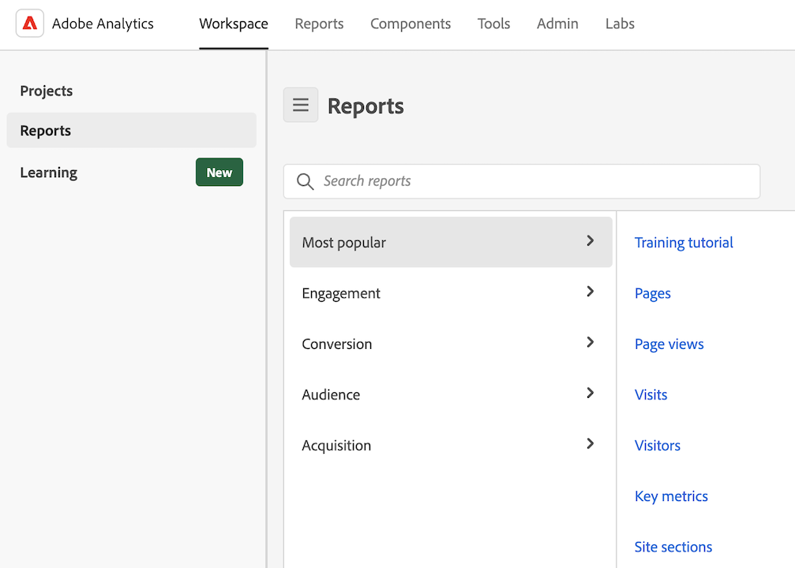

# Utilizzare i modelli

I modelli (o modelli aziendali) in Analysis Workspace forniscono informazioni rapide sugli scenari di reporting più comuni. Di seguito sono riportati alcuni esempi di domande a cui è possibile rispondere con i modelli:

* quante persone visitano il sito
* quanti di questi visitatori sono visitatori univoci (conteggiati una sola volta)
* come sono arrivati al sito (ad esempio, se hanno seguito un collegamento o ci sono arrivati direttamente)
* quali parole chiave hanno utilizzato i visitatori per cercare il contenuto del sito
* per quanto tempo i visitatori sono rimasti su una determinata pagina o sull’intero sito
* su quali collegamenti i visitatori hanno fatto clic e quando hanno lasciato il sito
* quali canali di marketing sono più efficaci nel generare ricavi o eventi di conversione
* quanto tempo hanno trascorso a guardare un video
* quali browser e dispositivi hanno utilizzato per visitare il sito

Le informazioni seguenti descrivono come accedere e utilizzare i modelli dalla scheda [!UICONTROL Templates] in Analysis Workspace.

## Accedere ed eseguire un modello

1. In Analysis Workspace, seleziona la scheda [!UICONTROL **Workspace**].

1. Seleziona [!UICONTROL **Modelli**].

   

1. Nel campo di ricerca, iniziare a digitare il nome del modello che si desidera trovare, quindi selezionarlo dall&#39;elenco dei modelli.

   Oppure

   Selezionare la categoria di modello che si desidera visualizzare, quindi selezionare il modello dall&#39;elenco dei modelli.

   >[!TIP]
   >
   >Per spostarti nel menu utilizzando i tasti freccia, premi il tasto Barra obliqua (/), quindi premi il tasto Freccia giù. Premi Invio per caricare il modello selezionato.

   Per un elenco dei modelli disponibili, vedere la sezione [Modelli disponibili](#available-templates) di seguito.

1. (Facoltativo) Visualizza e utilizza modelli che contengono componenti non disponibili nella visualizzazione dati. Per impostazione predefinita, gli unici modelli visualizzati sono quelli che utilizzano componenti disponibili nella visualizzazione dati.

   1. Seleziona (nome dell’opzione filtro?) per visualizzare i modelli che richiedono componenti aggiuntivi.

      <!-- add screenshot -->

   1. Seleziona il modello da utilizzare.

   1. Se il modello contiene componenti non disponibili nella visualizzazione dati, viene visualizzato un messaggio che indica quali componenti risultano mancanti. Fai clic su (pulsante?) per passare alla visualizzazione dati in cui è possibile crearli automaticamente. <!--how do you do this? Walk through the process -->

1. Seleziona il modello per creare un rapporto basato sul modello scelto.

## Personalizzare e salvare un modello {#use-reports}

Un modello potrebbe non soddisfare esattamente le tue esigenze, ma può avvicinarti. In questi casi, puoi utilizzare il modello come punto di partenza e personalizzarlo in base alle tue esigenze.

Se si esce da un modello dopo aver apportato modifiche, viene richiesto di salvare o eliminare le modifiche. Quando si salvano le modifiche apportate a un modello, questo viene salvato come nuovo progetto.

Per personalizzare e salvare un modello:

1. In Adobe Analytics, seleziona la scheda [!UICONTROL **Workspace**].

1. Selezionare la scheda [!UICONTROL **Modelli**].

1. Seleziona il modello da visualizzare. Ad esempio, in [!UICONTROL **Più popolari**], seleziona il rapporto [!UICONTROL **Pagine**].

   Il modello Pagine, visualizzato in Analysis Workspace, mostra due [visualizzazioni](/help/analysis-workspace/visualizations/freeform-analysis-visualizations.md) ([Grafico a barre](/help/analysis-workspace/visualizations/bar.md) e [Numero riepilogo](/help/analysis-workspace/visualizations/summary-number-change.md)) e una [Tabella a forma libera](/help/analysis-workspace/visualizations/freeform-table/freeform-table.md). La metrica utilizzata è Occorrenze.

   

1. Esegui una delle operazioni seguenti:

   * Visualizza il modello.
   * Puoi trascinare uno o più segmenti nella zona di rilascio Segmento, nella parte superiore. Ad esempio, trascina il segmento [!UICONTROL **Clienti mobile**] e visualizza i risultati.
   * Modifica l’intervallo di date andando sul calendario in alto a destra.
   * Aggiungi suddivisioni dimensionali, trascina altre metriche e in genere personalizza il modello in base alle tue esigenze.

1. (Facoltativo) Salva il modello come progetto selezionando [!UICONTROL **Progetto**] > [!UICONTROL **Salva**].

   Il modello viene salvato come nuovo progetto e non modifica il rapporto esistente. Per ulteriori informazioni sul salvataggio di un rapporto come progetto, consulta [Salvare i progetti](/help/analysis-workspace/build-workspace-project/save-projects.md).

## Modelli disponibili

Per accedere a tutti i modelli predefiniti disponibili:

1. In Adobe Analytics, seleziona la scheda [!UICONTROL **Workspace**], quindi la scheda [!UICONTROL **Modelli**].

   I modelli predefiniti sono organizzati per categoria.

   <!--add screenshot-->

1. Selezionare una categoria per visualizzare i modelli al suo interno.

   Le sezioni seguenti corrispondono alle categorie disponibili e forniscono informazioni su ciascun modello.

   * [[!UICONTROL ](#most-popular)

   * [[!UICONTROL ](#engagement)

   * [[!UICONTROL ](#web-conversion)

   * [[!UICONTROL ](#web-audience)

   * [[!UICONTROL ](#web-acquisition)

   * [[!UICONTROL ](#mobile-mobile-app)

   * [[!UICONTROL ](#mobile-mobile-device-information)

   * [[!UICONTROL ](#time-parting)

   * [[!UICONTROL ](#cross-channel)

   * [[!UICONTROL ](#other-channels)

   * [[!UICONTROL ](#ajo)

### Most popular (Più popolari) {#most-popular}

<!-- markdownlint-disable MD034 -->

>[!CONTEXTUALHELP]
>id="cja_template_desc_training_tutorial"
>title="Modello per le esercitazioni"
>abstract="Scopri la terminologia e i passaggi comuni di Analysis Workspace per creare la tua prima analisi."

<!-- markdownlint-enable MD034 -->

<!-- markdownlint-disable MD034 -->

>[!CONTEXTUALHELP]
>id="cja_template_desc_pages"
>title="Modello pagine"
>abstract="Identifica le pagine più popolari e meno popolari.  **Questo può aiutarti** a comprendere meglio il tuo pubblico e il tipo di informazioni a cui sono più interessati. **In base a ciò che hai appreso, potresti** fare qualsiasi cosa, ad esempio regolare i metadati della pagina per aumentare la visibilità sulle pagine visualizzate meno o passare del tempo a migliorare il contenuto delle pagine più visualizzate. Questo modello utilizza la dimensione Pagina e la metrica Visualizzazioni pagina."

<!-- markdownlint-enable MD034 -->

<!-- markdownlint-disable MD034 -->

>[!CONTEXTUALHELP]
>id="cja_template_desc_page_views"
>title="Modello Visualizzazioni pagina"
>abstract="Visualizzare il numero totale di visualizzazioni di pagina. I dati vengono visualizzati in un periodo di tempo e confrontati con i periodi precedenti.  **Questo può aiutarti** a comprendere meglio come il traffico sul tuo sito potrebbe aumentare o diminuire nel tempo. **In base a ciò che apprendi, potresti** eseguire una serie di operazioni, ad esempio valutare l&#39;efficacia di una campagna di marketing avviata di recente confrontando il traffico del sito prima e dopo l&#39;avvio della campagna. Oppure puoi confrontare il traffico delle vacanze su base annua. Questo modello utilizza la dimensione Giorno e la metrica Visualizzazioni pagina."

<!-- markdownlint-enable MD034 -->

<!-- markdownlint-disable MD034 -->

>[!CONTEXTUALHELP]
>id="cja_template_desc_web_visits"
>title="Modello Visite web"
>abstract="Visualizza il numero totale di visite. I dati vengono visualizzati in un periodo di tempo e confrontati con i periodi precedenti.  **Questo può aiutarti** a comprendere meglio come il traffico sul tuo sito potrebbe aumentare o diminuire nel tempo. **In base a ciò che apprendi, potresti** eseguire una serie di operazioni, ad esempio valutare l&#39;efficacia di una campagna di marketing avviata di recente confrontando il traffico del sito prima e dopo l&#39;avvio della campagna. Oppure puoi confrontare il traffico delle vacanze su base annua. Questo modello utilizza la dimensione Giorno e la metrica Visite."

<!-- markdownlint-enable MD034 -->

<!-- markdownlint-disable MD034 -->

>[!CONTEXTUALHELP]
>id="cja_template_desc_multi_channel_overview"
>title="Modello Panoramica multicanale"
>abstract=" "

<!-- markdownlint-enable MD034 -->

<!-- markdownlint-disable MD034 -->

>[!CONTEXTUALHELP]
>id="cja_template_desc_multi_channel_comparison"
>title="Modello di confronto multicanale"
>abstract=" "

<!-- markdownlint-enable MD034 -->

<!-- markdownlint-disable MD034 -->

>[!CONTEXTUALHELP]
>id="cja_template_desc_key_metrics"
>title="Modello metriche chiave"
>abstract="Visualizza un rapporto che mostra affiancate le metriche di visualizzazioni di pagina, visite e visitatori univoci. I dati vengono visualizzati in un periodo di tempo e confrontati con i periodi precedenti.  **Questo può aiutarti** a confrontare queste metriche importanti per ottenere un quadro più completo del numero di persone univoche che che visitano il sito, del numero di volte in cui sono state visitate le pagine e del numero di sessioni. **In base a ciò che hai appreso, potresti** eseguire un numero qualsiasi di operazioni, ad esempio valutare il numero medio di pagine visualizzate da ogni persona durante la visita al sito in una determinata settimana o mese e come è cambiato durante determinati periodi dell&#39;anno o prima e dopo l&#39;esecuzione di campagne di marketing.  Questo modello utilizza la dimensione Giorno, la metrica Visualizzazioni pagina, la metrica Visite e la metrica Visitatori univoci."

<!-- markdownlint-enable MD034 -->

Sono disponibili i seguenti modelli:

| Nome modello | Perché utilizzare questo modello <!-- What do you do with it? What can it help you learn? and What are the potential actions? --> |
| --- | --- | 
| [!UICONTROL **Esercitazione**] | Scopri la terminologia e i passaggi comuni di Analysis Workspace per creare la tua prima analisi |
| [!UICONTROL **Pagine**] | <!--duplicated in Engagement section--> Identifica le pagine più popolari e meno popolari. 
**Questo può aiutarti** a comprendere meglio il tuo pubblico e il tipo di informazioni a cui sono più interessati.

**In base a ciò che hai appreso, potresti** fare qualsiasi cosa, ad esempio regolare i metadati della pagina per aumentare la visibilità sulle pagine visualizzate meno o passare del tempo a migliorare il contenuto delle pagine più visualizzate.

Questo modello utilizza la dimensione Pagina e la metrica Visualizzazioni pagina.
 |
| [!UICONTROL **Visualizzazioni pagina**] | <!--duplicated in Engagement section--> Visualizzare il numero totale di visualizzazioni di pagina. I dati vengono visualizzati in un periodo di tempo e confrontati con i periodi precedenti. 
**Questo può aiutarti** a comprendere meglio come il traffico sul tuo sito potrebbe aumentare o diminuire nel tempo.

**In base a ciò che apprendi, potresti** eseguire una serie di operazioni, ad esempio valutare l&#39;efficacia di una campagna di marketing avviata di recente confrontando il traffico del sito prima e dopo l&#39;avvio della campagna. Oppure puoi confrontare il traffico delle vacanze su base annua.

Questo modello utilizza la dimensione Giorno e la metrica Visualizzazioni pagina.
 |
| [!UICONTROL **Visite Web**] | <!--duplicated in Engagement section--> Visualizza il numero totale di visite. I dati vengono visualizzati in un periodo di tempo e confrontati con i periodi precedenti. 
**Questo può aiutarti** a comprendere meglio come il traffico sul tuo sito potrebbe aumentare o diminuire nel tempo.

**In base a ciò che apprendi, potresti** eseguire una serie di operazioni, ad esempio valutare l&#39;efficacia di una campagna di marketing avviata di recente confrontando il traffico del sito prima e dopo l&#39;avvio della campagna. Oppure puoi confrontare il traffico delle vacanze su base annua.

Questo modello utilizza le dimensioni Giorno e Visite.
 |
| [!UICONTROL **Visitatori Web**] | <!--duplicated in Engagement section--> Visualizza il numero totale di visitatori univoci. I dati vengono visualizzati in un periodo di tempo e confrontati con i periodi precedenti. 
**Questo può aiutarti** a comprendere meglio come la portata e la dimensione del pubblico del tuo sito aumentino o diminuiscano nel tempo o rispetto a un periodo precedente.

**In base a ciò che hai appreso, potresti** fare un certo numero di cose, ad esempio valutare se una campagna di marketing lanciata di recente è riuscita ad attirare nuove persone sul sito confrontando visitatori univoci prima e dopo il lancio della campagna. Oppure puoi confrontare il numero di persone che visitano il sito durante le festività anno su anno.

Questo modello utilizza la dimensione Giorno e la metrica Visitatori univoci.
 |
| **[!UICONTROL Multi-Channel Overview]** |  |
| **[!UICONTROL Cross-Channel Comparison]** |  |
| [!UICONTROL **Metriche chiave**] | <!--duplicated in Engagement section--> Visualizza un rapporto che mostra affiancate le metriche di visualizzazioni di pagina, visite e visitatori univoci. I dati vengono visualizzati in un periodo di tempo e confrontati con i periodi precedenti. 
**Questo può aiutarti** a confrontare queste metriche importanti per ottenere un quadro più completo del numero di persone univoche che che visitano il sito, del numero di volte in cui sono state visitate le pagine e del numero di sessioni.

**In base a ciò che hai appreso, potresti** eseguire un numero qualsiasi di operazioni, ad esempio valutare il numero medio di pagine visualizzate da ogni persona durante la visita al sito in una determinata settimana o mese e come è cambiato durante determinati periodi dell&#39;anno o prima e dopo l&#39;esecuzione di campagne di marketing. 

Questo modello utilizza la dimensione Giorno, la metrica Visualizzazioni pagina, la metrica Visite e la metrica Visitatori univoci.
 |
| [!UICONTROL **Sezione sito**] | Visualizza le sezioni più popolari o con le prestazioni più elevate del sito. 
**Questo può aiutarti** a capire meglio quali sezioni del tuo sito sono più visitate.

**In base a ciò che hai appreso, potresti** fare un certo numero di cose, ad esempio valutare quali prodotti o servizi fornisci generano il maggior interesse.
 
Questo modello utilizza la dimensione Sezione sito e la metrica Visite.
 |
| [!UICONTROL **Pagina successiva e precedente**] | Visualizzare i luoghi più comuni in cui le persone vanno immediatamente dopo la visita o immediatamente prima di visitare un determinato luogo. 
**Questo ti aiuta** a capire come il traffico si sposta da una determinata pagina ad altre parti del sito e i percorsi seguiti dalle persone per arrivare a una determinata pagina.

**In base a ciò che hai appreso, potresti** eseguire una serie di operazioni, ad esempio valutare se la progettazione o il layout della pagina possa essere ottimizzato per indirizzare gli utenti a pagine più desiderate, ad esempio una pagina per effettuare un acquisto o lasciare una recensione. Oppure valuta se le informazioni sulla pagina corrente possano fornire la direzione o le azioni che le persone stanno cercando quando arrivano dalle pagine precedenti. Oppure puoi valutare se le pagine che non sono visualizzate come pagine precedenti richiedono collegamenti più prominenti alla pagina corrente.

Questo modello utilizza il pannello Elemento successivo o precedente.
 |
| [!UICONTROL **Campagne (codice di tracciamento)**] | Visualizza i collegamenti più efficaci per indirizzare il traffico verso il tuo sito. 
**Questo può aiutarti** a capire meglio quali codici di tracciamento (e i collegamenti a essi associati) sono stati più utilizzati per accedere al tuo sito.

**In base a ciò che hai appreso, potresti** fare un certo numero di cose, ad esempio modificare la tua strategia per la posizione in cui aggiungi collegamenti al tuo sito.

Questo modello utilizza la dimensione Codice di tracciamento e la metrica Visite.
 |
| [!UICONTROL **Prodotti**] | Visualizza il numero di ordini per prodotto. I dati vengono visualizzati in un arco di tempo. 
**Questo ti aiuta** a capire quali prodotti sono più richiesti o meno.

**In base a ciò che hai appreso, potresti** fare qualsiasi cosa, ad esempio modificare le tue strategie di marketing per promuovere prodotti dalle prestazioni elevate o per migliorare o interrompere prodotti dalle prestazioni insoddisfacenti. Puoi anche regolare l’inventario dei prodotti in base all’analisi dei dati.

Questo modello utilizza la dimensione Prodotto e la metrica Ordini.
 |
| [!UICONTROL **Canale marketing ultimo contatto**] | Visualizza i canali di marketing più recenti con cui i visitatori fanno riferimento durante il periodo di coinvolgimento (30 giorni per impostazione predefinita).
**Questo può aiutarti** a capire quali canali di marketing sono stati più efficaci nel portare le persone sul tuo sito e che hanno causato conversioni.

**In base a ciò che hai appreso, potresti** eseguire un numero qualsiasi di operazioni, ad esempio allocare più risorse ai canali con prestazioni elevate o allocare meno risorse ai canali con prestazioni insoddisfacenti.

Questo modello utilizza la dimensione Canale di ultimo contatto e la metrica Visitatori univoci.
 |
| [!UICONTROL **Dettaglio canale marketing ultimo contatto**] | Visualizza i dettagli sui canali di marketing più recenti con cui i visitatori corrispondono durante il periodo di coinvolgimento (30 giorni per impostazione predefinita).
**Questo può aiutarti** a capire non solo quali canali di marketing sono stati più efficaci nel portare le persone sul tuo sito che hanno generato conversioni, ma anche i dettagli su tali canali di marketing. Ad esempio, se un visitatore è arrivato sul tuo sito e corrisponde al canale di marketing &quot;Ricerca a pagamento&quot;, puoi utilizzare i dettagli del canale per vedere quale motore di ricerca è stato utilizzato o quale parola chiave ha cercato.

**In base a ciò che hai appreso, potresti** eseguire un numero qualsiasi di operazioni, ad esempio allocare più risorse ai canali con prestazioni elevate o allocare meno risorse ai canali con prestazioni insoddisfacenti.

Questo modello utilizza la dimensione Dettaglio canale di ultimo contatto e la metrica Visitatori univoci.
 |
| [!UICONTROL **Ricavi**] | Visualizza l&#39;importo monetario dei prodotti acquistati in tutti gli ordini. I dati vengono visualizzati in un periodo di tempo e confrontati con i periodi precedenti.
**Questo può aiutarti** a capire come i ricavi aumentano o diminuiscono nel tempo. Puoi combinare questa metrica con qualsiasi dimensione per scoprire quali elementi dimensionali hanno contribuito ai ricavi.

**In base a ciò che hai appreso, potresti** fare un certo numero di cose, ad esempio proiettare i ricavi futuri in base alle tendenze precedenti. Puoi anche aggiungere un’altra dimensione, come la dimensione Codice di tracciamento, per scoprire quali campagne generano più ricavi.

Questo modello utilizza la dimensione Giorno e la metrica Ricavi.
 |
| [!UICONTROL **Ordini**] | Visualizza il numero totale di eventi di acquisto. I dati vengono visualizzati in un periodo di tempo e confrontati con i periodi precedenti. 
**Questo ti aiuta** a comprendere meglio come aumenta o diminuisce nel tempo l&#39;interesse per i tuoi prodotti e servizi. Puoi applicare un segmento per scoprire quali clienti o aree geografiche stanno effettuando il maggior numero di ordini e come questi ultimi tendono nel tempo.

**In base a quanto appreso, è possibile** eseguire una serie di operazioni, ad esempio valutare l&#39;efficacia di una campagna di marketing avviata di recente confrontando gli ordini prima e dopo il lancio della campagna. Oppure puoi confrontare gli ordini relativi alle festività su base annua.

Questo modello utilizza la dimensione Giorno e la metrica Ordini.
 |

### Web: coinvolgimento

Sono disponibili i seguenti modelli:

| Nome modello | Perché utilizzare questo modello <!-- What do you do with it? What can it help you learn? and What are the potential actions? --> |
| --- | --- | 
| [!UICONTROL **Metriche chiave**] | <!--duplicated in Most popular section--> Visualizza un rapporto che mostra affiancate le metriche di visualizzazioni di pagina, visite e visitatori univoci. I dati vengono visualizzati in un periodo di tempo e confrontati con i periodi precedenti. 
**Questo può aiutarti** a confrontare queste metriche importanti per ottenere un quadro più completo del numero di persone univoche che che visitano il sito, del numero di volte in cui sono state visitate le pagine e del numero di sessioni.

**In base a ciò che hai appreso, potresti** eseguire un numero qualsiasi di operazioni, ad esempio valutare il numero medio di pagine visualizzate da ogni persona durante la visita al sito in una determinata settimana o mese e come è cambiato durante determinati periodi dell&#39;anno o prima e dopo l&#39;esecuzione di campagne di marketing. 

Questo modello utilizza la dimensione Giorno, la metrica Visualizzazioni pagina, la metrica Visite e la metrica Visitatori univoci.
 |
| [!UICONTROL **Visualizzazioni pagina**] | <!--duplicated in Most popular section-->Visualizzare il numero totale di visualizzazioni di pagina. I dati vengono visualizzati in un periodo di tempo e confrontati con i periodi precedenti. 
**Questo può aiutarti** a comprendere meglio come il traffico sul tuo sito potrebbe aumentare o diminuire nel tempo.

**In base a ciò che apprendi, potresti** eseguire una serie di operazioni, ad esempio valutare l&#39;efficacia di una campagna di marketing avviata di recente confrontando il traffico del sito prima e dopo l&#39;avvio della campagna. Oppure puoi confrontare il traffico delle vacanze su base annua.

Questo modello utilizza la dimensione Giorno e la metrica Visualizzazioni pagina.
 |
| [!UICONTROL **Pagine**] | <!--duplicated in Most popular section-->Identifica le pagine più popolari e meno popolari. 
**Questo può aiutarti** a comprendere meglio il tuo pubblico e il tipo di informazioni a cui sono più interessati.

**In base a ciò che hai appreso, potresti** fare qualsiasi cosa, ad esempio regolare i metadati della pagina per aumentare la visibilità sulle pagine visualizzate meno o passare del tempo a migliorare il contenuto delle pagine più visualizzate.

Questo modello utilizza la dimensione Pagina e la metrica Visualizzazioni pagina.
 |
| [!UICONTROL **Visite**] | <!--duplicated in Most popular section-->Visualizza il numero totale di visite. I dati vengono visualizzati in un periodo di tempo e confrontati con i periodi precedenti. 
**Questo può aiutarti** a comprendere meglio come il traffico sul tuo sito potrebbe aumentare o diminuire nel tempo.

**In base a ciò che apprendi, potresti** eseguire una serie di operazioni, ad esempio valutare l&#39;efficacia di una campagna di marketing avviata di recente confrontando il traffico del sito prima e dopo l&#39;avvio della campagna. Oppure puoi confrontare il traffico delle vacanze su base annua.

Questo modello utilizza le dimensioni Giorno e Visite.
 |
| [!UICONTROL **Visitatori**] | <!--duplicated in Most popular section-->Visualizza il numero totale di visitatori univoci. I dati vengono visualizzati in un periodo di tempo e confrontati con i periodi precedenti. 
**Questo può aiutarti** a comprendere meglio come la portata e la dimensione del pubblico del tuo sito aumentino o diminuiscano nel tempo o rispetto a un periodo precedente.

**In base a ciò che hai appreso, potresti** fare un certo numero di cose, ad esempio valutare se una campagna di marketing lanciata di recente è riuscita ad attirare nuove persone sul sito confrontando visitatori univoci prima e dopo il lancio della campagna. Oppure puoi confrontare il numero di persone che visitano il sito durante le festività anno su anno.

Questo modello utilizza la dimensione Giorno e la metrica Visitatori univoci.
 |
| [!UICONTROL **Tempo trascorso**] | Visualizza il tempo medio che i visitatori trascorrono sul sito durante ogni visita, nonché il tempo medio che gli utenti trascorrono prima di un evento di successo. I dati vengono visualizzati in un periodo di tempo e confrontati con i periodi precedenti. 
**Questo può aiutarti** a comprendere meglio i livelli di coinvolgimento dei visitatori e il tempo necessario ai visitatori per eseguire un&#39;azione desiderata, ad esempio per effettuare un acquisto.

**In base a ciò che hai appreso, potresti** fare qualsiasi cosa, ad esempio valutare se le modifiche al tuo sito migliorano la capacità dei visitatori di raggiungere rapidamente un evento di successo.

Questo modello utilizza la dimensione Giorno e la metrica Tempo trascorso per visita (secondi), la dimensione Giorno e la metrica Tempo trascorso per visita (secondi).
 |
| [!UICONTROL **Sezioni del sito**] | <!--duplicated in Most popular section-->Visualizza le sezioni più popolari o con le prestazioni più elevate del sito. 
**Questo può aiutarti** a capire meglio quali sezioni del tuo sito sono più visitate.

**In base a ciò che hai appreso, potresti** fare un certo numero di cose, ad esempio valutare quali prodotti o servizi fornisci generano il maggior interesse.
 
Questo modello utilizza la dimensione Sezione sito e la metrica Visite.
 |
| [!UICONTROL **Consumo di contenuti Web**] | Visualizzare i contenuti web più utilizzati e coinvolge maggiormente gli utenti.
**Questo può aiutarti** a capire meglio dove vanno le persone al primo accesso al sito, quali sezioni del sito sono più visitate e quali pagine hanno più probabilità di allontanare le persone dal sito.

**In base a quanto appreso, è possibile** eseguire un&#39;operazione qualsiasi, ad esempio valutare quali percorsi sul sito indirizzano le persone alle pagine più importanti e quali pagine hanno più probabilità di allontanarle dal sito <!-- not sure about these takeaways... -->.
 
Questo modello utilizza la dimensione Pagina e la metrica Visualizzazioni pagina, la metrica Visite, la metrica Visitatori univoci, la metrica Tasso di ingresso, la metrica Tasso di rimbalzo, la metrica Tasso di uscita e la metrica Velocità contenuto. Vengono inoltre utilizzate le visualizzazioni Flusso per le sezioni di entrata, uscita e superiori.
 |
| [!UICONTROL **Consumo di contenuti multimediali**] | Visualizzare i contenuti multimediali più utilizzati e coinvolge maggiormente gli utenti.
**Questo può aiutarti** a capire meglio dove vanno le persone al primo accesso al sito, quali sezioni del sito sono più visitate e quali pagine hanno più probabilità di allontanare le persone dal sito.

**In base a quanto appreso, è possibile** eseguire un&#39;operazione qualsiasi, ad esempio valutare quali percorsi sul sito indirizzano le persone alle pagine più importanti e quali pagine hanno più probabilità di allontanarle dal sito <!-- not sure about these takeaways... -->.
 
Questo modello utilizza la dimensione Pagina e la metrica Visualizzazioni pagina, la metrica Visite, la metrica Visitatori univoci, la metrica Tasso di ingresso, la metrica Tasso di rimbalzo, la metrica Tasso di uscita e la metrica Velocità contenuto. Inoltre, utilizza le visualizzazioni Flusso per le sezioni di entrata, uscita e principali; una visualizzazione grafico a dispersione che mostra le visualizzazioni di pagina per le pagine più comuni; una visualizzazione a barre che mostra le visualizzazioni di pagina per periodo fisso; e una visualizzazione a linee che mostra una visualizzazione con tendenze del tempo medio trascorso sul sito.
 |
| [!UICONTROL **Pagina successiva e precedente**] | Visualizza i luoghi più comuni in cui le persone vanno prima o dopo aver visitato un determinato luogo.
**Questo può aiutarti** a capire meglio dove vanno le persone al primo accesso al sito, quali sezioni del sito sono più visitate e quali sono le pagine più probabili da visitare prima di lasciare il sito.

**In base a quanto appreso, è possibile** eseguire un&#39;operazione qualsiasi, ad esempio valutare quali percorsi sul sito indirizzano le persone alle pagine più importanti e quali pagine allontanano più probabilmente le persone dal sito<!-- not sure about these takeaways... -->.
 
Questo modello utilizza la dimensione Pagina, la metrica Visualizzazioni pagina, la metrica Visite, la metrica Visitatori univoci, la metrica Tasso di ingresso, la metrica Tasso di rimbalzo, la metrica Tasso di uscita e la metrica Velocità contenuto. Inoltre, utilizza le visualizzazioni Flusso per le sezioni di entrata, uscita e principali; una visualizzazione Grafico a dispersione che mostra le visualizzazioni di pagina per le pagine più comuni; una visualizzazione a barre che mostra le visualizzazioni di pagina per periodo fisso; e una visualizzazione a linee che mostra una visualizzazione con tendenze del tempo medio trascorso sul sito.
 |
| **Riepilogo pagina** | Visualizza informazioni chiave su qualsiasi pagina delle tue proprietà. Mostra le visualizzazioni di pagina, una linea di tendenza, una visualizzazione di flusso e altro ancora.  
**Questo ti aiuta** a capire meglio come le persone interagiscono con una determinata pagina.

**In base a ciò che hai appreso, potresti** fare un certo numero di cose, come analizzare le prestazioni della pagina in un periodo di tempo o capire meglio cosa guida il traffico verso la pagina.

Questo modello utilizza la metrica Visualizzazioni pagina. Utilizza anche la visualizzazione Linee e la visualizzazione Flusso.
 |
| **Pagine di ingresso** | Visualizza le pagine principali a cui gli utenti accedono quando visitano il tuo sito per la prima volta. 
**Questo ti aiuta** a capire meglio quali pagine generano maggior traffico verso il tuo sito o le prime impressioni dei visitatori sul tuo sito.

**In base a ciò che hai appreso, potresti** fare qualsiasi cosa, come ottimizzare l&#39;esperienza iniziale che le persone trovano sul sito o assicurarti che le pagine che le persone vedono per la prima volta quando accedono al tuo sito siano accoglienti e forniscano i collegamenti necessari ad altre aree del sito.

Questo modello utilizza la metrica Sessioni. Utilizza anche la visualizzazione a barre e la visualizzazione a forma libera della tabella.
 |
| **Esci da pagine** | Visualizza le pagine principali a cui gli utenti accedono immediatamente prima di lasciare il sito.
**Questo ti aiuta** a capire meglio quali pagine allontanano le persone dal sito. 

**In base a ciò che hai appreso, potresti** fare qualsiasi cosa, ad esempio aggiornare le pagine di uscita comuni per ottimizzare l&#39;esperienza che le persone ottengono prima di partire, oppure includere contenuti o collegamenti per incoraggiare le persone a rimanere sul tuo sito.

Questo modello utilizza la metrica Sessioni. Utilizza anche la visualizzazione a barre e la visualizzazione a forma libera della tabella.
 |

### Web: Conversione

Sono disponibili i seguenti modelli:

| Nome modello | Perché utilizzare questo modello <!-- What do you do with it? What can it help you learn? and What are the potential actions? --> |
| --- | --- | 
| [!UICONTROL **Funnel di conversione prodotto**] | 
**Questo ti può aiutare** a comprendere meglio

**In base a ciò che hai appreso, potresti** fare un certo numero di cose, come 

Questo modello utilizza |
| **Prodotti** | Scopri quali prodotti sono più determinanti per le metriche chiave, ad esempio i più venduti o i più visualizzati. 
**Questo ti aiuta** a capire meglio quali prodotti hanno più successo.

**In base a ciò che apprendi, potresti** fare un certo numero di cose, come aumentare i finanziamenti per i prodotti di successo e diminuire i finanziamenti per i prodotti di minor successo.

Questo modello utilizza la metrica Ordini e la dimensione Prodotto. |
| **Prestazioni prodotto** | Visualizzare i prodotti con le prestazioni più elevate.
**Questo ti aiuta** a capire meglio quali prodotti hanno più successo.

**In base a ciò che apprendi, potresti** fare un certo numero di cose, come aumentare i finanziamenti per i prodotti di successo e diminuire i finanziamenti per i prodotti di minor successo.

Questo modello utilizza le metriche Visualizzazioni prodotto, Aggiunte carrello, Ordini, Ricavi e Unità. Utilizza anche la dimensione Prodotto. |
| **Funnel di conversione carrello** | Visualizzare il numero di volte in cui le persone hanno eseguito eventi di pagamento chiave, ad esempio l&#39;aggiunta di articoli al carrello, la visualizzazione del carrello, la rimozione di articoli dal carrello e l&#39;estrazione. 
**Questo può aiutarti** a capire meglio quali parti del funnel del processo di pagamento che portano alla conversione e quali sono più soggette all&#39;abbandono del carrello.

**In base a ciò che hai appreso, potresti** fare un certo numero di cose, ad esempio ridurre l&#39;attrito in determinati passaggi del processo di pagamento.

Questo modello utilizza |
| **Carrelli** | Visualizza il numero di persone che hanno aggiunto un prodotto al carrello.
**Questo può aiutarti** a comprendere meglio il numero di persone che aggiungono un prodotto al carrello, rispetto al numero complessivo di prodotti che vengono aggiunti a un carrello.

**In base a ciò che hai appreso, potresti** eseguire una serie di operazioni, ad esempio misurare l&#39;efficacia delle pagine dei tuoi prodotti.

Questo modello utilizza la metrica Carrelli. |
| **Visualizzazioni carrello** | Visualizza il numero di volte in cui le persone hanno visualizzato il carrello. 
**Questo può aiutarti** a comprendere meglio l&#39;esperienza di pagamento nel tentativo di ridurre i tassi di abbandono del carrello o di analizzare il tempo tra le aggiunte al carrello e le estrazioni tra i diversi prodotti.

**In base a ciò che apprendi, potresti** fare un certo numero di cose, come offrire promozioni per prodotti che rimangono nei carrelli più a lungo e sono a maggior rischio di abbandono.

Questo modello utilizza la metrica Visualizzazioni carrello. |
| **Aggiunte carrello** | Visualizza il numero di volte in cui le persone hanno aggiunto qualcosa al carrello. 
**Questo può aiutarti** a comprendere meglio la parte del funnel di conversione in cui l&#39;interesse del cliente per un prodotto è sufficientemente elevato da consentirne l&#39;aggiunta al carrello.

**In base a ciò che hai appreso, potresti** fare qualsiasi cosa, ad esempio migliorare i consigli di prodotto per tutti i clienti. Questo può essere fatto analizzando quali prodotti vengono spesso aggiunti agli stessi carrelli e suggerendo prodotti correlati in base agli articoli già nel carrello. |
| **Rimozioni carrello** | Visualizza il numero di volte in cui le persone hanno rimosso qualcosa dal carrello.
**Questo può aiutarti** a comprendere meglio la parte del funnel di conversione in cui i clienti non sono più interessati a un prodotto, oppure può aiutarti a capire dove possono esistere problemi nel processo di pagamento.

**In base a ciò che hai appreso, potresti** eseguire una serie di operazioni, ad esempio rimuovere eventuali barriere che potrebbero esistere nel processo di pagamento, ad esempio un&#39;esperienza utente complicata.

Questo modello utilizza la metrica Rimozioni carrello. |
| **Funnel di conversione acquisti** | 
**Questo ti può aiutare** a comprendere meglio

**In base a ciò che hai appreso, potresti** fare un certo numero di cose, come 

Questo modello utilizza |
| **Ricavi** | Visualizza l&#39;importo monetario dei prodotti acquistati in tutti gli ordini.
**Questo può aiutarti** a capire meglio quali elementi dimensionali hanno contribuito ai ricavi, combinando la metrica Ricavi con qualsiasi dimensione. Ad esempio, puoi vedere le campagne principali (utilizzando la dimensione Codice di tracciamento) che hanno contribuito ai ricavi. 

**In base a ciò che hai appreso, potresti** fare un certo numero di cose, ad esempio regolare le campagne che non soddisfano gli obiettivi di ricavo previsti.

Questo modello utilizza la metrica Ricavi. |
| **Ordini** | Visualizza il numero totale di eventi di acquisto effettuati sul sito. 
**Questo può aiutarti** a capire meglio quali elementi dimensionali hanno contribuito a un ordine, combinando la metrica Ordini con qualsiasi dimensione. Ad esempio, puoi vedere le campagne principali (utilizzando la dimensione Codice di tracciamento) che hanno contribuito agli acquisti.

**In base a ciò che hai appreso, potresti** fare qualsiasi cosa, ad esempio regolare le campagne che non soddisfano i target di acquisto previsti. 

Questo modello utilizza la metrica Ordini. |

### Web: audience

Sono disponibili i seguenti modelli:

| Nome modello | Perché utilizzare questo modello <!-- What do you do with it? What can it help you learn? and What are the potential actions? --> |
| --- | --- | 
| [!UICONTROL **Utenti nuovi e ripetuti**] | Visualizza un confronto tra i visitatori nuovi e quelli ripetuti. 
**Questo può aiutarti** a comprendere meglio l&#39;efficacia del tuo sito nel mantenere la fedeltà dei clienti o la velocità con cui acquisisci nuovi clienti.

**In base a ciò che hai appreso, potresti** fare qualsiasi cosa, ad esempio offrire incentivi per acquisti futuri ai nuovi visitatori per indurli a tornare.

Questo modello utilizza |
| **ID persona/Spazio dei nomi** | 
**Questo ti può aiutare** a comprendere meglio

**In base a ciò che hai appreso, potresti** fare un certo numero di cose, come 

Questo modello utilizza |
| **Panoramica sulla posizione** | Visualizza una panoramica della posizione del visitatore in una visualizzazione mappa.
**Questo può aiutarti** a capire meglio dove si trovano i visitatori che stanno visitando il tuo sito. 

**In base a ciò che apprendi, potresti** fare un certo numero di cose, come concentrare le risorse di marketing nelle posizioni in cui visualizzi più interesse e opportunità.

Questo modello utilizza |
| **Paesi geografici** | Visualizzare il paese da cui provengono le persone che visitano il sito.
**Questo può aiutarti** a capire meglio da cosa provengono i visitatori dei paesi più popolari che visitano il tuo sito.

**In base a ciò che apprendi, potresti** fare qualsiasi cosa, come utilizzare i dati per concentrarti sulle attività di marketing in questi paesi, o assicurarti che la tua esperienza sul sito sia ottimale in paesi che hanno diverse lingue primarie.

Questo modello utilizza la dimensione Paesi. |
| **Stati Geo USA** | Visualizza lo stato (negli Stati Uniti) da cui hanno avuto origine le persone che visitano il sito. È simile al modello Geo Regions, con la differenza che è specifico per gli Stati Uniti.
**Questo può aiutarti** a comprendere meglio gli stati americani più popolari da cui provengono i visitatori che visitano il tuo sito.

**In base a ciò che apprendi, potresti** fare un certo numero di cose, come utilizzare i dati per concentrarsi sulle attività di marketing in questi stati.

Questo modello utilizza la dimensione Stati Uniti. |
| **Aree geografiche** | Visualizzare l&#39;area geografica da cui hanno avuto origine le persone che visitano il sito. Una regione è un&#39;area geografica più piccola di un paese ma più grande di una città. In alcuni paesi, una regione è uno stato, una provincia o una prefettura. In altre aree, è un paese costituente, un dipartimento o una regione metropolitana. 
**Questo può aiutarti** a comprendere meglio le aree geografiche da cui provengono i visitatori più popolari che visitano il tuo sito.

**In base a ciò che apprendi, potresti** fare qualsiasi cosa, ad esempio utilizzare i dati per concentrarti sulle attività di marketing in queste aree geografiche, oppure assicurarti che l&#39;esperienza del tuo sito sia ottimale nelle aree geografiche che hanno diverse lingue primarie. 

Questo modello utilizza le dimensioni ID(variabili/geocountry) e Aree geografiche. |
| **Città geografiche** | Visualizza la città da cui provengono le persone che visitano il sito. 
**Questo può aiutarti** a comprendere meglio le città più popolari da cui provengono i visitatori che visitano il tuo sito.

**In base a ciò che apprendi, potresti** fare un certo numero di cose, ad esempio utilizzare i dati per concentrarti sulle attività di marketing in queste città. 

Questo modello utilizza |
| **Geo US DMA** | Visualizzare le aree di marketing designate (DMA) all’interno degli Stati Uniti da cui hanno avuto origine le persone che visitano il sito.
**Questo può aiutarti** a comprendere meglio le aree geografiche da cui provengono i visitatori più popolari che visitano il tuo sito.

**In base a ciò che apprendi, potresti** fare un certo numero di cose, ad esempio utilizzare i dati per concentrarti sulle attività di marketing nelle aree di maggior successo. 

Questo modello utilizza |
| **Lingue** | Visualizza le lingue principali in cui i visitatori preferiscono visualizzare il contenuto. 
**Questo può aiutarti** a comprendere meglio le lingue preferite più frequentemente dai visitatori.

**In base a ciò che apprendi, potresti** fare un certo numero di cose, come concentrare le attività di localizzazione o di marketing per le lingue più popolari.

Questo modello utilizza la dimensione Lingua. |
| **Panoramica tecnologia** | 
**Questo ti può aiutare** a comprendere meglio

**In base a ciò che hai appreso, potresti** fare un certo numero di cose, come 

Questo modello utilizza |
| **Browser** | Visualizza il nome e la versione dei principali browser utilizzati dagli utenti per accedere al tuo sito.
**Questo può aiutarti** a comprendere meglio i browser più comuni utilizzati dai visitatori.

**In base a ciò che hai appreso, potresti** fare qualsiasi cosa, ad esempio migliorare la qualità del sito testando nuove versioni del sito utilizzando i browser principali. In questo modo è possibile massimizzare gli sforzi di controllo della qualità.

Questo modello utilizza la dimensione Browser. |
| **Tipi di browser** | Visualizza i nomi delle organizzazioni che hanno creato i browser principali utilizzati dagli utenti per accedere al sito. Questo è diverso dal modello Browser in quanto non elenca diverse versioni dello stesso browser come elementi dimensionali separati.
**Questo può aiutarti** a comprendere meglio i browser più comuni utilizzati dai visitatori

**In base a ciò che hai appreso, potresti** fare qualsiasi cosa, ad esempio migliorare la qualità del sito testando nuove versioni del sito utilizzando i browser principali. In questo modo è possibile massimizzare gli sforzi di controllo della qualità. 

Questo modello utilizza la dimensione Tipo di browser. |

### Web: Acquisizione

Sono disponibili i seguenti modelli:

| Nome modello | Perché utilizzare questo modello <!-- What do you do with it? What can it help you learn? and What are the potential actions? --> |
| --- | --- | 
| [!UICONTROL **Canali marketing**] > [!UICONTROL **Rapporto panoramica canale marketing**] | Quando si utilizza l’attribuzione personalizzata, questo modello mostra il modo in cui i visitatori arrivano sul sito.
**Questo ti aiuta** a capire meglio quali dei tuoi canali di marketing sono più efficaci.

**In base a ciò che apprendi, potresti** fare un certo numero di cose, ad esempio investire di più in canali di marketing efficaci e disinvestire da canali di marketing meno influenti.

Questo modello utilizza la dimensione ID(variables/marketingchannel) e la metrica Ricavi. |
| [!UICONTROL **Canali marketing**] > [!UICONTROL **Canale marketing primo contatto**] | Visualizza il primo canale di marketing con cui un visitatore trova una corrispondenza durante il periodo di coinvolgimento del visitatore (30 giorni per impostazione predefinita). 
**Questo ti aiuta** a capire meglio quali canali di marketing indirizzano il traffico iniziale verso il tuo sito.

**In base a ciò che apprendi, potresti** fare qualsiasi cosa, ad esempio concentrare le attività di marketing nelle aree più efficaci.

Questo modello utilizza la dimensione Canale di primo contatto. |
| [!UICONTROL **Canali Marketing**] > [!UICONTROL **Dettagli Canale Marketing Di Primo Contatto**] | Visualizza i dettagli sul primo canale di marketing con cui un visitatore corrisponde durante il periodo di coinvolgimento del visitatore (30 giorni per impostazione predefinita).
**Questo ti può aiutare** a capire meglio cosa ha contribuito all&#39;hit che corrisponde a un canale di marketing. Ad esempio, se un visitatore è arrivato sul tuo sito e corrisponde al canale di marketing &quot;Ricerca a pagamento&quot;, puoi utilizzare i dettagli del canale per vedere quale motore di ricerca è stato utilizzato o quale parola chiave ha cercato.

**In base a ciò che apprendi, potresti** fare qualsiasi cosa, ad esempio concentrare le attività di marketing nelle aree più efficaci.

Questo modello utilizza la dimensione Dettaglio canale di primo contatto, |
| [!UICONTROL **Canali marketing**] > [!UICONTROL **Canale marketing ultimo contatto**] | Visualizza il canale di marketing con cui un visitatore trova corrispondenza più recente durante il periodo di coinvolgimento del visitatore (30 giorni per impostazione predefinita).
**Questo ti può aiutare** a capire meglio quali canali di marketing indirizzano il traffico verso il tuo sito che dà luogo a conversioni.

**In base a ciò che apprendi, potresti** fare qualsiasi cosa, ad esempio concentrare le attività di marketing nelle aree più efficaci.

Questo modello utilizza la dimensione Canale di ultimo contatto. |
| [!UICONTROL **Canali Marketing**] > [!UICONTROL **Dettagli Canale Marketing Ultimo Contatto**] | Visualizza dettagli sul canale di marketing più recente con cui un visitatore corrisponde durante il periodo di coinvolgimento del visitatore (30 giorni per impostazione predefinita)
**Questo ti può aiutare** a capire meglio cosa ha contribuito all&#39;hit che corrisponde a un canale di marketing. Ad esempio, se un visitatore è arrivato sul tuo sito e corrisponde al canale di marketing &quot;Ricerca a pagamento&quot;, puoi utilizzare i dettagli del canale per vedere quale motore di ricerca è stato utilizzato o quale parola chiave ha cercato.

**In base a ciò che apprendi, potresti** fare qualsiasi cosa, ad esempio concentrare le attività di marketing nelle aree più efficaci. 

Questo modello utilizza la dimensione Dettaglio canale di ultimo contatto. |
| [!UICONTROL **Campagne**] > [!UICONTROL **Campagne (codice di tracciamento)**] | Visualizza i nomi dei codici di tracciamento sul tuo sito. Puoi inserire collegamenti con valori di parametri di stringhe di query diversi in posizioni diverse su Internet.
**Questo ti aiuta** a capire meglio quali collegamenti sono stati più efficaci nel traffico verso il tuo sito. L’aggiunta di stringhe di query del codice di tracciamento è comune nelle e-mail, negli annunci pubblicitari, nei post sui social media e in altre attività di marketing utilizzate dalla tua organizzazione

**In base a ciò che apprendi, potresti** fare un certo numero di cose, ad esempio concentrare le attività di marketing sulle campagne che generano maggior fatturato.

Questo modello utilizza la dimensione Codice di tracciamento. |
| [!UICONTROL **Campagne**] > [!UICONTROL **Funnel di conversione campagna**] | 
**Questo ti può aiutare** a comprendere meglio

**In base a ciò che hai appreso, potresti** fare un certo numero di cose, come 

Questo modello utilizza |
| [!UICONTROL **Campagne**] > [!UICONTROL **Prestazioni campagna**] | Visualizza i dettagli sulle prestazioni delle campagne di marketing.
**Questo ti aiuta** a comprendere meglio i vari indicatori di successo associati alle campagne, come ricavi, visualizzazioni prodotti, ordini e così via.

**In base a ciò che apprendi, potresti** fare un certo numero di cose, ad esempio concentrare le attività di marketing sulle campagne che generano maggior fatturato. 

Questo modello utilizza la metrica Ricavi, la metrica Visualizzazioni prodotto, la metrica Aggiunte carrello, la metrica Ordini e la metrica Unità. Vengono inoltre utilizzate le dimensioni Codice di tracciamento e Dominio di riferimento. |
| **Acquisizione Web** | Visualizza come il tuo sito web ottiene i visitatori.
**Questo può aiutarti** a comprendere meglio i vari fattori che portano all&#39;acquisizione, come le parole chiave di ricerca, il dominio di riferimento e così via.

**In base a ciò che hai appreso, potresti** fare un certo numero di cose, come 

Questo modello utilizza le metriche Percentuale non recapitate e Percentuale non recapitate. Vengono inoltre utilizzate le dimensioni Motore di ricerca, Parola chiave di ricerca, Pagina di ingresso, Dominio di riferimento, Codice di tracciamento e Referrer. |
| **Parole chiave di ricerca - Tutto** | Visualizza le parole chiave di ricerca utilizzate dai visitatori per raggiungere il sito, indipendentemente dal fatto che sia a pagamento o naturale. 
**Questo può aiutarti** a comprendere meglio le parole chiave che gli utenti usano nelle ricerche che generano traffico sul sito. 

**In base a ciò che hai appreso, potresti** fare un certo numero di cose, come identificare e colmare i gap SEO tra le parole chiave utilizzate e quelle che stanno guidando il traffico del sito.

Questo modello utilizza la dimensione Parola chiave di ricerca. |
| **Parole chiave di ricerca - pagate** | Visualizza le parole chiave di ricerca utilizzate dai visitatori per raggiungere il sito e corrispondenti al rilevamento di ricerche a pagamento.
**Questo può aiutarti** a comprendere meglio le parole chiave che gli utenti usano nelle ricerche che generano traffico sul sito.

**In base a ciò che hai appreso, potresti** fare un certo numero di cose, come identificare e colmare i gap SEO tra le parole chiave utilizzate e quelle che stanno guidando il traffico del sito. 

Questo modello utilizza la dimensione Parola chiave di ricerca - A pagamento. |
| **Parole chiave di ricerca - Naturale** | Visualizza le parole chiave di ricerca utilizzate dai visitatori per raggiungere il tuo sito che non corrispondono al rilevamento di ricerche a pagamento.
**Questo può aiutarti** a comprendere meglio le parole chiave che gli utenti usano nelle ricerche che generano traffico sul sito.

**In base a ciò che hai appreso, potresti** fare un certo numero di cose, come identificare e colmare i gap SEO tra le parole chiave utilizzate e quelle che stanno guidando il traffico del sito.

Questo modello utilizza la dimensione Parola chiave di ricerca - Naturale. |
| **Motori di ricerca - Tutti** | Visualizza i motori di ricerca utilizzati dai visitatori per raggiungere il tuo sito, indipendentemente dal fatto che sia a pagamento o naturale. 
**Questo può aiutarti** a comprendere meglio i motori di ricerca utilizzati dagli utenti che generano traffico sul sito. 

**In base a ciò che hai appreso, potresti** fare qualsiasi cosa, come concentrare le tue attività SEO sui motori di ricerca che generano più traffico verso il sito.

Questo modello utilizza la dimensione Motore di ricerca. |
| **Motori di ricerca - Pagati** | Visualizza i motori di ricerca utilizzati dai visitatori per raggiungere il tuo sito, che corrispondono al rilevamento di ricerche a pagamento.
**Questo può aiutarti** a comprendere meglio i motori di ricerca utilizzati dagli utenti che generano traffico sul sito.

**In base a ciò che hai appreso, potresti** fare qualsiasi cosa, come concentrare le tue attività SEO sui motori di ricerca che generano più traffico verso il sito. 

Questo modello utilizza la dimensione Motore di ricerca - Pagato. |
| **Motori di ricerca - Naturale** | Visualizza le parole chiave di ricerca utilizzate dai visitatori per raggiungere il tuo sito che non corrispondono al rilevamento di ricerche a pagamento.
**Questo può aiutarti** a comprendere meglio i motori di ricerca utilizzati dagli utenti che generano traffico sul sito.

**In base a ciò che hai appreso, potresti** fare qualsiasi cosa, come concentrare le tue attività SEO sui motori di ricerca che generano più traffico verso il sito.

Questo modello utilizza la dimensione Motore di ricerca - Naturale. |
| **Domini di riferimento** | Visualizza i domini su cui gli utenti fanno clic per raggiungere il tuo sito.
**Questo ti aiuta** a capire meglio quali siti di terze parti indirizzano più traffico verso il tuo. Affinché l’elemento dimensione venga visualizzato, è necessario che nel sito esterno esista un collegamento e che un visitatore faccia clic su di esso.

**In base a ciò che apprendi, potresti** fare qualsiasi cosa, come creare o regolare il contenuto per allinearlo meglio agli interessi dei visitatori provenienti dai principali domini di riferimento. 

Questo modello utilizza la dimensione Dominio di riferimento. |
| **Domini di riferimento originali** | Visualizza il primo dominio di riferimento tramite il quale gli utenti hanno fatto clic per raggiungere il sito. Una volta impostato, contiene lo stesso valore per l’intera durata di vita dell’ID visitatore.
**Questo può aiutarti** a capire meglio quali siti di terze parti originariamente indirizzano il traffico verso il tuo sito.

**In base a ciò che apprendi, potresti** fare qualsiasi cosa, come creare o regolare il contenuto per allinearlo meglio agli interessi dei visitatori provenienti dai principali domini di riferimento originali. 

Questo modello utilizza la dimensione Dominio di riferimento originale. |
| **Riferimenti** | Puoi vedere su quali URL si trovavano i visitatori quando facevano clic per raggiungere il tuo sito. Affinché l’elemento della dimensione venga visualizzato, è necessario che sull’URL esterno esista un collegamento e che un visitatore faccia clic su di esso.  
**Questo può aiutarti** a capire meglio quali URL specifici indirizzano il maggior traffico verso il tuo sito.

**In base a ciò che apprendi, potresti** fare un certo numero di cose, come creare o modificare il contenuto per allinearlo meglio agli interessi dei visitatori provenienti dagli URL principali. 

Questo modello utilizza la dimensione Dominio di riferimento 

Questo modello utilizza la dimensione Referrer. |
| **Tipi di riferimento** | Visualizza i canali generici attraverso i quali i visitatori hanno fatto clic per arrivare al sito. Adobe mantiene le regole per ogni canale. I canali possibili includono motori di ricerca, social network, altri siti web, disco rigido o e-mail.
**Questo può aiutarti** a capire meglio quale tipo di referrer gestisce più traffico verso il tuo sito.

**In base a ciò che apprendi, potresti** fare un certo numero di cose, come creare o modificare il contenuto per allinearlo meglio agli interessi dei visitatori provenienti da un determinato canale.

Questo modello utilizza la dimensione Tipo referrer. |

### Mobile: app mobile

Sono disponibili i seguenti modelli:

| Nome modello | Perché utilizzare questo modello <!-- What do you do with it? What can it help you learn? and What are the potential actions? --> |
| --- | --- | 
| [!UICONTROL **App mobile Screens**] | Visualizza informazioni sugli schermi mobili utilizzati dagli utenti per accedere al sito, ad esempio dimensioni dello schermo, larghezza dello schermo e altezza dello schermo. 
**Questo può aiutarti** a comprendere meglio come le persone stanno vivendo il tuo sito.

**In base a ciò che hai appreso, potresti** eseguire una serie di operazioni, ad esempio ottimizzare il rendering del sito per ottenere le dimensioni di schermo più comuni.

Questo modello utilizza |
| **Azioni app mobile** | 
**Questo ti può aiutare** a comprendere meglio

**In base a ciò che hai appreso, potresti** fare un certo numero di cose, come 

Questo modello utilizza |
| **Utilizzo app mobile** | 
**Questo ti può aiutare** a comprendere meglio

**In base a ciò che hai appreso, potresti** fare un certo numero di cose, come 

Questo modello utilizza |
| **Percorsi di app mobili** | 
**Questo ti può aiutare** a comprendere meglio

**In base a ciò che hai appreso, potresti** fare un certo numero di cose, come 

Questo modello utilizza |
| **Metriche app mobile** | 
**Questo ti può aiutare** a comprendere meglio

**In base a ciò che hai appreso, potresti** fare un certo numero di cose, come 

Questo modello utilizza |
| **Messaggistica app mobile** | 
**Questo ti può aiutare** a comprendere meglio

**In base a ciò che hai appreso, potresti** fare un certo numero di cose, come 

Questo modello utilizza |
| **Prestazioni app mobile** | 
**Questo ti può aiutare** a comprendere meglio

**In base a ciò che hai appreso, potresti** fare un certo numero di cose, come 

Questo modello utilizza |
| **Conservazione app mobile** | 
**Questo ti può aiutare** a comprendere meglio

**In base a ciò che hai appreso, potresti** fare un certo numero di cose, come 

Questo modello utilizza |

### Mobile: informazioni dispositivo mobile

Sono disponibili i seguenti modelli:

| Nome modello | Perché utilizzare questo modello <!-- What do you do with it? What can it help you learn? and What are the potential actions? --> |
| --- | --- | 
| [!UICONTROL **Gestore di telefonia mobile**] | Visualizza i gestori di telefonia mobile utilizzati dagli utenti per accedere al tuo sito.
**Questo può aiutarti** a capire meglio quali operatori di telefonia mobile sono più popolari nella tua base di utenti.

**In base a ciò che hai appreso, potresti** fare qualsiasi cosa, ad esempio personalizzare la distribuzione dei contenuti in base alle funzionalità di rete di diversi gestori per garantire un&#39;esperienza utente fluida.

Questo modello utilizza la dimensione Operatore mobile. |
| **Dispositivi mobili** | Visualizza i dispositivi mobili utilizzati dagli utenti per accedere al tuo sito.
**Questo può aiutarti** a capire meglio quali dispositivi mobili sono più popolari nella tua base di utenti.

**In base a ciò che hai appreso, potresti** eseguire una serie di operazioni, ad esempio ottimizzare il rendering del sito per i dispositivi mobili più comuni.

Questo modello utilizza la dimensione Nome dispositivo mobile. |
| **Tipo di dispositivo mobile** | Visualizza i tipi di dispositivi mobili utilizzati dagli utenti per accedere al sito, ad esempio telefoni e tablet.
**Questo può aiutarti** a comprendere meglio i vari tipi di dispositivi mobili che vengono utilizzati per accedere al tuo sito.

**In base a ciò che hai appreso, potresti** fare qualsiasi cosa, come ottimizzare il tuo sito per i tipi di dispositivi mobili più utilizzati.

Questo modello utilizza la dimensione Tipo di dispositivo mobile. |
| **Produttore** | Visualizza quali produttori producono i dispositivi mobili utilizzati dagli utenti per accedere al tuo sito, ad esempio Apple e Samsung.
**Questo può aiutarti** a capire meglio quali produttori sono più popolari nella tua base di utenti.

**In base a ciò che hai appreso, potresti** fare qualsiasi cosa, ad esempio personalizzare la distribuzione dei contenuti in base alle capacità di diversi produttori per garantire un&#39;esperienza utente fluida.

Questo modello utilizza la dimensione Produttore di dispositivi mobili. |

### Suddivisione del tempo

Sono disponibili i seguenti modelli:

| Nome modello | Perché utilizzare questo modello <!-- What do you do with it? What can it help you learn? and What are the potential actions? --> |
| --- | --- | 
| [!UICONTROL **Minuto dell&#39;Ora**] | Visualizzare il minuto in cui si è verificata una particolare metrica (arrotondato per difetto). Il primo elemento dimensione è il primo minuto nell’intervallo di date e l’ultimo elemento dimensione è l’ultimo minuto nell’intervallo di date. 
**Questo ti può aiutare** a comprendere meglio

**In base a ciò che hai appreso, potresti** fare un certo numero di cose, come 

Questo modello utilizza |
| **Ora del giorno** | 
**Questo ti può aiutare** a comprendere meglio

**In base a ciò che hai appreso, potresti** fare un certo numero di cose, come 

Questo modello utilizza |
| **AM/PM** | 
**Questo ti può aiutare** a comprendere meglio

**In base a ciò che hai appreso, potresti** fare un certo numero di cose, come 

Questo modello utilizza |
| **Giorno della settimana** | 
**Questo ti può aiutare** a comprendere meglio

**In base a ciò che hai appreso, potresti** fare un certo numero di cose, come 

Questo modello utilizza |
| **Giorno del mese** | 
**Questo ti può aiutare** a comprendere meglio

**In base a ciò che hai appreso, potresti** fare un certo numero di cose, come 

Questo modello utilizza |
| **Giorno dell&#39;anno** | 
**Questo ti può aiutare** a comprendere meglio

**In base a ciò che hai appreso, potresti** fare un certo numero di cose, come 

Questo modello utilizza |
| **Giorno feriale/Fine settimana** | 
**Questo ti può aiutare** a comprendere meglio

**In base a ciò che hai appreso, potresti** fare un certo numero di cose, come 

Questo modello utilizza |
| **Settimana dell&#39;anno** | 
**Questo ti può aiutare** a comprendere meglio

**In base a ciò che hai appreso, potresti** fare un certo numero di cose, come 

Questo modello utilizza |
| **Mese dell&#39;anno** | 
**Questo ti può aiutare** a comprendere meglio

**In base a ciò che hai appreso, potresti** fare un certo numero di cose, come 

Questo modello utilizza |
| **Trimestre dell&#39;anno** | 
**Questo ti può aiutare** a comprendere meglio

**In base a ciò che hai appreso, potresti** fare un certo numero di cose, come 

Questo modello utilizza |

### Cross-Channel

Sono disponibili i seguenti modelli:

| Nome modello | Perché utilizzare questo modello <!-- What do you do with it? What can it help you learn? and What are the potential actions? --> |
| --- | --- | 
| [!UICONTROL **Panoramica multicanale**] | 
**Questo ti può aiutare** a comprendere meglio

**In base a ciò che hai appreso, potresti** fare un certo numero di cose, come 

Questo modello utilizza |
| **Confronto tra canali** | 
**Questo ti può aiutare** a comprendere meglio

**In base a ciò che hai appreso, potresti** fare un certo numero di cose, come 

Questo modello utilizza |
| **Deflessione del call center (Web+Call Center)** | Visualizzare come il traffico web influisce sul traffico del call center.
**Questo può aiutarti** a comprendere meglio come il contenuto self-service sul tuo sito web stia deviando il traffico verso il tuo call center.

**In base a ciò che hai appreso, potresti** fare qualsiasi cosa, ad esempio migliorare i contenuti self-service per ridurre il traffico verso il call center, o misurare il ROI dei contenuti self-service calcolando la quantità risparmiata attraverso meno chiamate di supporto.

Questo modello utilizza |
| **Web+App** | Visualizzare il traffico web e quello mobile insieme.
**Questo ti aiuta** a comprendere meglio la distribuzione del traffico web e mobile sul tuo sito.

**In base a ciò che hai appreso, potresti** fare un certo numero di cose, ad esempio dedicare più risorse all&#39;esperienza della tua app mobile quando raggiunge un certo livello di traffico.

Questo modello utilizza |
| **Online/Offline** | Visualizza il traffico online e offline insieme.
**Questo può aiutarti** a comprendere meglio la distribuzione del traffico online e offline sul tuo sito.

**In base a ciò che hai appreso, potresti** fare qualsiasi cosa, ad esempio dedicare più risorse alla tua esperienza online quando raggiunge un certo livello di traffico.

Questo modello utilizza |

### Altri canali

Sono disponibili i seguenti modelli:

| Nome modello | Perché utilizzare questo modello <!-- What do you do with it? What can it help you learn? and What are the potential actions? --> |
| --- | --- | 
| [!UICONTROL **Dashboard del call center**] | 
**Questo ti può aiutare** a comprendere meglio

**In base a ciò che hai appreso, potresti** fare un certo numero di cose, come 

Questo modello utilizza |
| **POS/Offline** | Visualizzare i dati POS (Point-of-Sale) e delle transazioni offline.
**Questo ti può aiutare** a comprendere meglio

**In base a ciò che hai appreso, potresti** fare un certo numero di cose, come 

Questo modello utilizza |
| **E-mail/AJO** | 
**Questo ti può aiutare** a comprendere meglio

**In base a ciò che hai appreso, potresti** fare un certo numero di cose, come 

Questo modello utilizza |
| **Sondaggio** | 
**Questo ti può aiutare** a comprendere meglio

**In base a ciò che hai appreso, potresti** fare un certo numero di cose, come 

Questo modello utilizza |

### AJO

Sono disponibili i seguenti modelli:

| Nome modello | Perché utilizzare questo modello <!-- What do you do with it? What can it help you learn? and What are the potential actions? --> |
| --- | --- | 
| [!UICONTROL **Campagne AJO**] | 
**Questo ti può aiutare** a comprendere meglio

**In base a ciò che hai appreso, potresti** fare un certo numero di cose, come 

Questo modello utilizza |
| **Percorsi AJO** | 
**Questo ti può aiutare** a comprendere meglio

**In base a ciò che hai appreso, potresti** fare un certo numero di cose, come 

Questo modello utilizza |
| **Pagine di destinazione di AJO** | 
**Questo ti può aiutare** a comprendere meglio

**In base a ciò che hai appreso, potresti** fare un certo numero di cose, come 

Questo modello utilizza |
| **Rapporto Panoramica di AJO** | 
**Questo ti può aiutare** a comprendere meglio

**In base a ciò che hai appreso, potresti** fare un certo numero di cose, come 

Questo modello utilizza |
| **Iscrizioni AJO** | 
**Questo ti può aiutare** a comprendere meglio

**In base a ciò che hai appreso, potresti** fare un certo numero di cose, come 

Questo modello utilizza |

<!-- deleted: 

| [!UICONTROL **Real-Time**] | View the dimensions and metrics that are currently being collected on your site. 
**This can help you** better understand what is trending on your site.

**Based on what you learn, you might** respond to and actively manage the performance of your current marketing content and campaigns.
 
This template uses the [Real-time report](/help/admin/admin/c-manage-report-suites/c-edit-report-suites/realtime/realtime.md).
 | 
| [!UICONTROL **Fallout**] | View where people leave or continue through a predefined sequence of pages.
**This can help you** better understand where people are falling out of the user journey.

**Based on what you learn, you might** do any number of things, like analyze conversion rates through specific processes on your site (such as a purchase or registration process), or analyze correlations between events on your site. (For example, what percentage of people who looked at your privacy policy went on to purchase a product.) You can also use this template to perform side-by-side comparisons of two different segments in the same report.
 
This template uses the [Fallout visualization](/help/analyze/analysis-workspace/visualizations/fallout/fallout-flow.md).
 | 
| [!UICONTROL **Cross-device analysis**] | View which devices people used across all points of the journey.
**This can help you** better understand how many people interact with your brand, the types of devices they use, and how their use of multiple devices affects their experience. For example, how often do people begin a task on a mobile device and then later move to a desktop to complete a task? What are the most common paths users take from one device to another? Where do they drop out? Where do they succeed? And so forth.

**Based on what you learn, you might** do any number of things, like optimize certain parts of the user journey for a mobile experience.
 
This template uses the [Flow visualization](/help/analyze/analysis-workspace/visualizations/c-flow/flow.md), [Fallout visualization](/help/analyze/analysis-workspace/visualizations/fallout/fallout-flow.md), [Cohort analysis](/help/analyze/analysis-workspace/visualizations/cohort-table/cohort-analysis.md), [the People metric](/help/components/metrics/people.md), and [the Unique devices metric](/help/components/metrics/unique-devices.md).
 |
| [!UICONTROL **Web retention**] | View who your loyal users are and what they are doing on your site.
**This can help you** better understand the number of times the average person visits your site, the frequency with which people return to the site, and the number of days between return visits.

**Based on what you learn, you might** do any number of things, like analyze what content is most effective at bringing people back to the site.
This template uses the [Visits metric](/help/components/metrics/visits.md) and the [Unique visitors metric](/help/components/metrics/unique-visitors.md).
 | 
| [!UICONTROL **Streaming Media Consumption**] | View  trends and top metrics of media consumption across all digital devices.
**This can help you** better understand the number of times the average person visits your site, the frequency with which people return to the site, and the number of days between return visits.

**Based on what you learn, you might** do any number of things, like analyze what content is most effective at bringing people back to the site.
This template uses the [Visits metric](/help/components/metrics/visits.md) and the [Unique visitors metric](/help/components/metrics/unique-visitors.md).
 | 

-->

<!--

Ignore below this 

| Menu item | Reports under this menu item |
| --- | --- | 
| **[!UICONTROL Most Popular]** | <ul><li>Training Tutorial (Pre-existing Workspace template)</li><li>Pages (What are my top pages?)</li><li>Page views (How many page views am I generating?)</li><li>Visits (How many visits am I getting?)</li><li>Visitors (How many visitors am I getting?)</li><li>Key metrics (How are my most important metrics performing?)</li><li>Site sections (Which sections of my site generated the most page views?)</li><li>Real-Time (What is trending on my site, and why?)</li><li>Next page (What are the next pages my visitors go to?)</li><li>Previous page (What are the previous pages my visitors went to?)</li><li>Campaigns (What campaigns are driving my key metrics?)</li><li>Products (What products are driving my key metrics?)</li><li>Last touch channel (Which last touch channel is performing best?</li><li>Last touch channel detail (Which specific last touch channel is outperforming others?)</li><li>Revenue (How is my revenue performing?)</li><li>Orders (How are my orders performing?)</li><li>Units (How many units am I selling?)</li></ul> | 
| **[!UICONTROL Engagement]** | <ul><li>Key metrics (How are my most important metrics performing?)</li><li>Page views (How many page views am I generating?)</li><li>Pages (What are my top pages?)</li><li>Visits (How many visits am I getting?)</li><li>Visitors (How many visitors am I getting?)</li><li>Time spent per visit (How much time do my users spend per visit?)</li><li>Time prior to event (How much time do my users spend prior to a success event?)</li><li>Site sections (Which sections of my site generated the most page views?</li><li>Web content consumption (Which content is consumed most and is engaging users?)</li><li>Media content consumption (Which content is consumed most and is engaging users?)</li><li>Next and previous page flow (What are/were the next/previous paths my visitors take/took?)</li><li>Fallout (Where am I seeing fallout through my digital properties?)</li><li>Cross-device analysis (Using cross-device analysis in Analysis Workspace)</li><li>Web retention (Who are my loyal users and what do they do?)</li><li>Media audio consumption (What are trends and top metrics of audio consumption?)</li><li>Media recency, frequency, loyalty (Who are my loyal readers?)</li><li>Page analysis > Reloads (Which pages generate the most reloads?)</li><li>Page analysis > Time spent on page (How much time do my users spend on my pages?)</li><li>Entries & exits > Entry pages (What are my top entry pages?)</li><li>Entries & exits > Original entry pages (What page did my visitor originally enter from?)</li><li>Entries & exits > Single-page visits (Which pages generated the most single-page visits?)</li><li>Entries & exits > Exit pages (What are my top exit pages?)</li><li>Page Analysis > Page summary</li></ul> |
| **[!UICONTROL Conversion]** | <ul><li>Products > Products (Which products are driving my key metrics?)</li><li>Products > Product performance (Which products are performing best?)</li><li>Products > Categories (What are my best performing product categories?</li><li>Shopping cart > Carts (How many users added a product to cart?</li><li>Shopping cart > Cart views (How many times did my visitors view their carts?)</li><li>Shopping cart > Cart additions (How often are users adding a product to their cart?)</li><li>Shopping cart > Cart removals (How often are users removing a product from their cart?)</li><li>Purchases > Revenue (How is my revenue performing?)</li><li>Purchases > Orders (How are my orders performing?)</li><li>Purchases > Units (How many units am I selling?)</li><li>[Magento: marketing and commerce](https://experienceleague.adobe.com/docs/analytics/analyze/analysis-workspace/build-workspace-project/starter-projects.html#commerce)</li></ul> |
| **[!UICONTROL Audience]** |<ul><li>People metric (How many people are interacting with my brand?)</li><li>Visitor profile > Location overview (Which locations are driving the most usage among users)</li><li>Visitor profile > Geosegmentation > Geo Counties, Geo US States, Geo Regions, Geo Cities, Geo US DMA (Which geographies are my users visiting from?)</li><li>Visitor profile > Languages (Which language do my users prefer?)</li><li>Visitor profile > Time zones (Which time zones are my users visiting from?)</li><li>Visitor profile > Domains (Which ISPs are my visitors using to access my site?)</li><li>Visitor profile > Top level domains (Which domains are driving traffic to my site?)</li><li>Visitor profile > Technology > Technology overview (What technologies are people using to access my site?)</li><li>Visitor profile > Technology > Browsers, Browser type, Browser width, Browser height (Which company's browser, browser version, and its width and height, are people using to access my site?)</li><li>Visitor profile > Technology > Operating system, Operating system types (Which OS and which version of it do my visitors use?)</li><li>Visitor profile > Technology > Mobile carrier (Which mobile carriers do my visitors use to access my site?)</li><li>Visitor retention > Return frequency (How much time passes between my user's current visit and previous visits?)</li><li>Visitor retention > Return visits (How many of my visits are returning users?)</li><li>Visitor retention > Visit number (Which visit number bucket drives most of my key metrics)</li><li>Visitor retention > Sales cycle > Customer loyalty (Which loyalty segment do my users belong to?)</li><li>Visitor retention > Sales cycle > Days before first purchase (How many days passed between my users' first visit and their first purchase?)</li><li>Visitor retention > Sales cycle > Days since last purchase (How many days have passed between my users' current visit and their last purchase? )</li><li>Visitor retention > Mobile > Devices and Device types (Which devices and device types are my visitors using?)</li><li>Visitor retention > Mobile > Manufacturer (Which mobile device manufacturer do my visitors use?)</li><li>Visitor retention > Mobile > Screen size, Screen height, Screen width (Which mobile screen size/height/width do my visitors have?)</li><li>Visitor retention > Mobile > [Mobile app usage](https://experienceleague.adobe.com/docs/analytics/analyze/analysis-workspace/build-workspace-project/starter-projects.html#mobile)</li><li>Visitor retention > Mobile > [Mobile app journeys](https://experienceleague.adobe.com/docs/analytics/analyze/analysis-workspace/build-workspace-project/starter-projects.html#mobile)</li><li>Visitor retention > Mobile > [Mobile app metrics](https://experienceleague.adobe.com/docs/analytics/analyze/analysis-workspace/build-workspace-project/starter-projects.html#mobile)</li><li>Visitor retention > Mobile > [Mobile app messaging](https://experienceleague.adobe.com/docs/analytics/analyze/analysis-workspace/build-workspace-project/starter-projects.html#mobile)</li><li>Visitor retention > Mobile > [Mobile app performance](https://experienceleague.adobe.com/docs/analytics/analyze/analysis-workspace/build-workspace-project/starter-projects.html#mobile)</li><li>Visitor retention > Mobile > [Mobile app retention](https://experienceleague.adobe.com/docs/analytics/analyze/analysis-workspace/build-workspace-project/starter-projects.html#mobile)</li></ul> |
| **[!UICONTROL Acquisition]** |<ul><li>Marketing channels > First touch channel, First touch channel detail (Which first touch channel, and which specific first touch channel is performing best?)</li><li>Marketing channels > First last channel, First last channel detail (Which last touch channel, and which specific last touch channel is performing best?)</li><li>Campaigns > Campaigns (Which campaigns are driving my key metrics?)</li><li>Campaigns > Campaign performance (What campaigns are driving the most revenue?)</li><li>Campaigns > Tracking code (Which campaign tracking codes perform the best?)</li><li>[Web acquisition](https://experienceleague.adobe.com/docs/analytics/analyze/analysis-workspace/build-workspace-project/starter-projects.html#web)</li><li>[Mobile acquisition](https://experienceleague.adobe.com/docs/analytics/analyze/analysis-workspace/build-workspace-project/starter-projects.html#mobile)</li><li>[Advertising Analytics: paid search](https://experienceleague.adobe.com/docs/analytics/analyze/analysis-workspace/build-workspace-project/starter-projects.html#advertising)</li><li>Search keywords - all, paid, natural (Which search keywords and paid/natural search keywords drive my key metrics the best?)</li><li>Search engines - all, paid, natural (Which search engines and paid/natural search engines drive my key metrics the best?)</li><li>All search page ranking (Which search page are my users visiting from?)</li><li>Referring domains (Which domains are driving traffic to my site?)</li><li>Original referring domains (What was the first domain users were on before visiting my site?)</li><li>Referrers (Which URLs were my users on before clicking through to my site?)</li><li>Referrer types (Which category do my referring URLs belong to?)</li></ul> |

-->
