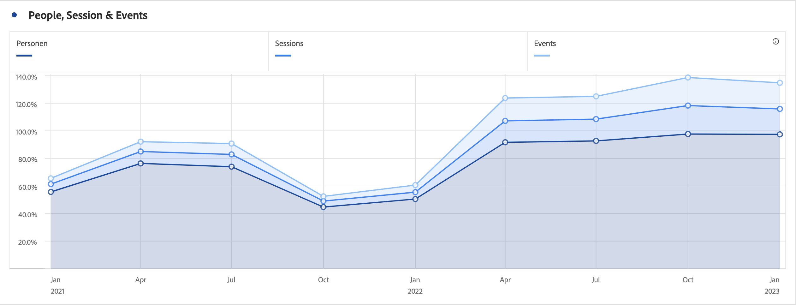
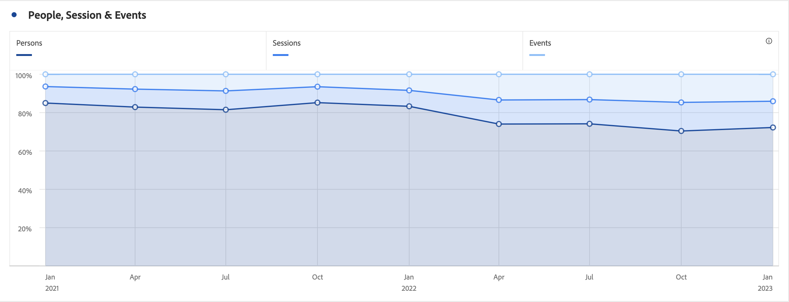

# Superfici (sovrapposte)

>[!BEGINSHADEBOX]

_In questo articolo vengono documentate le visualizzazioni Superfici e Superfici sovrapposte in_  _&#x200B;**Customer Journey Analytics**._ _Vedere [Superfici e Superfici sovrapposte](https://experienceleague.adobe.com/it/docs/analytics/analyze/analysis-workspace/visualizations/area) per la versione_  _&#x200B;**Adobe Analytics** di questo articolo._

>[!ENDSHADEBOX]

La visualizzazione a superficie ha un’opzione standard e una sovrapposta.

## Area {#area}

<!-- markdownlint-disable MD034 -->

>[!CONTEXTUALHELP]
>id="workspace_area_button"
>title="Grafico a superficie"
>abstract="Crea una visualizzazione di un grafico a superficie per rappresentare l’intersezione di più metriche."

<!-- markdownlint-enable MD034 -->

La visualizzazione  **[!UICONTROL Area]** è simile a un grafico a linee, ma presenta un&#39;area colorata al di sotto della linea. Aggiungi un grafico a superficie quando hai diverse metriche e desideri visualizzare la superficie di intersezione di due o più metriche.

## Superfici sovrapposte {#area-stacked}

<!-- markdownlint-disable MD034 -->

>[!CONTEXTUALHELP]
>id="workspace_areastacked_button"
>title="Superfici sovrapposte"
>abstract="Crea una visualizzazione di un grafico a superficie per rappresentare la sovrapposizione di più metriche."

<!-- markdownlint-enable MD034 -->

La visualizzazione  **[!UICONTROL Area sovrapposta]** è simile a un&#39;area, ma ogni serie inizia all&#39;inizio della serie precedente.

Utilizza l&#39;opzione **[!UICONTROL 100% in pila]** in  **[!UICONTROL Impostazioni]** per trasformare il grafico in una visualizzazione con pila 100%.

>[!BEGINSHADEBOX]

Per un video demo, consulta  [Visualizzazione area](https://experienceleague.adobe.com/en/docs/customer-journey-analytics-learn/tutorials/analysis-workspace/visualizations/add-area-visualizations){target="_blank"}.

>[!ENDSHADEBOX]

>[!MORELIKETHIS]
>
>[Aggiungi una visualizzazione a un pannello](/help/analysis-workspace/visualizations/freeform-analysis-visualizations.md#add-visualizations-to-a-panel)
>[Impostazioni di visualizzazione](/help/analysis-workspace/visualizations/freeform-analysis-visualizations.md#settings)
>[Menu di scelta rapida della visualizzazione](/help/analysis-workspace/visualizations/freeform-analysis-visualizations.md#context-menu)
>
