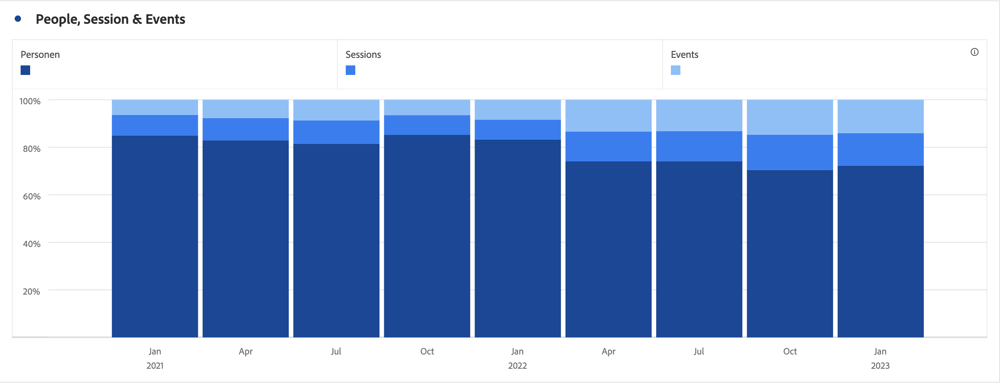

# Barre (sovrapposte)

>[!BEGINSHADEBOX]

_Questo articolo documenta le visualizzazioni Barre e Barre sovrapposte in_  _**Customer Journey Analytics**._ _Vedi [Barre e Barre sovrapposte](https://experienceleague.adobe.com/it/docs/analytics/analyze/analysis-workspace/visualizations/bar) per la versione_  _**Adobe Analytics** di questo articolo._

>[!ENDSHADEBOX]

La visualizzazione a barre ha un’opzione standard e una sovrapposta.

## A barre {#bar}

<!-- markdownlint-disable MD034 -->

>[!CONTEXTUALHELP]
>id="workspace_bar_button"
>title="A barre"
>abstract="Crea una visualizzazione a barre per rappresentare diversi valori per una o più metriche."

<!-- markdownlint-enable MD034 -->

La visualizzazione  **[!UICONTROL Bar]** mostra barre verticali che rappresentano diversi valori in una o più metriche.

Nelle impostazioni di visualizzazione, un elenco a discesa di granularità permette di cambiare una visualizzazione con tendenza (ad esempio un grafico a linee) da base giornaliera a settimanale, mensile, ecc.

## Barre sovrapposte {#bar-stacked}

<!-- markdownlint-disable MD034 -->

>[!CONTEXTUALHELP]
>id="workspace_barstacked_button"
>title="Barre sovrapposte"
>abstract="Crea una visualizzazione a barre per rappresentare diversi valori per una o più metriche sovrapposte."

<!-- markdownlint-enable MD034 -->

La visualizzazione  **[!UICONTROL Barre sovrapposte]** è simile a un grafico a barre, ma le barre delle serie sono sovrapposte le une alle altre.

Utilizza l&#39;opzione **[!UICONTROL 100% in pila]** in  **[!UICONTROL Impostazioni]** per trasformare il grafico in una visualizzazione con pila 100%.

>[!BEGINSHADEBOX]

Per un video demo, consulta  [Visualizzazione area](https://experienceleague.adobe.com/en/docs/customer-journey-analytics-learn/tutorials/analysis-workspace/visualizations/add-bar-visualizations){target="_blank"}.

>[!ENDSHADEBOX]

>[!MORELIKETHIS]
>
>[Aggiungi una visualizzazione a un pannello](/help/analysis-workspace/visualizations/freeform-analysis-visualizations.md#add-visualizations-to-a-panel)
>[Impostazioni di visualizzazione](/help/analysis-workspace/visualizations/freeform-analysis-visualizations.md#settings)
>[Menu di scelta rapida della visualizzazione](/help/analysis-workspace/visualizations/freeform-analysis-visualizations.md#context-menu)
>

