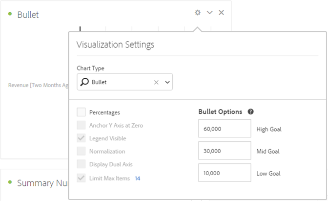

# Grafico bullet

È possibile vedere come un valore al quale sei interessato si confronta con altre gamme di prestazioni (obiettivi).

Il grafico bullet presenta una singola misura primaria (ad esempio le entrate annuali correnti) e consente di inserire intervalli qualitativi di gamme di prestazioni (ad esempio rispetto a un fatturato target). È possibile specificare valori alti, medi e bassi. È possibile specificare una gamma di obiettivi in [!UICONTROL Visualization Settings] (Impostazioni visualizzazione).
