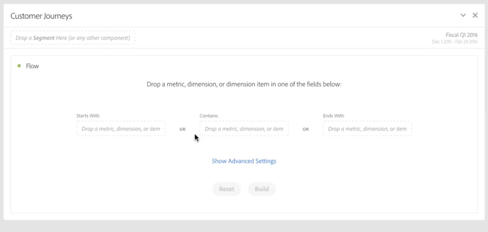
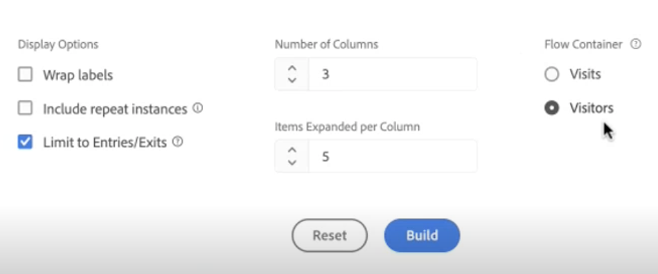
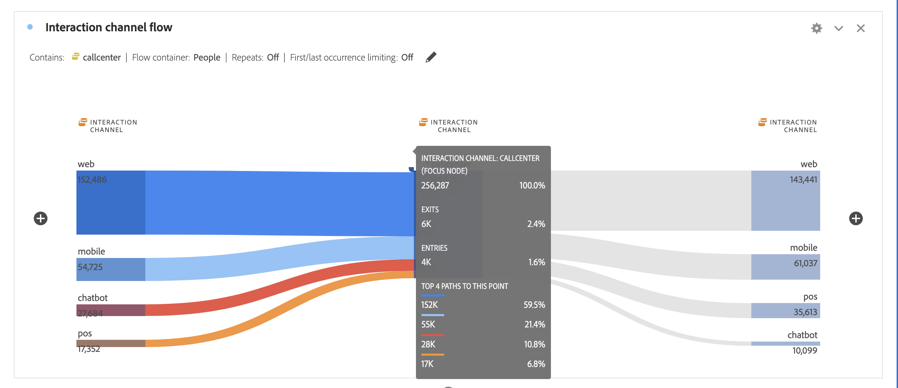

# Configurare una visualizzazione di flusso

Le visualizzazioni Flusso consentono di comprendere il percorso che deriva da o precede un evento di conversione specifico sul sito web o sull’app. Traccia un percorso attraverso le dimensioni (e gli elementi dimensionali) o le metriche.

Le visualizzazioni Flusso consentono di configurare l’inizio o la fine del percorso desiderato o di analizzare tutti i percorsi che passano attraverso una dimensione o un elemento dimensionale.

## Creare una visualizzazione di flusso {#configure}

1. Aggiungi un pannello vuoto al progetto e fai clic sull’icona delle visualizzazioni nella barra a sinistra.

1. Trascina [!UICONTROL **Flusso**] nel pannello.

   Oppure

   Trascina [!UICONTROL **Flusso**] in un progetto esistente.

1. Ancorate la visualizzazione Flusso utilizzando una delle seguenti opzioni:

   * [!UICONTROL **Inizia con**] (metriche, dimensioni o elementi), oppure
   * [!UICONTROL **Contiene**] (dimensioni o elementi), oppure
   * [!UICONTROL **Termina con**] (metriche, dimensioni o elementi)

   Ogni categoria è visualizzata come una “zona di rilascio”. Puoi popolare la zona di rilascio in tre modi:

   * Utilizza il menu a discesa per selezionare metriche o dimensioni.
   * Trascina dimensioni o metriche dalla barra a sinistra.
   * Inizia a digitare il nome di una dimensione o metrica, quindi selezionala quando viene visualizzato nell’elenco a discesa.

   >[!IMPORTANT]
   >
   >Le metriche calcolate non possono essere utilizzate in  **[!UICONTROL Starts with]** o **[!UICONTROL Ends with]** campi.

1. Se scegli una metrica, devi anche fornire una [!UICONTROL Pathing Dimension] da utilizzare per utilizzare come percorso che porta o proviene dal componente selezionato, come mostrato qui. Il valore predefinito è [!UICONTROL **Pagina**].

   

1. (Facoltativo) Seleziona **[!UICONTROL Show advanced settings]** per configurare una delle opzioni seguenti:

   

   | Impostazione | Descrizione |
   | --- | --- |
   | **[!UICONTROL Wrap labels]** | Di norma, le etichette degli elementi di Flusso vengono troncate per risparmiare spazio sullo schermo, ma selezionando questa casella puoi rendere visibile l’intera etichetta.  Impostazione predefinita = non selezionata. |
   | **[!UICONTROL Include repeat instances]** | Le visualizzazioni di Flusso si basano su istanze di una dimensione. Questa impostazione offre la possibilità di includere o escludere istanze ripetute, ad esempio i ricaricamenti delle pagine. Tuttavia, le ripetizioni non possono essere rimosse dalle visualizzazioni Flusso che includono dimensioni con più valori, come listVars, listProps, s.product, eVars di merchandising, ecc. 
Questa opzione è disabilitata per impostazione predefinita.
 |
   | **[!UICONTROL Limit to first/last occurrence]** | Limita i percorsi a quelli che iniziano/terminano con la prima/ultima occorrenza di una dimensione/elemento/metrica. Vedi la sezione seguente, [Scenario di esempio per &quot;limit to first/last occurrence&quot; (limita alla prima/ultima occorrenza)](#example-scenario-for-limit-to-firstlast-occurrence), per una spiegazione più dettagliata. |
   | **[!UICONTROL Number of columns]** | Il numero di colonne desiderato nel diagramma di flusso. |
   | **[!UICONTROL Items expanded per column]** | Il numero di elementi desiderati in ogni colonna. |
   | **[!UICONTROL Flow container]** | <ul><li>Visita</li><li>Visitatore</li></ul> Consente di passare da Visita a Visitatore per analizzare il percorso dei visitatori. Queste impostazioni consentono di comprendere il coinvolgimento dei visitatori a livello dei singoli visitatori (attraverso più visite) o di limitare l’analisi a una singola visita. |

1. Seleziona **[!UICONTROL Build]** (Aggiungi gruppi di campi).

>[!INFO]
>
>**Esempio:** Supponiamo di voler tracciare il percorso seguito dagli utenti per le pagine più popolari del sito e da esse.
>
>Per eseguire questa operazione,
>1. Inizia a creare una visualizzazione di flusso come descritto in precedenza.
>1. Trascina [!UICONTROL **Pagina**] dimensione in **[!UICONTROL Contains]** , quindi seleziona [!UICONTROL **Genera**].
>1. La visualizzazione Flusso si basa sulla pagina più visualizzata visibile nel nodo attivo al centro della visualizzazione. Vengono visualizzate anche le pagine principali che conducono a quella pagina (a sinistra del nodo attivo) e le pagine principali che precedono quella pagina (a destra del nodo attivo).
>1. Analizzare i dati nel flusso, come descritto in [Visualizzare e modificare l’output del flusso](#view-and-change-the-flow-output).

## Visualizzare e modificare l’output di Flusso {#output}

Nella parte superiore del diagramma viene visualizzato un riepilogo della configurazione di Flusso. I percorsi nel diagramma sono proporzionali. I percorsi con maggiore attività sono più spessi.

Per approfondire ulteriormente i dati, hai a disposizione diverse opzioni:

* Il diagramma di flusso è interattivo. Passa il cursore del mouse sul diagramma per cambiare i dettagli visualizzati.

* Quando fai clic su un nodo nel diagramma, vengono visualizzati i dettagli per tale nodo. Fai di nuovo clic sul nodo per chiuderlo.

  

* Puoi filtrare una colonna per visualizzare solo alcuni risultati, ad esempio puoi includere ed escludere, specificare criteri, ecc.

* Fai clic sul segno più (+) a sinistra per espandere una colonna.

* Utilizza le opzioni di clic con il pulsante destro del mouse illustrate di seguito per personalizzare ulteriormente l’output.

* Fai clic sull’icona a forma di matita accanto al riepilogo di configurazione per modificare ulteriormente il flusso o ricrearlo con opzioni diverse.

* Puoi anche esportare e analizzare ulteriormente il diagramma di flusso come parte del file .CSV di un progetto, da **[!UICONTROL Project]** (Progetto) > **[!UICONTROL Download CSV]** (Scarica CSV).

## Filtro

Sopra ogni colonna viene visualizzato un filtro al passaggio del mouse. Facendo clic sul filtro, si ottiene la stessa finestra di dialogo del filtro attualmente presente nella tabella a forma libera. Questo filtro funziona come nella tabella a forma libera.

* Utilizza le impostazioni avanzate per includere o escludere determinati criteri con il nostro elenco di operatori.
* Dopo aver filtrato un elemento dall’elenco, quella colonna specifica rifletterà il filtro. Il filtro riduce la colonna di modo che mostri solo l’elemento consentito nel filtro, oppure rimuove tutti gli elementi eccetto quello desiderato nel filtro.
* Tutte le colonne upstream e downstream dovrebbero persistere, purché sia presente un flusso di dati nei nodi rimanenti.
* Una volta applicato, l’icona del filtro viene visualizzata in blu sopra la colonna che sta filtrando.
* Per rimuovere un filtro, fai clic sull’icona di filtro per aprire il menu dei filtri. Rimuovi i filtri applicati e fai clic su **[!UICONTROL Save]**. Il flusso dovrebbe tornare allo stato precedente non filtrato.

## Opzioni di clic con il pulsante destro {#right-click}

| Opzione | Descrizione |
|--- |--- |
| [!UICONTROL Focus on this node] | Rende attivo il nodo selezionato. Il nodo attivo è visualizzato al centro del diagramma di flusso. |
| [!UICONTROL Start over] | Si torna al generatore di diagrammi a forma libera dove è possibile generare un nuovo diagramma di flusso. |
| [!UICONTROL Create filter for this path] | Crea un filtro. Viene aperto il Generatore di filtri, dove è possibile configurare il nuovo filtro. |
| [!UICONTROL Breakdown] | Suddivide il nodo per dimensioni, metriche o ora. |
| [!UICONTROL Filter column] | Vengono visualizzate le stesse opzioni di filtro disponibili nella tabella a forma libera. Per ulteriori informazioni sulle opzioni disponibili, consulta la sezione &quot;Applicare un filtro semplice o avanzato a una tabella&quot; in [Filtrare e ordinare le tabelle](/help/analysis-workspace/visualizations/freeform-table/filter-and-sort.md). |
| [!UICONTROL Exclude item]/[!UICONTROL Restore excluded items] | Rimuove un nodo specifico dalla colonna e lo crea automaticamente come filtro nella parte superiore della colonna. Per ripristinare l’elemento escluso, fai di nuovo clic con il pulsante destro del mouse e seleziona **[!UICONTROL Restore Excluded Item]**. Puoi anche aprire il filtro nella parte superiore della colonna e rimuovere la casella con l’elemento appena escluso. |
| [!UICONTROL Trend] | Crea un diagramma di tendenza per il nodo. |
| Mostra colonna successiva / Mostra colonna precedente | Mostra la colonna successiva (destra) o precedente (sinistra) della visualizzazione. |
| Nascondi colonna | Nasconde la colonna selezionata dalla visualizzazione. |
| [!UICONTROL Expand entire column] | Espande una colonna per mostrare tutti i nodi. Per impostazione predefinita, vengono visualizzati solo i primi cinque nodi. |
| Creare un pubblico dalla selezione | Crea un pubblico in base alla colonna selezionata. |
| [!UICONTROL Collapse entire column] | Nasconde tutti i nodi di una colonna. |

## Scenario di esempio per “limit to first/last occurrence” (limita alla prima/ultima occorrenza)

Quando utilizzi questa opzione, tieni presente che:

* **[!UICONTROL Limit to first/last occurrence]** conta solo la prima/ultima occorrenza della serie. Tutte le altre occorrenze del criterio **[!UICONTROL Starts with]** o **[!UICONTROL Ends with]** vengono ignorate.
* Se utilizzata con un flusso **[!UICONTROL Starts with]**, è inclusa solo la prima occorrenza corrispondente ai criteri di inizio.
* Se utilizzata con un flusso **[!UICONTROL Ends with]**, verrà inclusa solo l’ultima occorrenza corrispondente ai criteri di fine.
* La serie utilizzata varia in base al contenitore. Se utilizzi il **[!UICONTROL Visit]** contenitore, la serie di eventi sarà la sessione. Se utilizzi il **[!UICONTROL Visitor]** contenitore, la serie di eventi sarà costituita da tutti gli eventi per un determinato utente nell’intervallo di date specificato.
* Quando si utilizza una metrica o un elemento dimensionale nei campi “Inizia con” o “Termina con”, l’opzione **[!UICONTROL Limit to first/last occurrence]** può essere configurata nelle impostazioni avanzate.

Serie di eventi di esempio:

Home > Prodotti > Aggiungi al carrello > Prodotti > Aggiungi al carrello > Fatturazione > Conferma d’ordine

### Considerare un’analisi di flusso utilizzando le seguenti impostazioni:

* Inizia con[!UICONTROL  Add to cart] (elemento dimensionale)
* Dimensione del percorso [!UICONTROL Page]
* Contenitore [!UICONTROL Visit]

Se &quot;Limit to first/last occurrence&quot; (Limita alla prima/ultima occorrenza) è disabilitato, questa singola serie di eventi conterà due occorrenze di &quot;Aggiungi al carrello&quot;.
Output di flusso previsto:
“Aggiungi al carrello” (2) —> “Prodotti” (1)
-> “Fatturazione” (1)

Tuttavia, se &quot;Limit to first/last occurrence&quot; (Limita alla prima/ultima occorrenza) è abilitato, nell’analisi verrà inclusa solo la prima occorrenza di &quot;Aggiungi al carrello&quot;.
Output di flusso previsto: 
“Aggiungi al carrello” (1) —> “Prodotti” (1)

### Considera la stessa serie di eventi ma utilizzando le seguenti impostazioni:

* Termina con [!UICONTROL Add to cart] (elemento dimensionale)
* Dimensione del percorso [!UICONTROL Page]
* Contenitore [!UICONTROL Visit]

Se **[!UICONTROL Limit to first/last occurrence]** è *disabilitato*, quindi questa singola serie di eventi conterà due occorrenze di &quot;Aggiungi al carrello&quot;.
Flusso di output previsto: 
“Prodotti” (2) &lt;— “Aggiungi al carrello” (2)

Tuttavia, se **[!UICONTROL Limit to first/last occurrence]** è *abilitato*, nell’analisi verrà inclusa solo l’ultima occorrenza di [!UICONTROL Add to cart].
Flusso di output previsto: 
“Prodotti” (1) &lt;— “Aggiungi al carrello” (1)
