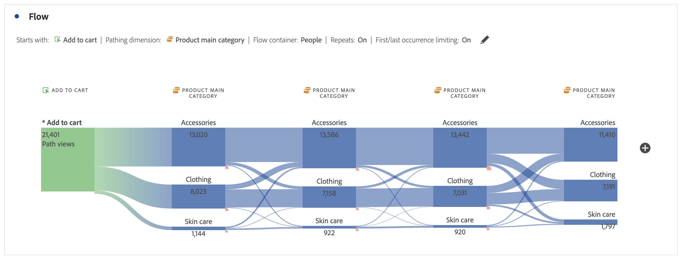

# Configurare una visualizzazione del flusso

Le visualizzazioni Flusso consentono di comprendere il percorso che ha origine da un evento di conversione specifico sul sito web o sull’app. Oppure che porta a un evento di conversione specifico. La visualizzazione traccia un percorso attraverso le dimensioni (e gli elementi dimensionali) o le metriche.

Puoi configurare l’inizio o la fine del percorso che ti interessa. Oppure analizza tutti i percorsi che passano attraverso una dimensione o un elemento dimensionale.

## Seleziona

1. Aggiungi una visualizzazione  **[!UICONTROL Flow]**. Vedi [Aggiungere una visualizzazione a un pannello](../freeform-analysis-visualizations.md#add-visualizations-to-a-panel).

1. Aggancia la visualizzazione Flusso tramite una delle tre opzioni seguenti:

   * [!UICONTROL **Inizia con**] (metriche, dimensioni o elementi), oppure
   * [!UICONTROL **Contiene**] (dimensioni o elementi), oppure
   * [!UICONTROL **Termina con**] (metriche, dimensioni o elementi)

   Ognuna di queste categorie viene visualizzata come *zona di rilascio*. Puoi popolare la zona di rilascio in tre modi:

   * Utilizza il menu a discesa per selezionare metriche o dimensioni.
   * Trascina dimensioni o metriche dal pannello a sinistra.
   * Inizia a digitare il nome di una dimensione o metrica, quindi selezionala quando viene visualizzata nell’elenco a discesa.

   >[!IMPORTANT]
   >
   >Impossibile utilizzare le metriche calcolate nei campi **[!UICONTROL Starts with]** o **[!UICONTROL Ends with]**.

1. Se scegli una metrica, devi anche fornire un [!UICONTROL **Dimension di percorsi**] da utilizzare come percorso che porta o proviene dal componente selezionato, come mostrato di seguito. Il valore predefinito è [!UICONTROL **Pagina**].

   

1. (Facoltativo) Seleziona **[!UICONTROL Show advanced settings]** per configurare una delle opzioni seguenti:

   | Impostazione | Descrizione |
   | --- | --- |
   | **[!UICONTROL Wrap labels]** | Di norma, le etichette degli elementi di Flusso vengono troncate per risparmiare spazio sullo schermo, ma selezionando questa casella puoi rendere visibile l’intera etichetta.  Impostazione predefinita = non selezionata. |
   | **[!UICONTROL Include repeat instances]** | Le visualizzazioni di Flusso si basano su istanze di una dimensione. Questa impostazione consente di includere o escludere istanze ripetute, ad esempio i ricaricamenti delle pagine. Tuttavia, le ripetizioni non possono essere rimosse dalle visualizzazioni Flusso che includono dimensioni con più valori, come listVars, listProps, s.product, eVars di merchandising, ecc. 
Questa opzione è disabilitata per impostazione predefinita.
 |
   | **[!UICONTROL Limit to first/last occurrence]** | Limita i percorsi ai percorsi che iniziano o terminano con la prima o l’ultima occorrenza di una dimensione, elemento o metrica. Per una spiegazione più dettagliata, vedi [Limita alla prima/ultima occorrenza](#example-scenario-for-limit-to-firstlast-occurrence). |
   | **[!UICONTROL Number of columns]** | Determina il numero di colonne desiderato nel diagramma Flusso. Puoi indicare un massimo di 5 colonne. |
   | **[!UICONTROL Items expanded per column]** | Il numero di elementi che desideri inserire in ogni colonna. È possibile specificare un massimo di 10 elementi espansi per colonna. |
   | **[!UICONTROL Flow container]** | È possibile passare da **[!UICONTROL Sessions]** a **[!UICONTROL Person]** per analizzare i percorsi. Queste impostazioni consentono di comprendere il coinvolgimento di una persona a livello personale (tra sessioni) o di vincolare l’analisi a una singola sessione. |

   >[!IMPORTANT]
   >
   >La combinazione di **[!UICONTROL Number of columns]** e **[!UICONTROL Items expanded per column]** determina il numero di richieste sottostanti necessarie per creare la visualizzazione del flusso. Più alti sono questi numeri, più tempo sarà necessario per eseguire il rendering di una visualizzazione.

1. Seleziona **[!UICONTROL Build]**.

### Esempio

Supponiamo di voler tracciare il percorso seguito dagli utenti per le pagine più popolari del sito e da esse.

1. Crea una visualizzazione di flusso come descritto in precedenza.
1. Trascina la dimensione [!UICONTROL **Pagina**] nel campo **[!UICONTROL Contains]**, quindi seleziona [!UICONTROL **Genera**].
1. La visualizzazione Flusso si sviluppa, con la pagina più visualizzata visibile nel nodo principale, al centro della visualizzazione. Vengono visualizzate anche le pagine principali che conducono a quella pagina (a sinistra del nodo attivo) e le pagine principali che precedono quella pagina (a destra del nodo attivo).
1. Analizzare i dati nel flusso, come descritto in [Configurazione](#configure).

## Configurare

Nella parte superiore delle visualizzazioni viene visualizzato un riepilogo della configurazione Flusso. I percorsi nel diagramma sono proporzionali. I percorsi con maggiore attività sono più spessi.

Per approfondire ulteriormente i dati, hai a disposizione diverse opzioni:

* Il diagramma di flusso è interattivo. Passa il cursore del mouse sul diagramma per cambiare i dettagli visualizzati.

* Quando selezioni un nodo nel diagramma, vengono visualizzati i dettagli per tale nodo. Seleziona nuovamente il nodo per comprimerlo.

  

* Puoi filtrare una colonna per visualizzare solo alcuni risultati, ad esempio puoi includere ed escludere, specificare criteri, ecc.

* Seleziona  a sinistra o a destra per espandere una colonna.

* Per personalizzare l&#39;output, utilizzare le opzioni del [menu di scelta rapida](#context-menu).

* Per modificare il flusso o ricrearlo con opzioni diverse, seleziona  accanto al riepilogo della configurazione.

## Filtro

Sopra ogni colonna viene visualizzato un filtro  al passaggio del mouse. Selezionando il filtro, si ottiene la stessa finestra di dialogo del filtro presente nella tabella a forma libera. Vedi [Filtro e ordinamento](freeform-table/../../freeform-table/filter-and-sort.md).

* Utilizzare **[!UICONTROL Show advanced]** per configurare le impostazioni avanzate in modo da includere o escludere determinati criteri con un elenco di operatori. Per ulteriori informazioni, vedere [Filtri e ordinamento](../freeform-table/filter-and-sort.md).
* Dopo aver filtrato una colonna, tale colonna specifica riflette il filtro. Un  blu indica che la colonna è filtrata.  Il filtro riduce la colonna in modo da mostrare solo l’elemento consentito nel filtro. In alternativa, vengono rimossi tutti gli elementi, tranne quello desiderato nel filtro.
* Tutte le colonne upstream e downstream persistono, purché i dati fluiscano nei nodi rimanenti.
* Per rimuovere un filtro, selezionare  per aprire il menu dei filtri. Rimuovi i filtri applicati e seleziona **[!UICONTROL Save]**. Il flusso dovrebbe tornare allo stato precedente non filtrato.

## Menu di scelta rapida

Utilizza un menu contestuale su qualsiasi nodo della visualizzazione del flusso con le seguenti opzioni:

| Opzione | Descrizione |
|--- |--- |
| **[!UICONTROL Focus on this node]** | Rende attivo il nodo selezionato. Il nodo attivo è visualizzato al centro del diagramma di flusso. |
| **[!UICONTROL Start over]** | Tornare al generatore di diagrammi a forma libera, dove è possibile creare un nuovo diagramma di flusso. |
| **[!UICONTROL Create a filter for this path]** | Crea un filtro. Questa selezione ti porta al Generatore di filtri, dove puoi configurare il nuovo filtro. |
| **[!UICONTROL Breakdown]** | Suddivide il nodo per dimensioni, metriche o ora. |
| **[!UICONTROL Filter column]** | Vengono visualizzate le stesse opzioni di filtro disponibili nella tabella a forma libera. Per ulteriori informazioni sulle opzioni disponibili, vedere la sezione &quot;Applicare un filtro semplice o avanzato a una tabella&quot; in [Filtrare e ordinare le tabelle](/help/analysis-workspace/visualizations/freeform-table/filter-and-sort.md). |
| **[!UICONTROL Exclude item]** o **[!UICONTROL Restore excluded items]** | Rimuove un nodo specifico dalla colonna e lo crea automaticamente come filtro nella parte superiore della colonna. Per ripristinare l&#39;elemento escluso, dal menu di scelta rapida selezionare **[!UICONTROL Restore Excluded Item]**. Puoi anche aprire il filtro nella parte superiore della colonna e rimuovere la casella con l’elemento appena escluso. |
| **[!UICONTROL Trend]** | Crea un diagramma di tendenza per il nodo. |
| **[!UICONTROL Show next column]** / **[!UICONTROL Show previous column]** | Mostra la colonna successiva (destra) o precedente (sinistra) della visualizzazione. |
| **[!UICONTROL Hide colum]**n | Nasconde la colonna selezionata dalla visualizzazione. |
| **[!UICONTROL Expand entire column]** | Espande una colonna per mostrare tutti i nodi. Per impostazione predefinita, vengono visualizzati solo i primi cinque nodi. |
| **[!UICONTROL Create audience from selection]** | Crea un pubblico in base alla colonna selezionata. |
| **[!UICONTROL Collapse entire column]** | Nasconde tutti i nodi di una colonna. |

## Limita alla prima/ultima occorrenza

Quando utilizzi questa opzione, tieni presente che:

* **[!UICONTROL Limit to first/last occurrence]** conta solo la prima/ultima occorrenza della serie. Tutte le altre occorrenze del criterio **[!UICONTROL Starts with]** o **[!UICONTROL Ends with]** vengono ignorate.
* Se utilizzata con un flusso **[!UICONTROL Starts with]**, è inclusa solo la prima occorrenza corrispondente ai criteri di inizio.
Nell&#39;esempio seguente sono incluse **tutte** le occorrenze di *Aggiungi al carrello* e *Categoria principale prodotto* in ogni passaggio del flusso.
  

  Nell&#39;esempio seguente, sono incluse solo le **prime** occorrenze di *Aggiungi al carrello* e *Categoria principale prodotto* in ogni passaggio del flusso.
  
* Se utilizzata con un flusso **[!UICONTROL Ends with]**, è inclusa solo l&#39;ultima occorrenza corrispondente ai criteri di fine.
Nell&#39;esempio seguente sono incluse **tutte** le occorrenze di *categoria principale prodotto* e *Aggiungi al carrello* in ogni passaggio del flusso.
  

  Nell&#39;esempio seguente, sono incluse solo le **ultime** occorrenze di *Categoria principale prodotto* e *Aggiungi al carrello* in ogni passaggio del flusso.
  
* La serie utilizzata varia in base al contenitore. Se si utilizza il contenitore **[!UICONTROL Person]**, la serie di eventi corrisponde alla sessione. Se utilizzi il contenitore **[!UICONTROL Session]**, la serie di eventi sono tutti gli eventi per un determinato utente nell&#39;intervallo di date specificato.
* L&#39;opzione **[!UICONTROL Limit to first/last occurrence]** può essere configurata nelle impostazioni avanzate quando si utilizza una metrica o un elemento di Dimension nei campi **[!UICONTROL Starts with]** o **[!UICONTROL Ends with]**.

>[!MORELIKETHIS]
>
>[Aggiungi una visualizzazione a un pannello](/help/analysis-workspace/visualizations/freeform-analysis-visualizations.md#add-visualizations-to-a-panel)
>[Impostazioni visualizzazione](/help/analysis-workspace/visualizations/freeform-analysis-visualizations.md#settings)
>[Menu di scelta rapida visualizzazione](/help/analysis-workspace/visualizations/freeform-analysis-visualizations.md#context-menu)
>

