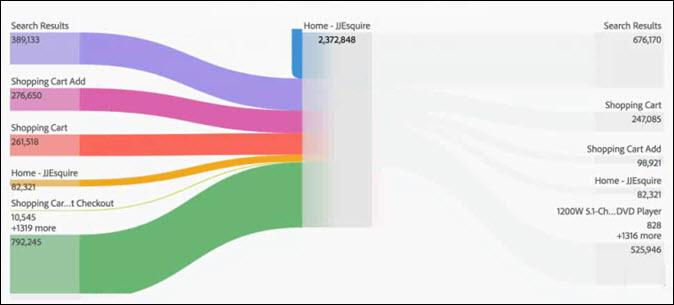

# Configurare una visualizzazione di flusso

Un rapporto di flusso consente di tenere traccia di un percorso attraverso le pagine o dimensioni, ad esempio eVar:

* Entrata (solo per dimensioni)
* Dimensioni o elementi
* Uscita (solo per dimensioni)

Ogni categoria è visualizzata come una “zona di rilascio”. Trascina gli elementi dall’elenco alla zona di rilascio desiderata. Le pagine e altri elementi che non sono dimensioni possono essere inseriti solo nella zona di rilascio centrale. Quando rilasci una dimensione nella zona centrale, viene automaticamente eseguito un rapporto in cui sono inseriti i principali elementi per tale dimensione.

Quando rilasci un elemento in una zona di rilascio, viene aperto il diagramma di flusso. Il contenuto del diagramma di flusso dipende dalla zona in cui si rilascia una dimensione o un elemento. Uscita ed Entrata mostrano tutti gli elementi per la dimensione (ad esempio, pagine) rilasciata nella relativa zona. Ad esempio, se rilasci una dimensione nella zona centrale, viene aperto il diagramma di flusso per tale zona.

Passa il cursore del mouse sul nodo di interesse al centro del diagramma per visualizzare informazioni su tale nodo.

Il diagramma di flusso è interattivo. Passa il cursore del mouse sul diagramma per cambiare i dettagli visualizzati.

I percorsi nel diagramma sono proporzionali. I percorsi con maggiore attività sono più spessi.

Quando fai clic su un nodo nel diagramma, vengono visualizzati i dettagli per tale nodo. Ad esempio, se fai clic su **[!UICONTROL Search Results]** (Risultati ricerca) in alto a destra nel diagramma superiore illustrato qui sopra, il diagramma si espande per mostrare più dettagli sul nodo dei risultati di ricerca. Fai di nuovo clic sul nodo per chiuderlo.

Per impostazione predefinita, il diagramma mostra i primi cinque flussi. Se fai clic sul nodo **[!UICONTROL More]** (Altro) in fondo al diagramma, quest’ultimo si espande verso il basso per visualizzare altri cinque flussi. Continua a fare clic su **[!UICONTROL More]** (Altro) fino a visualizzare tutti i flussi disponibili.

Non vi è alcun limite alla navigazione nel diagramma di flusso.

Puoi anche esportare e analizzare ulteriormente il diagramma di flusso come parte del file .CSV di un progetto, da **[!UICONTROL Project]** (Progetto) > **[!UICONTROL Download CSV]** (Scarica CSV).
