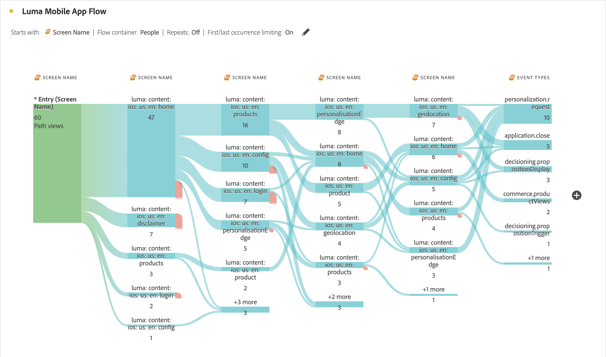
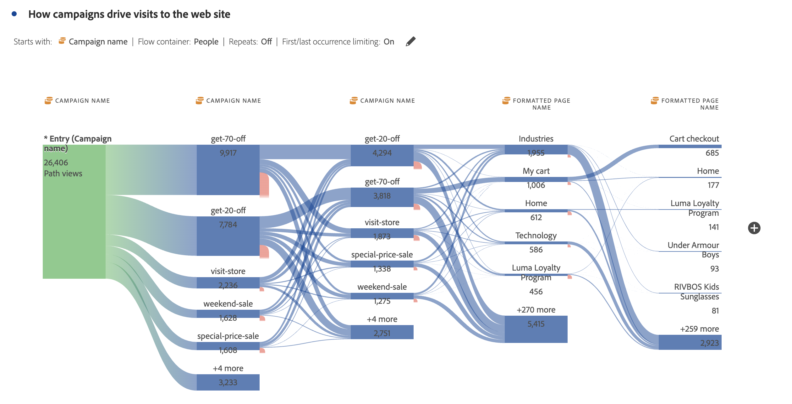

# Flussi interdimensionali

Un flusso interdimensionale ti consente di esaminare i percorsi seguiti dai clienti attraverso varie dimensioni. Questo articolo mostra come utilizzare questo flusso per due casi d’uso: interazioni ed eventi delle app mobili e come le campagne guidano le visite web

<!--
A dimension label at the top of each Flow column makes using multiple dimensions in a flow visualization more intuitive:

-->

## Interazioni ed eventi delle app mobili

La dimensione [!UICONTROL Screen Name] viene utilizzata in questo flusso di esempio per vedere come gli utenti utilizzano le varie schermate (scene) nell&#39;app. La schermata superiore restituita è **[!UICONTROL luma: content: ios: en: home]**, che è la home page dell&#39;app:

Per esplorare l&#39;interazione tra schermate e tipi di evento (come aggiungi al carrello, acquisti e altri) in questa app, trascina e rilascia la dimensione **[!UICONTROL Event Types]**:

* Per sostituire la dimensione, esegui le operazioni riportate di seguito.

  

* Al di fuori della visualizzazione del flusso corrente, per aggiungere la dimensione:

  

La visualizzazione di flusso seguente mostra il risultato dell&#39;aggiunta della dimensione **[!UICONTROL  Event Types]**. La visualizzazione fornisce informazioni su come gli utenti dell’app mobile si spostano attraverso le varie schermate dell’app prima di aggiungere prodotti al carrello, chiudere l’applicazione, visualizzare un’offerta e altro ancora.

## Come le campagne guidano le visite web

Desideri analizzare quali campagne sono all’origine delle visite al sito web. Si crea una visualizzazione di flusso con **[!UICONTROL Campaign Name]** come dimensione

L&#39;ultima dimensione **[!UICONTROL Campaign Name]** viene sostituita con la dimensione **[!UICONTROL Formatted Page Name]** e viene aggiunta un&#39;altra dimensione **[!UICONTROL Formatted Page Name]** alla fine della visualizzazione del flusso.

Puoi passare il cursore del mouse su uno dei flussi per visualizzare ulteriori dettagli. Ad esempio, quali campagne hanno generato un’estrazione dal carrello.

