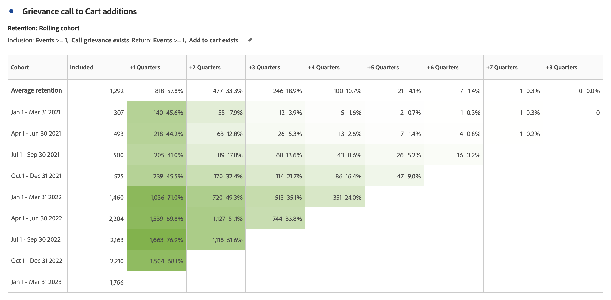

# Panoramica della tabella coorte {#cohort-table-overview}

<!-- markdownlint-disable MD034 -->

>[!CONTEXTUALHELP]
>id="cja_workspace_cohorttable_button"
>title="Tabella coorte"
>abstract="Crea una visualizzazione per coorte per raggruppare gli utenti in base al completamento di un evento e analizzare il coinvolgimento continuo e l’abbandono nel tempo."

<!-- markdownlint-enable MD034 -->

<!-- markdownlint-disable MD034 -->

>[!CONTEXTUALHELP]
>id="cja_workspace_cohorttable_panel"
>title="Tabella coorte"
>abstract="Raggruppa gli utenti in base al completamento di un evento, quindi analizza il loro coinvolgimento continuo e l’abbandono nel tempo.  **Parametri ** **Criteri di inclusione**: componenti utilizzati per definire le coorti di visitatori iniziali. **Criteri di ritorno**: i componenti utilizzati per determinare se un visitatore ha restituito."

<!-- markdownlint-enable MD034 -->

Una *coorte* è un gruppo di persone che condividono le stesse caratteristiche per un determinato periodo di tempo. Una visualizzazione  **[!UICONTROL Cohort table]** è utile, ad esempio, quando vuoi scoprire in che modo una coorte si relaziona con un brand. Permette di individuare facilmente cambiamenti nelle tendenze e reagire di conseguenza. Puoi trovare informazioni sull’[!UICONTROL Cohort Analysis] su Internet, ad esempio [Cohort Analysis 101](https://it.wikipedia.org/wiki/Analisi_di_coorte).

Dopo aver generato un rapporto sulla coorte, puoi curarne i componenti (dimensioni, metriche e filtri specifici) e condividerlo con chiunque. Consulta [Cura e condivisione](/help/analysis-workspace/curate-share/curate.md).

Esempi di cosa è possibile fare con [!UICONTROL Cohort table]:

* Lanciare campagne sviluppate per promuovere un’azione desiderata.
* Spostare il budget marketing nel momento giusto del ciclo di vita di un cliente.
* Riconoscere quando terminare una prova o un’offerta per massimizzare il valore.
* Sviluppare idee per il test A/B in aree come prezzo, percorso di upgrade ecc.

[!UICONTROL Cohort table] è disponibile per tutti i clienti Customer Journey Analytics con diritti di accesso ad [!UICONTROL Analysis Workspace].

+++ Guarda un video dimostrativo della tabella coorte.

>[!VIDEO](https://video.tv.adobe.com/v/23990/?quality=12)

{{videoaa}}

+++

>[!IMPORTANT]
>
>[!UICONTROL Cohort Analysis] non supporta metriche non filtrabili (incluse le metriche calcolate), metriche non intere (come Revenue) o Occurrences. Solo le metriche utilizzabili nei filtri possono essere utilizzate in [!UICONTROL Cohort Analysis] e possono essere incrementate solo di 1 alla volta.

## Funzionalità della tabella coorte

Le seguenti funzionalità consentono un controllo accurato delle coorti che crei:

### Tabella [!UICONTROL Retention]

Una tabella coorte [!UICONTROL Retention] restituisce persone: ogni cella di dati mostra il numero e la percentuale di persone nella coorte che hanno eseguito un’azione in quel determinato periodo di tempo. Può contenere fino a 3 metriche e 10 filtri.

### Tabella [!UICONTROL Churn]

Una tabella coorte [!UICONTROL Churn] è l&#39;inverso di una tabella Retention e mostra le persone che non rientrano più o non sono mai rientrate nei criteri della coorte nel tempo. Può contenere fino a 3 metriche e 10 filtri.

### [!UICONTROL Rolling Calculation]

È possibile calcolare il livello di fidelizzazione o abbandono in base alla colonna precedente, non alla colonna Included, definita calcolo continuo.

### Tabella [!UICONTROL Latency]

Una tabella di latenza misura il tempo trascorso prima e dopo il verificarsi dell’evento di inclusione. La misurazione della latenza è uno strumento eccellente per l&#39;analisi pre e post. La colonna **[!UICONTROL Included]** è al centro della tabella ed è preceduta e seguita dai periodi di tempo precedenti e successivi all’evento di inclusione.

### Coorte [!UICONTROL Custom dimension]

Puoi creare le coorti in base a una dimensione selezionata e non in base al tempo (impostazione predefinita). Utilizzare dimensioni quali [!UICONTROL City geo], [!UICONTROL Marketing channel], [!UICONTROL campaign], [!UICONTROL product], [!UICONTROL page], [!UICONTROL region] o qualsiasi altra dimensione per mostrare come cambia la fidelizzazione. In base ai diversi valori di queste dimensioni.

>[!MORELIKETHIS]
>
>[Configurare una tabella coorte](/help/analysis-workspace/visualizations/cohort-table/t-cohort.md).
>

