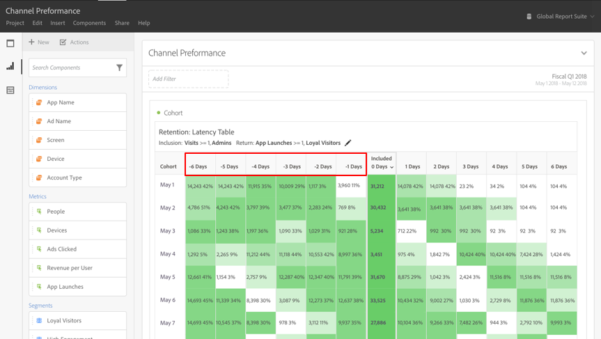

# Che cosa è l’[!UICONTROL Cohort Analysis]?

Una *`cohort`* è un gruppo di persone che condividono le stesse caratteristiche per un determinato periodo di tempo. L’[!UICONTROL Cohort Analysis] è utile, ad esempio, quando vuoi comprendere in che modo una coorte si relaziona con un marchio. Permette di individuare facilmente cambiamenti nelle tendenze e reagire di conseguenza. Puoi trovare informazioni sull’[!UICONTROL Cohort Analysis] su Internet, ad esempio [Cohort Analysis 101](https://it.wikipedia.org/wiki/Analisi_di_coorte).

Dopo aver generato un rapporto sulla coorte, puoi curarne i componenti (dimensioni, metriche e filtri specifici) e condividerlo con chiunque. Consulta [Cura e condivisione](/help/analysis-workspace/curate-share/curate.md).

Esempi di cosa è possibile fare con l’[!UICONTROL Cohort Analysis]:

* Lanciare campagne sviluppate per promuovere un’azione desiderata.
* Spostare il budget marketing nel momento giusto del ciclo di vita di un cliente.
* Riconoscere quando interrompere una versione di prova o un’offerta in modo da massimizzare il valore.
* Sviluppare idee per il test A/B in aree come prezzo, percorso di upgrade ecc.

[!UICONTROL Cohort Analysis] è disponibile per tutti i clienti Customer Journey Analytics con diritti di accesso ad [!UICONTROL Analysis Workspace].

[Video tutorial sull’analisi per coorte](https://experienceleague.adobe.com/docs/analytics-learn/tutorials/analysis-workspace/cohort-analysis/cohort-analysis-workspace.html?lang=it) (4:36)

>[!IMPORTANT]
>
>[!UICONTROL Cohort Analysis] non supporta le metriche non filtrabili (comprese le metriche calcolate), le metriche non intere (come Revenue) o Occurrences. Solo le metriche utilizzabili nei filtri possono essere utilizzate in [!UICONTROL Cohort Analysis]e possono essere incrementate solo di 1 alla volta.

## Capacità dell’analisi per coorte

Le seguenti funzionalità consentono un controllo accurato delle coorti che crei:

### [!UICONTROL Retention] Tabella

A [!UICONTROL Retention] il rapporto della coorte restituisce persone: ogni cella di dati mostra il numero e la percentuale di persone nella coorte che hanno eseguito un’azione in quel determinato periodo di tempo. Può contenere fino a 3 metriche e 10 filtri.

### [!UICONTROL Churn] Tabella

A [!UICONTROL Churn] la coorte è l’inverso di una tabella Retention e mostra le persone che non rientrano più o non sono mai rientrate nei criteri della coorte nel tempo. Può contenere fino a 3 metriche e 10 filtri.

### [!UICONTROL Rolling Calculation]

Consente di calcolare il livello di fidelizzazione o abbandono dei visitatori in base alla colonna precedente, non alla colonna Included.

### [!UICONTROL Latency] Tabella

Misura il tempo trascorso prima e dopo il verificarsi dell’evento di inclusione. È un ottimo strumento di analisi pre/post. La colonna **[!UICONTROL Included]** è al centro della tabella ed è preceduta e seguita dai periodi di tempo precedenti e successivi all’evento di inclusione.

### Coorte [!UICONTROL Custom Dimension]

Puoi creare le coorti in base a una dimensione selezionata anziché in base al tempo, che è l’impostazione predefinita. Puoi usare dimensioni quali [!UICONTROL marketing channel], [!UICONTROL campaign], [!UICONTROL product], [!UICONTROL page], [!UICONTROL region], o qualsiasi altra dimensione in Customer Journey Analytics per mostrare in che modo la fidelizzazione cambia in base a valori diversi di tali dimensioni.

Per informazioni su come impostare ed eseguire un rapporto per coorte, consulta [Configurare un rapporto di analisi per coorte](/help/analysis-workspace/visualizations/cohort-table/t-cohort.md).
