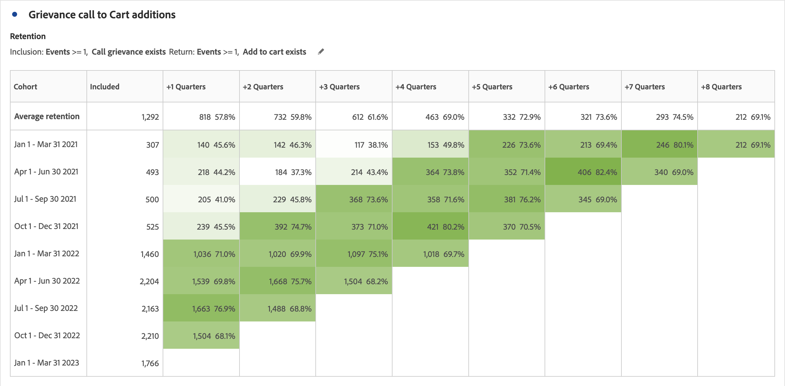
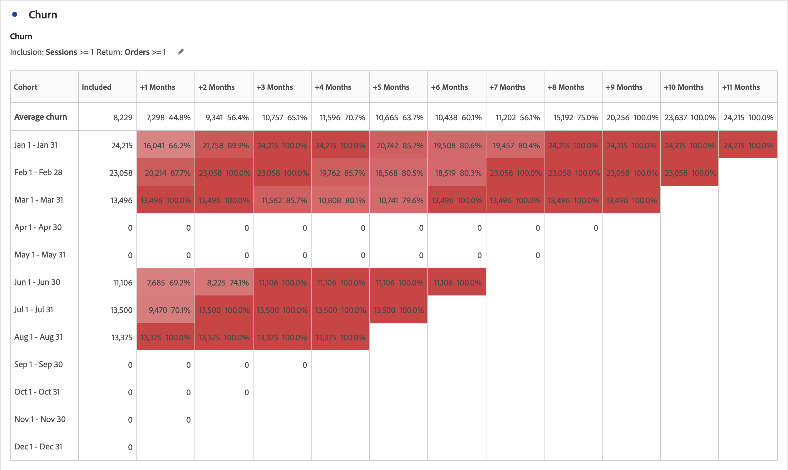
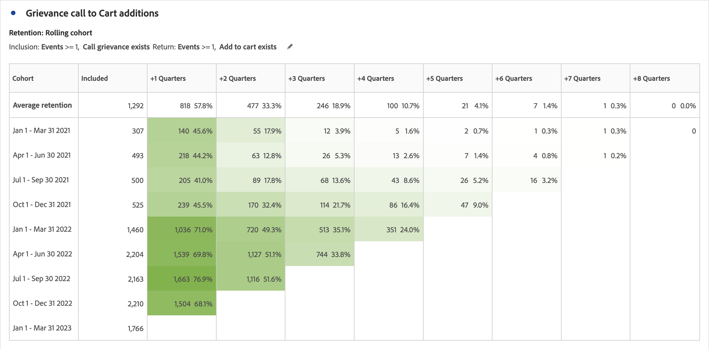
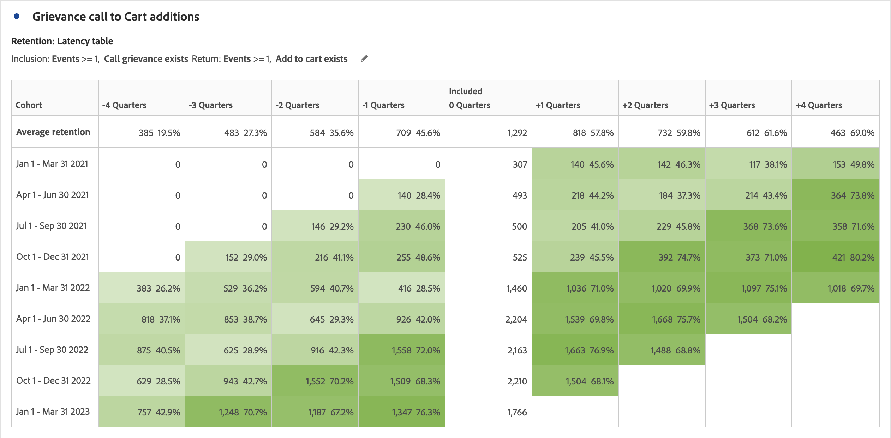
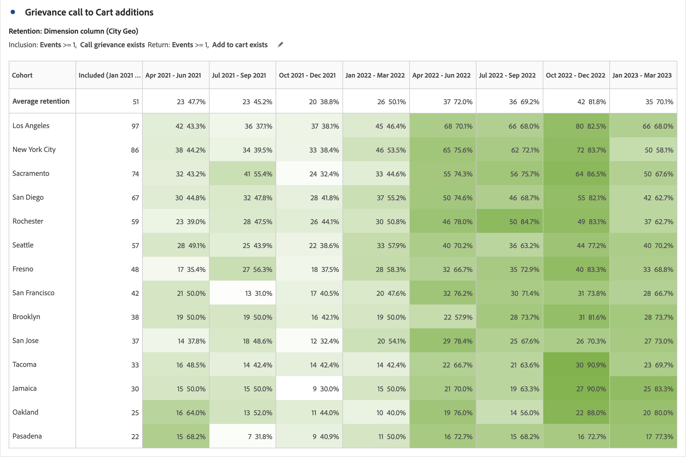

# Panoramica delle tabelle coorte {#cohort-table-overview}

<!-- markdownlint-disable MD034 -->

>[!CONTEXTUALHELP]
>id="workspace_cohorttable_button"
>title="Tabella coorte"
>abstract="Crea una visualizzazione per coorte per raggruppare gli utenti in base al completamento di un evento e analizzare il coinvolgimento continuo e l’abbandono nel tempo."

<!-- markdownlint-enable MD034 -->

<!-- markdownlint-disable MD034 -->

>[!CONTEXTUALHELP]
>id="workspace_cohorttable_panel"
>title="Tabella coorte"
>abstract="Raggruppa gli utenti in base al completamento di un evento, quindi analizzane il coinvolgimento continuo e l’abbandono nel tempo. Specifica impostazioni aggiuntive come granularità, tipo di analisi per coorte ed eventuale utilizzo del calcolo continuo. Puoi impostare opzioni avanzate per creare una tabella di latenza o una coorte di dimensioni personalizzata in base a una dimensione selezionata."

<!-- markdownlint-enable MD034 -->

>[!BEGINSHADEBOX]

_Questo articolo documenta la tabella coorte in_  _&#x200B;**Customer Journey Analytics**._ _Consulta la [tabella coorte](https://experienceleague.adobe.com/it/docs/analytics/analyze/analysis-workspace/visualizations/cohort-table/cohort-analysis) per la_  _&#x200B;**Adobe Analytics** versione di questo articolo._

>[!ENDSHADEBOX]

Una *coorte* è un gruppo di persone che condividono le stesse caratteristiche per un determinato periodo di tempo. Una visualizzazione  **[!UICONTROL Tabella coorte]** è utile, ad esempio, quando vuoi scoprire in che modo una coorte si relaziona con un brand. Permette di individuare facilmente cambiamenti nelle tendenze e reagire di conseguenza. (Puoi trovare informazioni sull&#39;[!UICONTROL analisi per coorte] sul Web, ad esempio [analisi per coorte 101](https://it.wikipedia.org/wiki/Analisi_di_coorte).)

Dopo aver generato un rapporto sulla coorte, puoi curarne i componenti (dimensioni, metriche e segmenti specifici) e condividerlo con chiunque. Vedi [Cura e condivisione](/help/analysis-workspace/curate-share/curate.md).

Esempi di cosa è possibile fare con una [!UICONTROL tabella coorte]:

* Avvia campagne progettate per stimolare un’azione desiderata.
* Modifica il budget marketing al momento giusto nel ciclo di vita del cliente.
* Riconoscere quando interrompere una versione di prova o un’offerta per massimizzare il valore.
* Sviluppare idee per il test A/B in aree come prezzo, percorso di aggiornamento ecc.

[!UICONTROL La tabella coorte] è disponibile per tutti i clienti Customer Journey Analytics con diritti di accesso a [!UICONTROL Analysis Workspace].

>[!BEGINSHADEBOX]

Per un video dimostrativo, guarda  [Analisi per coorte in Analysis Workspace](https://experienceleague.adobe.com/it/docs/analytics-learn/tutorials/analysis-workspace/cohort-analysis/cohort-analysis-workspace){target="_blank"}.

{{videoaa}}

>[!ENDSHADEBOX]

>[!IMPORTANT]
>
>[!UICONTROL L&#39;analisi per coorte] non supporta metriche non segmentabili (comprese le metriche calcolate), metriche non intere (come Revenue) o Occurrences. Solo le metriche utilizzabili nei segmenti possono essere utilizzate in [!UICONTROL Analisi per coorte] e possono essere incrementate solo di 1 alla volta.

Le tabelle coorte in Customer Journey Analytics supportano metriche basate sul doppio sistema (o su qualsiasi altro sistema numerico). Ad esempio, Purchase.Value (doppio) può essere utilizzato come metrica di inclusione/ritorno. Inoltre, anche tutte le metriche passate in Adobe Experience Platform tramite il connettore di origine di Analytics sono doppie.

## Funzionalità delle tabelle coorte

Le sezioni seguenti descrivono le funzioni di analisi per coorte che consentono un controllo accurato delle coorti che stai creando.

Per informazioni più dettagliate sulla creazione di una coorte e sull&#39;esecuzione di un report di [!UICONTROL Analisi per coorte], vedere [Configurare una tabella per coorte](/help/analysis-workspace/visualizations/cohort-table/t-cohort.md).

### Tabella di conservazione

Una tabella coorte [!UICONTROL Mantenimento] restituisce persone: ogni cella di dati mostra il numero e la percentuale di persone nella coorte che hanno eseguito l&#39;azione in quel determinato periodo di tempo. Puoi includere fino a 3 metriche e 10 segmenti.

### Tabella di abbandono

Una tabella coorte [!UICONTROL Churn] è l&#39;inverso di una tabella Retention e mostra le persone che non rientrano più o non sono mai rientrate nei criteri della coorte nel tempo. Puoi includere fino a 3 metriche e 10 segmenti.

### Calcolo continuo

Puoi calcolare il livello di fidelizzazione o abbandono in base alla colonna precedenti, non alla colonna inclusi, a cui si fa riferimento come calcolo continuo.

### Tabella latenza

Una tabella di latenza misura il tempo trascorso prima e dopo il verificarsi dell’evento di inclusione. La misura della latenza è un ottimo strumento di analisi pre/post. La colonna **[!UICONTROL Included]** è al centro della tabella e i periodi di tempo precedenti e successivi all&#39;evento di inclusione vengono visualizzati su entrambi i lati.

### Dimensioni coorte personalizzate

Puoi creare le coorti in base a una dimensione selezionata anziché in base al tempo, che è l’impostazione predefinita. Utilizza dimensioni quali [!UICONTROL City geo], [!UICONTROL Marketing channel], [!UICONTROL campaign], [!UICONTROL product], [!UICONTROL page], [!UICONTROL region] o qualsiasi altra dimensione per mostrare le modifiche apportate alla fidelizzazione. In base ai diversi valori di queste dimensioni.

>[!MORELIKETHIS]
>
>[Configurare una tabella coorte](/help/analysis-workspace/visualizations/cohort-table/t-cohort.md)
>

