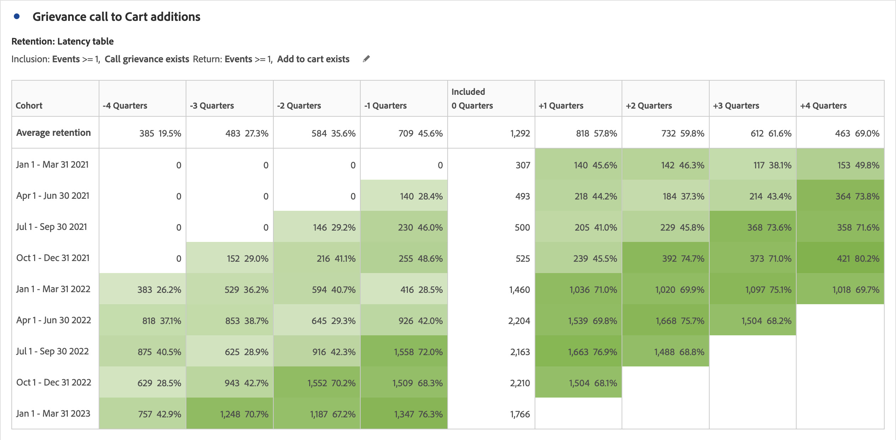

# Panoramica delle tabelle coorte {#cohort-table-overview}

<!-- markdownlint-disable MD034 -->

>[!CONTEXTUALHELP]
>id="workspace_cohorttable_button"
>title="Tabella coorte"
>abstract="Crea una visualizzazione per coorte per raggruppare gli utenti in base al completamento di un evento e analizzare il coinvolgimento continuo e l’abbandono nel tempo."

<!-- markdownlint-enable MD034 -->

<!-- markdownlint-disable MD034 -->

>[!CONTEXTUALHELP]
>id="workspace_cohorttable_panel"
>title="Tabella coorte"
>abstract="Raggruppa gli utenti in base al completamento di un evento, quindi analizzane il coinvolgimento continuo e l’abbandono nel tempo. Specifica impostazioni aggiuntive come granularità, tipo di analisi per coorte ed eventuale utilizzo del calcolo continuo. Puoi impostare opzioni avanzate per creare una tabella di latenza o una coorte di dimensioni personalizzata in base a una dimensione selezionata."

<!-- markdownlint-enable MD034 -->

>[!BEGINSHADEBOX]

_Questo articolo descrive la tabella coorte in_  _&#x200B;**Customer Journey Analytics**._ _Consulta [Tabelle coorte](https://experienceleague.adobe.com/it/docs/analytics/analyze/analysis-workspace/visualizations/cohort-table/cohort-analysis) per la versione_  _&#x200B;**Adobe Analytics** di questo articolo._

>[!ENDSHADEBOX]

Una *coorte* è un gruppo di persone che condividono le stesse caratteristiche per un determinato periodo di tempo. Una visualizzazione **[!UICONTROL Cohort table]**  è utile, ad esempio, quando vuoi scoprire in che modo una coorte si relaziona con un brand. Permette di individuare facilmente cambiamenti nelle tendenze e reagire di conseguenza. Puoi trovare informazioni sull’[!UICONTROL Cohort Analysis] su Internet, ad esempio [Cohort Analysis 101](https://it.wikipedia.org/wiki/Analisi_di_coorte).

Dopo aver generato un rapporto sulla coorte, puoi curarne i componenti (dimensioni, metriche e segmenti specifici) e condividerlo con chiunque. Vedi [Cura e condivisione](/help/analysis-workspace/curate-share/curate.md).

Esempi di cosa è possibile fare con una [!UICONTROL Cohort table]:

* Lanciare campagne sviluppate per promuovere un’azione desiderata.
* Spostare il budget marketing nel momento giusto del ciclo di vita di un cliente.
* Riconoscere quando interrompere una versione di prova o un’offerta per massimizzare il valore.
* Sviluppare idee per il test A/B in aree come prezzo, percorso di upgrade ecc.

[!UICONTROL Cohort table] è disponibile per tutti i clienti Customer Journey Analytics con diritti di accesso ad [!UICONTROL Analysis Workspace].

>[!BEGINSHADEBOX]

Per un video dimostrativo, guarda  [Analisi per coorte in Analysis Workspace](https://video.tv.adobe.com/v/23990/?quality=12&learn=on){target="_blank"}.

{{videoaa}}

>[!ENDSHADEBOX]

>[!IMPORTANT]
>
>[!UICONTROL Cohort Analysis] non supporta le metriche non segmentabili (comprese le metriche calcolate), le metriche non composte da numeri interi (come le entrate) o le occorrenze. Solo le metriche utilizzabili nei segmenti possono essere utilizzate in [!UICONTROL Cohort Analysis] e possono essere incrementate solo di 1 alla volta.

Le tabelle coorte in Customer Journey Analytics supportano metriche basate sul doppio sistema (o su qualsiasi altro sistema numerico). Ad esempio, Purchase.Value (doppio) può essere utilizzato come metrica di inclusione/ritorno. Inoltre, anche tutte le metriche passate in Adobe Experience Platform tramite il connettore di origine di Analytics sono doppie.

## Funzionalità delle tabelle coorte

Le sezioni seguenti descrivono le funzioni di analisi per coorte che consentono un controllo accurato delle coorti che stai creando.

Per informazioni più dettagliate sulla creazione di una coorte e sull’esecuzione di un rapporto di [!UICONTROL Cohort Analysis], consulta [Configurare una tabella coorte](/help/analysis-workspace/visualizations/cohort-table/t-cohort.md).

### Tabella di conservazione

Una tabella coorte [!UICONTROL Retention] restituisce persone: ogni cella di dati mostra numeri e percentuali non elaborate di persone nella coorte che hanno eseguito un’azione in quel periodo di tempo. Puoi includere fino a 3 metriche e 10 segmenti.

### Tabella di abbandono

Una tabella coorte [!UICONTROL Churn] è l’inverso di una tabella Fidelizzazione e mostra le persone che durante un periodo non rientrano più o non sono mai rientrate nei criteri della coorte. Puoi includere fino a 3 metriche e 10 segmenti.

### Calcolo continuo

Puoi calcolare il livello di fidelizzazione o abbandono in base alla colonna precedenti, non alla colonna inclusi, a cui si fa riferimento come calcolo continuo.

### Tabella di latenza

Una tabella di latenza misura il tempo trascorso prima e dopo il verificarsi dell’evento di inclusione. La misura della latenza è un ottimo strumento di analisi pre/post. La colonna **[!UICONTROL Included]** è al centro della tabella ed è preceduta e seguita dai periodi di tempo precedenti e successivi all’evento di inclusione.

### Coorte con dimensione personalizzata

Puoi creare le coorti in base a una dimensione selezionata anziché in base al tempo, che è l’impostazione predefinita. Utilizza dimensioni quali [!UICONTROL City geo], [!UICONTROL Marketing channel], [!UICONTROL campaign], [!UICONTROL product], [!UICONTROL page], [!UICONTROL region] o qualsiasi altra dimensione per mostrare come cambia la fidelizzazione. In base ai diversi valori di queste dimensioni.

>[!MORELIKETHIS]
>
>[Configurare una tabella coorte](/help/analysis-workspace/visualizations/cohort-table/t-cohort.md)
>

